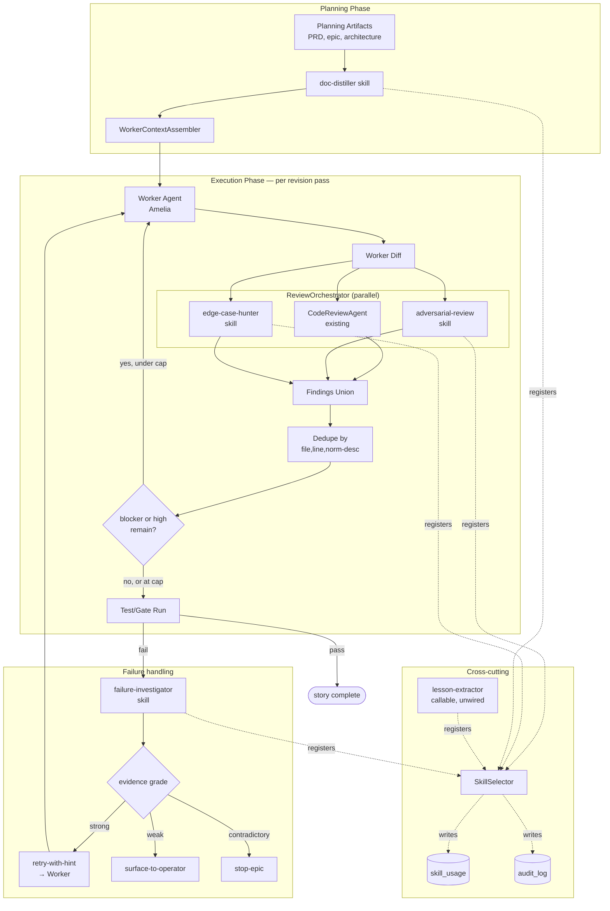

# Review Forge — System Architecture

## Architecture Philosophy

Four constraints drive every decision below:

1. **Headless purity is load-bearing.** The five ported skills must run in environments where `_bmad/` does not exist. Any defaults the BMAD originals pulled from `_bmad/scripts/` or `_bmad/bmm/config.yaml` must move *into* the skill body or into a loom-owned config constant. This rules out lazy-loading overlays at runtime.
2. **The shared findings schema is the contract.** Three reviewers run in parallel and must produce comparable output. A single `zod` schema in `loom-core` is the only seam wide enough to support dedupe, severity gating, and audit logging — every reviewer (ported *and* the existing `CodeReviewAgent`) emits against it.
3. **Determinism beats cleverness in routing.** Failure routing reads the grade field and dispatches. No LLM in the router path. This makes `audit_log` traces reproducible and the unit tests trivial.
4. **Independent agents implement independent stories.** Story-to-file ownership must be clean. The shared schema is owned by story-001 and read by everyone; the loop wiring is owned by story-003 and depends only on schema + skill registration. Parallel branches must not touch the same files.

We accept the trade-off that **lexical dedupe will let some near-duplicate findings through** (different wording for the same issue). Semantic dedupe is explicitly out of scope per the PRD; the reviewer pass cost is the tax we pay to avoid an embeddings dependency in v1.

## Component Diagram



## Tech Stack

| Layer | Choice | Rationale |
|---|---|---|
| Skill format | agentskills.io (SKILL.md + frontmatter under `skills/`) | CLAUDE.md invariant #4; loom already loads this format via `SkillSelector`. |
| Schema validation | `zod` | Already a project dependency; lets us validate finding shape, severity enum, and run repair-then-fallback in one place. |
| Skill orchestration | Existing `SkillSelector` in `packages/loom-core/` | Centralizes `skill_usage` + `audit_log` writes — keeps invariant #5 enforceable. |
| Parallelism | `Promise.all` over the three reviewer invocations | Reviewers are stateless w.r.t. each other; parallel is the simplest path. No worker pool needed. |
| Token counting (distiller) | Anthropic SDK tokenizer (or `tiktoken` if already vendored) | Already in use for prompt caching telemetry; reusing avoids a new dep. |
| Persistence | `better-sqlite3` (`skill_usage`, `audit_log`) | Existing tables; no new migrations this epic (FR-9, story-006 explicit). |
| Prompt caching | Anthropic SDK `cache_control` on system prefixes | Invariant #3; each new skill carries a static prefix block to remain cacheable. |
| Dedupe | Lexical normalize: `lowercase + collapse whitespace + strip punctuation` | PRD §FR-4; v1 is intentionally non-semantic. |
| Router | Plain TypeScript `switch` over grade | Determinism beats cleverness — no LLM in the routing path. |

## Data Models

### Shared findings schema (`packages/loom-core/src/findings/schema.ts`)

```ts
import { z } from "zod";

export const SeverityEnum = z.enum(["blocker", "high", "medium", "low", "info"]);
export type Severity = z.infer<typeof SeverityEnum>;

export const FindingLocation = z.object({
  file: z.string().min(1),
  line: z.number().int().positive().optional(),
});

export const Finding = z.object({
  severity: SeverityEnum,
  category: z.string().min(1),         // e.g. "correctness", "edge-case", "security"
  location: FindingLocation,
  description: z.string().min(1),
  suggested_fix: z.string().optional(),
  source: z.string().min(1),           // skill name: "adversarial-review" | "edge-case-hunter" | "code-review-agent" | ...
});
export type Finding = z.infer<typeof Finding>;

export const ReviewerOutput = z.object({
  findings: z.array(Finding),
});
export type ReviewerOutput = z.infer<typeof ReviewerOutput>;
```

### Failure-investigator output (`packages/loom-core/src/findings/investigation.ts`)

```ts
export const EvidenceGrade = z.enum(["strong", "weak", "contradictory"]);
export type EvidenceGrade = z.infer<typeof EvidenceGrade>;

export const Investigation = z.object({
  grade: EvidenceGrade,
  hypothesis: z.string().min(1),
  hint: z.string().optional(),          // required when grade === "strong"; consumed by retry-with-hint
  evidence_refs: z.array(z.string()),   // file:line, test name, log line markers
}).refine(
  (v) => v.grade !== "strong" || (v.hint && v.hint.length > 0),
  { message: "strong grade requires a non-empty hint" },
);
export type Investigation = z.infer<typeof Investigation>;
```

### Distillation output (`packages/loom-core/src/findings/distillation.ts`)

```ts
export const Distillation = z.object({
  distilled: z.string().min(1),
  source_token_count: z.number().int().nonneg(),
  distilled_token_count: z.number().int().nonneg(),
  acceptance_criteria_preserved: z.array(z.string()),  // verbatim copies from input
});
export type Distillation = z.infer<typeof Distillation>;
```

### Lesson-extractor output (provisional, story-006)

```ts
// Marked PROVISIONAL in SKILL.md per FR-9. Not consumed this epic.
export const Lesson = z.object({
  kind: z.enum(["worked-well", "did-not-work", "surprise"]),
  summary: z.string().min(1),
  context: z.string().min(1),           // story id, epic id, file refs
  recommended_action: z.string().optional(),
});
export type Lesson = z.infer<typeof Lesson>;
```

### Persistence (no schema changes)

```sql
-- skill_usage: existing table, no migration
-- columns relied on: id, skill_name, story_id, started_at, finished_at, status, repair_attempts

-- audit_log: existing table, no migration
-- columns relied on: id, story_id, actor, action, payload_json, created_at
-- new `action` values used by this epic:
--   'review.findings.deduped'
--   'review.revision.triggered'
--   'review.reviewer.warn_and_continue'
--   'failure.investigation.graded'
--   'failure.routed.retry_with_hint'
--   'failure.routed.surface_to_operator'
--   'failure.routed.stop_epic'
--   'context.distilled'
```

## API / Interface Contracts

### Skill invocation (uniform shape via `SkillSelector`)

```ts
// packages/loom-core/src/skills/types.ts
export interface SkillInvocation<TInput, TOutput> {
  name: string;
  input: TInput;
  story_id: string;
  epic_id: string;
}

export interface SkillResult<TOutput> {
  output: TOutput;          // already zod-validated by SkillSelector
  cache_hit: boolean;
  duration_ms: number;
}

// SkillSelector.invoke writes skill_usage + audit_log BEFORE returning (invariant #5)
declare function invokeSkill<I, O>(call: SkillInvocation<I, O>): Promise<SkillResult<O>>;
```

### Reviewer contract (all three reviewers honor this)

```ts
// packages/loom-core/src/review/reviewer.ts
export interface ReviewerInput {
  diff: string;                    // unified diff from worker
  changed_files: string[];
  story_context: string;           // distilled story brief
}
export type ReviewerInvocation = SkillInvocation<ReviewerInput, ReviewerOutput>;
```

### Review orchestrator

```ts
// packages/loom-core/src/review/orchestrator.ts
export interface ReviewPassResult {
  findings: Finding[];             // post-dedupe
  triggers_revision: boolean;      // true iff any blocker | high present
  per_reviewer_status: Array<{
    source: string;
    status: "ok" | "repaired" | "warn_and_continue";
  }>;
}

export async function runReviewPass(
  input: ReviewerInput,
  ctx: { story_id: string; epic_id: string; revision_index: number },
): Promise<ReviewPassResult>;

// Dedupe key — exported for unit-test reuse:
export function dedupeKey(f: Finding): string;
// => `${f.location.file}|${f.location.line ?? ""}|${normalize(f.description)}`
export function normalize(s: string): string;
// => lowercase, collapse runs of \s+ to single space, strip /[^\p{L}\p{N}\s]/u
```

### Failure investigator + router

```ts
// packages/loom-core/src/failure/router.ts
export interface FailurePayload {
  failing_test_or_gate: string;
  stderr_tail: string;
  diff: string;
  story_id: string;
}

export type RouteDecision =
  | { kind: "retry-with-hint"; hint: string }
  | { kind: "surface-to-operator"; reason: string }
  | { kind: "stop-epic"; reason: string };

export async function investigateAndRoute(
  payload: FailurePayload,
): Promise<RouteDecision>;

// Pure router — no LLM, no I/O. Trivially unit-testable.
export function routeByGrade(inv: Investigation): RouteDecision;
```

### Distiller hook into worker-context assembly

```ts
// packages/loom-core/src/worker/contextAssembler.ts
export interface AssembledContext {
  raw: string;
  distilled: string;
  acceptance_criteria_preserved: string[];
}

export async function assembleWorkerContext(
  story_id: string,
  planning_artifacts: { prd: string; epic: string; architecture: string; story: string },
): Promise<AssembledContext>;
// Invokes doc-distiller exactly once per story (FR-8); throws if any AC is dropped.
```

## Security Model

The threat surface this epic introduces is small but real:

| Threat | Control |
|---|---|
| Malformed reviewer output crashes the loop | One repair attempt, then `warn-and-continue` log + skip that reviewer for the pass; `CodeReviewAgent` is the backstop (FR-6). |
| Untrusted skill output mutating loom state | Findings are data only; written to `audit_log`/`skill_usage`; never `eval`'d or used as code. |
| Routing decision spoofed by hostile reviewer | The router runs on `failure-investigator` output only, validated by `Investigation` zod schema. Other reviewers cannot reach the router. |
| Prompt-cache poisoning across stories | Static prefixes are skill-owned constants; per-story input is appended after the cache boundary. No story can mutate another's prefix. |
| `_bmad/` path traversal at runtime | Headless-purity fixture (FR §NFR-1) hides those paths; any runtime read fails the test. |
| Lesson-extractor output consumed prematurely | Schema is marked PROVISIONAL in SKILL.md; no runtime caller wired (FR-9). Down-stream guards in Epic D, not here. |

No new authentication or authorization surfaces are introduced. The epic adds no new operator knobs (PRD §Out of Scope).

## ADR Log

### ADR-001 — Single shared `zod` findings schema in `loom-core`

**Decision:** Define one `Finding` schema exported from `packages/loom-core/src/findings/schema.ts`. Every reviewer (ported and existing `CodeReviewAgent`) emits against it.

**Context:** Three independent reviewers run in parallel and their outputs must be unionable and dedup-able. A per-reviewer schema would force adapter code at every seam.

**Rationale:** One schema means one validator, one repair path, one dedupe function, and one audit-log shape. It also makes story-001 the natural blocking dependency for stories 002–006, which mirrors the PRD dependency graph.

**Trade-off:** `CodeReviewAgent` may need a thin output-adapter if its current shape diverges. We accept that small change as part of story-003 wiring rather than introducing per-reviewer schemas. The wider trade is that adding a sixth finding field later forces a coordinated change across all reviewers.

### ADR-002 — Reviewers run in parallel via `Promise.all`, not a worker pool

**Decision:** `runReviewPass` invokes the three reviewers concurrently with `Promise.all` and a per-reviewer try/catch that downgrades a thrown reviewer to `warn_and_continue`.

**Context:** The reviewers are pure functions of (diff, story context). They share no mutable state and each makes its own Anthropic API call.

**Rationale:** Three concurrent calls fit comfortably under any sensible API rate limit; a worker pool is over-engineering. Wall-clock is gated by the slowest reviewer, which is the same as a pool.

**Trade-off:** If we later scale to ten reviewers per pass we may need to add concurrency limiting. We accept that as a future change — the orchestrator function signature is the natural place to add it.

### ADR-003 — Lexical dedupe, not semantic

**Decision:** Dedupe key is `(file, line, normalize(description))` with `normalize` = lowercase + collapse whitespace + strip punctuation.

**Context:** PRD §FR-4 mandates lexical-only for v1; §Out of Scope explicitly excludes embeddings.

**Rationale:** Lexical normalization is deterministic, free, and unit-testable. Two reviewers describing the same line problem in identical-after-normalization words collapse to one finding.

**Trade-off:** Two reviewers phrasing the same finding differently both reach the operator/worker. The worker pays the revision cost for what is really one issue. We accept this; a future epic can swap in semantic dedupe behind the same `dedupeKey` interface.

### ADR-004 — Router is a pure function over `Investigation.grade`

**Decision:** `routeByGrade(inv)` is a plain `switch` returning a tagged union. No LLM, no I/O, no async.

**Context:** PRD §G2 demands deterministic routing covered by unit tests for all three grades.

**Rationale:** A pure function is trivially unit-testable, makes `audit_log` traces reproducible, and prevents the model from ever deciding to "stop the epic" off-script. The investigator's *judgment* (grading) is LLM-driven; the *action* on that judgment is not.

**Trade-off:** A misgraded `weak` failure that is actually `strong` won't auto-retry — the operator has to intervene. We accept that; the alternative (LLM in the routing path) collapses the determinism property the PRD calls out as G2.

### ADR-005 — Distiller fails the run if any acceptance criterion is dropped, logs only on missed compression target

**Decision:** `assembleWorkerContext` throws if any acceptance-criterion string from input is absent verbatim from distilled output. Missing the ≤55% compression target writes a warn-level log entry and proceeds.

**Context:** PRD §G3 and §FR-8 are asymmetric: AC preservation is a hard guarantee; compression is a soft target.

**Rationale:** A dropped AC silently miscalibrates the worker; it is the worst failure mode and worth a hard stop. Missed compression is a cost issue, not a correctness one.

**Trade-off:** A reviewer that paraphrases an AC (even harmlessly) will fail the verbatim check and abort. We accept the false-positive risk because the alternative — fuzzy match — reintroduces the ambiguity we are explicitly designing against.

### ADR-006 — Inline BMAD `_bmad/`-overlay defaults into skill bodies, do not fall back at runtime

**Decision:** Where a BMAD source skill referenced `_bmad/scripts/` or `_bmad/bmm/config.yaml`, the ported skill body embeds the resolved default as a constant. No runtime probe of `_bmad/`.

**Context:** PRD §NFR-1 requires headless purity; a test fixture hides those paths and asserts skills still run.

**Rationale:** Any runtime check ("if `_bmad/` exists, use it; otherwise default") fails the fixture and risks production behavior diverging from test behavior. Inlining the default removes the branch entirely.

**Trade-off:** Future BMAD upstream changes to those defaults won't flow through automatically. We accept that; the vendored interactive originals under `.agents/skills/` and `.claude/skills/` remain the upstream tracking surface and are untouched (FR-13).

### ADR-007 — `lesson-extractor` ships callable-only with a PROVISIONAL schema

**Decision:** Register `lesson-extractor` with `SkillSelector` and emit lessons JSON against a schema documented in its SKILL.md. The SKILL.md states the schema is PROVISIONAL pending Epic D. No runtime caller is added.

**Context:** PRD §US-5 wants Epic D consumers to be able to call this; FR-9 forbids wiring it into the runtime this epic.

**Rationale:** Shipping the skill now lets Epic D start consuming immediately. The PROVISIONAL marker buys us the right to change the schema once a real consumer exists, without breaking a backward-compat promise we never made.

**Trade-off:** If an external consumer ignores the PROVISIONAL marker and locks in early, breaking changes in Epic D could surprise them. We accept that; the marker is the contract.
