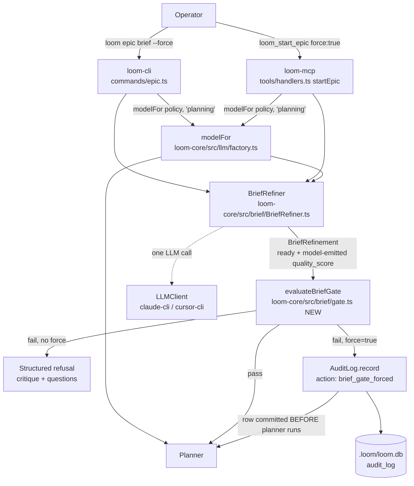

# Architecture: Brief-Quality Gate Overhaul

## Architecture Philosophy

Four constraints drive every decision below:

1. **One verdict function, two entry points.** `loom epic` (CLI) and `loom_start_epic` (MCP) currently duplicate the gate's threshold comparison inline. The new pass rule is compound (`ready && quality_score >= threshold`) and gains a force branch — duplicating that logic twice guarantees drift. The verdict moves into `loom-core` as a pure function; the entry points stay thin.
2. **Fail closed, because the exit now exists.** The old salvage path returned `ready: true` / 9-of-10 on truncated output because there was no other way out of a rejection. With `--force` as the bounded human exit, every parse-failure path can default to refusal without trapping anyone.
3. **The audit invariant is load-bearing.** A per-invocation bypass is only safe if it cannot become a silent standing bypass. The audit row — written before control returns, with the critique embedded — is the control that makes the feature shippable. It uses the existing `audit_log` table and `AuditLog.record()` seam; no new persistence.
4. **No new technology.** Everything here is a re-plumbing of existing components: `BriefRefiner`, `modelFor`, `AuditLog`, `commander`, the MCP registry. The riskiest change is semantic (what "pass" means), not structural — so the structure stays boring.

## Component Diagram



## Tech Stack

| Layer | Choice | Rationale |
|---|---|---|
| Gate verdict | New pure function in `packages/loom-core/src/brief/gate.ts` | Compound rule + force branch must live in exactly one place; pure function is trivially unit-testable without an LLM or DB |
| Refiner | Existing `BriefRefiner` class, prompt schema extended | The JSON-block protocol, salvage, and fallback machinery already work; we change what the model emits and how `normalize()` treats it, nothing structural |
| Model routing | Existing `modelFor(policy, 'planning')` in `packages/loom-core/src/llm/factory.ts` | Already the planner's resolution path and already cursor-aware (`cursor_model` short-circuit); reusing it *is* the fix |
| Force audit | Existing `AuditLog.record()` over `better-sqlite3` (`packages/loom-core/src/state/AuditLog.ts`) | Synchronous insert satisfies the written-before-return invariant for free; FTS search makes forced starts greppable |
| CLI flag | `commander` `.option('--force', ...)` in `packages/loom-cli/src/index.ts` | House standard; one boolean threaded into `runEpic` |
| MCP param | `force` boolean in the `loom_start_epic` inputSchema, `packages/loom-mcp/src/tools/registry.ts` | Mirrors the CLI flag 1:1; same handler-side semantics |
| Tests | `node:test` + `MockLLMClient` (`packages/loom-core/src/llm/MockLLMClient.ts`) | Existing pattern in `BriefRefinement.test.ts`; deterministic shaped-JSON injection covers every gate branch without a live model |

## Data Models

### `BriefRefinement` — `packages/loom-core/src/brief/types.ts` (changed semantics, same shape)

```ts
interface BriefRefinement {
  ready: boolean;            // model judgment; missing/non-boolean → false (unchanged)
  original: string;
  refined_brief?: string;
  critique: {
    strong_points: string[];
    ambiguities: string[];
    missing_scope: string[];
    untestable_claims: string[];
    hidden_complexity: string[];
  };
  questions: string[];
  // CHANGED: now MODEL-EMITTED holistic 0–10, parsed from the same JSON
  // response as `ready`. No longer derived from critique-array lengths.
  // normalize(): clamp to [0,10]; non-number → 0 (fail closed).
  quality_score: number;
  delta: { added_sections: string[]; clarifications: Array<{from: string; to: string}>; flagged_assumptions: string[] };
}
```

The refiner's `JSON_SCHEMA_INSTRUCTIONS` block in `BriefRefiner.ts` gains one field:

```text
"quality_score": number   // holistic 0-10: how ready this brief is for autonomous
                          // planning, judged as a whole — NOT a count of critique items
```

`computeQualityScore()` (BriefRefiner.ts ~lines 228–236) is **deleted**, along with its call in `normalize()`.

### Defensive defaults (FR-3, fail closed)

| Path | `ready` | `quality_score` | Notes |
|---|---|---|---|
| Transport failure / unparseable JSON — `fallback()` | `false` | `0` | Unchanged except score is now an explicit constant, not "derived from one synthetic ambiguity" |
| Truncation salvage — `salvagePartialRefinedBrief()` succeeds | `false` (was `true`) | `3` | Partial `refined_brief` still returned so the operator keeps the recovered draft; the verdict no longer vouches for content we couldn't verify. `3` < default threshold 6 ⇒ fails closed, distinguishable from total failure (`0`) in logs |

Both constants live in `BriefRefiner.ts` as named exports (`FALLBACK_QUALITY_SCORE = 0`, `SALVAGE_QUALITY_SCORE = 3`) so tests pin them by name.

### `GateVerdict` — new, `packages/loom-core/src/brief/gate.ts`

```ts
interface GateVerdict {
  pass: boolean;          // ready === true && quality_score >= threshold
  ready: boolean;         // echoed for reporting
  quality_score: number;  // echoed for reporting
  threshold: number;      // the min_brief_quality_score that was applied
}
```

### Forced-start audit row — existing `audit_log` table, new `action` value

```ts
audit.record({
  action: 'brief_gate_forced',
  command: brief.slice(0, 120),       // FTS-searchable handle on what was forced
  allowed: true,                       // the force is policy-legal; it is logged, not blocked
  detail: {
    entry_point: 'cli' | 'mcp',
    ready: boolean,
    quality_score: number,
    threshold: number,
    critique: BriefRefinement['critique'],   // FR-5: critique recorded IN the row
    questions: string[],
  },
});
```

No schema migration: `detail` is already a JSON column.

## API / Interface Contracts

```ts
// packages/loom-core/src/brief/gate.ts  (NEW — story seam)
export function evaluateBriefGate(
  refinement: Pick<BriefRefinement, 'ready' | 'quality_score'>,
  minScore: number
): GateVerdict;
// Invariant: pass === (refinement.ready === true && refinement.quality_score >= minScore)
// Note: at minScore = 0, `ready: false` still fails — ready is always consulted.

// packages/loom-core/src/brief/BriefRefiner.ts  (signature unchanged)
class BriefRefiner {
  constructor(opts: { projectRoot: string; llm: LLMClient; model: string });
  refine(rough: string): Promise<BriefRefinement>;
}
// Construction contract at BOTH call sites:
//   new BriefRefiner({ projectRoot, llm, model: modelFor(policy, 'planning') })
// Today both pass policy.agents.model — the defect IS present in both
// handlers.ts (~line 488) and epic.ts (~line 38); the epic.ts audit mandated
// by FR-6 will find it and apply the identical fix.

// packages/loom-cli/src/commands/epic.ts
export async function runEpic(brief: string, opts?: { force?: boolean }): Promise<void>;
// packages/loom-cli/src/index.ts — commander wiring:
//   .command('epic').argument('<brief>').option('--force', 'Skip the brief-quality
//   gate for this invocation; the critique is still produced and audit-logged')

// packages/loom-mcp — loom_start_epic
// inputSchema gains: force?: boolean (default false)
// Handler flow: refine → evaluateBriefGate →
//   pass            → plan (unchanged response)
//   !pass && !force → { status: 'rejected', reason: 'brief_quality_below_threshold',
//                       ready, quality_score, min_quality_score, critique,
//                       questions, refined_brief, message }   // adds `ready`; rest unchanged
//   !pass && force  → AuditLog.record(brief_gate_forced)  // BEFORE planner (NFR-2)
//                     → plan → { status: 'planned', forced: true, ...usual fields }
```

The ordering invariant in both entry points: **refine → verdict → (if forced) audit row → planner**. The synchronous `better-sqlite3` insert means the row is durable before the planner consumes a single token, which satisfies NFR-2 without any new transaction machinery.

## Security Model

| Threat | Control |
|---|---|
| Force becomes a silent standing bypass | Per-invocation only — no policy key, no env var. Every use writes a `brief_gate_forced` row before control returns (NFR-2); rows are FTS-searchable via the existing `loom_audit` surface |
| Forced start hides what the gate would have said | The refiner still runs on a forced start; the full critique is embedded in the audit row's `detail`, so the admin sees exactly what was overridden |
| Malformed/truncated model output sneaks a bad brief past the gate | All parse-failure paths fail closed: `ready: false`, score 0 or 3, below the default threshold. An unparseable response can only proceed via an explicit, logged `--force` |
| Gate and planner judge with different models (cursor backend silently ignoring `cursor_model`) | Single routing function — `modelFor(policy, 'planning')` — at both construction sites; a regression test asserts refiner and planner resolve identically on both backends |
| Documentation overstates the guarantee (operators rely on an unbypassable gate that isn't) | FR-7 copy sweep, verified by repo-wide search. Beyond the three named sites (`registry.ts` description, `init.ts` policy comment ~lines 557–562, `docs/capabilities.md` rows ~36 and ~145), the search also catches `README.md` ~line 94 and `docs/architecture/brief-refinement.md` ~lines 60–65, both of which say "non-negotiable" today and must be corrected to mention the audited `--force` escape hatch |

## ADR Log

### ADR-001 — Pass rule is `ready === true AND quality_score >= threshold`

- **Decision:** The gate passes only when both the model's boolean judgment and the threshold comparison agree.
- **Context:** FR-1's reconciled precedence. Two signals can disagree: `ready: true` with a low score, or `ready: false` with a high score.
- **Rationale:** AND-composition gives the policy knob a real meaning — operators can *tighten* beyond the model's judgment — while `ready` retains veto power, which is what makes threshold-0 repos (the current workaround) safe: they still get judgment, not a disabled gate.
- **Trade-off:** Strictly more rejections than either signal alone; a model that says "ready" but scores 5 fails at the default threshold. Acceptable because `--force` now bounds the cost of a wrong refusal.

### ADR-002 — `quality_score` becomes model-emitted; `computeQualityScore` is deleted, not deprecated

- **Decision:** The 0–10 score is parsed from the model's JSON response. The critique-array-length arithmetic is removed entirely.
- **Context:** The derived score floors at 0 for any brief the refiner critiques thoroughly — punishing diligence — and the `types.ts` comment's claim that derivation made it "stable across refinements" was false in practice (array lengths flip between identical calls).
- **Rationale:** A holistic judgment is what the number always claimed to be. Keeping the old function around "just in case" would invite someone to re-wire it.
- **Trade-off:** We accept model nondeterminism in the score itself (acknowledged out-of-scope risk in the PRD). The same-field/same-response design at least guarantees `ready` and `quality_score` come from one coherent judgment, not two calls that could disagree.

### ADR-003 — All parse-failure paths fail closed; the truncation salvage flips from `ready: true`/9 to `ready: false`/3

- **Decision:** `fallback()` → `ready: false`, score 0. Salvage → partial `refined_brief` preserved, `ready: false`, score 3.
- **Context:** The salvage path's current optimism (`ready: true`, 9/10) existed because rejection was a dead end. FR-3's assumption resolves this: fail closed now that `--force` exists.
- **Rationale:** An unparseable response is zero evidence of a good brief. Distinct constants (0 vs 3) keep total failure and partial salvage distinguishable in logs and tests without inventing a status enum.
- **Trade-off:** An operator hit by backend truncation on a genuinely good brief now sees a refusal instead of a pass — one extra re-run or a deliberate `--force`. We trade their convenience for never vouching for content we couldn't parse.

### ADR-004 — Gate verdict lives in one pure function in loom-core (`brief/gate.ts`)

- **Decision:** `evaluateBriefGate(refinement, minScore)` is the only place the pass rule exists; `epic.ts` and `handlers.ts` call it instead of comparing inline.
- **Context:** The threshold comparison is currently duplicated at both entry points, and the routing bug this epic fixes is itself a duplication-drift defect — the two call sites already disagreed once.
- **Rationale:** A compound rule plus a force branch duplicated twice will drift again. A pure function is also the cheapest possible test target: every acceptance criterion about pass/fail semantics tests it directly, no LLM mock required.
- **Trade-off:** One new file and an export through `@loom-ai/core`'s index for what is arithmetically three lines. Worth it; the alternative already burned us.

### ADR-005 — The forced-start critique is recorded by embedding it in the audit row's `detail`

- **Decision:** No new table, no `.loom/planning` artifact file for forced critiques; the `brief_gate_forced` row's JSON `detail` carries the full critique, questions, scores, and entry point.
- **Context:** FR-5 requires the critique recorded and "referenced by" the audit row.
- **Rationale:** Embedding makes record-and-reference one atomic synchronous insert — the NFR-2 ordering invariant holds trivially, and there is no second artifact that can go missing or get out of sync. `detail` is already a free-form JSON column used this way across the Supervisor.
- **Trade-off:** Critiques are reachable only through audit queries, not as standalone files, and a verbose critique fattens one DB row. Both acceptable for an override expected to be rare.

### ADR-006 — The refiner routes through `modelFor(policy, 'planning')`, accepting planning-tier cost

- **Decision:** Both `BriefRefiner` construction sites pass `modelFor(policy, 'planning')`, replacing `policy.agents.model`.
- **Context:** `BriefRefinerOptions` explicitly documents the worker-tier choice ("Sonnet by default; refinement is one call, deep reasoning isn't needed") — the current wiring is intentional on the claude backend and only *broken* on cursor-cli, where `policy.agents.model` holds a Claude-namespaced id that `cursor-agent` can't use.
- **Rationale:** G3 is the requirement: the gate's verdict must reflect the model that will actually consume the brief, and `modelFor` is the one function that already gets the cursor short-circuit right. A bespoke "worker-tier but cursor-aware" resolution would be a third routing path — exactly the class of drift this epic exists to kill.
- **Trade-off:** On the claude-cli backend the gate call moves from Sonnet to the planning model (Opus 4.7 by default) — a real per-invocation cost increase for a single-call critique. We pay it for verdict fidelity and routing uniformity; the `BriefRefinerOptions.model` doc comment must be updated so the old rationale doesn't mislead the next reader.
