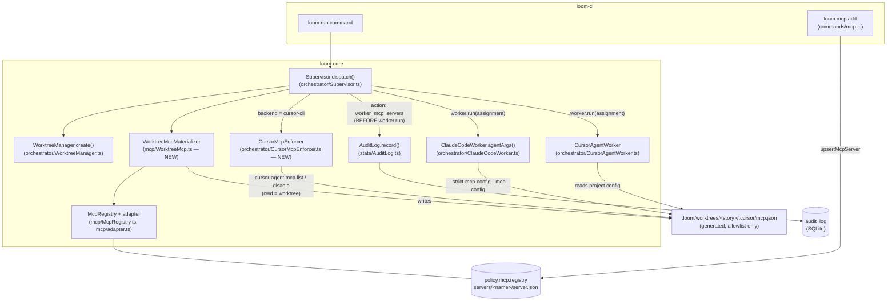

# Architecture: Worker MCP Isolation — Allowlist-Only Servers, Materialized Per-Worktree, Audit-Logged

## Architecture Philosophy

Three constraints drive every decision below:

1. **Structural, not prompt-based.** Isolation must hold against an adversarial or confused LLM. We act at worktree-setup / spawn time, in code paths the worker cannot influence — the same posture as the existing policy engine (`loom guard check`) and worktree isolation.
2. **One generation point, per-backend enforcement.** The allowlisted server set is computed once, in the Supervisor's dispatch path, from `policy.mcp.registry` via the existing `McpRegistry` / `adapter.ts` machinery. Backends differ only in how they're forced to honor it: claude-code has a real strict flag; cursor-cli must be wrangled with explicit disables. We accept that asymmetry rather than pretending both CLIs offer the same contract.
3. **Boring plumbing, existing seams.** No new tables, no new config formats, no new dependencies. The audit row reuses `audit_log.detail` (a JSON TEXT column); config generation reuses `toMcpJsonEntry()`; enforcement hangs off `Supervisor.dispatch()` exactly where the worktree is created and the `dispatch` audit row is already written.

The trade-off accepted overall: a deliberate behavior break for operators who relied on inherited `~/.cursor/mcp.json` servers, in exchange for a closed, auditable tool surface. Migration is `loom mcp add`.

## Component Diagram



## Tech Stack

| Layer | Choice | Rationale |
|---|---|---|
| Config generation | `node:fs` whole-file write of `.cursor/mcp.json` | Generation is authoritative — no merge semantics, no `upsertMcpServer` reuse (that helper deliberately never clobbers; here clobbering *is* the contract). |
| Registry → entry conversion | Existing `pickPackage()` / `toMcpJsonEntry()` in `packages/loom-core/src/mcp/adapter.ts` | Already produces `McpJsonEntry` with `${VAR}` secret references; loom never touches credential values. Zero new code for the hard part. |
| cursor-cli enforcement | `execFileSync('cursor-agent', ['mcp', 'list'/'disable', ...], { cwd: worktree })` | Boring subprocess calls; no cursor internals assumed. Precedence/durability verified by spike before wiring (NFR-2). |
| claude-code enforcement | `--strict-mcp-config --mcp-config <path>` spawn args | First-party strictness flag — the strongest guarantee available; prefer it over file games. |
| Audit | Existing `audit_log` table, `detail` JSON column | Schema already stores arbitrary JSON per row (`AuditLog.record` stringifies `detail`); no migration (confirms FR-5 assumption). |
| Tests | `node --test` under `packages/loom-core/src/__tests__/` | House standard (`package.json` test script); tests live next to source. |

## Data Models

No schema migration. The new audit row reuses the existing table:

```sql
-- packages/loom-core/src/state/Database.ts (existing, unchanged)
CREATE TABLE IF NOT EXISTS audit_log (
  id INTEGER PRIMARY KEY AUTOINCREMENT,
  agent_id TEXT REFERENCES agents(id),
  action TEXT NOT NULL,        -- new value: 'worker_mcp_servers'
  command TEXT,                -- story id (matches the 'dispatch' row convention)
  allowed INTEGER,
  policy_rule TEXT,
  detail TEXT,                 -- JSON payload, shape below
  timestamp DATETIME NOT NULL DEFAULT CURRENT_TIMESTAMP
);
```

```typescript
// detail payload for action = 'worker_mcp_servers'
interface WorkerMcpServersDetail {
  servers: string[];          // exact server names materialized, sorted
  backend: 'claude-code' | 'cursor-cli';
  configPath: string;         // worktree-relative path of the generated file
  loomServerIncluded: boolean;
  // cursor-cli only — what the enforcer disabled:
  disabledServers?: string[];
}
```

```typescript
// Generated file: .loom/worktrees/<storyId>/.cursor/mcp.json
// Entries come from toMcpJsonEntry(); shape already defined in mcp/adapter.ts.
interface GeneratedMcpConfig {
  mcpServers: Record<string, McpJsonEntry>;  // McpJsonStdioEntry | McpJsonHttpEntry
}
```

## API / Interface Contracts

```typescript
// NEW — packages/loom-core/src/mcp/WorktreeMcp.ts
export interface MaterializeOptions {
  worktreePath: string;
  /** null when policy.mcp.registry is unset — materializes the empty/loom-only config. */
  registry: McpRegistry | null;
  /** The loom server's own entry (node <script> serve), passed in by the caller
      because only loom-cli knows its script path. undefined = omit. */
  loomServerEntry?: McpJsonEntry;
}
export interface MaterializeResult {
  configPath: string;     // absolute path to the written .cursor/mcp.json
  serverNames: string[];  // sorted; includes 'loom' when loomServerEntry was given
}
export function materializeWorktreeMcpConfig(opts: MaterializeOptions): MaterializeResult;
```

```typescript
// NEW — packages/loom-core/src/orchestrator/CursorMcpEnforcer.ts
export interface CursorEnforceOptions {
  worktreePath: string;
  allowlist: string[];          // server names that must survive (registry + 'loom')
  cursorBin?: string;           // default 'cursor-agent'
}
export interface CursorEnforceResult {
  disabled: string[];           // servers found and disabled
  /** non-empty when a server could not be disabled headlessly — the documented
      strictness gap; recorded in the audit detail, never thrown. */
  gaps: string[];
}
export function enforceCursorMcpAllowlist(opts: CursorEnforceOptions): CursorEnforceResult;
```

```typescript
// CHANGED — packages/loom-core/src/orchestrator/ClaudeCodeWorker.ts
// agentArgs() gains access to the per-spawn worktree. The minimal seam:
// BaseCliWorker.spawnAgent passes the assignment down.
protected agentArgs(assignment: WorkerAssignment): string[];
// ClaudeCodeWorker appends, when the generated config exists:
//   ['--strict-mcp-config', '--mcp-config', path.join(worktreePath, '.cursor/mcp.json')]
```

```typescript
// CHANGED — packages/loom-core/src/orchestrator/Supervisor.ts, dispatch() ordering:
//   1. wt = this.wt.create(storyId, ...)                        (existing)
//   2. mat = materializeWorktreeMcpConfig(...)                  (NEW)
//   3. if backend === 'cursor-cli': enforceCursorMcpAllowlist() (NEW)
//   4. this.audit.record({ action: 'worker_mcp_servers', ... }) (NEW — before step 6)
//   5. this.audit.record({ action: 'dispatch', ... })           (existing)
//   6. runner.run(assignment)                                   (existing — worker spawns here)
```

Config keys: no new policy surface. `policy.mcp.registry` (`PolicySchema.mcp.registry` in `packages/loom-core/src/types.ts`) is consumed as-is.

## Security Model

| Threat | Control |
|---|---|
| Worker inherits developer's `~/.cursor/mcp.json` and acts with their Jira/internal-tool identity | Worktree-local `.cursor/mcp.json` generated from the registry only; cursor-cli: every non-allowlisted server explicitly disabled per-worktree; claude-code: `--strict-mcp-config` ignores all other config layers. |
| LLM output or worker behavior re-enables a server | Enforcement runs in Supervisor code before spawn; the worker process never participates. Mirrors invariant #1 (policy engine is structural). |
| Secret values leak into generated configs | `toMcpJsonEntry()` emits `${NAME}` references only — preserved unchanged; loom never reads or stores secret values. |
| No forensic record of a worker's tool surface | One `worker_mcp_servers` audit row per spawn, written before `runner.run()` — same write-before-act discipline as bash-command logging (invariant #5). Queryable via existing `AuditLog.getByStory()`. |
| Silent strictness gap on cursor-cli (server that can't be disabled headlessly) | `CursorEnforceResult.gaps` recorded in the audit detail and documented; upstream `--strict-mcp-config` equivalent recorded as an out-of-scope ask. |

## ADR Log

### ADR-1: Materialize an authoritative worktree config; never touch user config

**Decision.** Write a complete `.cursor/mcp.json` into each story worktree (overwrite, not merge). Never modify `~/.cursor/mcp.json`.
**Context.** Worktrees under `.loom/worktrees/<storyId>` contain only tracked files; the repo-root `.cursor/mcp.json` written by `loom init` is untracked, so today workers see *only* the user-level config — the exact exposure we're closing.
**Rationale.** The worktree is already the per-worker isolation boundary (invariant #2); placing the config there means cursor-agent's project-config resolution picks it up with `cwd = worktreePath`, no new mechanism. Whole-file write (not `upsertMcpServer`, which deliberately never clobbers) makes the generated file a pure function of the registry — re-dispatch and retry are idempotent.
**Trade-off.** A worker could in principle edit its own worktree config mid-run. We accept this for cursor-cli (defense-in-depth: disables + the file) because the alternative — wrapping every spawn in a chroot-style config jail — buys little against a worker that already runs with `--force`. claude-code doesn't have this hole (`--strict-mcp-config` pins the file at spawn).

### ADR-2: Asymmetric per-backend enforcement

**Decision.** claude-code: `--strict-mcp-config --mcp-config <generated file>` appended in `ClaudeCodeWorker.agentArgs()`. cursor-cli: enumerate via `cursor-agent mcp list`, disable every non-allowlisted server via `cursor-agent mcp disable <name>` with `cwd` = worktree, at worktree setup.
**Context.** cursor-agent has no strict-config flag; claude does. FR-3/FR-4 acknowledge this.
**Rationale.** Use the strongest primitive each CLI offers rather than a lowest-common-denominator hack on both. The disable pass is gated on a spike (story-002-002) verifying that disable state is per-project, not user-global — if it were user-global, disabling would corrupt the developer's own sessions, and the design must shift to a different mechanism before wiring in.
**Trade-off.** Two code paths to test and document, and cursor-cli's guarantee is weaker (enumerate-and-disable can race a server added between list and spawn; a gap we document rather than close). The upstream `--strict-mcp-config` equivalent is recorded as an ask, not built.

### ADR-3: Loom server inclusion is per-backend — include for cursor-cli, exclude for claude-code

**Decision.** The generated config includes the loom MCP server entry only when the backend is cursor-cli; claude-code workers get registry servers only.
**Context.** FR-6 defaults to exclude "confirmed against any dispatch-time dependency." That dependency exists: `CursorAgentWorker.pullGuidanceHint()` makes the worker prompt instruct polling the `loom_pull_guidance` MCP tool (the Phase 2 live-guidance fallback in `docs/research/live-agent-guidance.md`), because cursor-agent has no streaming stdin. claude-code receives guidance over stdin (`WorkerInputChannel`) and has no MCP-side dependency.
**Rationale.** Excluding loom on cursor-cli would silently break operator steering; including it on claude-code adds prompt surface with zero use. Materializing it per-worktree actually *fixes* cursor guidance, which today depends on the untracked repo-root config never reaching worktrees.
**Trade-off.** Backend-divergent configs mean the audit row must say which shape was used (`loomServerIncluded` in the detail payload) — a small complexity cost for not breaking a shipped feature.

### ADR-4: Audit via a new `worker_mcp_servers` action in the existing `audit_log`; no migration

**Decision.** One row per spawn, `action = 'worker_mcp_servers'`, `command = <storyId>`, `agent_id = <task.agentId>`, server set in `detail` JSON, written in `Supervisor.dispatch()` before `runner.run()`.
**Context.** `audit_log.detail` is a free-form JSON TEXT column (`AuditLog.record` already stringifies arbitrary objects) — the FR-5 no-migration assumption holds.
**Rationale.** A dedicated action keeps the row queryable (`getByStory`, FTS on `action`) without overloading the existing `dispatch` row, whose detail shape dashboards already consume. Writing it in `dispatch()` — the same function that creates the worktree and precedes `runner.run()` — gives write-before-spawn ordering by construction, not by convention.
**Trade-off.** Two rows per dispatch instead of one enriched row; we accept the duplication to avoid changing the `dispatch` row's contract.

### ADR-5: Generation lives in loom-core; the loom-server entry is injected by the caller

**Decision.** `materializeWorktreeMcpConfig` lives in `packages/loom-core/src/mcp/WorktreeMcp.ts` and takes `loomServerEntry` as a parameter rather than computing it.
**Context.** Only loom-cli knows the loom script's absolute path (`loomScriptPath()` in `commands/init.ts`); core must not depend on cli, and duplicating path discovery in core invites drift.
**Rationale.** Keeps the dependency direction clean (cli → core) and makes the materializer a pure, trivially testable function of its inputs — both the empty-registry and populated-registry acceptance tests become table-driven.
**Trade-off.** One more option threaded through `SupervisorOptions` and the `loom run` wiring; accepted as the cost of not coupling core to cli's filesystem layout.
