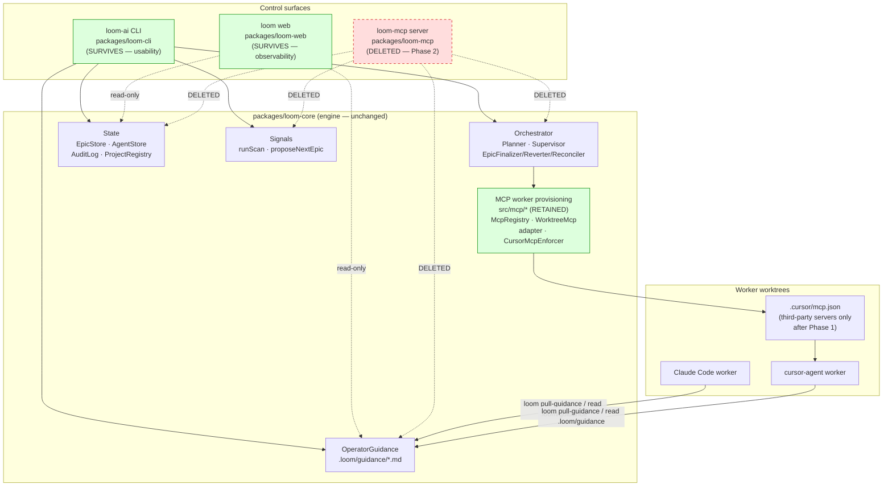

# Architecture: Retiring the Loom MCP Server — CLI-Only Control, Web-Only Observability

## Architecture Philosophy

This is subtractive architecture. The system already exists and works; our job is to remove a redundant surface without dropping a single capability on the floor. Four constraints drive every decision below.

1. **Parity is an invariant, not a milestone.** The `mcp__loom` server (`@loom-ai/mcp`) republishes 23 `loom_*` tools that already sit on top of the same core engine the CLI uses. Seven of those tools have no CLI equivalent today. We port those seven *first*, prove parity with a test, and only then delete. At no commit between here and done may a capability exist solely in MCP. This is the load-bearing decision — everything else is sequencing around it.

2. **Two surfaces collapse to one seam.** Both the CLI and the MCP server are thin shells over `packages/loom-core` (`Planner`, `Supervisor`, `EpicStore`, `AuditLog`, `OperatorGuidance`, `runScan`, `proposeNextEpic`). We are not rewriting that engine. We are deleting one of its two shells and re-pointing the few callers — chiefly the cursor worker's guidance read — at the surviving shell. The trade-off we accept: the MCP shell occasionally exposed an operation through a slightly richer typed payload than the CLI; we replace those with `--json` flags rather than a typed RPC.

3. **Retire the *server*, keep the *client*.** Loom-as-an-MCP-server (mount loom inside Claude Code/Cursor) dies. Loom-as-an-MCP-client (provisioning approved third-party servers into worker worktrees) lives, untouched. The entire `packages/loom-core/src/mcp/` tree — `McpRegistry`, `WorktreeMcp`, `adapter`, `CursorMcpEnforcer` — is on the retain side of the line. The hazard here is a sloppy grep deleting both; the contract and the search-allowlist exist precisely to draw that boundary in code.

4. **"Done" is defined by search, not by feeling.** A fixed set of forbidden strings (`loom-mcp`, `loom serve`, `loom init --mcp`, `mcp__loom`, `first-class`, `primary surface`, `two interfaces over the same engine`) must return zero hits outside two allowlisted locations. This makes positioning drift a mechanically detectable regression rather than a matter of taste.

---

## Component Diagram



The redrawn data path that matters: the cursor worker's guidance read (dashed `loom_pull_guidance` RPC today) is rerouted to `loom pull-guidance` / a direct `.loom/guidance` file read. The worker's *write*-side MCP config (`.cursor/mcp.json`) keeps its third-party servers and loses only its self-referential `loom` server entry.

---

## Tech Stack

No new technology is introduced — boring is the point. The stack table records what each surface is built on and what changes.

| Layer | Choice | Rationale / change |
|---|---|---|
| CLI framework | `commander` (`packages/loom-cli/src/index.ts`) | Already the primary surface; absorbs 3 new commands + flags. The `serve` command (lines 402–409) is deleted. |
| Engine | `packages/loom-core` TS modules | Unchanged. Both shells already call the same classes; we delete one caller. |
| MCP server SDK | `@modelcontextprotocol/sdk` (server side, in `loom-mcp`) | **Removed.** Client-side use inside `src/mcp/*` provisioning is retained. |
| MCP client/provisioning | `src/mcp/{McpRegistry,WorktreeMcp,adapter,CursorMcpEnforcer}` | **Retained, untouched.** Materializes third-party servers into worktrees. |
| State | `better-sqlite3` (`.loom/loom.db`) + JSON (`~/.loom/projects.json`) | Unchanged. New CLI commands are read/dispatch over existing stores. |
| Guidance transport | Append-only `.loom/guidance/<id>.md` + offset markers | Becomes the *sole* worker-guidance path once the MCP read tool is gone. |
| Output format | Plain text default + `--json` flag | Replaces MCP's typed return payloads. The trade-off for losing typed RPC. |
| Build/test | npm workspaces, root `package.json` scripts | Drop `-w @loom-ai/mcp` from `build` (line 8) and `test` (line 9). |
| Publish | npm publish workflow + `docs/operations/releasing.md` | Stop publishing `@loom-ai/mcp`. Treated as a major bump for our records; **no `npm deprecate`** run. |
| Docs | MkDocs (`docs/`), `README.md`, `CLAUDE.md` | Reframed CLI = usability, web = observability. |

---

## Data Models

No schema changes. The relevant shapes the new CLI commands read and write already exist; reproduced here so each story implements against one spec.

```typescript
// packages/loom-core/src/state/ProjectRegistry.ts — backs `loom project`
interface ProjectEntry {
  root: string;          // absolute repo path, the lookup key
  registeredAt: string;  // ISO timestamp
}
// persisted at ~/.loom/projects.json: { projects: ProjectEntry[] }

// packages/loom-core/src/state/types.ts — latest epic in `loom project`
interface EpicRecord {
  id: string;
  title: string;
  status: 'planning' | 'planned' | 'approved' | 'in_progress'
        | 'finalizing' | 'done' | 'failed' | 'rejected';
  // ...brief/prd/yaml paths, autonomy_level, cost metadata
}

// OperatorGuidance.pullSince return — backs `loom pull-guidance`
interface GuidancePull {
  content: string | null;  // appended bytes since last pull, or null when none
  has_more: boolean;
}

// packages/loom-core/src/state/types.ts — audit row written by --reason flags
interface AuditLogEntry {
  id: number;
  agent_id: string | null;
  action: string;          // e.g. 'stop_agent', 'stop_epic', 'retry_story'
  command: string | null;
  allowed: boolean | null;
  policy_rule: string | null;
  detail: string | null;   // JSON: { reason, ... }
  timestamp: string;
}
```

On-disk guidance convention (the contract the worker read path depends on):

```
.loom/guidance/<story-id>.md            # append-only, timestamped entries, never truncated
.loom/guidance/.pulled/<story-id>.offset # per-worker consumption marker, advanced by pullSince()
```

---

## API / Interface Contracts

These are the seams the parallel stories must agree on. New CLI commands wrap existing core functions one-to-one; the function under each command is the same one the MCP handler called, so behavior is identical by construction.

### New / extended CLI commands (Epic 002)

```text
loom pull-guidance <story-id> [--json]
    → OperatorGuidance.pullSince(storyId): { content, has_more }
    default: prints content as plain text, or "no new guidance" when content === null
    --json:  prints { content, has_more }
    unknown story id → exit 1, one-line message, no stack trace

loom project <project-root> [--json]
    → ProjectRegistry().list().find(p => p.root === root)  +  latest EpicRecord
    default: prints root, name, latest epic id/status/title
    --json:  prints { project, latest_epic? }
    unregistered root → exit 1, one-line message

loom stop                       [--reason <text>]   # UNCHANGED graceful whole-supervisor halt
loom stop --epic <epic-id>      [--reason <text>]   # NEW: terminate only that epic's workers
    → mirrors loom_stop_epic; other epics keep running
    nonexistent epic id → exit 1, one-line message
loom retry <story-id>           [--reason <text>]
    --reason absent → audit detail.reason defaults to a CLI-source string

loom status [--project <root>]      # NEW flag, mirrors MCP `project` param
loom scan   [--project <root>]      # NEW flag
loom propose [--top-lessons <n>] [--top-opps <n>] [--json]   # mirrors loom_propose
```

### Core seams these commands bind to (existing, do not modify)

```typescript
// packages/loom-core/src/orchestrator/OperatorGuidance.ts
pullSince(storyId: string): { content: string | null; has_more: boolean }

// packages/loom-core/src/state/AuditLog.ts
record(entry: {
  agent_id?: string; action: string; command?: string;
  allowed?: boolean; policy_rule?: string; detail?: Record<string, unknown>;
}): void
```

### Parity oracle (Epic 002, story-002-006)

The pre-removal `mcp__loom` inventory is the source of truth for "no capability lost." The verification test pins this list and asserts each maps to a CLI command:

```text
loom_pull_guidance → loom pull-guidance      loom_get_project   → loom project
loom_stop_epic     → loom stop --epic        loom_propose       → loom propose
loom_scan_signals  → loom scan               loom_get_status    → loom status
loom_stop_agent    → loom stop <story-id>    (… remaining 16 already had CLI equivalents)
```

### Worker provisioning seam (RETAINED — do not touch)

```typescript
// packages/loom-core/src/mcp/WorktreeMcp.ts
materializeWorktreeMcpConfig(opts): MaterializeResult
  // writes worktree .cursor/mcp.json = policy.mcp.registry servers ( + loom, until Phase 1 )
// Phase-1 change (story-002-005): stop passing the loom server entry into this call.
// The function signature and third-party behavior stay identical.
```

---

## Security Model

Removing a server is a net reduction in attack surface; the residual risks are about *what we accidentally remove or leave behind*.

| Threat | Pre-change exposure | Control after change |
|---|---|---|
| Loom orchestrator operations reachable via a long-lived stdio server mounted in an editor | `loom serve` exposes 23 privileged tools (`loom_start_epic`, `loom_approve_plan`, `loom_stop_epic`…) to any MCP client that can spawn it | Server deleted (FR-8). Control surface is the local CLI invoked by the operator; no resident RPC endpoint. |
| Over-broad deletion strips worker provisioning, breaking the policy-gated allowlist | — | File & module ownership map fences `packages/loom-core/src/mcp/*`, `loom mcp add/list`, `policy.mcp.registry`, `CursorMcpEnforcer` as **retain**. `CursorMcpEnforcer` keeps disabling non-allowlisted servers. |
| Stale `loom` server entry left in third-party repos' `.cursor/mcp.json` / `.mcp.json` after the binary stops shipping `serve` | An on-disk entry points at a `serve` subcommand that now errors | Accepted and logged as follow-up (explicitly out of scope). New materialization stops (story-002-005, FR-9); a stale entry fails closed — `loom serve` resolves as unknown command and exits non-zero, never silently mis-executing. |
| Guidance read path regresses to silent failure for cursor workers | Worker depended on `loom_pull_guidance` RPC | Sequencing invariant NFR-1: `loom pull-guidance` / `.loom/guidance` path is verified working (story-002-005/006) **before** the MCP read path is deleted in Epic 003. |
| Secrets inlined when rewriting worktree MCP config | — | Unchanged: `adapter.toMcpJsonEntry` keeps env vars as `${VAR}` references; `WorktreeMcp` overwrites whole-file and never inlines. |

---

## ADR Log

### ADR-001 — Port-then-delete in two ordered epics, never delete-then-port

**Decision.** Land all CLI parity (Epic 002) and prove it with a test before any MCP deletion (Epic 003). No Phase-2 deletion may precede its Phase-1 equivalent.

**Context.** Seven `mcp__loom` capabilities (`loom_pull_guidance`, `loom_get_project`, `loom_stop_epic`, `--project` targeting, `loom_propose` flags, `--reason` audit, cursor guidance read) have no CLI equivalent today. The cursor worker actively depends on `loom_pull_guidance` at runtime.

**Rationale.** Keeping parity unbroken at every commit means the change is safe to ship, pause, or partially revert at any point — Epic 002 is independently valuable as "a more complete CLI" even if Epic 003 never lands.

**Trade-off.** We carry both surfaces simultaneously for the duration of Epic 002, accepting temporary duplication to guarantee zero capability gap. The alternative — delete first, backfill after — would be fewer commits but would strand the cursor worker's guidance read in a broken state.

### ADR-002 — Replace typed MCP return payloads with `--json` flags, not a new typed RPC

**Decision.** Each ported command prints human text by default and accepts `--json` for machine consumers, rather than introducing any structured transport to replace the MCP tool's typed return.

**Context.** MCP handlers returned structured objects (e.g. `loom_get_project` → `{ project, latest_epic }`). Some consumer somewhere may have parsed those.

**Rationale.** `--json` is the boring, idiomatic CLI answer and already the pattern in `loom propose`. It needs no new dependency, no schema registry, no second wire format. Loom positioning is explicitly "no MCP surface of its own," so reintroducing a typed RPC would contradict the very goal.

**Trade-off.** Consumers lose MCP's schema-typed payloads and must parse JSON from stdout. We judge that acceptable: the only known runtime consumer is the cursor worker's guidance read, which needs raw appended text, not a typed object.

### ADR-003 — Retain the entire `src/mcp/` provisioning tree; delete only the server shell

**Decision.** Draw the removal boundary at the *server* (`packages/loom-mcp`, `loom serve`, `loom init --mcp`, `mcpConfig`). Keep every client-side provisioning module (`McpRegistry`, `WorktreeMcp`, `adapter`, `CursorMcpEnforcer`, `loom mcp add/list`, `policy.mcp.registry`).

**Context.** "MCP" names two unrelated capabilities here: loom-as-a-server (mount loom in an editor) and loom-as-a-client (inject approved third-party servers into worker worktrees). A naive grep-and-delete would take both.

**Rationale.** The provisioning path is load-bearing for worker capability and policy enforcement; it has nothing to do with the redundant control surface. Naming the retained modules explicitly — in the ownership map and the search allowlist — turns the boundary into something a reviewer and a test can both check.

**Trade-off.** The word "mcp" survives in the codebase and docs, so the forbidden-string search must be precise (`loom-mcp`, `mcp__loom`, `loom serve`) rather than a blanket `mcp` match, and `docs/research/cursor-mcp-strictness.md` plus provisioning code are allowlisted. We accept a more surgical search definition in exchange for not amputating a working subsystem.

### ADR-004 — "Done" is defined by a fixed forbidden-string search with an explicit allowlist

**Decision.** Completion is mechanically defined: `loom-mcp`, `loom serve`, `loom init --mcp`, `mcp__loom`, `first-class`, `primary surface`, and `two interfaces over the same engine` return zero hits except inside `docs/research/cursor-mcp-strictness.md` and retained worker-provisioning code paths.

**Context.** Positioning drift is the most likely silent regression — a doc or comment re-advertising loom as an MCP server after the code is gone.

**Rationale.** A search-defined definition of done is auditable and re-runnable in CI, unlike "we updated the docs." It catches both stale code references and stale prose in one pass.

**Trade-off.** The allowlist must be maintained as a real artifact; a legitimately new mention of "mcp" in retained provisioning code could trip the search and require an allowlist update. That friction is the price of a done-ness that a machine, not a reviewer's memory, enforces.

### ADR-005 — Stop new materialization of the loom server entry; do not migrate stale on-disk entries

**Decision.** Phase 2 removes the *generation* of `loom` server entries (in `mcpConfig` and the worker `.cursor/mcp.json` path) but ships no migration to scrub entries already written into other repos.

**Context.** Earlier `loom init --mcp` runs and prior worker dispatches wrote `{ "loom": { "command": "node", "args": [..., "serve"] } }` into `.mcp.json` / `.cursor/mcp.json` files across user repos we don't control.

**Rationale.** A migration would have to crawl arbitrary repos on a user's machine — high blast radius for a cosmetic cleanup. A stale entry now points at a `serve` subcommand that exits non-zero; it fails closed and visibly rather than mis-executing.

**Trade-off.** We accept stale, harmless-but-dead `loom` entries lingering on disk, logged as a follow-up, in exchange for not shipping a filesystem-crawling migration. The binary no longer ships `serve`, so the worst case is an unknown-command error, not silent wrong behavior.

### ADR-006 — Drop `@loom-ai/mcp` from build/test/publish; major-bump on record, no `npm deprecate`

**Decision.** Remove `-w @loom-ai/mcp` from the root `build` and `test` scripts, drop the package from the publish workflow and `docs/operations/releasing.md`, and treat it as a major version bump for our records only. Do **not** run `npm deprecate` and do not publish anything now.

**Context.** `@loom-ai/mcp` is a published workspace package; removing it changes the public package set.

**Rationale.** Removing it from the workflow is sufficient to stop future publishes without a registry-mutating action. Skipping `npm deprecate` avoids an irreversible public signal during a refactor that is internally scoped.

**Trade-off.** The last-published `@loom-ai/mcp` version remains installable from the registry with no deprecation notice, so an external consumer pinning it sees no warning. We accept that quiet tail in exchange for not taking a public, hard-to-reverse publishing action mid-change.
