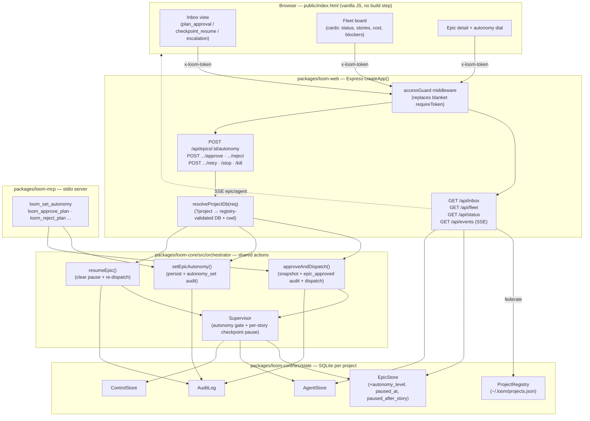

# Fleet Commander — Governance Layer Architecture

## Architecture Philosophy

Fleet Commander is an *additive control plane* over loom's existing web, MCP, and core surfaces. Four constraints drive every decision below:

1. **Byte-compatibility is non-negotiable (NFR-1, FR-14).** With no new column values and no new flags, the running system must behave identically to today. This forces additive-only schema migrations (`ALTER TABLE ... DEFAULT 'manual'`), defaulted code paths, and a guard that degrades to *exactly* the current `requireToken` behavior when read-only is off.
2. **One implementation per mutation (NFR-4, FR-9, FR-13).** The inbox and board are *views*; they must call the mutation endpoints that already exist. Autonomy enforcement and read-only gating each get exactly one home — the Supervisor and a single middleware — never per-handler copies. Where today's surfaces diverge (the MCP approve path writes no `epic_approved` audit row while the web path does), we *converge* them onto a shared action rather than adding a third variant.
3. **Autonomy changes who decides, not what is recorded (FR-7, NFR-2).** A `full-auto` auto-approval must produce the identical `epic_approved` audit row *and* `policy_snapshot` as a human approval. The only safe way to guarantee "identical" is to make both paths the *same code*.
4. **Federation already exists; reuse its shape (NFR-3, NFR-5).** `/api/status`, `/api/cost`, and the `ProjectRegistry` already read across projects. The inbox and fleet board are new federation endpoints cut from the same cloth (open each project DB, aggregate, tag with `project_root`) and ride the existing SSE `agent`/`epic` events rather than inventing a transport.

The accepted trade-off across all four: Fleet Commander deliberately grows the two existing hot files — `packages/loom-web/src/server/index.ts` and `packages/loom-core/src/orchestrator/Supervisor.ts` — rather than introducing a parallel governance subsystem. We pay in file size to avoid a second, drifting source of truth for dispatch and routing.

## Component Diagram



## Tech Stack

No new runtime dependencies. Every choice is "the one already in the tree," in keeping with loom's boring-technology stance.

| Layer | Choice | Rationale |
|---|---|---|
| Schema migration | `ALTER TABLE ADD COLUMN` in `Database.ts` `runMigrations`, bumped to **v16** | Existing migration runner is additive and idempotent; a defaulted column is the only change that keeps pre-existing epics reading as `manual` with zero backfill (FR-1, FR-14). |
| State access | `better-sqlite3` via existing `EpicStore` / `AgentStore` | Synchronous, single-file, already the home of every column we extend (NFR-4). |
| Validation | `zod` (`AutonomyLevelSchema`) in `loom-core/src/types.ts` | Mirrors `EpicStatusSchema`; one enum, reused by web body parsing and the MCP `inputSchema`. |
| Web routing | `express` route table in `createApp()` (`loom-web/src/server/index.ts`) | Extend the existing factory; the new endpoints sit beside `/api/status` and reuse its federation pattern. |
| Access control | Single `accessGuard` middleware in `loom-web/src/server/auth.ts` | Replaces the blanket `app.use('/api', requireToken(...))` with one method-aware classifier — the only place read-only logic lives (FR-13). |
| Live updates | Existing SSE `eventStreamHandler` (`loom-web/src/server/events.ts`) | `epic`/`agent` events already diff the DB every 500 ms; board and inbox subscribe rather than poll (FR-11, NFR-5). |
| MCP tool | `ToolDefinition` + handler in `loom-mcp/src/tools/{registry,handlers}.ts` | Follows the `loom_approve_plan` pattern exactly; delegates to the shared core action (FR-3). |
| Frontend | Vanilla JS in `public/index.html` | No framework, no build step; add two views to the existing router (NFR-4). |

## Data Models

### Schema migration (Database.ts → v16)

```sql
-- All additive. Existing rows take the default; no backfill, no rewrite (FR-1, FR-14).
ALTER TABLE epics ADD COLUMN autonomy_level     TEXT NOT NULL DEFAULT 'manual';
ALTER TABLE epics ADD COLUMN paused_at          DATETIME;   -- NULL = not checkpoint-paused
ALTER TABLE epics ADD COLUMN paused_after_story TEXT;       -- story_id the epic paused after
```

`autonomy_level ∈ {'full-auto','checkpoint','manual'}`. The pair `(paused_at, paused_after_story)` is the **durable paused indicator** of FR-5 / story-003-001: it lives on the epic row, so it survives a process restart and is readable by a federating inbox without any in-memory state.

> Trade-off: checkpoint pause is stored as epic columns rather than in `ControlStore`. `ControlStore` is a single-row, global `running|stopping` flag — it cannot express *which epic, paused after which story*. Per-epic columns cost two migrations but give per-epic durability and clean federation.

### Types (loom-core/src/types.ts)

```typescript
export const AutonomyLevelSchema = z.enum(['full-auto', 'checkpoint', 'manual']);
export type AutonomyLevel = z.infer<typeof AutonomyLevelSchema>;

// Extends the value returned by EpicStore.get()
interface Epic {
  // ...existing fields...
  autonomy_level: AutonomyLevel;          // default 'manual'
  paused_at: string | null;               // ISO8601; non-null ⇒ checkpoint-paused
  paused_after_story: string | null;
}
```

### Inbox entry (loom-web/src/shared/types.ts)

```typescript
type InboxType = 'plan_approval' | 'checkpoint_resume' | 'escalation';

interface InboxEntry {
  type: InboxType;
  project_root: string;     // absolute path; from ProjectRegistry
  project: string;          // display name = basename(project_root)
  epic_id: string;
  title: string;
  story_id: string | null;  // set for checkpoint_resume / escalation
  age_ms: number;           // now - decision-relevant timestamp
}
```

Derivation, per registered project DB:
- `plan_approval` ← `epicStore.listByStatus('planned')`, `age` from `updated_at`.
- `checkpoint_resume` ← epics with `paused_at IS NOT NULL`, `story_id = paused_after_story`, `age` from `paused_at`.
- `escalation` ← latest agents in `blocked` status (reuse `AgentStore.listLatestByEpic`), `age` from agent `updated_at`.

### Fleet card (loom-web/src/shared/types.ts)

```typescript
interface FleetStory { story_id: string; status: AgentStatus; }

interface FleetCard {
  project_root: string;
  epic_id: string;
  title: string;
  status: EpicStatus;
  autonomy_level: AutonomyLevel;
  paused: boolean;                  // paused_at !== null
  stories: FleetStory[];            // AgentStore.listLatestByEpic(epic_id)
  cost: EpicCost;                   // aggregateEpicCost(epic, agents) — reused verbatim
  blockers: number;                 // count of stories in {'blocked','failed'}
}
```

Cross-epic correctness (FR-10, NFR-3) is *structural*: every card is built from `listLatestByEpic(epic_id)`, which filters by `epic_id`. No shared accumulator spans epics, so two concurrent epics' agents cannot bleed into one card. The two-epic test asserts this by loading two epics' agents into one DB and checking card membership.

## API / Interface Contracts

### Shared core actions (loom-core/src/orchestrator)

```typescript
// NEW: the single approve+dispatch path. Web, MCP, and full-auto all call this.
// Writes the epic_approved audit row AND policy_snapshot, then dispatches — once.
function approveAndDispatch(
  deps: { epicStore: EpicStore; auditLog: AuditLog; ctx: ToolContext; db: Database; policy: Policy },
  epicId: string,
  opts: { actor: 'human' | 'full-auto' }
): Promise<{ status: 'dispatching' }>;

// NEW: shared autonomy setter. Web route and loom_set_autonomy both call this.
function setEpicAutonomy(
  deps: { epicStore: EpicStore; auditLog: AuditLog },
  epicId: string,
  level: AutonomyLevel,
  actor: string
): { id: string; autonomy_level: AutonomyLevel };

// NEW: clears the checkpoint pause and re-dispatches remaining stories.
function resumeEpic(
  deps: { epicStore: EpicStore; ctx: ToolContext; db: Database; policy: Policy },
  epicId: string
): Promise<{ status: 'dispatching' }>;
```

### EpicStore additions

```typescript
class EpicStore {
  getAutonomy(id: string): AutonomyLevel;                 // default 'manual'
  setAutonomy(id: string, level: AutonomyLevel): void;
  pauseAfterStory(id: string, storyId: string): void;    // sets paused_at = CURRENT_TIMESTAMP
  resume(id: string): void;                               // clears paused_at, paused_after_story
  isPaused(id: string): boolean;
}
```

### Supervisor seams (two enforcement points, one file)

```typescript
// Seam 1 — the planned→approved gate, consulted by the planner-completion path.
//   'manual'    → leave 'planned', wait for human (current behavior, FR-4)
//   'checkpoint'→ approveAndDispatch({actor:'full-auto'}) then pause-after-each-story
//   'full-auto' → approveAndDispatch({actor:'full-auto'}), run straight through (FR-6, FR-7)

// Seam 2 — inside dispatchLoop, after each integrateStory():
//   if autonomy === 'checkpoint': epicStore.pauseAfterStory(epicId, storyId);
//                                 stop dispatching further stories (FR-5)
```

### Web endpoints

```
POST /api/epics/:id/autonomy   body {level}      → setEpicAutonomy()       [mutation, token]
GET  /api/inbox                                   → InboxEntry[]            [read]
GET  /api/fleet                                   → FleetCard[]             [read]
POST /api/epics/:id/approve    ?project=<root>    → approveAndDispatch()    [mutation, token]
POST /api/epics/:id/reject     ?project=<root>                              [mutation, token]
POST /api/stories/:id/retry    ?project=<root>                             [mutation, token]
POST /api/stop                 ?project=<root>                             [mutation, token]
POST /api/agents/:id/kill      ?project=<root>                            [mutation, token]
```

The inbox is cross-project, so its inline actions pass `?project=<project_root>`. A new `resolveProjectDb(req)` helper maps that param (validated against `ProjectRegistry.list()`) to the target DB and spawn `cwd`, defaulting to the host project when absent. This keeps **one** mutation implementation while letting the inbox act on a peer (FR-9).

### Access guard middleware

```typescript
function accessGuard(opts: { token: string; readOnly: boolean }): RequestHandler;
// readOnly === false (default): require valid token for ALL /api/* — byte-identical to today's requireToken.
// readOnly === true: GET/HEAD and SSE pass without token; any mutation without the write token → 403.
// "mutation" is classified by HTTP method (non-GET/HEAD), enumerable by the route test.
```

### MCP tool

```typescript
{ name: 'loom_set_autonomy',
  inputSchema: { type:'object',
    properties: { epic_id:{type:'string'}, level:{type:'string', enum:['full-auto','checkpoint','manual']} },
    required: ['epic_id','level'] } }
// handler → setEpicAutonomy(deps, epic_id, level, 'mcp')  — identical effect & audit as the web route (FR-3).
```

## Security Model

The access model is exactly two tiers — write-token holder and read-only observer — by explicit PRD scope (RBAC and multi-user identity are out of scope).

| Threat | Control |
|---|---|
| Unauthorized mutation in normal mode | `accessGuard` requires the token on every `/api/*` request — unchanged from today (FR-14, NFR-2). Token compared with `crypto.timingSafeEqual`. |
| Mutation slips through in read-only mode | Single centralized guard returns `403` for any non-GET without the write token; an **enumerated-route test** walks the Express route table asserting every mutation fails tokenless and every GET serves (FR-13, NFR-3). Centralization means a newly added mutation route is covered by default — no per-handler opt-in to forget. |
| `full-auto` bypasses the audit trail | `approveAndDispatch` is the *only* approval path; it writes `epic_approved` + `policy_snapshot` before dispatch regardless of `actor`. Autonomy changes the caller, not the record (FR-7, NFR-2). |
| Cross-project mutation hits an arbitrary DB / path traversal | `resolveProjectDb` accepts only `project_root` values present in `ProjectRegistry.list()`; anything else is rejected before a DB is opened. |
| **Read-only tunnel leaks sensitive data** | `[ASSUMPTION, NFR-6]` A publicly tunneled read-only server still streams worker `log_tail`, costs, branch names, and PR URLs over SSE and `/api/fleet`. This is documented as an operator-facing sensitivity note in `docs/capabilities.md`; field-level scrubbing is explicitly deferred (out of scope). |

## ADR Log

### ADR-1 — Additive v16 migration with a defaulted column
**Decision.** Add `autonomy_level TEXT NOT NULL DEFAULT 'manual'` plus `paused_at` / `paused_after_story` via `ALTER TABLE` in the existing `runMigrations` (schema v15 → v16).
**Context.** FR-1/FR-14 demand that pre-existing epics read as `manual` with no behavior change.
**Rationale.** The migration runner is already additive and idempotent; a defaulted column needs no backfill and no data rewrite.
**Trade-off.** Three columns instead of a normalized `autonomy` side-table. Accepted: the data is 1:1 with an epic and queried on every fleet/inbox read, so co-locating it on the epic row is faster and simpler than a join.

### ADR-2 — Converge approval onto one shared `approveAndDispatch` action
**Decision.** Extract a single core action that captures the policy snapshot, writes the `epic_approved` audit row, transitions `planned→approved`, and dispatches. Web, MCP, and the `full-auto` path all call it.
**Context.** Today the web approve route writes an `epic_approved` audit row (`index.ts:438`) but the MCP `approvePlan` handler does not — a pre-existing divergence. FR-7 requires `full-auto` to be *identical* to a human approve.
**Rationale.** "Identical" is only guaranteeable if it is literally the same code. Converging also fixes the existing MCP/web audit gap as a side effect.
**Trade-off.** We modify two working handlers (`loom-mcp/.../handlers.ts:608` and `loom-web/.../index.ts:427`) rather than leaving them alone. Accepted under the "one implementation per mutation" constraint; the alternative is a third copy that will drift.

### ADR-3 — Enforce autonomy at two seams inside the Supervisor, not a new orchestrator
**Decision.** Put autonomy logic in the Supervisor: a gate at `planned→approved`, and a per-story pause inside `dispatchLoop` after `integrateStory`.
**Context.** NFR-3 mandates that autonomy enforcement live in the Supervisor and be unit-tested per level.
**Rationale.** The Supervisor already owns the dispatch loop, the dependency graph, and the lease; the two decisions ("approve without a human?" and "pause after this story?") are exactly where its existing control flow already branches.
**Trade-off.** `Supervisor.ts` (already ~1500 lines) grows further. Accepted over a parallel "autonomy controller" that would have to re-derive dispatch state and risk a second source of truth for what runs next.

### ADR-4 — One method-aware `accessGuard` replaces the blanket `requireToken`
**Decision.** Replace `app.use('/api', requireToken(...))` with a single `accessGuard({ token, readOnly })` that classifies read vs mutation by HTTP method.
**Context.** FR-12/FR-13 require read-only mode and a *single* centralized mutation guard, with byte-compatible default behavior.
**Rationale.** When `readOnly=false` the guard reduces to today's behavior (token on everything), preserving compatibility; when `true` it opens GET/SSE and 403s tokenless mutations. Method-based classification (GET/HEAD = read) is enumerable, so the route-table test is exhaustive by construction.
**Trade-off.** Correctness now depends on every mutation being a non-GET verb. Accepted: it already is, and the enumerated-route test fails loudly if a future read is mistakenly made a POST or vice versa.

### ADR-5 — Cross-project mutation via a registry-validated DB resolver, not duplicated routes
**Decision.** Add `resolveProjectDb(req)` that maps an optional `?project=<root>` (validated against `ProjectRegistry`) to the target DB and spawn `cwd`; the inbox passes it. Mutation handlers stay single-implementation.
**Context.** FR-8/FR-9: the inbox federates across projects but must act through the *existing* mutation endpoints with no duplicated logic.
**Rationale.** `/api/epics/:id/archive` already accepts `?project`; generalizing that into one resolver lets every mutation become project-aware without forking handlers.
**Trade-off.** Mutations now open a DB chosen at request time and must spawn `loom run` with the right `cwd`. Accepted: validation against the registry bounds the blast radius to known loom repos.

### ADR-6 — Reuse existing SSE; add fields, don't add an event
**Decision.** The board and inbox subscribe to the existing `epic`/`agent` SSE events; the `epic` payload gains additive `autonomy_level` and `paused` fields so checkpoint pauses surface live.
**Context.** FR-11 and NFR-5: render live off existing events, respect per-project SSE scoping, and introduce a new event only if strictly needed.
**Rationale.** The `epic` event already fires on any epic-row change; a checkpoint pause *is* an epic-row change (`paused_at`), so widening the payload is sufficient. No new event type, no new transport.
**Trade-off.** The `epic` SSE payload grows for all consumers. Accepted: additive fields are backward-compatible with the existing frontend, which ignores unknown keys.

### ADR-7 — Inbox and fleet are federation reads cut from the `/api/status` pattern
**Decision.** Build `/api/inbox` and `/api/fleet` by iterating `ProjectRegistry.list()`, opening each project DB read-only, and aggregating — the same shape as the existing `/api/status` and `/api/cost`.
**Context.** G-1/FR-8/FR-10 require one cross-project view; NFR-4 forbids rewrites.
**Rationale.** The federation machinery (registry enumeration, per-project DB open, `project_root` tagging) already exists and is proven by `/api/status`. Reusing it keeps one mental model for "how loom reads across projects."
**Trade-off.** Each inbox/fleet request opens N project DBs synchronously. Accepted at operator scale (a handful of repos); if it ever became hot, a short-TTL cache is the obvious next step — deliberately not built now (no premature optimization).
