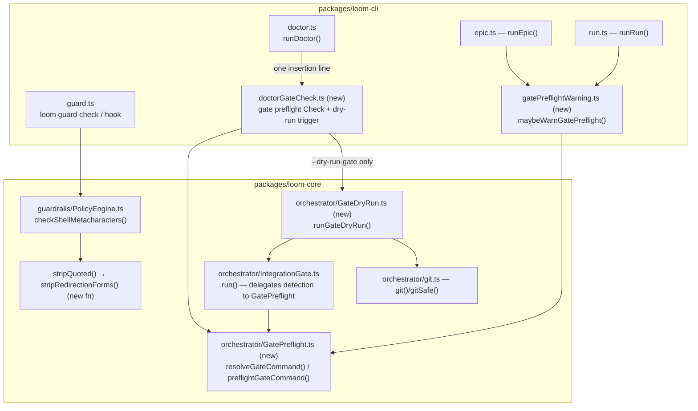

# Architecture: Guard Parser Redirection Correctness + Integration-Gate Command Preflight

## Architecture Philosophy

Four constraints drive every decision below:

1. **Fail-safe classification.** The metacharacter check is a denylist guarding invariant #1 (`loom guard check` exits non-zero for any forbidden command regardless of LLM output). The fix therefore works by *recognizing and removing* a closed set of known-safe redirection tokens before the existing blockers run — anything we don't positively recognize keeps its `&` and stays blocked. We accept false positives on exotic forms to make false negatives structurally impossible.
2. **Advisory means structurally advisory.** Preflight returns data; it never calls `process.exit`, never throws into a run path, and is wired only to `console.warn`-class output in the CLI. There is no code path where preflight alone can stop a run (NFR-2).
3. **One detection brain, many surfaces.** The gate's command-resolution logic currently lives as private methods on `IntegrationGate` (`detectCommand`, `findScopedTestDir`, `resolveDiffRange` in `packages/loom-core/src/orchestrator/IntegrationGate.ts`). It is extracted into a standalone module that the gate *delegates to*, so doctor, `loom epic`, `loom run`, and the gate all resolve the identical command by construction — not by parallel reimplementation.
4. **Parallel-agent merge cleanliness.** Six stories land concurrently, and a sibling epic is concurrently extending `loom doctor`. New behavior goes in new files with single-line insertion points in existing files, so independent branches merge without conflict.

## Component Diagram



## Tech Stack

No new dependencies. This epic is a correctness fix inside the existing stack — adding a shell parser library here would trade a 40-line regex pre-pass for a new load-bearing dependency on the security boundary.

| Layer | Choice | Rationale |
|---|---|---|
| Language / runtime | TypeScript, Node.js 20+ | Existing stack; no change. |
| Metachar classification | Regex token-stripping pre-pass inside `PolicyEngine.ts` | PRD explicitly scopes out an AST/shell parser. A closed-set token stripper is auditable in one screen and fail-safe by construction. Trade-off: exotic-but-legal redirections stay blocked. |
| Command detection / preflight | Pure functions in new `GatePreflight.ts`, injectable `fileExists`/`fileReader` probes | Mirrors the existing `IntegrationGateOptions` injection pattern, so unit tests need no disk. |
| Dry-run execution | Reuse `IntegrationGate.run()` against a throwaway worktree created via `orchestrator/git.ts` helpers | "Identical to the real gate" is guaranteed by *calling* the real gate, not simulating it. |
| CLI wiring | `commander` flag on existing `doctor` command in `packages/loom-cli/src/index.ts` | No new subcommand surface; one option line. |
| Tests | `node:test` + `node:assert`, under `src/__tests__/` | House convention (`PolicyEngine.test.ts`, `IntegrationGate.test.ts` already exist there). |

## Data Models

```ts
// packages/loom-core/src/orchestrator/GatePreflight.ts

/** How the gate command was resolved — same precedence the gate itself uses. */
export interface ResolvedGateCommand {
  command?: string;                 // undefined => no command resolvable (amputation-only gate)
  cwd: string;                      // projectRoot, or the monorepo-scoped subdir
  source: 'configured' | 'auto-detected' | 'none';
}

/** Advisory verdict. Pure data — carries no ability to block anything. */
export interface GatePreflightResult {
  resolved: ResolvedGateCommand;
  viable: boolean;                  // structural prerequisites met for a bare worktree
  reasons: string[];                // human-readable, empty when viable
  /** Exact policy.agents.test_command value to set, e.g. "npm ci && npm test".
      Always present when !viable — FR-3 requires naming the fix. */
  recommendation?: string;
}

// packages/loom-core/src/orchestrator/GateDryRun.ts
export interface GateDryRunOutcome {
  worktreePath: string;             // .loom/integration/gate-dryrun-<pid>
  gate: GateOutcome;                // verbatim from IntegrationGate.run()
  cleanedUp: boolean;
}
```

Redirection token set (the closed list FR-1 permits — everything else keeps its `&`):

```ts
// Inside PolicyEngine.ts. Applied to the stripQuoted() output, replacing each
// match with a metacharacter-free placeholder before the blockers loop runs.
const REDIRECTION_FORMS: RegExp[] = [
  /\d*>&\d+/g,    // 2>&1, >&2, m>&n
  /\d*<&\d+/g,    // <&0, n<&m  (symmetric)
  /\d*>&-/g,      // >&-, 2>&-  (close fd)
  /\d*<&-/g,      // <&-        (symmetric close)
  /&>>?(?=\s|\S)/g, // &>file, &> file, &>>file (the &> token itself)
];
```

## API / Interface Contracts

```ts
// ── PolicyEngine.ts (story-003-001) — private, behavior visible via check() ──
// New module-level helper, sibling to stripQuoted():
function stripRedirectionForms(stripped: string): string;
// checkShellMetacharacters pipeline becomes:
//   stripQuoted(raw) → stripRedirectionForms(...) → existing blockers loop (unchanged)

// ── GatePreflight.ts (story-003-002) — exported from orchestrator/index.ts ──
export function resolveGateCommand(
  projectRoot: string,
  opts: { testCommand?: string; fileExists?: (p: string) => boolean; fileReader?: (p: string) => string | null }
): ResolvedGateCommand;

export function preflightGateCommand(
  projectRoot: string,
  opts: { testCommand?: string; fileExists?: (p: string) => boolean; fileReader?: (p: string) => string | null }
): GatePreflightResult;
// IntegrationGate.detectCommand() body moves here; the gate delegates so
// resolution is identical by construction. Gate semantics untouched.

// ── GateDryRun.ts (story-003-004) ──
export async function runGateDryRun(opts: {
  projectRoot: string;
  testCommand?: string;            // from policy.agents.test_command
  timeoutMs?: number;
}): Promise<GateDryRunOutcome>;

// ── loom-cli: doctorGateCheck.ts (story-003-003 / 003-004) ──
// Returns the same Check shape doctor.ts already renders; required is always false.
export function gateCommandCheck(projectRoot: string): { name: string; ok: boolean; detail: string; required: false };
export async function runGateDryRunCommand(projectRoot: string): Promise<void>; // prints GateDryRunOutcome

// ── loom-cli: gatePreflightWarning.ts (story-003-003) ──
// Called from runEpic() (after policy load) and runRun() (before supervisor.run()).
// Prints a loud advisory block via console.warn when integration_gate !== 'off'
// and preflight is non-viable. Returns void; never exits, never throws outward.
export function maybeWarnGatePreflight(projectRoot: string, policy: Policy): void;
```

Viability heuristics (FR-3, structural only — never executes anything):

| Resolved command | Viable when | Recommendation on failure |
|---|---|---|
| `npm test` | a lockfile (`package-lock.json` / `npm-shrinkwrap.json`) exists at the resolved `cwd` | `test_command: "npm ci && npm test"` |
| `make test` | `Makefile` at `cwd` has a `^test:` target | name the explicit `test_command` to set |
| `pytest` | a pytest config (`pytest.ini` or pytest in `pyproject.toml`/`setup.cfg`/`tox.ini`) exists at `cwd` | name the explicit `test_command` to set |
| `source: 'none'` | reported as informational (gate runs amputation-only) | suggest setting `test_command` if a suite exists |
| `source: 'configured'` | always reported viable unless it begins with a known-detectable form that fails its check | operator's word is law; we only annotate |

## Security Model

| Threat | Control |
|---|---|
| Loosening the `&` blocker reopens backgrounding (`cmd &`, `a & b`) — invariant #1 breach | Stripping is allowlist-only: a `&` survives unless it sits inside one of the five named redirection tokens. The blockers loop in `checkShellMetacharacters` is byte-for-byte unchanged; tests in `PolicyEngine.test.ts` pin both directions plus an ambiguous form (`>& $FD`) that must stay blocked. |
| Redirection tokens used to smuggle chaining (`foo 2>&1 && rm -rf /`) | Stripping replaces tokens with metacharacter-free placeholders; the surviving `&&` / `;` / backtick / `$(` blockers fire exactly as before. |
| Dry-run executes an arbitrary operator-configured command | Runs only on the explicit `loom doctor --dry-run-gate` flag (FR-6 — never during planning), inside a detached throwaway worktree under `.loom/integration/gate-dryrun-<pid>` (outside `.loom/worktrees/`, so the `WorktreeJanitor` never races it), through `IntegrationGate.run()` with its existing SIGTERM→SIGKILL timeout escalation. Worktree is force-removed in a `finally`. |
| Preflight acquiring blocking power over runs | `GatePreflightResult` is plain data; the only CLI consumers are a `required: false` doctor `Check` and `console.warn` in `maybeWarnGatePreflight`. No exit codes, no thrown errors reach `supervisor.run()`. |

## ADR Log

### ADR-1 — Redirection handled by a token-stripping pre-pass, not a relaxed `&` regex

- **Decision:** Add `stripRedirectionForms()` between `stripQuoted()` and the blockers loop in `PolicyEngine.checkShellMetacharacters`, rather than complicating the `/(?<!&)&(?!&)/` backgrounding regex with redirection lookarounds.
- **Context:** The current regex (line 79 of `PolicyEngine.ts`) flags the `&` in `2>&1` as backgrounding, contradicting the method's own doc comment that redirection is allowed.
- **Rationale:** One regex trying to express "an `&` that is not backgrounding" grows lookbehind/lookahead cases until it's unreviewable — and unreviewable is unacceptable on a security boundary. Stripping a closed set of known-good tokens first leaves the blockers exactly as they are today, so the proof obligation is local: "does any forbidden `&` survive stripping?" — and the answer is yes by default.
- **Trade-off:** Legal-but-exotic redirections (`>&$FD`, `{fd}>&1`, `>& word`) remain blocked. The PRD explicitly accepts this (fail-safe direction, Out of Scope item 4).

### ADR-2 — Extract command detection into `GatePreflight.ts`; the gate delegates

- **Decision:** Move `detectCommand`, `findScopedTestDir`, `resolveDiffRange`, and `commonAncestor` out of `IntegrationGate.ts` into a new `orchestrator/GatePreflight.ts` exporting pure functions; `IntegrationGate` calls `resolveGateCommand()` internally.
- **Context:** FR-5's assumption holds: detection lives only inside `IntegrationGate` as private methods, but doctor, `loom epic`, and `loom run` all need the *same* resolution.
- **Rationale:** Static methods on the gate class would work, but a standalone module keeps `IntegrationGate.ts` owned by no story in this epic except via one delegation edit, gives story-003-002 a file it solely owns, and lets the CLI import detection without constructing a gate. Identical-by-construction beats identical-by-duplication.
- **Trade-off:** One more module and an indirection hop in the gate. Accepted: the alternative is three surfaces drifting from the gate's real behavior over time.

### ADR-3 — Preflight returns data; rendering and tone live in the CLI

- **Decision:** `preflightGateCommand()` returns `GatePreflightResult` and has no side effects; `loom-cli` owns all printing (`doctorGateCheck.ts`, `gatePreflightWarning.ts`).
- **Context:** NFR-2 demands no code path where preflight blocks a run; G-4 demands zero runs blocked by preflight.
- **Rationale:** If core never prints, exits, or throws advisory state, the "advisory only" property is enforced by the type system rather than by discipline — a consumer would have to write new blocking code to violate it.
- **Trade-off:** Slight duplication of message formatting between the doctor check and the run-start warning. Accepted: the two surfaces legitimately want different verbosity.

### ADR-4 — Doctor gains the check via a new module and a single insertion line

- **Decision:** `gateCommandCheck()` lives in new `packages/loom-cli/src/commands/doctorGateCheck.ts`; `doctor.ts` changes by one `checks.push(...)` line (plus the flag handoff), and the new check is `required: false`.
- **Context:** FR-4 — a concurrent sibling epic is also extending `loom doctor`; `runDoctor()` exits 1 when a `required` check fails.
- **Rationale:** Two epics appending whole check bodies to `doctor.ts` guarantees merge conflicts; two epics each adding one short line near a list usually auto-merge. `required: false` keeps doctor's exit code honest — a missing lockfile is advice, not a broken installation.
- **Trade-off:** A one-function file is mildly against house preference for editing existing files. Accepted explicitly for merge cleanliness, which the PRD calls out.

### ADR-5 — Dry-run = the real gate in a detached throwaway worktree, behind `loom doctor --dry-run-gate`

- **Decision:** `runGateDryRun()` creates `git worktree add --detach .loom/integration/gate-dryrun-<pid> HEAD` via the `git()`/`gitSafe()` helpers in `orchestrator/git.ts`, invokes `IntegrationGate.run({ projectRoot: <worktree> })`, and removes the worktree in `finally`. Exposed as a flag on the existing `doctor` command in `packages/loom-cli/src/index.ts`.
- **Context:** FR-6 — opt-in only, never silent during planning; the dry-run must behave identically to the real gate.
- **Rationale:** Calling `IntegrationGate.run()` reuses the resolved command, timeout, process-group kill, and output-tail semantics for free — simulating any of that would drift. Placing the tree under `.loom/integration/` (not `.loom/worktrees/`) mirrors the `IntegrationBranch` precedent: the `WorktreeJanitor` prunes `.loom/worktrees/*` entries with no agent record and must never reap a live dry-run. A flag (vs. a `doctor gate` subcommand) keeps the commander surface minimal and avoids colliding with the sibling epic's doctor additions.
- **Trade-off:** A detached-HEAD worktree tests the *current* tree, not a future integrated `epic/<id>` tree — it validates the command's runnability, not the epic's correctness. That is exactly the PRD's stated scope (Out of Scope item 6).

### ADR-6 — Capabilities page edits are a dedicated story touching exactly two rows

- **Decision:** story-003-005 alone edits `docs/capabilities.md`: the policy-engine row (line 136, blocked-constructs description) and the prerequisites-probe/doctor row (line 169).
- **Context:** Repo invariant: capabilities must ship in the same PR as the feature; five other stories land in parallel and several "touch user-visible behavior."
- **Rationale:** If every story edited the doc, every pair of branches would conflict in the same table. One owning story, sequenced after the feature stories (it depends on 001, 003, 004), serializes the contention to zero.
- **Trade-off:** A window inside the epic where code exists before its doc row. Accepted: the epic merges as one PR, so the invariant holds at the boundary that matters.
