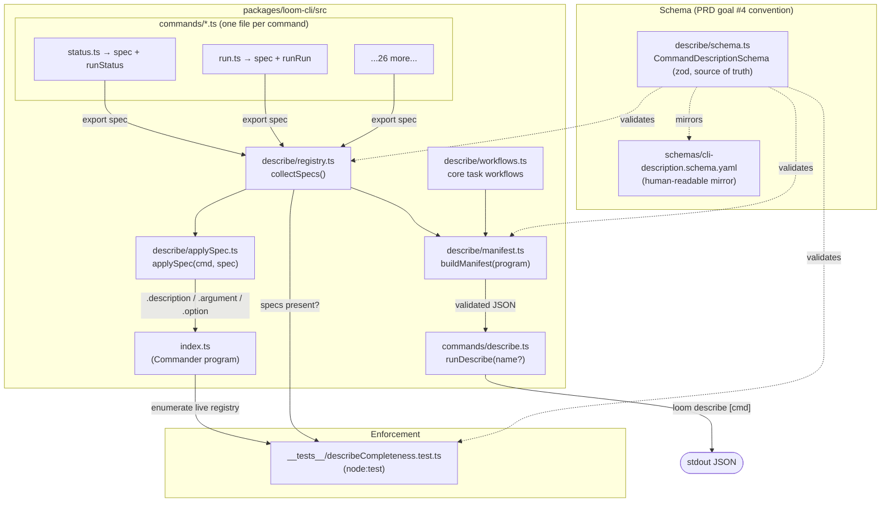

# Architecture: Machine-Readable CLI Self-Description for LLM Agents

## Architecture Philosophy

Removing the MCP server (epic-003) made the CLI loom's *only* programmatic interface. This epic restores machine discoverability without reopening that surface. Four constraints drive every decision below.

1. **One origin per command, or it will drift.** The PRD's hard goal is "no duplicate description store." A description authored in one file and a `--help` string authored in another *will* diverge. The design forces the structured spec to be the single source for at least the command summary, and tests the rest for drift. (Principle: developer productivity is an architectural concern — drift is a productivity tax paid forever.)

2. **Coverage is enforced by the build, not by discipline.** FR-9 / story-004-005 require a completeness test that derives its inventory *from the live Commander registry*, not a hand-maintained list. A command added without a spec must turn the suite red. This deliberately **inverts** the snapshot principle of the existing parity oracle (`packages/loom-cli/src/__tests__/cliParity.test.ts`) — see ADR-001.

3. **No behavior change, no new surface (NFR-2, NFR-3).** `describe` is a read-only CLI command that prints static JSON to stdout. It runs no git, no LLM, no network, opens no server. Existing `--help` and every command's behavior are untouched. We design *around* the current inline Commander wiring in `packages/loom-cli/src/index.ts` rather than rewriting it wholesale.

4. **Match the existing schema convention, don't invent one.** loom already has a settled pattern: zod in `packages/loom-core/src/types.ts` is the source of truth; a `schemas/*.schema.yaml` JSON-Schema-in-YAML file is the human-readable mirror, maintained by hand. We follow it exactly (ADR-004) rather than introducing codegen.

> **Note on the `mcp` command.** The CLI registers `mcp list` / `mcp add` (`packages/loom-cli/src/commands/mcp.ts`). This is the *worker MCP provisioning registry* — servers that loom's worker agents may use — and is **unrelated** to loom's own removed MCP server. NFR-3 forbids re-exposing *loom itself* over MCP; it does not touch this command. `mcp list`/`mcp add` are registered commands and therefore require descriptions like any other. Do not delete them.

## Component Diagram



## Tech Stack

| Layer | Choice | Rationale |
|---|---|---|
| Language / runtime | TypeScript, Node.js 20+ | Existing repo standard; no reason to deviate. |
| CLI framework | `commander` (already in use) | The whole CLI is built on it; `program.commands` is also our completeness inventory. |
| Description schema | `zod` in `packages/loom-cli/src/describe/schema.ts` | Matches the repo's "zod is source of truth" convention (`types.ts`). Lives in `loom-cli` (not core) to keep dependency direction clean — CLI depends on core, not the reverse. |
| Schema mirror | `schemas/cli-description.schema.yaml` (JSON Schema draft-07, YAML) | Mirrors `epic.schema.yaml` / `policy.schema.yaml` for human readers and external tooling. Hand-synced (ADR-004). |
| Manifest emit | `JSON.stringify(payload, null, 2)` via `console.log` | Identical to every existing `--json` command (`status.ts:86`, `diff.ts:90`). No new formatter — the repo has none and doesn't want one. |
| Completeness test | `node:test` + `node:assert/strict` | The repo's only test framework (`cliParity.test.ts`); run by `node --test` over compiled `dist`. |
| YAML (if loaded) | `js-yaml` | Already a dependency; only needed if a test validates the YAML mirror against zod. The mirror is documentation; zod is loaded at runtime. |

## Data Models

The spec is the unit of co-location. One `CommandDescription` lives in each `commands/*.ts`, exported next to its `run*` handler.

```typescript
// packages/loom-cli/src/describe/schema.ts  (zod — source of truth)
import { z } from 'zod';

export const ArgTypeSchema = z.enum(['string', 'number', 'boolean', 'enum']);

export const PositionalArgSchema = z.object({
  name: z.string().min(1),
  type: ArgTypeSchema,
  required: z.boolean(),
  description: z.string().min(1),
  values: z.array(z.string()).optional(),        // present when type === 'enum'
});

export const OptionFlagSchema = z.object({
  name: z.string().regex(/^--[a-z][a-z0-9-]*$/),  // e.g. "--json", "--epic"
  type: ArgTypeSchema,
  default: z.unknown().optional(),
  description: z.string().min(1),
  changesOutputShape: z.boolean(),                // FR-1: does this flag alter emitted shape?
});

export const OutputContractSchema = z.object({
  text: z.string().min(1),                        // what the human-readable form prints
  json: z
    .object({
      supported: z.boolean(),
      shape: z.string().optional(),               // typed pseudocode of the --json payload
    })
    .optional(),
});

export const UsageExampleSchema = z.object({
  command: z.string().min(1),                     // e.g. "loom status --json"
  description: z.string().min(1),
});

export const ExitCodeSchema = z.object({
  code: z.number().int(),
  meaning: z.string().min(1),
});

export const RelationshipsSchema = z.object({
  prerequisites: z.array(z.string()).default([]), // command names that typically run first
  nextSteps: z.array(z.string()).default([]),     // command names that typically run next
});

export const CommandDescriptionSchema = z.object({
  name: z.string().min(1),                        // full path: "guard check", "mcp add"
  summary: z.string().min(5).max(100),            // feeds Commander .description()
  whenToUse: z.string().min(1),                   // agent-facing guidance
  arguments: z.array(PositionalArgSchema).default([]),
  options: z.array(OptionFlagSchema).default([]),
  output: OutputContractSchema,
  examples: z.array(UsageExampleSchema).min(1),   // FR-1: at least one example
  exitCodes: z.array(ExitCodeSchema).min(1),
  errors: z.array(z.string()).default([]),        // common error conditions
  relationships: RelationshipsSchema.default({ prerequisites: [], nextSteps: [] }),
});
export type CommandDescription = z.infer<typeof CommandDescriptionSchema>;

// Task-level workflows (FR-6 / story-004-003)
export const WorkflowStepSchema = z.object({
  command: z.string().min(1),                     // a command 'name' that must exist in the manifest
  why: z.string().min(1),
});
export const WorkflowSchema = z.object({
  id: z.string().regex(/^[a-z][a-z0-9-]*$/),       // 'plan', 'approve', 'run', 'status', 'retry', 'reconcile'
  goal: z.string().min(1),
  steps: z.array(WorkflowStepSchema).min(1),
});
export type Workflow = z.infer<typeof WorkflowSchema>;

// The full manifest emitted by `loom describe`
export const ManifestSchema = z.object({
  loomVersion: z.string(),                        // from package.json, as index.ts already reads PKG_VERSION
  source: z.literal('live-commander-registry'),
  commands: z.array(CommandDescriptionSchema).min(1),
  workflows: z.array(WorkflowSchema).min(1),
});
export type Manifest = z.infer<typeof ManifestSchema>;
```

The YAML mirror at `schemas/cli-description.schema.yaml` carries the same structure in JSON-Schema-draft-07-in-YAML, opening with the convention header used by the existing schemas:

```yaml
# Loom CLI Description Schema
# Validated at runtime by zod (see packages/loom-cli/src/describe/schema.ts)
# This file is the human-readable reference; zod is the source of truth.
$schema: "http://json-schema.org/draft-07/schema#"
```

## API / Interface Contracts

These are the seams the stories must agree on. Signatures are the contract; the file-ownership map (separate contract document) assigns each to exactly one story.

```typescript
// describe/registry.ts — the single inventory of authored specs
//   Imports every command module's `spec` and returns them. This array,
//   NOT a hardcoded list, is what the manifest and the completeness test read.
export function collectSpecs(): CommandDescription[];

// describe/applySpec.ts — the one-origin wiring helper (ADR-003)
//   Applies spec.summary -> cmd.description(), and spec.arguments/options ->
//   cmd.argument()/cmd.option(). Returns the same Command for chaining .action().
export function applySpec(cmd: Command, spec: CommandDescription): Command;

// describe/workflows.ts — the six core task workflows (FR-6)
export const WORKFLOWS: Workflow[];

// describe/manifest.ts — assemble + validate the full manifest
//   Walks the live `program` to confirm every registered command has a spec,
//   then returns a ManifestSchema-valid object. Throws (ZodError) on invalid spec.
export function buildManifest(program: Command): Manifest;

// commands/describe.ts — the command handler
//   No arg  -> full manifest JSON (FR-7).
//   With arg -> that single command's CommandDescription JSON (FR-8).
//   Unknown name -> non-zero exit + stderr message.
export function runDescribe(commandName?: string): void;

// Shared test seam (used by describeCompleteness.test.ts)
//   Recursively flattens program.commands (including 'guard'/'mcp' subcommands)
//   to their full path names, e.g. ["status", "run", "guard check", "mcp add", ...].
export function enumerateRegisteredCommands(program: Command): string[];
```

Validation failures reuse the repo's established `ZodError` formatting (`PMAgent.ts:140`): `err.issues.map(i => `${i.path.join('.')}: ${i.message}`).join('\n')` — so a malformed spec reports `commands.4.examples: Array must contain at least 1 element(s)` rather than a raw stack trace.

## Security Model

`describe` is an introspection seam, not a privileged one — but two NFRs make its boundaries load-bearing.

| Threat | Control |
|---|---|
| **Reintroducing a network / agent surface (NFR-3).** An "expose the capability surface" feature is exactly the shape of the removed MCP server. | `describe` is a pure CLI command: reads the static spec registry, validates, prints to stdout, exits. No server, no socket, no MCP, no LLM call. Enforced by ownership — `commands/describe.ts` imports only `describe/*` and `commander`. This invariant belongs in the completeness/regression test (story-004-006 already asserts "no MCP surface reintroduced"). |
| **Secret / path leakage.** A manifest that interpolates runtime project state could leak absolute paths, env values, or tokens. | Specs are *static, in-repo, authored prose* — never derived from runtime state, environment, or user files. The manifest contains only `loomVersion` (already public via `--version`) and authored text. Review enforces "no secrets in specs." |
| **Side effects via introspection.** | `runDescribe` performs no git, no filesystem writes, no DB reads, no subprocess. Output is deterministic given the installed binary version. |
| **Malformed manifest breaking agent consumers.** A downstream LLM agent parses the JSON; an invalid/partial manifest is a silent correctness failure. | `buildManifest` validates against `ManifestSchema` before emit; the completeness test (story-004-005) blocks merge of any missing or invalid spec. The contract is checked at build time, not hoped for at runtime. |

Out of scope per the PRD and not controlled here: asserting the *documented* `--json` `output.shape` matches the *actual* runtime payload (deferred), and validating prose *accuracy* (author discipline + review).

## ADR Log

### ADR-001 — Completeness test derives its inventory from the live Commander registry (inverting the parity-oracle snapshot)

- **Decision.** `describeCompleteness.test.ts` enumerates commands by walking the live `program.commands` (via `enumerateRegisteredCommands`) and asserts each has a spec in `collectSpecs()`. It does **not** pin a hardcoded inventory.
- **Context.** The epic explicitly says "mirror the parity-oracle pattern" (story-004-005) — yet the existing oracle (`cliParity.test.ts:42`) deliberately *hardcodes* its inventory, with a comment forbidding reading from the live registry. FR-9 and story-004-005's third criterion require the opposite: "derives its command inventory from the registry, not a hand-maintained list."
- **Rationale.** The two tests guard opposite failure modes. The parity oracle guards against *losing* a capability during a migration — for that, a frozen snapshot is the right tripwire. This test guards against *adding* a command without a description — for that, the live registry is the right source, because the threat is a command the snapshot wouldn't know about. We mirror the oracle's *spirit* (enumerate, assert completeness, fail loud) while inverting its inventory source to fit the goal.
- **Trade-off.** We give up the "silent removal tripwire" property: if a command is deleted, this test won't notice (there's simply no spec to be missing). Accepted — describe-coverage is about additions, and `cliParity.test.ts` already owns the removal tripwire.

### ADR-002 — Specs co-located in each `commands/*.ts`, assembled by a registry module

- **Decision.** Each command exports `export const spec: CommandDescription` from its own `commands/*.ts` file, next to its `run*` handler. `describe/registry.ts` imports them into one array.
- **Context.** The alternative is a single central descriptions file (e.g. `describe/descriptions.ts`) holding all ~29 specs. PRD goal #3 demands "a single source of truth per command; no duplicate description store."
- **Rationale.** Co-location is the literal PRD requirement (FR-5) and the strongest anti-drift force: the description lives where the behavior lives, so a contributor changing a flag sees the spec in the same file. It also distributes story-004-002's authoring work across ~29 independent files instead of concentrating it in one merge-conflict hotspot — directly serving the parallel-agent constraint.
- **Trade-off.** Many files are touched when authoring, and `registry.ts` must import all of them (one line per command). Accepted: the imports are mechanical and the registry is the single, intentional place where "all commands" is expressed in code — which is also what the completeness test cross-checks against the live program.

### ADR-003 — Commander sources description/args/options from the spec via `applySpec`, with a manual escape hatch + drift test

- **Decision.** Standard commands are wired with `applySpec(program.command('x'), spec).action(runX)`, so `.description()`, `.argument()`, and `.option()` all originate from the spec. Commands with bespoke wiring (the `guard`/`mcp` subcommand groups, `approve --run` chaining in `gate.ts`, `doctor`'s `--cross-epic-gate` branching) keep their hand-written wiring but still export a spec; a drift check in the completeness test asserts the spec's declared `options[].name` set matches `command.options`.
- **Context.** Three options existed: (a) full generation of Commander from specs for every command; (b) full duplication — keep all manual wiring, spec is documentation only; (c) this hybrid. The current CLI registers everything inline in `index.ts` with non-trivial per-command logic.
- **Rationale.** Full generation (a) gives perfect single-source and zero drift but forces a high-risk rewrite of ~29 commands against a hard "no behavior change" bar (NFR-2) — and the bespoke commands resist generation anyway. Pure documentation (b) reintroduces exactly the drift the PRD forbids. The hybrid gives genuine single-origin for the common case (and *always* for the human-facing `summary`, satisfying "feed both machine and human help where practical"), while the drift test backstops the bespoke remainder.
- **Trade-off.** The handful of bespoke commands declare their flag *names* in two places (Commander call + spec), guarded by a test rather than eliminated structurally. Accepted: the *description prose* — the thing the PRD calls the "description store" — is never duplicated; only flag names are, and divergence turns the suite red.

### ADR-004 — zod is the schema source of truth; `schemas/cli-description.schema.yaml` is a hand-synced human mirror

- **Decision.** `CommandDescriptionSchema` (zod, in `loom-cli`) is authoritative and is what validates at runtime. A JSON-Schema-draft-07 YAML mirror lives at `schemas/cli-description.schema.yaml`, carrying the standard's documentation and the "zod is the source of truth" header.
- **Context.** loom's `schemas/` already contains `epic.schema.yaml` and `policy.schema.yaml`, both of which explicitly state they are human references mirroring zod in `types.ts`, with no codegen between them.
- **Rationale.** Consistency beats cleverness. Introducing JSON-Schema↔zod codegen *only* for this one schema would be novel machinery that the rest of the repo doesn't use and contributors wouldn't expect. Following the established convention means the standard is documented (FR-3) in the place contributors already look for schema docs.
- **Trade-off.** The YAML and zod must be kept in sync by hand, exactly as `epic`/`policy` already are. Accepted as the house style; an optional test can diff a representative fixture against both to catch gross divergence.

### ADR-005 — `describe` always emits JSON; the stretch human reference is a separate generator over the same manifest

- **Decision.** `loom describe [command]` always emits JSON (the machine surface). The FR-11 stretch — a human-readable CLI reference — is a *separate* generator that consumes the same `buildManifest()` output, not a `--format` flag on `describe`.
- **Context.** FR-7/FR-8 define `describe` as the JSON manifest seam; FR-11 wants human docs from the same source; NFR-1 keeps `--help` working independently.
- **Rationale.** Keeping `describe` single-purpose (always JSON) makes it a clean, predictable contract for an agent — no mode detection, no shape switching. Human docs derive from the manifest downstream, so "docs cannot drift from code" still holds, without overloading the agent-facing command.
- **Trade-off.** Humans don't read `loom describe` output directly; they read `--help` (unchanged) or the generated reference. Accepted — the audience for `describe` is explicitly the LLM agent, per the PRD title.

### ADR-006 — The `--json` `output.shape` is declarative documentation, not asserted against runtime

- **Decision.** A command's `output.json.shape` describes the emitted payload as typed pseudocode authored by hand; nothing asserts it matches the actual runtime `--json` output.
- **Context.** The PRD's "Out of Scope" defers "asserting that the documented `--json` output contract matches the actual emitted JSON," flagging it as an open question for possible pull-in.
- **Rationale.** Each existing command constructs its `--json` payload ad hoc (`status.ts`, `diff.ts`, `artifacts.ts`) with no shared schema; building a runtime conformance check is a separate, larger effort than restoring discoverability. Documenting the shape now delivers the agent value; asserting it is a follow-up.
- **Trade-off.** A command author can change its `--json` payload without the documented shape noticing — a real drift vector for output contracts specifically. Accepted for V1, explicitly deferred; if pulled in, it attaches to the completeness test as a companion conformance check.
