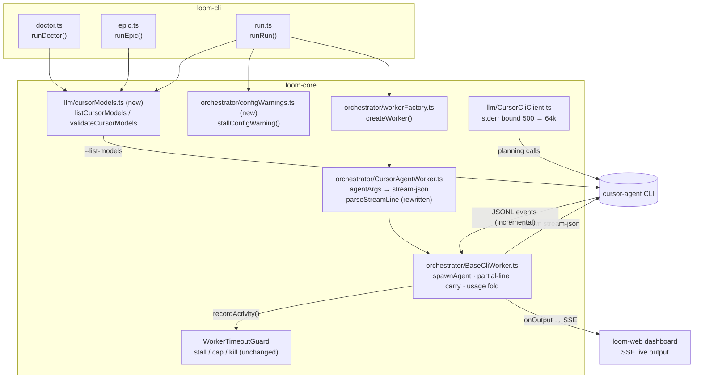

I'll ground the architecture in the actual codebase first — Winston cites real paths, not guesses.# Architecture: Observable cursor-cli Worker Backend (epic-004)

## Architecture Philosophy

Four constraints drive every decision below:

1. **Fix the signal, not the watchdog.** `WorkerTimeoutGuard` is correct — it already resets its stall clock on any stdout/stderr chunk (`guard.recordActivity()` wired in `BaseCliWorker.spawnAgent`, `packages/loom-core/src/orchestrator/BaseCliWorker.ts`). The defect is that `cursor-agent --output-format json` emits exactly one chunk, at completion. We change what the backend emits, not how the guard listens. Trade-off: we take a hard dependency on cursor-agent's stream-json event cadence (PRD's stated assumption, confirmed empirically in story-004-001).
2. **Mirror the proven backend.** `ClaudeCodeWorker` already runs `--output-format stream-json` through the same `parseStreamLine` seam and has survived production epics. The cursor path adopts the identical pattern — line-delimited JSON, defensive parse, fall through to `humanText` — rather than inventing a second streaming architecture. Boring wins.
3. **Fail before money is spent.** Model validation is a subprocess probe (`cursor-agent --list-models`, seconds) executed at `loom doctor` and at the top of `loom epic` / `loom run`, before `BriefRefiner` or any worker spawn. Validation logic lives in `loom-core` as a pure, fixture-testable function; the CLI commands are thin call sites.
4. **Degrade open, warn loud.** When `--list-models` itself fails (offline, unauthenticated), we warn and proceed rather than false-failing a valid config. Trade-off accepted: a typo'd model can still slip through when the probe is unavailable — that is strictly no worse than today, and the alternative (fail-closed) bricks offline operation.

## Component Diagram



## Tech Stack

| Layer | Choice | Rationale |
|---|---|---|
| Subprocess streaming | `node:child_process.spawn`, line-split with carry in `BaseCliWorker.spawnAgent` | Already exists and is test-covered; zero new machinery. |
| Stream format | `cursor-agent --output-format stream-json --stream-partial-output` | The only cursor-agent mode that emits during work; partial output is the mitigation for long single-message generations (PRD assumption). |
| Event parsing | Defensive per-line `JSON.parse` in `parseStreamLine`, unknown shapes fall through to `humanText` / silence | Mirrors `ClaudeCodeWorker.parseStreamLine`; survives CLI version drift without crashing a worker. |
| Model probe | `execFileSync('cursor-agent', ['--list-models'])` behind a pure parser | args-array (no shell), synchronous — it runs once at startup where blocking is fine. |
| Validation/warning logic | Pure functions in `loom-core`, thin CLI call sites | Unit-testable under `node --test` without spawning real CLIs; CLI commands have almost no test harness today. |
| Tests | `node:test` fixtures under `packages/loom-core/src/__tests__/` | House standard (`npm test` runs `node --test dist/__tests__/**`). |
| New dependencies | None | Nothing here justifies one. |

## Data Models

### Cursor stream-json event (parsed shape, `CursorAgentWorker`)

Defensive union — fixture lines captured from a real `cursor-agent` run are the source of truth (story-004-001 checks them in under `__tests__/fixtures/` or inline):

```ts
// What parseStreamLine must tolerate, per line of stdout:
type CursorStreamEvent =
  | { type: 'system'; subtype?: 'init'; model?: string }            // session start
  | { type: 'user'; message?: unknown }                              // prompt echo
  | { type: 'assistant';                                             // incremental w/ --stream-partial-output
      message?: { content?: Array<{ type: 'text'; text: string }> } }
  | { type: 'tool_call'; subtype?: string; [k: string]: unknown }    // tool activity
  | { type: 'result';                                                // terminal event
      result?: string;
      duration_ms?: number;
      usage?: Record<string, unknown>;       // harvested via existing readNum key lists
      request_count?: number;
      total_cost_usd?: number };
// Any unparseable / unknown line → { humanText: line } or {} — never a throw.
```

### Existing shapes that must not change (regression surface)

```ts
// WorkerRunner.ts — unchanged; parseStreamLine still returns:
{ humanText?: string;
  usage?: WorkerUsage;     // { inputTokens, outputTokens, cacheReadTokens,
                           //   cacheCreationTokens, totalTokens,
                           //   requestCount?, costUsd? }
  traces?: Array<{ kind: string; subject?: string; rationale: string }> }
// FR-4: when the result event reports no usage fields, fall back to
// requestCount: 1 for the session — same semantics as today's single-blob parse.
```

### Model validation result (new)

```ts
// packages/loom-core/src/llm/cursorModels.ts
export type ListModelsResult =
  | { ok: true; models: string[] }
  | { ok: false; error: string };               // offline / unauthenticated / no binary

export interface CursorModelCheck {
  status: 'ok' | 'invalid' | 'unavailable';
  validModels: string[];      // [] when unavailable
  invalidIds: string[];       // the policy values that failed; [] otherwise
  message: string;            // operator-facing; on 'invalid' contains the COMPLETE model list
}
```

### Policy fields consumed (existing, `packages/loom-core/src/types.ts`)

`agents.worker_backend` (`'claude-code' | 'cursor-cli'`), `agents.llm_backend` (`'claude-cli' | 'cursor-cli'`), `agents.cursor_model` (default `sonnet-4`), `agents.story_stall_minutes` (default 12), `agents.story_absolute_cap_minutes` (default 60). **No new policy knobs** — per PRD Out of Scope.

## API / Interface Contracts

```ts
// ── CursorAgentWorker.ts (story-004-001) ────────────────────────────────
protected agentArgs(): string[];
// returns ['-p', '--model', this.model, '--force', '--trust',
//          '--output-format', 'stream-json', '--stream-partial-output']

protected parseStreamLine(line: string): {
  humanText?: string; usage?: WorkerUsage;
  traces?: Array<{ kind: string; subject?: string; rationale: string }>;
};
// Stall-reset is free: BaseCliWorker's stdout 'data' handler calls
// guard.recordActivity() before parseStreamLine — no guard changes.
// streamingInput() stays false (cursor-agent has no stream-json input);
// stdin still closes immediately after the prompt write.

// ── llm/cursorModels.ts (new, story-004-003) ────────────────────────────
export function listCursorModels(cursorBin?: string): ListModelsResult;
export function parseListModelsOutput(stdout: string): string[];   // pure, fixture-tested
export function validateCursorModels(
  policy: Policy,
  cursorBin?: string
): CursorModelCheck | undefined;
// undefined when neither llm_backend nor worker_backend is 'cursor-cli'
// (nothing to validate). Note modelFor() in llm/factory.ts: under
// llm_backend='cursor-cli' the planning model IS cursor_model — so
// validating cursor_model covers the PRD's "cursor-cli planning_model".

// Call sites: doctor.ts adds a Check row (required: false → 'warn' on
// unavailable, FAIL semantics on invalid only when the backend is cursor-cli);
// epic.ts and run.ts call it after policy load, BEFORE BriefRefiner /
// Supervisor construction, and process.exit(1) on status === 'invalid'.

// ── orchestrator/configWarnings.ts (new, story-004-002) ─────────────────
export function stallConfigWarning(policy: Policy): string | undefined;
// non-undefined ONLY when worker_backend === 'cursor-cli' &&
// story_stall_minutes < story_absolute_cap_minutes; message names both
// values and the false-kill risk. run.ts prints it via console.warn at
// startup, alongside the existing integration_branch / integrator warnings
// (run.ts ~line 256).

// ── llm/CursorCliClient.ts (story-004-004) ──────────────────────────────
const MAX_ERROR_OUTPUT_CHARS = 64_000;
// complete(): `cursor-agent exited ${code}: ${proc.output.slice(0, MAX_ERROR_OUTPUT_CHARS)}`
// replaces today's .slice(0, 500) at line 65.
```

## Security Model

| Threat | Control |
|---|---|
| Command injection via `cursor_model` / bin path flowing into the probe | `execFileSync` with an args array — no shell interpretation; same discipline as `doctor.ts`'s existing `probe()`. |
| Validation outage bricking valid runs (DoS-by-validation) | Degrade-open: `--list-models` failure → `status: 'unavailable'` warning, run proceeds (FR-8). Named trade-off: offline typos surface late, as today. |
| Unbounded stderr held in memory on pathological CLI output | Bound raised to 64 KB, not removed — large enough for any model list, small enough to be harmless. |
| Streaming change weakening kill guarantees | None of `WorkerTimeoutGuard`, process-group SIGTERM→SIGKILL, or checkpoint-on-kill are touched; genuine silence still dies at `story_stall_minutes` (G-2, test-pinned). |
| Worker privilege surface | Unchanged — `--force --trust` inside worktree isolation, guard hook and policy engine untouched. |

## ADR Log

**ADR-1 — Reset the stall timer via stdout activity; do not touch `WorkerTimeoutGuard`.**
*Decision:* No changes to the guard or to `BaseCliWorker`'s activity wiring; the fix is entirely in what `cursor-agent` emits.
*Context:* `spawnAgent` already calls `guard.recordActivity()` on every stdout/stderr chunk; the cursor backend just never produced chunks mid-run.
*Rationale:* The guard is shared with claude-code and the mock; modifying it risks the working backend to fix the broken one.
*Trade-off:* We depend on cursor-agent's event cadence during long generations — `--stream-partial-output` is the mitigation, and empirical fixture capture in story-004-001 is the verification.

**ADR-2 — Adopt the `ClaudeCodeWorker` stream-parsing pattern verbatim, not a new abstraction.**
*Decision:* Rewrite `CursorAgentWorker.parseStreamLine` as a per-line defensive JSON parse with fall-through, like `ClaudeCodeWorker.parseStreamLine`; no shared "StreamEventParser" extraction.
*Context:* Two backends with similar-but-not-identical event vocabularies; the shapes drift independently with CLI versions.
*Rationale:* A premature shared parser couples the backends at exactly the seam where they differ. Two ~100-line overrides are cheaper than one wrong abstraction.
*Trade-off:* Some duplication (`readNum` key lists, truncation helpers) stays duplicated.

**ADR-3 — Harvest usage from the terminal `result` event; keep the `requestCount: 1` session fallback.**
*Decision:* Usage fields are read from the `type:'result'` event using the existing `readNum` key lists; when absent, attribute `requestCount: 1` per spawn — identical to today's single-blob semantics (FR-4).
*Context:* `BaseCliWorker.applySessionUsage` treats per-event usage as session-cumulative and re-folds across spawns; mid-stream `assistant` events may or may not carry usage.
*Rationale:* The result event is the one shape we can pin with a fixture; partial events feeding cumulative usage would double-count without careful replacement semantics — which the existing fold already provides if usage appears, so emitting it only at `result` is the conservative floor.
*Trade-off:* No inflight token telemetry on cursor-cli (so `budget_tokens_per_story` still effectively requires claude-code, unchanged from today's documented limitation).

**ADR-4 — Validation is a pure core function; CLI commands are call sites.**
*Decision:* `validateCursorModels` + `parseListModelsOutput` live in `packages/loom-core/src/llm/cursorModels.ts`; `doctor.ts`, `epic.ts`, `run.ts` each add a ≤10-line call.
*Context:* `loom-cli` has minimal test infrastructure (3 test files); `loom-core` has the `node --test` harness and fixture conventions.
*Rationale:* The valid/invalid/degraded matrix (FR-7/FR-8) needs unit tests; putting logic in the CLI would make it integration-test-only.
*Trade-off:* Three call sites to keep consistent instead of one — accepted because the three commands have genuinely different failure semantics (doctor warns, epic/run abort).

**ADR-5 — Warning over default-to-cap for self-defeating stall config.**
*Decision:* `stallConfigWarning` only warns; loom never silently rewrites `story_stall_minutes`.
*Context:* PRD FR-6, PM sign-off recorded. Streaming (ADR-1) ships in the same release and restores the stall signal's meaning.
*Rationale:* Silently raising the window to the cap would weaken genuine-silence protection (G-2) for every cursor-cli run, to paper over a config that streaming already fixes.
*Trade-off:* An operator who ignores the warning on a pre-streaming build still gets false kills — belt-and-braces, not a hard gate.

**ADR-6 — Bound stderr at 64 KB rather than unbounded.**
*Decision:* Replace `output.slice(0, 500)` in `CursorCliClient.complete` with a 64,000-char bound (named constant).
*Context:* FR-9 asks for "full or near-full"; the failure that motivated it is a model list of a few KB.
*Rationale:* Unbounded interpolation of subprocess output into an `Error` message is a memory/log-spam hazard on pathological output; 64 KB is two orders of magnitude past the observed need.
*Trade-off:* A hypothetical >64 KB stderr still truncates — acceptable, named, and trivially raisable.

**ADR-7 — Cursor stdin stays single-shot; no `isTerminalLine` / `streamingInput` changes.**
*Decision:* `streamingInput()` remains `false` for `CursorAgentWorker`; stdin closes immediately after the prompt write; `isTerminalLine` keeps its never-terminal default.
*Context:* FR-5 requires verifying terminal-event detection and partial-line carry hold under stream-json — verification, not modification.
*Rationale:* cursor-agent has no `--input-format stream-json` equivalent (documented in `CursorAgentWorker.pullGuidanceHint`); holding stdin open buys nothing and risks hung sessions.
*Trade-off:* Mid-spawn operator guidance on cursor-cli stays on the `loom_pull_guidance` polling fallback — pre-existing, unchanged.
