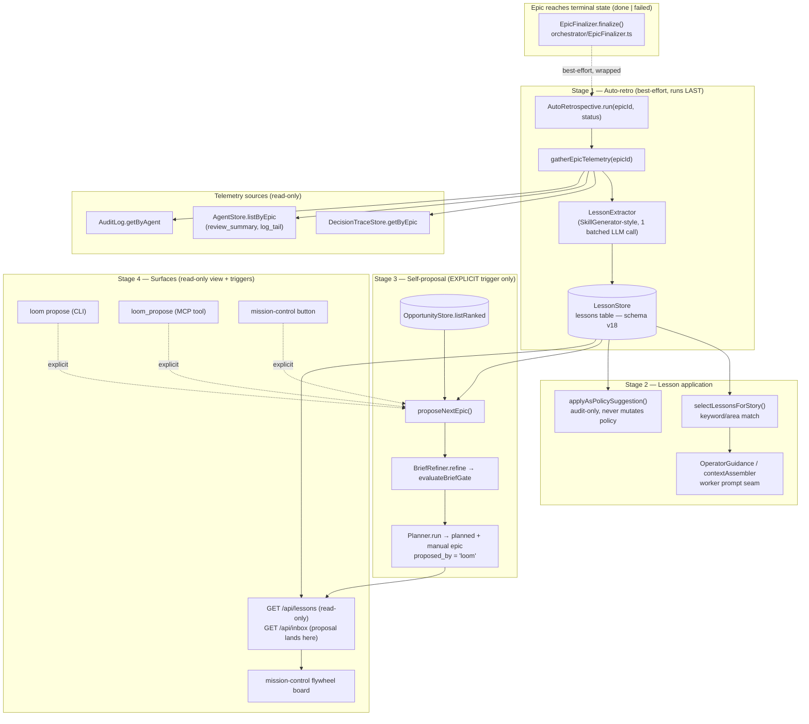

# Loom Flywheel — System Architecture

## Architecture Philosophy

Four constraints drive every decision in this design. They are listed in priority order; where they conflict, the earlier one wins.

1. **Learn-but-never-decide.** The flywheel observes, persists, and suggests. It never schedules, auto-triggers, auto-applies, or self-executes. Every write that changes what loom *does* — policy, epic execution — sits behind an explicit human action (CLI invocation, mission-control button, MCP call). This is not a feature; it is the load-bearing invariant the whole epic exists to honor, enforced by a structural test (NFR-3).
2. **Finalize is sacred.** Epic finalization already merges, gates, pushes, and audits. The auto-retro is strictly *additive* and *best-effort*: it runs **last**, after all finalize writes complete, inside a wrapper from which no error can escape. A retro that fails leaves a skip-note in the audit log and nothing else. Learning may never cost us a finalize (NFR-1, FR-4).
3. **Reuse the proven seams.** Every capability this epic needs already has a battle-tested analog in the tree: the `SkillGenerator` pre-parse field-injection pattern (`reviewerSkills.ts`), the `Store`-over-`better-sqlite3` idiom (`OpportunityStore.ts`), the `scopeOpportunity` brief→gate→planner pipeline, and the `OperatorGuidance` context seam. We extend these, we do not invent. Boring, proven machinery is what a self-improvement loop must be built from — the cost of a novel abstraction here is paid on every future epic.
4. **One batched call, injectable LLM.** Cost discipline is structural, not advisory. The lesson-extractor and the proposer each make exactly one batched Anthropic call on the happy path; the LLM is a constructor dependency, stubbed in every test (NFR-2). A repair retry exists only on malformed output and is the sole exception.

A note on a tension this design resolves up front: the existing `Lesson` schema (`findings/lesson.ts`: `kind/summary/context/recommended_action`) does **not** match the persisted columns FR-6 mandates (`category/observation/root_cause/general_rule/evidence/...`). ADR-001 in that file already flagged the schema as provisional, to tighten "when the lesson store lands." This epic is that moment. We evolve `Lesson` to the persisted shape and treat the column set as the contract. See **ADR-002**.

---

## Component Diagram



---

## Tech Stack

| Layer | Choice | Rationale |
|---|---|---|
| Persistence | `better-sqlite3`, new `lessons` table at `SCHEMA_VERSION = 18` | Matches every existing store; synchronous prepared statements keep the retro path simple and side-effect-free. Additive `CREATE TABLE IF NOT EXISTS` + per-column `ALTER` is the established migration idiom (`Database.ts`). |
| Lesson extraction | Anthropic SDK via the `LLMClient` interface, `SkillGenerator`-style handler with `cache_control` on the SKILL.md prefix | Reuses the exact caching + injectable-client pattern from `SkillGenerator.ts`; satisfies prompt-caching invariant and NFR-2 cost discipline. |
| Schema validation | `zod`, evolved `Lesson` schema in `findings/lesson.ts` | Same validation seam the reviewer uses; pre-parse field stamping is the proven fix for the reviewer source-injection bug (ADR-003). |
| Retro orchestration | `AutoRetrospective` invoked from the `EpicFinalizer` finalize tail | Single, last, wrapped call-site keeps "finalize is sacred" auditable in one place. |
| Guidance injection | `OperatorGuidance` (`.loom/guidance/<story-id>.md`) + `contextAssembler.ts` | The context-notes seam already layers timestamped operator entries into worker prompts; lessons ride the same rail — no new prompt plumbing. |
| Proposal pipeline | `BriefRefiner` → `evaluateBriefGate` → `Planner.run`, mirroring `scopeOpportunity.ts` | The opportunity-scoping path already turns a brief into a `planned` + `manual` epic through the gate; the proposer is that path with lessons folded into the brief. |
| Web surface | Express `registerLessonRoutes(app, deps)` mounted in `createApp` | New route module + real-`createApp` test, per the epic-003 orphaned-route lesson (NFR-5). |
| CLI | `commander`, `loom propose` → `runPropose()` | Standard `run<Command>` command pattern in `loom-cli/src/index.ts`. |
| MCP | `loom_propose` in `TOOL_DEFINITIONS` + `HANDLERS` | Standard tool-registration pattern in `loom-mcp/src/tools/`. |
| Frontend | vanilla JS mission-control board | Matches existing inbox/fleet/opportunities boards; no framework introduced. |

---

## Data Models

### v18 `lessons` table (FR-6) — exact column contract

```sql
-- Added to the DDL block in packages/loom-core/src/state/Database.ts
CREATE TABLE IF NOT EXISTS lessons (
  id           INTEGER PRIMARY KEY AUTOINCREMENT,
  epic_id      TEXT    NOT NULL,           -- handler-owned (stamped pre-parse)
  category     TEXT    NOT NULL,           -- LLM-owned: area tag, lowercase-hyphen (e.g. 'schema-migration')
  observation  TEXT    NOT NULL,           -- LLM-owned: what happened
  root_cause   TEXT,                       -- LLM-owned: why
  general_rule TEXT    NOT NULL,           -- LLM-owned: the reusable, area-keyword-bearing rule
  evidence     TEXT,                       -- LLM-owned: pointer/excerpt from telemetry
  applied_as   TEXT,                       -- handler-owned: NULL | 'worker_guidance' | 'policy_suggestion'
  applied_ref  TEXT,                       -- handler-owned: story_id | audit row id
  created_at   TEXT    NOT NULL            -- handler-owned (stamped pre-parse)
);
CREATE INDEX IF NOT EXISTS idx_lessons_epic     ON lessons(epic_id);
CREATE INDEX IF NOT EXISTS idx_lessons_category ON lessons(category);
```

### `proposed_by` on `epics` — additive column (FR-10)

```sql
-- Per-column migration block in runMigrations(), matching the existing ALTER idiom
-- if (!epicCols.some(c => c.name === 'proposed_by'))
ALTER TABLE epics ADD COLUMN proposed_by TEXT;   -- NULL = human, 'loom' = self-proposed
```

### Evolved `Lesson` zod schema (`findings/lesson.ts`) — see ADR-002

```typescript
// LLM-owned fields: the model returns ONLY these (SKILL.md instructs it to omit the rest).
const LessonContent = z.object({
  category:     z.string().min(1),   // area tag for keyword matching (FR-8)
  observation:  z.string().min(1),
  root_cause:   z.string().optional(),
  general_rule: z.string().min(1),
  evidence:     z.string().optional(),
});

// Full persisted shape: handler-owned fields stamped BEFORE parse (FR-2, ADR-003).
export const Lesson = LessonContent.extend({
  epic_id:     z.string().min(1),
  applied_as:  z.enum(['worker_guidance', 'policy_suggestion']).nullable().default(null),
  applied_ref: z.string().nullable().default(null),
  created_at:  z.string().min(1),
});
export type Lesson = z.infer<typeof Lesson>;
export type LessonRow = Lesson & { id: number };
```

### `EpicTelemetry` — the batched retro input (FR-3)

```typescript
interface EpicTelemetry {
  epic_id: string;
  final_status: 'done' | 'failed';
  decision_traces: DecisionTrace[];          // DecisionTraceStore.getByEpic(epicId)
  agents: { story_id: string; review_summary: string | null; log_tail: string | null }[]; // AgentStore.listByEpic
  audit_tail: AuditRow[];                     // AuditLog rows for the epic's agents
}
// Empty contract (FR-5): every array empty ⇒ retro returns [] WITHOUT an LLM call.
```

---

## API / Interface Contracts

These are the seams the eight stories must agree on. Signatures are the contract; a producer and consumer must match them rather than each guessing.

### LessonStore (story-005-001) — `packages/loom-core/src/state/LessonStore.ts`

```typescript
class LessonStore {
  constructor(private db: Database.Database) {}

  insert(lessons: Lesson[]): LessonRow[];            // validates each via Lesson.parse before write
  getByEpic(epicId: string): LessonRow[];
  list(opts?: { category?: string; appliedOnly?: boolean; limit?: number }): LessonRow[];
  markApplied(id: number, applied_as: 'worker_guidance' | 'policy_suggestion', applied_ref: string): void;
}
```

`applied_as`/`applied_ref` hold the **latest** application; full application history lives in the audit log (see ADR-005). `created_at` is passed in by the caller, never generated inside the store (the runtime forbids `Date.now()` in some contexts and keeps the store pure/testable).

### LessonExtractor (story-005-002) — `packages/loom-core/src/findings/LessonExtractor.ts`

```typescript
interface LessonExtractorOptions {
  llm: LLMClient;          // injectable, stubbed in tests (NFR-2)
  model: string;           // policy.agents.* model; default Sonnet/Haiku tier
  skillMdPath: string;     // lesson-extractor SKILL.md, loaded as cached system prefix
}

class LessonExtractor {
  constructor(private opts: LessonExtractorOptions) {}

  // Exactly one batched call on the happy path; one repair call only on malformed output (FR-4).
  async extract(telemetry: EpicTelemetry): Promise<Lesson[]>;
}
```

Internals mirror `reviewerSkills.ts` precisely:

```typescript
const response = await this.opts.llm.complete({
  model: this.opts.model,
  system: [{ text: skillMd, cache: true }],            // cache_control on the SKILL.md prefix
  messages: [{ role: 'user', content: serialize(telemetry) }],
});
const raw = extractJsonBlock(response.text) as { lessons?: unknown[] };
const stamped = (raw?.lessons ?? []).map((l) => Lesson.parse({
  ...(l as object),                                    // LLM-owned fields
  epic_id: telemetry.epic_id,                          // handler-owned — stamped BEFORE parse (FR-2)
  applied_as: null,
  applied_ref: null,
  created_at: nowIso,
}));
```

### AutoRetrospective (story-005-003) — `packages/loom-core/src/orchestrator/AutoRetrospective.ts`

```typescript
class AutoRetrospective {
  constructor(opts: { extractor: LessonExtractor; lessonStore: LessonStore; audit: AuditLog;
                      traces: DecisionTraceStore; agents: AgentStore; }) {}

  // Best-effort. MUST NOT throw. Called from the finalize tail for BOTH terminal statuses.
  async run(epicId: string, finalStatus: 'done' | 'failed'): Promise<void>;
}
```

Integration point — `EpicFinalizer.finalize()` tail, **after** the `epic_finalize` audit row:

```typescript
// ... existing terminal writes (recordPrUrl, epic_finalize audit) ...
try {
  await this.autoRetro?.run(epicId, status);
} catch (err) {
  this.audit.record({ action: 'auto_retro_skipped', command: epicId, allowed: true,
                      detail: { reason: String(err) } });   // skip-with-audit-note (FR-4)
}
return result;
```

### Lesson matcher + guidance injection (story-005-004)

```typescript
// packages/loom-core/src/findings/lessonMatch.ts — deterministic, no LLM, no embeddings (FR-8, ADR-004)
function selectLessonsForStory(
  story: { id: string; title: string; description: string },
  epicTitle: string,
  lessons: LessonRow[],
  opts?: { topK?: number },           // default 3
): LessonRow[];
// Match = non-empty token overlap between tokenize(lesson.category + ' ' + lesson.general_rule)
//         and tokenize(story.title + ' ' + story.description + ' ' + epicTitle); rank by overlap count.
```

Injection rides the existing seam in `contextAssembler.assembleWorkerContext`: selected lessons are rendered as a clearly-delimited **"Lessons from prior epics"** block in the operator-guidance/context-notes section. On injection, the store records application:

```typescript
lessonStore.markApplied(lesson.id, 'worker_guidance', story.id);   // applied_as / applied_ref (FR-7)
```

### Policy-suggestion mode (story-005-005)

```typescript
// Writes an audit row + sets applied_as; NEVER touches policy file or PolicyEngine state (FR-9, NFR-3).
function applyAsPolicySuggestion(deps: { lessonStore: LessonStore; audit: AuditLog },
                                 lessonId: number, suggestion: string): { auditRef: string };
// audit.record({ action: 'policy_suggestion', detail: { lessonId, suggestion } })
// lessonStore.markApplied(lessonId, 'policy_suggestion', auditRef)
```

### proposeNextEpic (story-005-006) — `packages/loom-core/src/planner/proposeNextEpic.ts`

```typescript
interface ProposeDeps {
  lessonStore: LessonStore;
  opportunityStore: OpportunityStore;
  refiner: BriefRefiner;
  planner: Planner;
  epicStore: EpicStore;
  audit: AuditLog;
  minBriefQualityScore: number;
}

// EXPLICIT trigger only. Exactly one batched LLM call (BriefRefiner) on the happy path.
async function proposeNextEpic(deps: ProposeDeps, opts?: { topLessons?: number; topOpps?: number })
  : Promise<{ ok: true; epicId: string } | { ok: false; critique: BriefRefinement }>;
```

Pipeline (a generalization of `scopeOpportunity.ts`):
1. Rank lessons by **recency + category frequency** (ADR-006), take top-N.
2. Take top-M open opportunities via `opportunityStore.listRanked({ status: 'open', limit })`.
3. Compose a brief from both → `refiner.refine(rough)` → `evaluateBriefGate(refinement, minBriefQualityScore)`.
4. On pass: `planner.run(brief)` → set `epicStore.setProposedBy(epicId, 'loom')`; epic stays `planned` + `manual`.
5. Audit `epic_proposed`. The epic surfaces in `GET /api/inbox` as a `plan_approval` entry, frozen until human approval.

### Surfaces (story-005-006 / story-005-007)

```typescript
// CLI:  packages/loom-cli/src/commands/propose.ts
program.command('propose').action(async () => runPropose());

// MCP:  loom_propose in TOOL_DEFINITIONS + HANDLERS (input: {}, returns { ok, epicId })

// Web:  packages/loom-web/src/server/routes/lessons.ts
//   GET /api/lessons  -> read-only, federated; NO token required when readOnly (accessGuard)
type LessonsResponse = {
  lessons: { id: number; epic_id: string; category: string; observation: string;
             general_rule: string; applied_as: string | null; applied_ref: string | null;
             created_at: string }[];
  proposals: { epic_id: string; title: string; created_at: string }[];   // proposed_by = 'loom', status = 'planned'
  empty: boolean;                                                          // defined empty state (FR-12)
};
//   POST /api/propose (if button posts here) -> token-gated + audit-logged (NFR-5)
```

---

## Security Model

The flywheel introduces one genuinely new data-flow risk: **untrusted LLM output and epic telemetry flow into future worker prompts** (FR-7). The threats below are ranked by that flow.

| # | Threat | Control |
|---|---|---|
| T-1 | **Lesson-as-injection.** A malformed or adversarial `general_rule`/`observation` is injected into a future worker's prompt and steers it (e.g. "ignore the policy engine"). | Lessons are injected as a clearly-delimited, *advisory* "Lessons from prior epics" context block — never as system instructions. The policy engine remains structural (`loom guard check` exits non-zero regardless of LLM output) so no lesson text can authorize a forbidden command. Every injected lesson is operator-visible on the flywheel board and stamped `applied_ref`, giving a human audit trail. |
| T-2 | **Telemetry poisoning of the extractor.** Worker `log_tail`/`review_summary` containing crafted text manipulates the lesson-extractor. | Telemetry is loom's own audit/trace data (lower trust radius than external input), sent as the *user* message while SKILL.md is the cached *system* prefix — the model's role boundary is preserved. Output is zod-validated; malformed output triggers one repair then skip (FR-4). |
| T-3 | **Auto-execution / silent governance drift.** A proposed epic runs, or a policy suggestion mutates policy, without human consent. | `proposeNextEpic` is reachable **only** from explicit CLI/MCP/button entry points; proposed epics land `planned` + `manual`, frozen. `applyAsPolicySuggestion` writes an audit row and `applied_as='policy_suggestion'` only — it has no handle to the policy file or `PolicyEngine`. A structural test (NFR-3) asserts no `setInterval`/`setTimeout`/cron/auto-approve path references the retro or propose code. |
| T-4 | **Finalize compromise.** A retro error corrupts or blocks epic finalization. | `AutoRetrospective.run` is the **last** finalize step, wrapped in a catch that records `auto_retro_skipped` and swallows the error (NFR-1). It performs no merge/push/status writes. |
| T-5 | **Unauthorized mutation via new web routes.** | `GET /api/lessons` is read-only (passes `accessGuard` without a token only in read-only mode). Any new mutating route (`POST /api/propose`) is token-gated by the centralized `accessGuard` middleware and explicitly calls `audit.record()` (NFR-5). |

All new mutations (`epic_proposed`, `policy_suggestion`, `lesson` application, `auto_retro_skipped`) are written to `audit_log` before returning, per the project-wide logging invariant.

---

## ADR Log

### ADR-001 — Auto-retro hooks the finalize *tail*, not the Supervisor done-gate
- **Decision.** Invoke `AutoRetrospective.run(epicId, status)` from the end of `EpicFinalizer.finalize()`, after the `epic_finalize` audit row, for both `done` and `failed`.
- **Context.** The terminal transition is written by the Supervisor's done-gate, but `EpicFinalizer` is the single place where all sacred writes (merge, PR, audit) have provably completed. We need one auditable call-site that fires on both terminal statuses.
- **Rationale.** A single, last, wrapped call-site makes "finalize is sacred" reviewable in one diff and one test. Placing it after the final audit row guarantees nothing the retro does can reorder or block a finalize write.
- **Trade-off.** The retro sees the epic *as finalized*; it cannot influence finalize behavior (by design). If `failed` epics finalize through a different path than `done`, that path must also call `run()` — accepted as an explicit wiring cost over a hidden global hook.

### ADR-002 — Evolve the `Lesson` schema to the FR-6 column set
- **Decision.** Redefine `Lesson` in `findings/lesson.ts` to `{category, observation, root_cause?, general_rule, evidence?, epic_id, applied_as, applied_ref, created_at}`, splitting LLM-owned from handler-owned fields. Drop the provisional `kind/summary/context` shape.
- **Context.** The existing schema and FR-6's table columns are incompatible. ADR-001 *in that file* already declared the schema provisional "until the lesson store lands." Two schemas for one concept would force a lossy mapping on every read and write.
- **Rationale.** One shape, validated once, persisted verbatim. The `category` field doubles as the keyword-match axis (FR-8), so the storage shape and the matching mechanism share a field instead of duplicating intent.
- **Trade-off.** Any code referencing the old `kind` enum breaks and must be updated in this epic. We lose the worked-well/did-not-work/surprise axis as a typed enum; if that axis proves useful it can return as a constrained `category` vocabulary later.

### ADR-003 — Stamp handler-owned fields *before* the zod parse
- **Decision.** In `LessonExtractor.extract`, merge `epic_id`, `created_at`, and null `applied_*` into each raw model object *before* calling `Lesson.parse`. The lesson-extractor SKILL.md instructs the model to omit these fields.
- **Context.** This is the exact reviewer bug fixed in commits #7/#9: validating before injecting `source` rejected every real finding on a `Required` error, silently degrading both reviewers to warn-and-continue.
- **Rationale.** The handler *owns* provenance fields; the model should not invent them. Stamping pre-parse means a correct, field-less model response always validates. A regression test (FR-2) sends a field-less response and asserts the parse succeeds — a direct guard against re-introducing the reviewer bug.
- **Trade-off.** The schema must mark handler-owned fields required-after-stamp, so the schema alone can't validate a raw model response — validity is defined only post-stamp. Accepted: the stamping step is a single, tested chokepoint.

### ADR-004 — Keyword/area matching for lesson relevance, no semantic layer
- **Decision.** `selectLessonsForStory` ranks lessons by token-overlap between `lesson.category + general_rule` and `story.title + description + epicTitle`; take top-K (default 3). No embeddings, no LLM.
- **Context.** FR-8 is the riskiest under-specified seam and explicitly scopes v4.0 to keyword/area matching; semantic matching is out of scope.
- **Rationale.** Deterministic matching is testable, free, and adds zero latency to worker assembly. `category` is authored by the extractor specifically to be a clean match key, so overlap quality is controllable via the SKILL.md prompt rather than a model.
- **Trade-off.** Synonyms and paraphrases miss (a lesson about "migrations" won't match a story phrased as "schema upgrade"). Acceptable at v4.0 scale; the seam is isolated in one function so a semantic ranker can replace it without touching callers.

### ADR-005 — Single `applied_as`/`applied_ref` columns; audit log is the history
- **Decision.** The `lessons` row carries only the **latest** application (`applied_as`, `applied_ref`). Every application also writes an audit row, which is the authoritative N-application history.
- **Context.** FR-6 mandates exactly one `applied_as`/`applied_ref` pair, but a lesson can be injected into many workers and also raised as a policy suggestion.
- **Rationale.** Keeps the table to the mandated columns while preserving full history where loom already keeps history. The flywheel board reads the latest column for the at-a-glance view and can drill into the audit log for "where applied."
- **Trade-off.** The row alone understates reuse (shows one application, not all). The board must join the audit log to show complete application history — accepted to honor the FR-6 column contract.

### ADR-006 — Proposal ranking = recency + category frequency, reusing `scopeOpportunity`
- **Decision.** `proposeNextEpic` ranks lessons by recency plus category frequency, folds in top open opportunities, and drives them through `BriefRefiner → evaluateBriefGate → Planner.run` — the same pipeline `scopeOpportunity.ts` already uses — then sets `proposed_by = 'loom'`.
- **Context.** FR-10 needs a brief built from lessons + opportunities that lands a gated `planned` + `manual` epic. The opportunity-scoping path already does the brief→gate→planner half end-to-end.
- **Rationale.** Reusing the proven pipeline means the gate, the `planned`/`manual` defaults, and the inbox surfacing are inherited, not reimplemented. A frequency+recency heuristic needs no scoring model, honoring the cost and no-ML constraints.
- **Trade-off.** Frequency-weighted ranking amplifies whatever category is currently noisiest, which may not be the most valuable. Accepted for v4.0; if the flywheel view turns noisy (the flagged dedup/retention risk), ranking and a retention policy are the first follow-ups.
