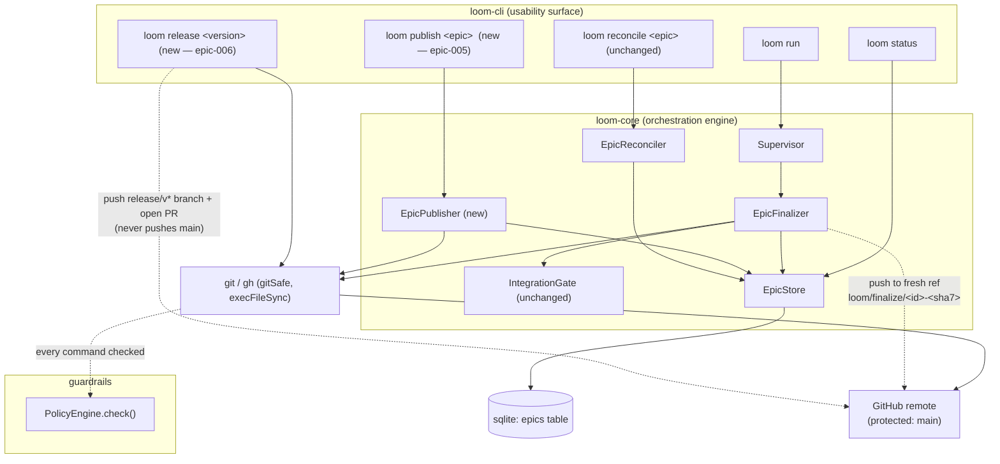
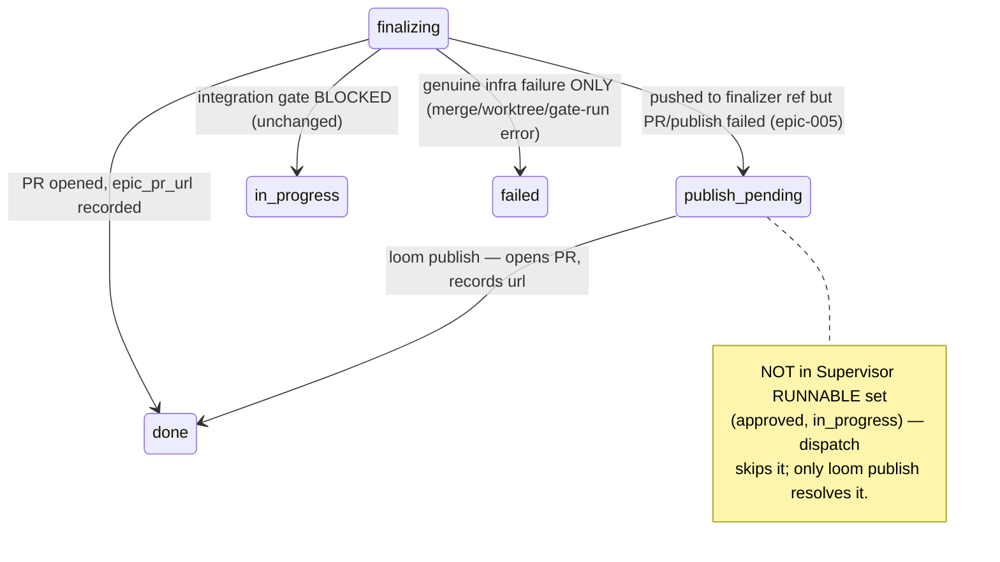

# Architecture — Robust Epic Finalization & Guard-Compatible Release

This document covers the two epics in the breakdown:

- **epic-005** — collision-free finalization, a recoverable `publish_pending` lifecycle state, and an operator recovery command.
- **epic-006** — a guard-compatible records-only release path and documentation parity.

Everything below is grounded in the current code: `EpicFinalizer` (`packages/loom-core/src/orchestrator/EpicFinalizer.ts`), the `Supervisor` (`.../orchestrator/Supervisor.ts`), the `EpicStore`/`Database` (`.../state/`), the `PolicyEngine` (`.../guardrails/PolicyEngine.ts`), the existing `EpicReconciler`, and the release tooling (`scripts/bump-versions.mjs`, `docs/operations/releasing.md`).

---

## Architecture Philosophy

Four constraints drive every decision here. Each one is a load-bearing invariant from `CLAUDE.md` or the PRD's non-functional requirements, not a preference.

1. **The guard is sacrosanct — we route around friction, never through it.** The protected-branch rule and the `forbidden_flags` (`--force`, `--force-with-lease`) in `PolicyEngine` stay exactly as strong as they are today (NFR-1, NFR-2). A non-fast-forward push is solved by *changing where we push*, not by overriding the remote. No new code path may emit a force push.
2. **The lifecycle must not lie.** Today `failed` is overloaded: a fully gate-green epic whose push is *correctly* rejected lands in terminal `failed` (`EpicFinalizer.ts:640-648` → `Supervisor.fail()`). We add exactly one new state, `publish_pending`, and reserve `failed` for genuine infrastructure failure and `rejected` for human verdicts (NFR-3).
3. **Additive change over migration.** The new state is introduced by *new write paths only*. No migration reclassifies an existing row (FR-8). An in-flight epic on `main`-as-it-stands keeps its current status; the schema version bumps, the data does not move.
4. **Boring, already-proven mechanics.** We reuse what already works in this repo: `gitSafe()` for porcelain, `gh pr create` for PRs (already the finalizer's default), `scripts/bump-versions.mjs` for version bumps, and the `release/v*` branch + PR shape visible in recent history (`41b223a` merged `release/v5.1.0`). No new release framework; we codify the path the maintainer already walks by hand.

---

## Component Diagram



The two new seams are **`EpicPublisher`** (drives a `publish_pending` epic to `done`) and the **`loom release`** command path. The `IntegrationGate` and `PolicyEngine` are untouched in behavior.

---

## Tech Stack

| Layer | Choice | Rationale |
|---|---|---|
| Git porcelain | Existing `gitSafe(cwd, args)` (`orchestrator/git.ts`) | Never throws, returns `{ok, output}`; the finalizer's push path already uses it. No new git abstraction. |
| PR creation | `gh pr create --head <ref> …` via `execFileSync` (existing `openPr` injection point in `EpicFinalizer`) | Already the finalizer default; the recovery command reuses the identical call so behavior is one code path, two callers. |
| State | `better-sqlite3`, `epics` table, `EpicStore` methods | Single source of runtime truth; the new state is one enum value + two nullable columns, applied via the existing `runMigrations()` ladder. |
| Schema validation | `zod` `EpicStatusSchema` (`types.ts`) | One enum edit propagates type-safety across core, cli, and web. |
| Version bump | Existing `scripts/bump-versions.mjs <version>` | Idempotent, formatting-preserving, already walks workspace globs. FR-9 mandates reuse. |
| Release branch + PR | `git checkout -b release/v<version>` → push → `gh pr create` | Matches the `release/v5.1.0` shape already in history; rides the guard instead of fighting it. |
| Guard | Existing `PolicyEngine.check()` | Unmodified. Tag and `release/*` pushes are *already* permitted by its refspec matching; we add tests, not rules. |

---

## Data Models

### Epic lifecycle states (`packages/loom-core/src/types.ts`)

One value added to the existing `EpicStatusSchema` enum. It is DB-only (like `failed`), so it does **not** appear in `EpicYamlSchema` (plan-time statuses).

```ts
export const EpicStatusSchema = z.enum([
  'planning',
  'planned',
  'approved',
  'rejected',     // human decision — unchanged
  'in_progress',
  'finalizing',
  'publish_pending', // NEW: stories done + gate green, only publish remains.
                     // Non-terminal, recoverable. Never assigned by migration.
  'failed',       // genuine infra/runtime failure — unchanged semantics
  'done',
]);
```

State transitions (only the new/changed edges shown):



### `epics` table additions (`packages/loom-core/src/state/Database.ts`)

`SCHEMA_VERSION` 18 → 19. Two nullable columns added via `ALTER TABLE` in `runMigrations()`. No `UPDATE` of existing rows — additive only (FR-8).

```sql
-- migration v19 (additive; no data backfill)
ALTER TABLE epics ADD COLUMN finalize_ref  TEXT; -- the fresh finalizer-owned ref that was pushed
ALTER TABLE epics ADD COLUMN publish_note  TEXT; -- "work complete / publish pending" detail for status
```

`finalize_ref` is the bridge between the finalizer and the recovery command: the finalizer records *which ref it pushed*, and `loom publish` opens the PR from exactly that ref. `publish_note` carries the human reason (push rejected / remote disallowed / PR open failed).

### Finalizer-owned ref naming

A deterministic, collision-proof name in a namespace that rolling integration never touches (`epic/<id>` is the rolling branch; `loom/finalize/*` is finalizer-private).

```
loom/finalize/<epicId>-<integratedHead7>
        e.g.  loom/finalize/epic-005-1a2b3c4
```

- `<integratedHead7>` = first 7 chars of the integrated epic HEAD sha.
- **Deterministic:** same integrated tree ⇒ same name ⇒ a retry re-pushes the identical ref as a fast-forward no-op.
- **Collision-proof:** different epics differ by `<epicId>`; a retry that changed content differs by `<integratedHead7>`, so it pushes a *brand-new* ref — a non-fast-forward is structurally impossible without ever forcing.

---

## API / Interface Contracts

The signatures below are the seams the stories must agree on.

### Finalizer (`EpicFinalizer.ts`)

```ts
// FinalizeResult gains one status value (currently: skipped|merged|partial|failed|gated)
export interface FinalizeResult {
  status: 'skipped' | 'merged' | 'partial' | 'failed' | 'gated' | 'publish_pending';
  url?: string;
  conflicted: string[];
  merged: string[];
  cleaned: string[];
  note: string;
}

// New private helper — the ONLY place the ref name is computed.
private finalizeRef(epicId: string, integratedHead: string): string;
//   => `loom/finalize/${epicId}-${integratedHead.slice(0, 7)}`

// Push target changes from `epic/<id>` to finalizeRef(...). On a push that is
// rejected (non-fast-forward) OR remote-disallowed OR a PR-open failure, the
// finalizer writes publish_pending itself and returns status:'publish_pending'.
```

### Store (`EpicStore.ts`)

```ts
// New writes — additive, mirror the existing fail()/recordPrUrl() shape.
publishPending(id: string, finalizeRef: string, note: string): void; // status='publish_pending'
recordFinalizeRef(id: string, ref: string): void;
// recordPrUrl(id, url) + updateStatus(id, 'done') reused unchanged by the publisher.
```

### Supervisor (`Supervisor.ts`)

```ts
// finalizeAndGateDone() gains ONE branch BEFORE the existing failed-branch:
//   if (fin.status === 'publish_pending') return;   // finalizer already wrote state; do NOT fail() or done()
//   if (fin.status === 'failed') { this.epics.fail(...); return; }   // unchanged
// RUNNABLE set { 'approved', 'in_progress' } is UNCHANGED — publish_pending is never re-dispatched.
```

### Recovery command — `loom publish <epic-id>` (new, `loom-cli/src/commands/publish.ts` → `EpicPublisher`)

```ts
export type PublishStatus = 'published' | 'noop' | 'refused' | 'failed';
export interface PublishResult { status: PublishStatus; epicId: string; prUrl?: string; note: string; }

class EpicPublisher {
  // Refuses unless epic.status === 'publish_pending' (distinct premise from reconcile).
  // 1. read epic.finalize_ref  2. gh pr create --head <finalize_ref>
  // 3. ordered write in one txn: recordPrUrl → clearFinalizePhase → audit → updateStatus('done')
  publish(epicId: string): PublishResult;
}
```

### Release command — `loom release <version>` (new, `loom-cli/src/commands/release.ts`)

```ts
// Phase 1 (pre-merge):
//   node scripts/bump-versions.mjs <version>
//   git checkout -b release/v<version>
//   git commit -am "chore(release): v<version>"
//   git push -u origin release/v<version>        // allowed: not a protected branch
//   gh pr create --head release/v<version> --title "chore(release): v<version>"
// Phase 2 (post-merge, documented operator step — see ADR-6):
//   git tag v<version> <merge-sha> && git push origin v<version>   // tag ref — guard permits
```

### Guard (`PolicyEngine.ts`) — unchanged, asserted by test

`checkGit()` matches `cmd.args[2]` (the refspec destination) against `policy.git.protected_branches` globs (`main`, `master`). `release/v*` and `v<version>` tag refs do not match, so both are permitted today. `--force` / `--force-with-lease` remain blocked by the `forbidden_flags` check. **No rule is added; a regression test pins this behavior (story-006-002).**

---

## Security Model

The whole point of this work is to relieve friction *without* widening the attack surface. The guard's job — stop an agent from rewriting or bypassing protected history — is preserved.

| Threat | Existing control | Effect of this change |
|---|---|---|
| Worker/finalizer force-pushes over remote history | `forbidden_flags` block in `PolicyEngine.check()` | **Unchanged & untested-loosened.** New ref-naming removes the *motive* to force-push (no non-fast-forward arises) but adds no `--force` path. NFR-2 holds. |
| Agent pushes directly to `main` | `protected_branches` block (`agents_must_use_pr`) | **Unchanged.** Release flow opens a PR to `main`; it never pushes `main`. |
| Recovery/release command becomes a guard bypass | All git calls route through `gitSafe` → still subject to `PolicyEngine` when run as an agent | New commands issue only PR-opening, non-protected branch pushes, and tag pushes — each already permitted. Operator-run release still passes the guard. |
| Finalizer ref namespace collides with a real branch and clobbers work | Distinct `loom/finalize/*` namespace + sha suffix | Rolling integration only ever writes `epic/<id>`; the finalizer-owned ref cannot overwrite integration work. |
| New state mis-grants execution | `RUNNABLE = {approved, in_progress}` in `Supervisor.selectEpics()` | `publish_pending` is deliberately excluded — a recoverable epic is never silently re-run by dispatch; only the explicit `loom publish` resolves it. |

Out of scope (accepted): garbage-collection of stale `loom/finalize/*` refs (PRD Out of Scope; revisit if trivial).

---

## ADR Log

### ADR-1 — Push finalization to a fresh, finalizer-owned ref
- **Decision:** The finalizer pushes the integrated branch to `loom/finalize/<epicId>-<integratedHead7>`, not to `epic/<id>`. The PR's `--head` uses that ref.
- **Context:** In rolling mode the Supervisor pushes `epic/<id>` during the run; legacy mode recreates `epic/<id>` from `base_sha` at finalize. Either way the local ref can diverge from the remote, so `git push epic/<id>` is rejected non-fast-forward — and force-push is (correctly) blocked, stranding a green epic in `failed` (`EpicFinalizer.ts:640-648`).
- **Rationale:** A ref nobody else writes cannot be non-fast-forward. The sha suffix makes the name deterministic (idempotent re-push) and collision-proof across retries and concurrent epics (FR-1, FR-2).
- **Trade-off:** Accumulates one ref per distinct integrated state on the remote. We accept stale-ref buildup (no GC, per Out of Scope) in exchange for a structurally force-free finalize.

### ADR-2 — Introduce `publish_pending` as a new DB-only, non-terminal state
- **Decision:** Add exactly one enum value, `publish_pending`, distinct from `failed` and `rejected`. DB-only; absent from `EpicYamlSchema`.
- **Context:** The finalizer already has "PR-less terminal" paths that overload `finalizing` with a note (`updateStatus(id, 'finalizing', note)` at the remote-disallowed and PR-fail branches), while the push-fail path returns `failed`. The lifecycle can't truthfully say "work done, publish pending."
- **Rationale:** A first-class state lets status surfaces label the situation honestly (FR-4, FR-5) and gives the recovery command a precise precondition to refuse on. The three publish-friction paths (push rejected, remote disallowed, PR-open failed) all converge on this one state.
- **Trade-off:** Every surface that switches on `EpicStatus` (cli `status.ts` icons, `loom-web` union type and frontend) must learn the new value. We accept a wider blast radius now for a lifecycle that doesn't lie later. Mitigated by the `zod` enum giving compile-time coverage.

### ADR-3 — The finalizer owns the `publish_pending` write; the Supervisor must not override it
- **Decision:** `FinalizeResult.status` gains `'publish_pending'`. The finalizer writes the state itself (via `EpicStore.publishPending`) and returns that status; `Supervisor.finalizeAndGateDone()` adds one early branch that returns without calling `fail()` or flipping `done`.
- **Context:** The Supervisor currently maps `fin.status === 'failed'` → `epics.fail()`. Any publish friction that returns `'failed'` becomes terminal.
- **Rationale:** Making the seam an explicit enum value (not an inferred "merged-but-no-url" condition) keeps the Supervisor branch trivial and unit-testable, and keeps the done-gate's `epic_pr_url` invariant (ADR-3 write-ordering already in the code) intact — `publish_pending` has no url, so it can never be mistaken for `done`.
- **Trade-off:** Two components must stay in sync on the new status value. We prefer an explicit contract over the Supervisor re-deriving intent from `merged`/`url` fields.

### ADR-4 — Recovery via a new `loom publish`, separate from `loom reconcile`
- **Decision:** Add `loom publish <epic-id>` backed by an `EpicPublisher`. It refuses unless the epic is `publish_pending`, opens the PR from `finalize_ref`, records the url, and flips to `done` in one transaction.
- **Context:** `EpicReconciler` already exists but answers a *different* question — "this epic's branch is already merged into `main`; record reality and mark done" (it verifies merge ancestry or a merged PR URL). A publish-pending epic is the opposite: pushed but *not yet PR'd or merged*. Reusing `reconcile` would blur two preconditions (FR-7).
- **Rationale:** Distinct verb, distinct precondition, distinct refusal reasons. `reconcile` (gate-blocked / already-merged recovery) is left byte-for-byte unchanged. The PR-open call is the finalizer's exact `gh pr create` path, so there's one publishing implementation.
- **Trade-off:** Two recovery commands for an operator to learn. We choose `publish` over a `reconcile --mode` flag because conflating preconditions behind one command is how the original truth-in-lifecycle bug crept in. (Naming: `publish` names the remaining action and is maximally distinct from `reconcile`; `recover` was rejected as too close to `reconcile`.)

### ADR-5 — Guard-compatible release via bump → `release/v*` branch → PR
- **Decision:** `loom release <version>` runs `scripts/bump-versions.mjs <version>`, creates and pushes `release/v<version>`, and opens a PR to `main`. It never pushes `main` and never hand-makes a branch outside the command.
- **Context:** The documented runbook (`docs/operations/releasing.md`) says "commit the bump on `main`, then push" — which the protected-branch guard blocks inside a loom repo. Yet history already shows `release/v5.1.0` merged via PR (`41b223a`), so the working shape exists informally.
- **Rationale:** Codifying the branch+PR shape makes the runbook match reality (FR-9, FR-11) and rides the guard rather than asking an operator to disable it. Reuses the existing, idempotent bump script verbatim.
- **Trade-off:** A release now requires a PR merge step (human or CI) before the tag can be cut — slightly more ceremony than a direct push. That ceremony is exactly the guarantee the guard exists to provide.

### ADR-6 — Tag pushes are already permitted; pin with a test, push the tag post-merge
- **Decision:** Do not add a guard rule for tags. Add a regression test asserting `git push origin v<version>` and `git push origin release/v*` pass `PolicyEngine.check()`, and document the post-merge `git tag … && git push origin v<version>` as a defined operator step.
- **Context:** `checkGit()` matches the refspec destination against `protected_branches` (`main`/`master`) globs; a tag ref or `release/*` branch does not match, so both already pass. The tag can only be cut after the release PR merges, so it cannot live inside phase 1.
- **Rationale:** The guard already does the right thing; adding rules to "allow" what is already allowed risks weakening the matcher. A test freezes the behavior so a future tightening of `protected_branches` can't silently break releases (FR-10).
- **Trade-off:** The tag push is a separate, documented step rather than one atomic command. We accept the two-phase flow because the tag must point at the *merged* `main` commit, which doesn't exist until the human/CI merges the PR.

### ADR-7 — Schema change is additive; no migration reclassifies existing rows
- **Decision:** Bump `SCHEMA_VERSION` 18 → 19, add `finalize_ref` and `publish_note` columns via `ALTER TABLE`, and add the enum value. No `UPDATE` touches existing epics.
- **Context:** In-flight epics persisted under v18 must not be retro-labeled into the new state (FR-8, NFR-3).
- **Rationale:** `publish_pending` is only ever reached through the *new* finalize write paths. An existing `failed` row stays `failed`; an existing `finalizing` row stays `finalizing`. The state machine grows additively.
- **Trade-off:** Historical epics that *were* stranded in `failed` for publish friction stay `failed` — we don't retro-correct them. Correcting history would mean inferring intent from old rows, which violates the "don't misclassify" requirement. New epics get the honest state; old ones keep their recorded (if blunt) truth.
