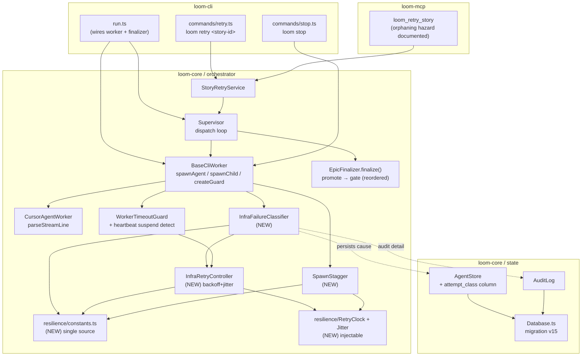
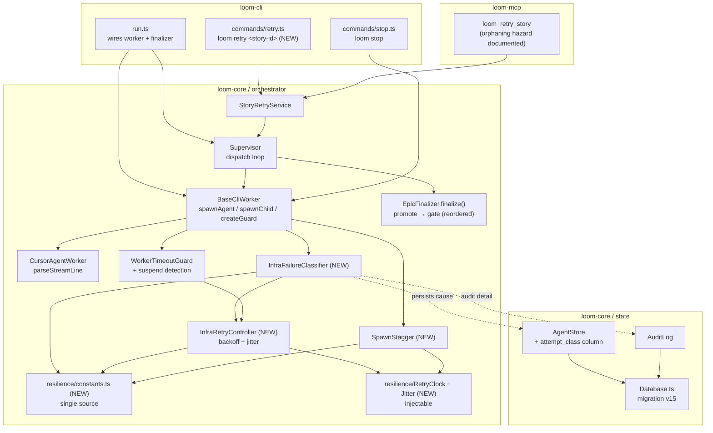

# Resilient Story Execution — System Architecture

## Architecture Philosophy

This epic does not add a subsystem; it hardens an existing one. The execution layer already has the right seams — `BaseCliWorker.spawnAgent`, the `spawnChild`/`createGuard` injection points, `WorkerTimeoutGuard`'s injectable `now`/timer sources, `StoryRetryService`, and the `EpicFinalizer.finalize()` flow. The work is to slot four narrow concerns into those seams without disturbing the bench baseline or the sibling epic's surface area. Four constraints drive every decision below.

1. **Classification is the new load-bearing primitive, and it must be cheap to extend.** Every worker death today collapses to one shape: a non-null `proc.code !== 0` becomes `failed`. We are splitting that into `infra_failure` (self-heal, don't bill the failure budget) vs. `work_failure` (loud, bills the budget). The trade-off we accept: a *table* of signature matchers rather than a clever heuristic. Adding the fifth signature from a future dogfood run should be one array entry plus one test, never a rewiring of the worker run loop.

2. **The loudness invariant is sacred and structural, not advisory.** A worker that produces output and *then* exits non-zero is genuine work that failed — it must never be laundered into an infra retry (FR-4). This is enforced by ordering: classification consults "did this spawn produce any output?" as a hard gate *before* any signature matcher runs. We accept that this makes the classifier slightly more conservative (a real infra fault that happens to arrive after a stray stdout byte is billed as work) in exchange for never silently burning a real defect.

3. **Determinism over realism in time and jitter.** All new timing — backoff schedule, jitter, spawn stagger, suspend detection — extends the *existing* `WorkerTimeoutGuard` injectable-source pattern (`now`, `setTimeout`, `setInterval`). Tests perform zero real sleeps (NFR-1). The trade-off: we thread a `RetryClock`/seeded-RNG abstraction through the worker and supervisor rather than reaching for `Date.now()` and `Math.random()` inline. The payback is that all four infra signatures get their own asserted retry test with no flake surface.

4. **Engine-tuned, not operator-tuned.** Every constant — the `30s / 2m / 8m` schedule, the cap of 3, the ±20% jitter, the 1–2s spawn stagger, the 6× suspend threshold, the 30s checkpoint bound — lives in one source module (FR-10). We deliberately expose **no** new `policy.yaml` knob and **no** new agent-status enum value (the latter belongs to the sibling observability epic). The trade-off: operators cannot retune the schedule without a code change. That is intentional — operators lack the calibration data, exactly as `DEFAULT_COMPLEXITY_MULTIPLIERS` already lives in source, not policy.

## Component Diagram



## Tech Stack

This epic introduces no new runtime dependency. It reuses the existing stack — that is the point.

| Layer | Choice | Rationale |
|---|---|---|
| Language / runtime | TypeScript / Node 20+ | The whole codebase; no reason to deviate. |
| Process spawn | `node:child_process.spawn` via `BaseCliWorker.spawnChild` seam | Already the injection point tests use to inject a fake child (NFR-2). Every infra signature is simulated here — no real CLI. |
| Monotonic time | `process.hrtime.bigint()` | Node built-in, immune to wall-clock jumps on laptop suspend (FR-7). Wrapped behind an injectable `RetryClock` so tests stay sleepless. |
| Timers | `setTimeout`/`setInterval` via injectable sources | Mirrors the existing `WorkerTimeoutGuardOptions.{setTimeout,setInterval,now}` pattern — already proven in `WorkerTimeout.test.ts`. |
| Deterministic jitter | Seeded LCG/`mulberry32`-style PRNG behind an injectable `JitterSource` | FR-2 requires "injectable seeded source." A 30-line pure function beats pulling in `seedrandom`; boring and auditable. |
| State | `better-sqlite3` + idempotent column migration in `Database.ts` | The attempt-classification column follows the exact `PRAGMA table_info` + `ALTER TABLE ADD COLUMN` pattern already used for `worker_pid`, `review_status`, `request_count` (FR-3, NFR-3). |
| Git checkpoint | `gitSafe` + existing `BaseCliWorker.checkpointUncommitted` | `loom stop` reuses the proven `wip: … [loom]` `--no-verify` commit machinery (FR-8) — no new commit path. |
| CLI | `commander` | `loom retry` is one more subcommand alongside `run`/`stop`. |

## Data Models

The only schema change is one nullable column on `agents`, added through the existing idempotent per-column migration in `packages/loom-core/src/state/Database.ts`. **No new agent-status enum value** — the lifecycle enum is owned by the sibling epic (FR-3, Out of Scope).

```sql
-- v15 migration (Database.ts runMigrations, after the v14 agent columns):
-- Attempt classification: WHY this attempt ended, orthogonal to `status`.
--   NULL          → not yet classified / clean success
--   'work_failure'→ produced output then exited non-zero (bills failure budget)
--   'infra_failure'→ matched an infra signature (auto-retried, budget untouched)
ALTER TABLE agents ADD COLUMN attempt_class TEXT;
```

Migration guard (mirrors the surrounding code in `Database.ts`, bump `SCHEMA_VERSION` 14 → 15):

```ts
if (!agentCols.some((c) => c.name === 'attempt_class')) {
  db.exec("ALTER TABLE agents ADD COLUMN attempt_class TEXT");
}
```

The classification is also written to the audit log as a detail field on the existing `completion` row (or a dedicated `attempt_classified` action), never as a new column there:

```ts
// AuditLog.record detail shape (no schema change — detail is JSON TEXT):
{
  action: 'attempt_classified',
  command: storyId,
  detail: {
    attempt_class: 'infra_failure' | 'work_failure',
    signature?: 'connection_loss' | 'spawn_enoent' | 'cli_config_rename' | 'exit_before_output',
    retry_attempt?: number,   // 1..3 for infra retries
    produced_output: boolean, // the loudness gate's input
  }
}
```

The in-memory classification result that flows from worker → supervisor:

```ts
// resilience/types.ts
export type AttemptClass = 'infra_failure' | 'work_failure';

export type InfraSignature =
  | 'connection_loss'      // cursor-agent connection lost mid-stream
  | 'spawn_enoent'         // ENOENT spawning the agent binary
  | 'cli_config_rename'    // ~/.cursor/cli-config.json rename race (EEXIST/ENOENT on config)
  | 'exit_before_output';  // process exited non-zero having emitted zero output

export interface Classification {
  class: AttemptClass;
  /** Present only when class === 'infra_failure'. */
  signature?: InfraSignature;
}
```

## API / Interface Contracts

These are the seams the stories must agree on. Signatures are deliberately additive — existing callers compile unchanged.

### Single source of constants (FR-10)

```ts
// packages/loom-core/src/orchestrator/resilience/constants.ts
export const INFRA_RETRY_SCHEDULE_MS = [30_000, 120_000, 480_000] as const; // 30s / 2m / 8m
export const INFRA_RETRY_MAX_ATTEMPTS = 3;
export const INFRA_RETRY_JITTER_FRACTION = 0.2;          // ±20% full jitter
export const SPAWN_STAGGER_MIN_MS = 1_000;
export const SPAWN_STAGGER_MAX_MS = 2_000;
export const SUSPEND_POLL_MULTIPLE = 6;                  // wall jump > 6× pollMs ⇒ suspend
export const STOP_CHECKPOINT_TIMEOUT_MS = 30_000;        // per-worker WIP-commit bound
```

### Injectable clock & jitter (NFR-1)

```ts
// packages/loom-core/src/orchestrator/resilience/RetryClock.ts
export interface RetryClock {
  /** Monotonic nanoseconds; production = process.hrtime.bigint(). */
  monotonicNs(): bigint;
  /** Wall-clock ms; production = Date.now(). Used only for suspend detection. */
  wallMs(): number;
  setTimeout(fn: () => void, ms: number): unknown;
  clearTimeout(handle: unknown): void;
}

export interface JitterSource {
  /** Deterministic in [0,1) from a seed; production seeds from crypto once. */
  next(): number;
}

/** ±fraction full jitter around a base delay, drawn from the injectable source. */
export function jitter(baseMs: number, fraction: number, src: JitterSource): number;
```

### Infra-failure classifier (FR-1, FR-4)

```ts
// packages/loom-core/src/orchestrator/InfraFailureClassifier.ts
export interface SpawnOutcome {
  code: number | null;
  output: string;          // full captured stdout+stderr
  spawnError?: string;     // child 'error' event message (carries ENOENT)
  timedOut: boolean;
  producedOutput: boolean; // the loudness gate — true once any stdout/stderr chunk arrived
}

export type SignatureMatcher = (o: SpawnOutcome) => InfraSignature | null;

/**
 * Ordered table of matchers. Adding a 5th signature is one push() + one test.
 * The loudness invariant (FR-4) is enforced by the caller BEFORE consulting these.
 */
export const INFRA_SIGNATURES: SignatureMatcher[];

export function classifyAttempt(o: SpawnOutcome): Classification;
//  Contract:
//   1. if o.producedOutput && o.code !== 0  → { class: 'work_failure' }   (loudness, FR-4)
//   2. else first matching INFRA_SIGNATURES → { class: 'infra_failure', signature }
//   3. else                                 → { class: 'work_failure' }
```

### Bounded auto-retry controller (FR-2)

```ts
// packages/loom-core/src/orchestrator/InfraRetryController.ts
export interface InfraRetryControllerOptions {
  clock: RetryClock;
  jitter: JitterSource;
}

export class InfraRetryController {
  /** True while attempt < INFRA_RETRY_MAX_ATTEMPTS. */
  shouldRetry(attempt: number): boolean;
  /** Backoff for attempt n (0-based) = schedule[n] ± 20% jitter. Resolves after the delay. */
  waitBeforeRetry(attempt: number): Promise<void>;
}
```

### Worker run loop integration (FR-1, FR-2, FR-7)

`BaseCliWorker.spawnAgent` already returns the shape `classifyAttempt` needs; it gains `producedOutput` tracking (set true in the existing `child.stdout/stderr 'data'` handlers). The infra-retry loop wraps the existing single `spawnAgent` call inside `run()` — *not* a new public method — so the loudness/budget contract stays inside the worker:

```ts
// Inside BaseCliWorker.run(), replacing the bare `await this.spawnAgent(...)`:
//   proc = await this.spawnWithInfraRetry(assignment, prompt);
protected async spawnWithInfraRetry(
  assignment: WorkerAssignment,
  prompt: string
): Promise<SpawnOutcome & { attemptClass: AttemptClass; signature?: InfraSignature }>;
//  - classifies each spawn; on infra_failure & shouldRetry → waitBeforeRetry → re-spawn
//  - emits assignment.onAttemptClassified?(...) so the Supervisor persists the column
//  - infra retries DO NOT count against the failure budget (they re-enter the same loop)
```

New optional sink on `WorkerAssignment` (additive, like `onTimeoutWarn`):

```ts
// WorkerRunner.ts — WorkerAssignment
onAttemptClassified?: (info: {
  attemptClass: AttemptClass;
  signature?: InfraSignature;
  retryAttempt: number;
}) => void;
```

### Suspend-aware timeout guard (FR-7)

`WorkerTimeoutGuard` extends its existing injectable-`now` pattern with heartbeat-based suspend detection. On a detected wall-clock jump > `SUSPEND_POLL_MULTIPLE × pollMs`, it re-arms (resets `startMs`/`lastActivityMs` from the resume instant) instead of killing, and signals the worker to route the spawn through the infra-retry path:

```ts
// WorkerTimeoutGuardOptions gains:
monotonicNow?: () => bigint;   // hrtime.bigint(); duration math uses THIS, not wall
onSuspendDetected?: (info: { wallJumpMs: number }) => void;
// check(): if wall delta since last tick > SUSPEND_POLL_MULTIPLE*pollMs while
//          monotonic delta is small ⇒ suspend ⇒ re-arm + onSuspendDetected, return 'noop'
```

### `loom retry` CLI (FR-6)

```ts
// packages/loom-cli/src/commands/retry.ts
export function runRetry(storyId: string, opts: { clean?: boolean }): Promise<void>;
//  - builds StoryRetryService({ projectRoot, db, clean })
//  - prep = retry.prepare(storyId)
//  - if a live epic lease is held → prep is 'rejected' for the live holder, but the
//    command's contract is: reset-to-ready and let the lease-holder dispatch (queue path);
//    self-dispatch (build a Supervisor, run([epicId])) only when no lease is held
//  - output states: "retry grants a FRESH auto-retry budget; story + budget reset"
```

### `loom stop` checkpoint (FR-8)

```ts
// stop.ts (run-wide branch, before setState('stopping') triggers SIGTERM paths)
//  For each in-flight worktree, attempt a bounded checkpoint reusing the worker's
//  proven machinery, bounded by STOP_CHECKPOINT_TIMEOUT_MS per worker:
export function checkpointInFlightWorktrees(
  db: Database.Database,
  clock: RetryClock,
): { storyId: string; checkpointed: boolean }[];
//  - hung checkpoint is abandoned at 30s; stop proceeds regardless of outcome
```

### `EpicFinalizer.finalize()` reordering (FR-9)

No signature change. The body moves `this.promoteArtifacts(epicId, epic, gitRoot)` to run **before** the integration gate, so the gate runs on the promoted tree, and the block-mode branch no longer calls `promoteArtifacts` a second time — collapsing to a single promotion site (no double commit).

## Security Model

This epic shifts no trust boundary, but two of its mechanisms touch sensitive surfaces and must be reasoned about.

| Threat | Control |
|---|---|
| **Infra retry masks a real, repeated work failure** (a story keeps "succeeding" via infra reclassification while never producing valid code). | The loudness invariant (FR-4): any spawn that produced output and exited non-zero is `work_failure` *before* signature matching. Cap of 3 infra attempts bounds the blast radius even for a true infra storm. Asserted by per-signature tests (NFR-2). |
| **Checkpoint-on-stop commits secrets / broken state with `--no-verify`.** | Reuses the *existing* `checkpointUncommitted` path, whose commit is clearly marked `wip: … [loom]` and is squashed/redone on the real retry — already an accepted, scoped exception documented in `worker-resilience.md`. No new bypass is introduced; `--no-verify` scope is unchanged. |
| **`loom retry` double-dispatches into an idempotent worktree, racing a live run.** | `StoryRetryService` is# Resilient Story Execution — System Architecture

## Architecture Philosophy

This epic does not add a subsystem; it hardens an existing one. The execution layer already has the right seams — `BaseCliWorker.spawnAgent`, the `spawnChild`/`createGuard` injection points, `WorkerTimeoutGuard`'s injectable `now`/timer sources, `StoryRetryService`, and `EpicFinalizer.finalize()`. The work is to slot four narrow concerns into those seams without disturbing the bench baseline or the sibling epic's surface area. Four constraints drive every decision below.

1. **Classification is the new load-bearing primitive, and it must be cheap to extend.** Every worker death today collapses to one shape: a non-null `proc.code !== 0` becomes `failed` in `BaseCliWorker.run()`. We split that into `infra_failure` (self-heal, don't bill the failure budget) vs. `work_failure` (loud, bills the budget). The trade-off we accept: a *table* of signature matchers (`INFRA_SIGNATURES`) rather than a clever heuristic. Adding the fifth signature from a future dogfood run is one array entry plus one test, never a rewiring of the worker run loop.

2. **The loudness invariant is sacred and structural, not advisory.** A worker that produces output and *then* exits non-zero is genuine work that failed — it must never be laundered into an infra retry (FR-4). This is enforced by ordering: `classifyAttempt` consults "did this spawn produce any output?" as a hard gate *before* any signature matcher runs. We accept that this makes the classifier slightly conservative (a real infra fault arriving after a stray stdout byte is billed as work) in exchange for never silently burning a real defect.

3. **Determinism over realism in time and jitter.** All new timing — backoff schedule, jitter, spawn stagger, suspend detection — extends the *existing* `WorkerTimeoutGuard` injectable-source pattern (`now`, `setTimeout`, `setInterval`). Tests perform zero real sleeps (NFR-1). The trade-off: we thread `RetryClock`/`JitterSource` abstractions through the worker rather than reaching for `Date.now()` / `Math.random()` inline. The payback is that all four infra signatures get their own asserted retry test with no flake surface.

4. **Engine-tuned, not operator-tuned.** Every constant — the `30s / 2m / 8m` schedule, the cap of 3, the ±20% jitter, the 1–2s spawn stagger, the 6× suspend threshold, the 30s checkpoint bound — lives in one source module (FR-10). We deliberately expose **no** new `policy.yaml` knob and **no** new agent-status enum value (the latter belongs to the sibling observability epic). The trade-off: operators cannot retune the schedule without a code change — intentional, exactly as `DEFAULT_COMPLEXITY_MULTIPLIERS` already lives in source, not policy.

## Component Diagram



## Tech Stack

This epic introduces no new runtime dependency. It reuses the existing stack — that is the point.

| Layer | Choice | Rationale |
|---|---|---|
| Language / runtime | TypeScript / Node 20+ | The whole codebase; no reason to deviate. |
| Process spawn | `node:child_process.spawn` via the `BaseCliWorker.spawnChild` seam | Already the injection point tests use to drive a fake child (NFR-2). Every infra signature is simulated here — no real CLI. |
| Monotonic time | `process.hrtime.bigint()` | Node built-in, immune to wall-clock jumps on laptop suspend (FR-7). Wrapped behind injectable `RetryClock` so tests stay sleepless. |
| Timers | `setTimeout` / `setInterval` via injectable sources | Mirrors the existing `WorkerTimeoutGuardOptions.{setTimeout,setInterval,now}` pattern — proven in `WorkerTimeout.test.ts`. |
| Deterministic jitter | Seeded `mulberry32`-style PRNG behind an injectable `JitterSource` | FR-2 requires an "injectable seeded source." A ~30-line pure function beats pulling in `seedrandom`; boring and auditable. |
| State | `better-sqlite3` + idempotent column migration in `Database.ts` | The `attempt_class` column follows the exact `PRAGMA table_info` + `ALTER TABLE ADD COLUMN` pattern already used for `worker_pid`, `review_status`, `request_count` (FR-3, NFR-3). |
| Git checkpoint | `gitSafe` + the existing `BaseCliWorker.checkpointUncommitted` | `loom stop` reuses the proven `wip: … [loom]` `--no-verify` commit machinery (FR-8) — no new commit path. |
| CLI | `commander` | `loom retry` is one more subcommand alongside `run`/`stop`. |

## Data Models

The only schema change is one nullable column on `agents`, added through the existing idempotent per-column migration in `packages/loom-core/src/state/Database.ts`. **No new agent-status enum value** — the lifecycle enum is owned by the sibling epic (FR-3, Out of Scope).

```sql
-- v15 migration (Database.ts runMigrations, after the v14 agent columns):
-- Attempt classification: WHY this attempt ended, orthogonal to `status`.
--   NULL           → not yet classified / clean success
--   'work_failure' → produced output then exited non-zero (bills failure budget)
--   'infra_failure'→ matched an infra signature (auto-retried, budget untouched)
ALTER TABLE agents ADD COLUMN attempt_class TEXT;
```

Migration guard (mirrors the surrounding code in `Database.ts`; bump `SCHEMA_VERSION` 14 → 15):

```ts
if (!agentCols.some((c) => c.name === 'attempt_class')) {
  db.exec('ALTER TABLE agents ADD COLUMN attempt_class TEXT');
}
```

The classification is also written to the audit log as a detail field — never as a new audit column (the `detail` field is already JSON `TEXT`):

```ts
// AuditLog.record(...) — dedicated action, story id in `command`:
{
  action: 'attempt_classified',
  command: storyId,
  detail: {
    attempt_class: 'infra_failure' | 'work_failure',
    signature?: 'connection_loss' | 'spawn_enoent' | 'cli_config_rename' | 'exit_before_output',
    retry_attempt?: number,   // 1..3 for infra retries
    produced_output: boolean, // the loudness gate's input
  }
}
```

The in-memory classification result that flows worker → supervisor:

```ts
// resilience/types.ts
export type AttemptClass = 'infra_failure' | 'work_failure';

export type InfraSignature =
  | 'connection_loss'      // cursor-agent connection lost mid-stream
  | 'spawn_enoent'         // ENOENT spawning the agent binary
  | 'cli_config_rename'    // ~/.cursor/cli-config.json rename race
  | 'exit_before_output';  // process exited non-zero having emitted zero output

export interface Classification {
  class: AttemptClass;
  signature?: InfraSignature; // present only when class === 'infra_failure'
}
```

## API / Interface Contracts

These are the seams the stories must agree on. Signatures are deliberately additive — existing callers compile unchanged.

### Single source of constants (FR-10)

```ts
// packages/loom-core/src/orchestrator/resilience/constants.ts
export const INFRA_RETRY_SCHEDULE_MS = [30_000, 120_000, 480_000] as const; // 30s / 2m / 8m
export const INFRA_RETRY_MAX_ATTEMPTS = 3;
export const INFRA_RETRY_JITTER_FRACTION = 0.2;          // ±20% full jitter
export const SPAWN_STAGGER_MIN_MS = 1_000;
export const SPAWN_STAGGER_MAX_MS = 2_000;
export const SUSPEND_POLL_MULTIPLE = 6;                  // wall jump > 6× pollMs ⇒ suspend
export const STOP_CHECKPOINT_TIMEOUT_MS = 30_000;        // per-worker WIP-commit bound
```

### Injectable clock & jitter (NFR-1)

```ts
// packages/loom-core/src/orchestrator/resilience/RetryClock.ts
export interface RetryClock {
  monotonicNs(): bigint;   // production = process.hrtime.bigint()
  wallMs(): number;        // production = Date.now(); used ONLY for suspend detection
  setTimeout(fn: () => void, ms: number): unknown;
  clearTimeout(handle: unknown): void;
}

export interface JitterSource {
  next(): number;          // deterministic in [0,1) from a seed
}

/** ±fraction full jitter around a base delay, drawn from the injectable source. */
export function jitter(baseMs: number, fraction: number, src: JitterSource): number;
```

### Infra-failure classifier (FR-1, FR-4)

```ts
// packages/loom-core/src/orchestrator/InfraFailureClassifier.ts
export interface SpawnOutcome {
  code: number | null;
  output: string;          // full captured stdout+stderr
  spawnError?: string;     // child 'error' event message (carries ENOENT)
  timedOut: boolean;
  producedOutput: boolean; // loudness gate — true once ANY stdout/stderr chunk arrived
}

export type SignatureMatcher = (o: SpawnOutcome) => InfraSignature | null;

/** Ordered table. A 5th signature is one push() + one test. */
export const INFRA_SIGNATURES: SignatureMatcher[];

export function classifyAttempt(o: SpawnOutcome): Classification;
//  1. if o.producedOutput && o.code !== 0 → { class: 'work_failure' }   (loudness, FR-4)
//  2. else first matching INFRA_SIGNATURES → { class: 'infra_failure', signature }
//  3. else                                 → { class: 'work_failure' }
```

### Bounded auto-retry controller (FR-2)

```ts
// packages/loom-core/src/orchestrator/InfraRetryController.ts
export interface InfraRetryControllerOptions {
  clock: RetryClock;
  jitter: JitterSource;
}

export class InfraRetryController {
  shouldRetry(attempt: number): boolean;        // attempt < INFRA_RETRY_MAX_ATTEMPTS
  waitBeforeRetry(attempt: number): Promise<void>; // schedule[n] ± 20% jitter, via clock.setTimeout
}
```

### Worker run-loop integration (FR-1, FR-2, FR-7)

`BaseCliWorker.spawnAgent` already returns the shape `classifyAttempt` needs; it gains `producedOutput` (set true in the existing `child.stdout`/`stderr` `'data'` handlers). The infra-retry loop wraps the existing single `spawnAgent` call inside `run()` — **not** a new public method — so the loudness/budget contract stays inside the worker:

```ts
// Inside BaseCliWorker.run(), replacing the bare `await this.spawnAgent(...)`:
//   const proc = await this.spawnWithInfraRetry(assignment, prompt);
protected async spawnWithInfraRetry(
  assignment: WorkerAssignment,
  prompt: string
): Promise<SpawnOutcome & { attemptClass: AttemptClass; signature?: InfraSignature }>;
//  - classifies each spawn; infra_failure & shouldRetry → waitBeforeRetry → re-spawn
//  - emits assignment.onAttemptClassified?(...) so the Supervisor persists the column
//  - infra retries do NOT count against the failure budget (re-enter the same loop)
```

New optional sink on `WorkerAssignment` (additive, like `onTimeoutWarn`):

```ts
// WorkerRunner.ts — WorkerAssignment
onAttemptClassified?: (info: {
  attemptClass: AttemptClass;
  signature?: InfraSignature;
  retryAttempt: number;
}) => void;
```

### Suspend-aware timeout guard (FR-7)

`WorkerTimeoutGuard` extends its existing injectable-`now` pattern with heartbeat-based suspend detection. Duration math uses `monotonicNow()`; on a wall-clock jump > `SUSPEND_POLL_MULTIPLE × pollMs` it **re-arms** (resets `startMs`/`lastActivityMs` from the resume instant) instead of killing, and routes the worker through the shared infra-retry path:

```ts
// WorkerTimeoutGuardOptions gains:
monotonicNow?: () => bigint;   // hrtime.bigint(); duration math uses THIS, not wall
onSuspendDetected?: (info: { wallJumpMs: number }) => void;
// check(): if wall delta since last tick > SUSPEND_POLL_MULTIPLE*pollMs while the
//          monotonic delta is small ⇒ suspend ⇒ re-arm + onSuspendDetected, return 'noop'
```

### `loom retry` CLI (FR-6)

```ts
// packages/loom-cli/src/commands/retry.ts
export function runRetry(storyId: string, opts: { clean?: boolean }): Promise<void>;
//  - builds StoryRetryService({ projectRoot, db, clean }); prep = retry.prepare(storyId)
//  - lease-aware: when a live epic lease is held, reset-to-ready and let the lease-holder
//    dispatch (queue path); self-dispatch (build Supervisor, run([epicId])) only when NO lease
//  - resets the story AND a fresh auto-retry budget; output states:
//    "retry grants a FRESH auto-retry budget; the story and that budget are reset"
```

### `loom stop` checkpoint (FR-8)

```ts
// stop.ts (run-wide branch, before the stop signal triggers SIGTERM)
export function checkpointInFlightWorktrees(
  db: Database.Database,
  clock: RetryClock,
): { storyId: string; checkpointed: boolean }[];
//  - per in-flight worktree: bounded WIP commit reusing checkpointUncommitted machinery,
//    capped at STOP_CHECKPOINT_TIMEOUT_MS via clock.setTimeout
//  - a hung checkpoint is abandoned; stop proceeds regardless of outcome
```

### `EpicFinalizer.finalize()` reordering (FR-9)

No signature change. `this.promoteArtifacts(epicId, epic, gitRoot)` moves to run **before** the integration gate so the gate runs on the promoted tree, and the block-mode branch no longer calls `promoteArtifacts` a second time — collapsing to a single promotion site (no double commit).

## Security Model

This epic shifts no trust boundary, but two mechanisms touch sensitive surfaces and must be reasoned about.

| Threat | Control |
|---|---|
| **Infra retry masks a real, repeated work failure** — a story keeps "self-healing" while never producing valid code. | The loudness invariant (FR-4): any spawn that produced output and exited non-zero is `work_failure` *before* signature matching. The cap of 3 infra attempts bounds the blast radius even in a true infra storm. Asserted per-signature (NFR-2). |
| **Checkpoint-on-stop commits secrets / broken state with `--no-verify`.** | Reuses the *existing* `checkpointUncommitted` path, whose commit is clearly marked `wip: … [loom]` and squashed/redone on the real retry — already an accepted, scoped exception documented in `worker-resilience.md`. No new bypass; `--no-verify` scope unchanged. |
| **`loom retry` double-dispatches into an idempotent worktree, racing a live run.** | `StoryRetryService` already refuses when `LeaseStore.heldByOther(epicId)`; the lease-aware retry path (FR-6) resets-to-ready and lets the lease-holder dispatch instead of self-dispatching, so no second supervisor enters the same worktree. |
| **MCP `loom_retry_story` orphans a background dispatch when a one-shot stdio client disconnects.** | Out of scope to *fix*; documented as a known hazard on the tool (FR-6 / Out of Scope). The real fix is the shared CLI path (`loom retry`), which this epic ships. |
| **Suspend detection re-arms timers indefinitely, letting a genuinely stuck worker run forever.** | Re-arm resets the deadline from the resume instant but the absolute cap and stall ceilings still apply post-resume; a worker silent after resume is killed normally. Suspend only forgives the *gap*, not the worker. |

## ADR Log

### ADR-1 — Attempt classification is a separate column, not a status enum value

- **Decision.** Add a nullable `attempt_class TEXT` column to `agents` (`infra_failure` / `work_failure` / `NULL`). Do **not** add an `infra_failure` value to the agent-status enum.
- **Context.** FR-3 and the Out-of-Scope list assign the status-lifecycle enum to a sibling epic. The cause of an attempt (infra vs. work) is orthogonal to its lifecycle state (`running` / `failed` / `done`).
- **Rationale.** A separate column lets a story be `status='failed'` *and* `attempt_class='infra_failure'` simultaneously, captures the same information the audit detail does, and follows the established `Database.ts` per-column migration idiom (`worker_pid`, `review_status`).
- **Trade-off.** Two fields now express "what happened," so any status renderer that wants the cause must read both columns. Accepted: it keeps this epic's diff out of the sibling epic's enum.

### ADR-2 — Classification is a matcher table, gated by a structural loudness check

- **Decision.** `classifyAttempt` checks `producedOutput && code !== 0 ⇒ work_failure` *first*, then walks an ordered `INFRA_SIGNATURES` table.
- **Context.** Four documented signatures today (FR-1); more will surface in future dogfood runs (Out of Scope notes incremental growth). FR-4 forbids reclassifying a post-output non-zero exit as infra.
- **Rationale.** The loudness gate is the cheapest possible structural guarantee — one boolean read before any pattern matching — so it can never be subverted by signature ordering. The table makes "admit a new signature cheaply" literal: one `push()` + one test (NFR-2).
- **Trade-off.** A genuine infra fault that arrives *after* a stray output byte is billed as work. Accepted: erring toward "loud" is the safe direction for a failure budget.

### ADR-3 — Reuse `WorkerTimeoutGuard`'s injectable sources for all new timing

- **Decision.** Backoff, jitter, spawn stagger, and suspend detection all go through `RetryClock` / `JitterSource`, modeled on the existing `WorkerTimeoutGuardOptions.{now,setTimeout,setInterval}`.
- **Context.** NFR-1 requires deterministic, sleepless tests; NFR-2 requires each of the four signatures to have its own asserted retry test through the `spawnChild` seam.
- **Rationale.** The pattern is already proven (`WorkerTimeout.test.ts`). A seeded PRNG plus an injectable clock makes "30s ± 20% jitter, three times, no real sleep" a pure-function assertion.
- **Trade-off.** Every new timing call site takes an injected source rather than calling globals — more plumbing. Accepted: the alternative is flaky time-based tests, which we refuse.

### ADR-4 — Monotonic `hrtime.bigint()` for duration; wall-clock only as a suspend *signal*

- **Decision.** All worker duration math switches to `process.hrtime.bigint()`. Wall-clock (`Date.now()`) is read only to *detect* a suspend (a large wall jump with a small monotonic delta).
- **Context.** FR-7: laptop suspend freezes wall-clock-based timers and misfires kills on a streaming worker.
- **Rationale.** Monotonic time does not jump across a suspend, so the stall/cap math is correct without special-casing. The wall-vs-monotonic divergence is itself the suspend signal, which lets the guard re-arm from the resume instant and route the worker through the shared infra-retry path.
- **Trade-off.** Two clocks now feed the guard, and a test must mock both. Accepted: it is the only way to tell "the machine slept" from "the worker stalled."

### ADR-5 — Auto-retry lives inside the worker; operator retry stays in `StoryRetryService`

- **Decision.** The bounded in-place infra retry (FR-2) wraps `spawnAgent` *inside* `BaseCliWorker.run()`. Operator-initiated retry (FR-6) stays in the existing `StoryRetryService` + CLI, lease-aware.
- **Context.** Infra retries must not touch the failure budget and must re-use the same worktree; operator retry must reset the story *and* grant a fresh auto-retry budget, and must never race a live lease.
- **Rationale.** Keeping the auto-retry loop inside the worker means the budget contract (infra retries are free, work failures are billed) is enforced at the single point that already owns commit-counting and checkpointing. Operator retry is a distinct concern — resetting state and re-dispatching — already encapsulated by `StoryRetryService` and the `loom_retry_story` tool wiring.
- **Trade-off.** Two retry paths exist rather than one unified mechanism. Accepted: they answer different questions (a blink vs. an operator decision) and share only the constants module and the budget semantics.

### ADR-6 — Promote artifacts before the integration gate; collapse to one promotion site

- **Decision.** In `EpicFinalizer.finalize()`, move `promoteArtifacts` ahead of the gate and delete the second `promoteArtifacts` call in the block-mode branch.
- **Context.** FR-9: today the gate runs on a tree that lacks the promoted `.loom_outputs/<epic-id>/` artifacts, while the PR ships *with* them — the gate validates a different tree than the PR carries. Block-mode promotes twice.
- **Rationale.** Running the gate on the promoted tree makes the gated tree byte-identical to the PR tree. One promotion site removes the double-commit and the divergence in one move.
- **Trade-off.** The gate now also sees the artifact commit, marginally enlarging the validated diff. Accepted: that commit is exactly what ships, so validating it is correct, not noise. The diff is deliberately confined to ordering — status transitions and PR-URL recording remain the sibling epic's (Out of Scope).

### ADR-7 — Stagger concurrent spawns with 1–2s jitter rather than serializing or locking

- **Decision.** Before each concurrent `cursor-agent` spawn, wait a 1–2s jittered delay (`SpawnStagger`, FR-5) drawn from the injectable source.
- **Context.** Concurrent `cursor-agent` starts race on the `~/.cursor/cli-config.json` rename, one of the four infra signatures.
- **Rationale.** A small stagger clears the rename herd without a cross-process lock on a file loom does not own and without serializing dispatch (which would erase the concurrency the supervisor exists to provide). If the race still fires, the classifier catches `cli_config_rename` and the retry path recovers — defense in depth.
- **Trade-off.** A 1–2s start latency per concurrent worker. Accepted: negligible against multi-minute stories, and far cheaper than a retry cycle.
