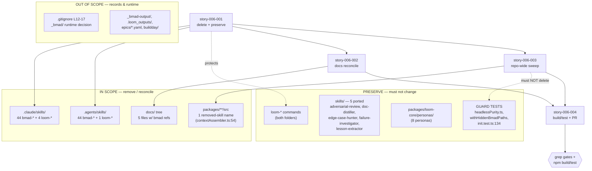

# Architecture — Remove BMAD Scaffolding (epic-006)

## Architecture Philosophy

This epic ships **zero new behavior**. It is a subtractive change: delete ~44 vendored `bmad-*` IDE-command directories from each of two folders and reconcile every dangling reference. There is no runtime to design — so the "architecture" here is a *deletion-safety discipline*: a taxonomy that tells an agent which `bmad` strings to remove, which to keep, and which it must never touch. Four constraints drive every decision below.

1. **The literal string `bmad` is not a single thing.** It appears in three disjoint classes, and only one is in scope. Treating them uniformly (blind grep-and-delete) is the dominant failure mode — it deletes the very tests that prove the removal is safe and rewrites historical records. The taxonomy in **Data Models** is the load-bearing artifact of this epic.

2. **Subtractive, but not byte-blind.** The four product packages (`loom-core`, `loom-cli`, `loom-mcp`, `loom-web`) must come out behaviorally identical. The only permitted source edits are reconciling *names of removed skills* (one confirmed site: `contextAssembler.ts:54`). Everything else under `packages/**/src` is off-limits.

3. **Green is necessary, not sufficient.** `_bmad`-runtime-hiding tests already pass and must keep passing — but a naive cleanup could *delete* them and still go green. Verification is therefore by **explicit grep gates with triage**, not by test color alone (PRD FR-7).

4. **One owner per path, one PR.** Stories run as parallel agents on isolated branches; the file-ownership map (in the companion contract) and the single-PR assembly in `story-006-004` are what keep four branches from colliding on `docs/` and the epic record.

## Component Diagram



## Tech Stack

This epic has no application stack; its "stack" is the toolchain that performs and verifies the prune.

| Layer | Choice | Rationale |
|---|---|---|
| Deletion | `git rm -r .{claude,agents}/skills/bmad-*` | Stages removal atomically; `git status` then shows *only* deletions under skill dirs, making "loom-* untouched" trivially auditable. Boring and reversible. |
| Reference discovery | `git grep -in bmad` (case-insensitive, line numbers) | Tracked-files-only, fast, deterministic. The single source of the reference inventory triaged in Data Models. |
| Glob audit | `find .agents/skills .claude/skills -maxdepth 1 -name 'bmad-*'` | Empty result is the machine-checkable acceptance gate for FR-1/FR-2. |
| Build verify | `npm run build` (workspaces) | Catches any TS reference to a deleted name across `loom-core/cli/mcp/web`. |
| Test verify | `npm run test` (workspaces) | Proves behavior unchanged *and* that the `_bmad`-hiding guard tests still load the five ported skills. |
| Editing | `Edit` (targeted) on docs + the one source comment | Per-line edits keep the diff legible; no `sed` sweeps that could clobber Class B/C strings. |

## Data Models

The central entity is **not** a runtime object — it is the classification of every `bmad`-bearing path/string. An agent's only job is to assign each hit to a class and act per its policy.

```typescript
// Every directory under the two IDE-command folders.
type SkillEntry = {
  folder: '.claude/skills' | '.agents/skills';
  name: string;                 // e.g. "bmad-prd" | "loom-epic"
  kind: 'bmad' | 'loom';
  action: 'DELETE' | 'PRESERVE';  // kind==='bmad' → DELETE; kind==='loom' → PRESERVE
};

// Observed inventory (verified on disk at planning time):
//   .claude/skills : 44 bmad-*  + 4 loom-*  [loom-approve, loom-epic, loom-status, loom-ux-designer]
//   .agents/skills : 44 bmad-*  + 1 loom-*  [loom-approve]   ← ASYMMETRIC: only one loom command here
//   skills/        : 5 ported (NO bmad- prefix) — PRESERVE, out of scope
//   personas/      : 8 files — PRESERVE, out of scope

// THE taxonomy: which class is every `git grep -i bmad` hit?
type RefClass =
  | 'A_REMOVED_SKILL_NAME'   // names a deleted bmad-* dir → MUST reconcile/remove
  | 'B_PROVENANCE'           // generic lineage ("BMAD originals", "BMAD-era") → default KEEP
  | 'C_GUARD_INVARIANT'      // test/assert that enforces independence FROM bmad → MUST PRESERVE
  | 'D_HISTORICAL_RECORD';   // planning artifact / epic title / gitignore runtime path → DO NOT EDIT

type Reference = { file: string; line: number; text: string; cls: RefClass; };

// Triaged inventory from the repo-wide sweep (the load-bearing table):
const INVENTORY: Reference[] = [
  // ── Class A: the ONLY mandatory source reconciliation ───────────────────
  { file: 'packages/loom-core/src/worker/contextAssembler.ts', line: 54,
    text: '...the graceful-degradation path bmad-distillator', cls: 'A_REMOVED_SKILL_NAME' },

  // ── Class B: provenance — keep (optionally soften to "the planning originals") ──
  { file: 'packages/loom-core/src/findings/LessonExtractor.ts', line: 28,
    text: 'overriding BMAD-era schema drift', cls: 'B_PROVENANCE' },
  { file: 'packages/loom-core/src/skills/reviewerSkills.ts', line: 11,
    text: 'the BMAD originals emit a...', cls: 'B_PROVENANCE' },

  // ── Class C: PROTECTIVE — deleting these silently weakens loom (false-green trap) ──
  { file: 'packages/loom-cli/src/__tests__/init.test.ts', line: 134,
    text: "assert !/bmad/i.test(content) — bundled skill must not reference bmad", cls: 'C_GUARD_INVARIANT' },
  { file: 'packages/loom-core/test/fixtures/headlessPurity.ts', line: 0,
    text: 'withHiddenBmadPaths() / HIDDEN_FRAGMENTS = [_bmad/scripts, _bmad/bmm/config.yaml]', cls: 'C_GUARD_INVARIANT' },
  // + seedStory.test.ts, adversarialReview/edgeCaseHunter/lessonExtractor/registration.test.ts,
  //   contextAssembler.test.ts — all assert ported skills load with _bmad HIDDEN. PRESERVE ALL.

  // ── Class D: records & runtime — editing rewrites history ────────────────
  { file: '.gitignore', line: 12, text: 'L12-17: _bmad/ .bmad/ runtime is bootstrap-only, not a dep', cls: 'D_HISTORICAL_RECORD' },
  { file: 'epics/epic-006.yaml', line: 0, text: 'epic title literally is "Remove BMAD scaffolding"', cls: 'D_HISTORICAL_RECORD' },
  // + _bmad-output/**, .loom_outputs/epic-001/**, buildday/** — planning history, DO NOT EDIT.
];
```

Note two discrepancies surfaced against the PRD and resolved here:
- **`_bmad/` runtime ≠ `bmad-*` skills.** `_bmad/` and `.bmad/` are the gitignored vendored *runtime* (reproducible via `npx bmad-method install`, not present on disk). The Class C tests guard that the five ported skills never read it. This epic removes *skills*, not the runtime decision; `.gitignore` L12–17 stay as-is.
- **`docs/capabilities.md` is already clean.** `git grep -i bmad -- docs/capabilities.md` returns nothing. FR-5 is therefore almost certainly a **no-op verify**, not an edit. The agent must confirm and *not invent* rows to delete.

## API / Interface Contracts

The "seams" are the verification gates. Each is a command with an exact pass condition; `story-006-004` is green only when all hold.

```bash
# GATE 1 — FR-1/FR-2: no bmad-* directory survives in either folder
find .agents/skills .claude/skills -maxdepth 1 -name 'bmad-*'      # → MUST be empty

# GATE 2 — FR-3: loom-* preserved, nothing else under skill dirs touched
git status --porcelain -- .claude/skills .agents/skills
#   → every line is "D  …/bmad-*…"; ZERO lines mention loom-*, skills/, or personas/

# GATE 3 — FR-4: docs reference no removed skill (Class A/B only; A must be 0)
git grep -in bmad -- docs/                                          # → triage: 0 Class-A hits

# GATE 4 — FR-6/FR-7: repo-wide sweep, triaged — Class A == 0, Class C count UNCHANGED
git grep -in bmad -- ':!docs/' ':!.loom_outputs/' ':!_bmad-output/' ':!epics/' ':!buildday/'
#   → remaining hits are Class B (provenance) or Class C (guards) ONLY

# GATE 5 — guard-invariant survival check (the false-green tripwire)
git grep -c 'withHiddenBmadPaths' -- packages/loom-core/test/      # → count MUST equal pre-change count

# GATE 6 — FR-7: test tree names no removed skill
git grep -in 'bmad-' -- packages/loom-core/test/ packages/loom-cli/src/__tests__/   # → empty

# GATE 7 — no regression
npm run build      # → 0 errors across loom-core/cli/mcp/web
npm run test       # → all green, including the five ported-skill load tests
```

## Security Model

The threat model here is not adversarial input; it is **agent self-harm during deletion**. Threats and controls:

| # | Threat | Blast radius | Control |
|---|---|---|---|
| T1 | Blind `sed`/grep-delete removes Class C guard tests; suite stays green | loom silently loses its "independent of BMAD runtime" invariant | GATE 5: assert `withHiddenBmadPaths` reference count is unchanged; ownership map forbids `story-006-003` from editing `test/fixtures/headlessPurity.ts`. |
| T2 | Over-eager removal of a `loom-*` command or a `skills/`/`personas/` file | Breaks autonomous pipeline (the *opposite* of the PRD goal) | GATE 2: `git status` under skill dirs must show deletions only; Out-of-Scope list pins `skills/` + `personas/` as read-only. |
| T3 | Editing `epics/epic-006.yaml`, `_bmad-output/**`, or `buildday/**` to "fix" a bmad hit | Rewrites the historical record / corrupts the epic whose title *is* BMAD removal | Class D policy = DO NOT EDIT; GATE 4 pathspec excludes these dirs from the sweep. |
| T4 | Two parallel branches both edit a shared `docs/` file or the PR-assembly point | Merge conflict / lost edits | File-ownership map (companion contract): `story-006-002` solely owns `docs/`; `story-006-003` solely owns `packages/**/src` + test tree; `story-006-004` solely assembles the PR. |
| T5 | Asymmetric loom set: agent assumes both folders preserve the same loom commands | Accidentally deletes `loom-epic/status/ux-designer` (present only in `.claude/skills`) | Data Models pins the per-folder loom inventory; PRESERVE acts on observed entries, not an assumed list. |

## ADR Log

**ADR-001 — Classify every `bmad` string before acting; never blanket-delete.**
*Decision:* Introduce the A/B/C/D reference taxonomy and gate actions on it.
*Context:* `git grep -i bmad` returns hits in source comments, guard tests, planning records, and `.gitignore` — far more than the 44 skill dirs.
*Rationale:* Only Class A (a name of a *removed* skill) is genuinely dangling. The rest are provenance, protective invariants, or history.
*Trade-off:* Per-hit human/agent judgment is slower than a `sed` sweep and demands the inventory table be right — but a sweep would delete the safety net (T1) and pass tests anyway.

**ADR-002 — Preserve all `_bmad`-runtime-hiding guard tests; verify by reference count, not test color.**
*Decision:* Treat `headlessPurity.ts`, `withHiddenBmadPaths`, and the `init.test.ts:134` assertion as protected invariants; add GATE 5.
*Context:* These tests *contain* the string `bmad` yet exist to prove loom does **not** depend on BMAD.
*Rationale:* A green run after deleting them is a false positive — the strongest signal that the removal is safe would itself be gone.
*Trade-off:* Carrying a count-stability gate is extra ceremony for a "just delete files" epic, but it is the only thing standing between us and a silent invariant regression.

**ADR-003 — `.gitignore` BMAD-runtime lines and `_bmad-output/` are out of scope.**
*Decision:* Leave `.gitignore` L12–17 and all `_bmad-output/`/`.loom_outputs/` content untouched.
*Context:* FR-6 says "update any config reference," but these reference the BMAD *runtime/output*, not a removed *skill*.
*Rationale:* The runtime decision (BMAD was bootstrap-only planning, reproducible via `npx bmad-method install`) is still true and still useful documentation.
*Trade-off:* `git grep -i bmad` will not return zero repo-wide after this epic. We accept residual provenance/history hits and define success as "zero Class-A hits," not "zero `bmad`."

**ADR-004 — Treat `docs/capabilities.md` as verify-only unless a real hit appears.**
*Decision:* Do not edit `capabilities.md` unless `git grep -i bmad` shows a hit there.
*Context:* PRD FR-5 names it, but the grep currently returns nothing.
*Rationale:* The capabilities page is a public-API-style surface; inventing rows to delete to satisfy a checklist would damage it. CLAUDE.md's "capabilities page must stay current" cuts the other way only when a *user-visible feature* changes — removing operator IDE commands arguably warrants a note, deferred to the PR body per FR-8.
*Trade-off:* If a row does exist in a form the grep missed (e.g. "BMAD" inside a larger word), the agent must still catch it — so GATE 3 reads the file, not just the grep count.

**ADR-005 — One owner per path; assemble a single PR in `story-006-004`.**
*Decision:* `story-006-001` owns the deletions; `story-006-002` solely owns `docs/`; `story-006-003` solely owns `packages/**/src` + test tree; `story-006-004` owns build/test + PR assembly.
*Context:* Stories run as parallel agents on isolated branches that cannot see each other (PRD: single clean PR, no split).
*Rationale:* Disjoint ownership is what lets `002` and `003` run concurrently after `001` without conflicting, then fold into one PR.
*Trade-off:* `002` and `003` both *observe* the deletions from `001` but neither re-performs them; this requires `001` to land first in the assembly order, serializing one dependency edge in exchange for conflict-free parallelism on the rest.
