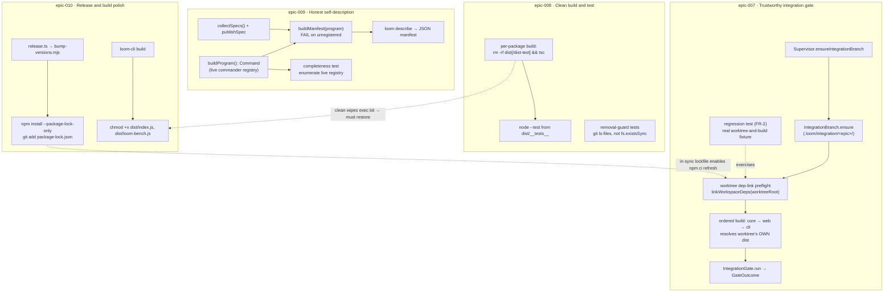

# Architecture: Trustworthy Build, Test & Integration-Gate Reliability

## Architecture Philosophy

Every defect in this PRD has the same shape: a correctness check consults **derived or stale state** instead of the **current source of truth**. The integration gate compiles against a stale symlink target; the test runner discovers compiled tests that no longer exist in source; the `describe` manifest reads a hand-maintained list rather than the live command tree; the release leaves the lockfile and executable bit lagging the bumped source. The architecture is therefore not a redesign — it is a set of surgical re-pointings, each replacing a stale oracle with the live one. Four constraints drive every decision:

1. **Judge against current source, never derived state.** Each fix swaps a stale input (parent-repo `dist`, leftover `dist/*.test.js`, a curated spec array, an un-refreshed lockfile) for the live one (the worktree's own build output, source-present tests, the live commander registry, the bumped versions). This is the unifying invariant.

2. **No guardrail may weaken (NFR-1).** Every fix that makes the gate *stop* failing sound code is paired with a proof that it *still* fails genuine regressions: the cross-package regression test (FR-2) and the registry-enumerating completeness tripwire (FR-6). A fix that cannot demonstrate the guard still bites is rejected.

3. **Four independently shippable units, two real cross-epic couplings.** Epics 007–010 touch disjoint code paths and merge independently. But two physical couplings exist and are designed for, not ignored: cleaning `dist/` before build (epic-008) *removes* the CLI executable bit, which is exactly why epic-010 must restore it; and an in-sync lockfile (epic-010) is what lets the worktree dependency-refresh (epic-007) run offline via `npm ci`. These are noted at every relevant seam.

4. **Boring, POSIX, zero new dependencies.** The toolbox is `git`, `tsc`, `npm`, `rm -rf`, and `chmod` — all already in the repo. Target is macOS/Linux dev + (currently absent) CI. No new build tool, no `tsc -b`/project-references migration, no Windows executable-bit handling, no reintroduced MCP server.

## Component Diagram



## Tech Stack

This work introduces **no new technology**. The table records the choice made *within* the existing stack for each seam.

| Layer | Choice | Rationale |
|---|---|---|
| Worktree dep resolution (FR-1) | Worktree-local workspace symlinks + ordered `tsc` (recommended) **or** `npm ci` refresh | Build order is already correct (core→web→cli); the defect is *resolution*, so the fix is local linking, not reordering. Symlink is offline/fast; `npm ci` is the heavier "refresh the install" alternative. |
| Build cleanliness (FR-3) | `rm -rf dist && tsc` per package | No `composite`/`tsBuildInfoFile` is configured and **no `.github/workflows` CI exists**, so there is no incremental-build or cache assumption to break. `rm -rf` is POSIX and already used by the root `clean` script. |
| Test runner | `node --test` over `dist/**/__tests__/**/*.test.js` (unchanged) | Existing runner stays; cleanliness comes from the build step, not a runner swap. |
| Removal-guard oracle (FR-4) | `git ls-files -- <path>` | Tracked state is the source of truth for "package removed"; disk presence conflates removal with build leftovers. |
| Manifest source (FR-5/6) | Live commander tree via `buildProgram()` factory | The registry that `loom` actually exposes is the only honest source; a hand-curated array drifts (it already dropped `publish`). |
| Lockfile refresh (FR-8) | `npm install --package-lock-only` | Rewrites `package-lock.json` to match bumped versions without touching `node_modules` — offline, fast, deterministic. |
| CLI exec bit (FR-9) | `chmod +x` build step (POSIX) | tsc emits `644`; a clean build drops the bit. A build-time `chmod` is the smallest fix; Windows is out of scope. |

## Data Models

These are the shapes the fixes read from and write to. They are TypeScript/JSON/DDL as they exist in the repo today.

```ts
// packages/loom-cli/src/describe/schema.ts — the contract `describe` must satisfy
interface CommandDescription {
  name: string;            // full path, e.g. "guard check", "publish"
  summary: string;         // → commander .description()
  whenToUse?: string;
  arguments: Array<{ name: string; type: string; required: boolean; description: string }>;
  options: Array<{ /* flags, description, ... */ }>;
  output?: { text: string };
  examples?: Array<{ command: string; description: string }>;
  exitCodes?: Array<{ code: number; meaning: string }>;
  errors?: string[];
  relationships?: { prerequisites: string[]; nextSteps: string[] };
}

interface Manifest {
  loomVersion: string;
  source: 'live-commander-registry';   // the literal claim this work must make true
  commands: CommandDescription[];       // MUST cover every node of buildProgram()
  workflows: Workflow[];
}
```

```ts
// packages/loom-core/src/orchestrator/IntegrationGate.ts — gate verdict (unchanged shape)
interface GateOutcome {
  passed: boolean;
  command: string;        // the resolved test_command run in the worktree
  exitCode: number | null;
  amputated: boolean;     // a story merge was dropped → gate fails regardless of tests
  output: string;         // tail of stdout+stderr
}
```

```yaml
# .loom/policy.yaml — the knobs the gate honors (no schema change; behavior must hold for both)
agents:
  integration_branch: rolling          # IntegrationBranch worktree at .loom/integration/<epic>/
  test_command: "npm ci && npm test"   # or "npm test"; FR-1 must make BOTH worktree-correct
```

```jsonc
// package.json shapes the release path mutates (FR-8) and the bin shape (FR-9)
// root + packages/*/package.json
{ "version": "5.3.0" }                                   // bumped by scripts/bump-versions.mjs
// packages/loom-cli/package.json
{ "bin": { "loom": "dist/index.js", "loom-bench": "dist/loom-bench.js" } } // targets must be +x
// package-lock.json (lockfileVersion 3, git-tracked) — MUST match bumped versions post-release
```

## API / Interface Contracts

The signatures of the seams each epic introduces or changes. These are the points where a producing story and a consuming story (or the regression test) must agree.

```ts
// ── epic-007 ────────────────────────────────────────────────────────────────
// New helper: makes a worktree resolve @loom-ai/* to ITS OWN freshly built dist,
// not the parent repo's stale symlink target. Invoked by loom's own build path
// (pre-build) AND by the FR-2 regression fixture, so the test exercises the real path.
function linkWorkspaceDeps(worktreeRoot: string): void;
//   creates <worktreeRoot>/node_modules/@loom-ai/{core,web} → ../../packages/{loom-core,loom-web}
//   (equivalently: the build runs `npm ci` in the worktree when the lockfile is in sync — see ADR-1)

// ── epic-008 ────────────────────────────────────────────────────────────────
// Removal-guard oracle: tracked-state absence, not disk absence.
function isTracked(repoRoot: string, relPath: string): boolean;   // `git ls-files -- relPath` non-empty
//   guards assert: assert.ok(!isTracked(REPO_ROOT, 'packages/loom-mcp'))

// ── epic-009 ────────────────────────────────────────────────────────────────
// Refactor: index.ts stops self-parsing at module scope; exposes a pure factory.
function buildProgram(): Command;          // registers every command, does NOT call .parse()
// bin entry becomes: buildProgram().parse();
function collectSpecs(): CommandDescription[];          // MUST now include publishSpec
function buildManifest(program: Command): Manifest;     // unregistered-without-spec → THROW (was: warn)
function enumerateRegisteredCommands(program: Command): string[];   // unchanged; now fed buildProgram()

// ── epic-010 ────────────────────────────────────────────────────────────────
// release.ts: after bump, before the release commit —
//   git: add `package-lock.json` to the existing pathspec
//   shell: `npm install --package-lock-only` (refresh lock to bumped versions)
// loom-cli build script gains a post-tsc step: chmod +x dist/index.js dist/loom-bench.js
```

## Security & Guardrail-Integrity Model

The dominant risk here is not exfiltration but **false confidence** — a guard that stops biting. NFR-1 makes guardrail integrity a security property.

| Threat | Vector | Control |
|---|---|---|
| Gate stops failing real regressions (false negative) | The FR-1 dep-refresh masks a genuine cross-story break by always resolving "fresh" | FR-2 regression test asserts the gate **still fails** a genuine cross-package regression, exercising the real worktree-and-build path — not a stand-in (story-007-002 AC4). |
| A command ships invisibly again | Future command registered in `buildProgram()` but absent from `collectSpecs()` | FR-6 completeness test enumerates the **live** registry and fails if any node lacks a spec; `buildManifest` upgraded from warn→throw so the manifest build itself fails closed. |
| Supply-chain drift on release | Lockfile lags bumped versions; `npm ci` later resolves unexpected trees | FR-8 refreshes and stages `package-lock.json` in the release commit; lockfile and source versions move atomically. |
| Shipping a non-runnable / wrong-bit binary | Clean build emits `dist/index.js` at `644`; `npm link` yields a non-executable `loom` | FR-9 `chmod +x` on the bin targets at build time; the linked command is runnable with no manual `chmod`. |
| Policy bypass via gate commit | `commitResolved` uses `--no-verify` | Unchanged and intentional: the gate, not a target repo's pre-commit hook, is the authoritative check. The structural policy engine (`loom guard check`) is untouched by this work. |

## ADR Log

### ADR-1 — Fix worktree dependency *resolution*, not build *order*
- **Decision:** In the integration worktree, establish worktree-local `node_modules/@loom-ai/*` symlinks (or refresh the install via `npm ci`) so dependents resolve the worktree's own freshly built `dist`. Do **not** reorder the build.
- **Context:** The root build is *already* ordered core→web→cli (`package.json`). The real defect: `.loom/integration/<epic>/` has no local `node_modules`, so `loom-cli`'s `import '@loom-ai/core'` resolves *upward* to the main repo's `node_modules/@loom-ai/core`, a symlink to `../../packages/loom-core` — the **main checkout's stale `dist`**, not the worktree's. A method added to core in story A is invisible to story B's compile.
- **Rationale:** Re-pointing resolution at the worktree's own output is the minimal change that addresses the actual cause; ordering changes would be cargo-culting and fix nothing.
- **Trade-off:** Symlink-and-order is fast and offline but reimplements a slice of npm's workspace linking; `npm ci` is the "boring" refresh but is slower and **depends on the lockfile being in sync (ADR-5 / epic-010)**. We recommend the symlink helper for the gate's hot path and document `npm ci` as the supported policy alternative.

### ADR-2 — Clean `dist/` before each build with `rm -rf dist && tsc`
- **Decision:** Each package's `build` script removes its compiled output (`loom-core` also clears `dist-test`) before invoking `tsc`.
- **Context:** `tsc` overwrites in place but never deletes orphans. A renamed/deleted `src/*.test.ts` leaves its `dist/*.test.js`, which `node --test $(find dist ...)` then runs — a ghost test passing or failing against code that no longer exists.
- **Rationale:** A clean output directory makes `dist/` a faithful projection of `src/`. Verified safe: no `composite`/`tsBuildInfoFile` is set and **no `.github/workflows` CI exists**, so nothing relies on incremental output (story-008-001 AC4 satisfied by inspection).
- **Trade-off:** Full recompile every build — slower than incremental. Acceptable: the packages are small and no incremental build was configured to begin with. This step also **wipes the CLI executable bit, mandating ADR-6.**

### ADR-3 — Removal-guards assert git-tracked absence, not disk absence
- **Decision:** Removal-guard tests (`mcpWorkspaceScrub.test.ts`, `serve.test.ts`) replace `fs.existsSync('packages/loom-mcp')` with a `git ls-files -- packages/loom-mcp` emptiness check.
- **Context:** A removed package can leave untracked build leftovers (`dist/`, `node_modules/`) on a long-lived tree. Disk-presence guards then fail even though the package is gone from version control — the dev/gate disagreement the PRD targets.
- **Rationale:** "Removed" means "no longer tracked." Querying git is querying the source of truth; querying disk conflates removal with build residue.
- **Trade-off:** Tests now shell out to `git` and assume execution inside a git checkout (already true for the suite). The guard still fails correctly if any `loom-mcp` file remains *tracked* (story-008-002 AC3).

### ADR-4 — Drive `describe` from a `buildProgram()` factory; manifest fails closed
- **Decision:** Refactor `index.ts` to expose `buildProgram(): Command` (registers all commands, no `.parse()`); the bin entry calls `buildProgram().parse()`. `buildManifest` enumerates that live program and **throws** (was: warns to stderr) on any registered command lacking a spec. Wire `publishSpec` into `collectSpecs()`. The completeness test enumerates `buildProgram()` instead of a spec-derived stand-in.
- **Context:** Today `index.ts` builds the program and self-parses at module load, so it can't be enumerated in a test. `describeCompleteness.test.ts` therefore reconstructs a program *from* `collectSpecs()` — circular: both sides derive from the curated array, so a command registered in `index.ts` but missing from the array (exactly `publish`) is never caught. `buildManifest` already enumerates the live registry but only *warns*.
- **Rationale:** Enumerating the real registry is the only check that reflects what `loom` actually exposes. Failing closed turns an ignorable warning into a build-breaking guarantee.
- **Trade-off:** Splitting construction from parsing is a non-trivial refactor of `index.ts` and a shared seam two epic-009 stories depend on (see contract). Worth it: it is the structural fix that makes invisible commands impossible, not just unlikely.

### ADR-5 — Refresh the lockfile with `--package-lock-only`
- **Decision:** `release.ts` runs `npm install --package-lock-only` after the version bump and adds `package-lock.json` to the release commit's pathspec.
- **Context:** `bump-versions.mjs` does surgical `package.json` edits and explicitly never touches the lockfile, leaving drift that a clean post-release `npm ci` would choke on.
- **Rationale:** `--package-lock-only` rewrites the lockfile to match bumped versions without mutating `node_modules` — deterministic, fast, no network install side effects mid-release.
- **Trade-off:** It assumes the registry is reachable to resolve metadata; a fully air-gapped release would need a vendored cache. Accepted — release is an online operation by nature (it opens a PR via `gh`).

### ADR-6 — Restore the CLI executable bit with a build-time `chmod +x`
- **Decision:** `loom-cli`'s build appends `chmod +x dist/index.js dist/loom-bench.js` after `tsc`.
- **Context:** `tsc` emits `644`. With ADR-2's clean build, the previously-surviving `755` bit is gone, so a freshly built `dist/index.js` is non-executable and `loom` won't run after `npm link` without a manual `chmod`.
- **Rationale:** Setting the bit at build time keeps the artifact runnable by construction and survives the clean-build step — the bit is re-derived from source intent on every build rather than checked into git and hoped to persist.
- **Trade-off:** POSIX-only; Windows ignores the bit (explicitly out of scope, NFR-4). This ADR exists *because of* ADR-2 — the two must ship such that clean-build-then-chmod is the build order.
