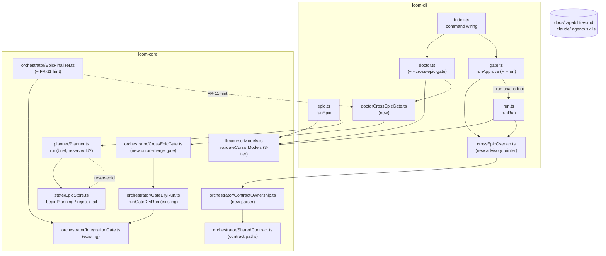

# Pre-1.0 Operator-Trust Hardening — System Architecture

## Architecture Philosophy

This epic is a polish wave, not a build-out. The architecture is therefore disciplined by what it must *not* disturb: the v1.0 stability freeze sits one merge away. Four constraints drive every decision below.

1. **One shared seam per behavior, never per call site.** `validateCursorModels` is consumed by `loom doctor`, `loom epic`, and `loom run` today. The alias tier (FR-1/FR-2) lands *inside that one function* — the three call sites keep their existing three-line `if (status==='invalid') exit; else if ('unavailable') warn;` shape. We extend `CursorModelCheck`, not the call sites. The trade-off: the shape of `CursorModelCheck` becomes load-bearing for three commands at once, so its test (`CursorModels.test.ts`) is the contract, not any one command's test.

2. **Additive only — no migration, no renamed status, no new top-level command.** Per the PRD `[ASSUMPTION]`, the reserved planning row (FR-5/FR-6) reuses the *existing* `epics` columns (`status`, `planning_phase`, `title`, `user_brief`, `error`) and the *existing* `beginPlanning`/`fail` seams. Cross-epic gating (FR-9) rides on the existing `doctor` command as a flag, exactly as `--dry-run-gate` already does. The trade-off: we accept the slightly awkward overloading of `'rejected'` (a human verdict) to also carry a quality-gate verdict (FR-6), rather than minting a new status and a migration — a freeze-appropriate trade.

3. **Advisories warn; they never fail and never block.** The alias advisory (FR-2), the cross-epic overlap notice (FR-7), and the finalizer PR hint (FR-11) all print and proceed. Only two paths exit non-zero: a *confirmed* invalid model, and `loom doctor --cross-epic-gate`'s graded exit codes (FR-10). The trade-off: an operator can ignore an advisory and hit the collision later — accepted, because the alternative (blocking on a lexical heuristic) would produce false failures, the exact failure mode this epic exists to kill.

4. **Reuse the throwaway-worktree machinery; never mutate real branches.** The cross-epic gate (FR-9) is a *second caller* of the same `git worktree add --detach` + `finally`-remove pattern that `runGateDryRun` already owns. It does not re-implement worktree lifecycle or command execution; it composes them. The trade-off: a detached union-merge worktree answers "do these branches merge and pass *together, right now*?" — not "will they pass after rebasing onto a moved main" — which is exactly the scope FR-9 promises.

## Component Diagram



## Tech Stack

No new technology is introduced. The whole point is to reuse what exists.

| Layer | Choice | Rationale |
|---|---|---|
| Language / runtime | TypeScript, Node.js 20+ | Repo standard; no change. |
| CLI | `commander` | Existing; `--run` and `--cross-epic-gate` are `.option()` additions, not new commands (FR-4, FR-9). |
| State | `better-sqlite3` (synchronous) | The synchronous insert is *why* FR-5's reservation is durable before any async refiner work — the row exists before the first `await`. |
| Schema validation | `zod` | `EpicStatusSchema` already enumerates `'rejected'`/`'failed'`; FR-6 reuses both, adds no enum member. |
| Subprocess | `node:child_process` `execFileSync` / `git()` helper | `validateCursorModels` already shells `cursor-agent --list-models`; the union gate uses the same `git()`/`gitSafe()` wrappers as `runGateDryRun`. |
| Markdown parsing | Hand-rolled line scanner (no dep) | The ownership table parser (FR-8) is a defensive line/cell splitter mirroring `parseListModelsOutput`'s "skip what doesn't match, never throw" style. Adding a markdown-AST dep for one table would violate the boring-tech constraint. |
| Tests | `node:test` + temp git repos | Existing `GateDryRun.test.ts` / `doctorDryRunGate.test.ts` pattern: real `git init` temp repos, stubbed `gate`/`--list-models`, no `cursor-agent`, no sleeps. |

## Data Models

No DDL changes. FR-5/FR-6 operate entirely on the existing `epics` table via existing `EpicStore` methods. The relevant existing columns:

```sql
-- packages/loom-core/src/state/*  (EXISTING — shown for reference, NOT a migration)
CREATE TABLE epics (
  id              TEXT PRIMARY KEY,   -- 'epic-007'
  title           TEXT NOT NULL,      -- FR-5 placeholder lives here, replaced at completePlanning
  status          TEXT NOT NULL,      -- 'planning'|'planned'|'approved'|'rejected'|'failed'|... (EpicStatusSchema)
  planning_phase  TEXT,               -- 'analyst'|'pm'|'architect' | NULL
  user_brief      TEXT,               -- the raw brief, set by beginPlanning
  reason          TEXT,               -- human reject reason (updateStatus 3rd arg)
  error           TEXT,               -- infra failure message (fail()); FR-6 gate verdict ALSO lands here
  ...
);
```

New in-memory shapes (no persistence):

```ts
// packages/loom-core/src/llm/cursorModels.ts — EXTENDED, additive fields only
export interface CursorModelCheck {
  status: 'ok' | 'invalid' | 'unavailable';   // UNCHANGED enum — alias is still 'ok'
  validModels: string[];
  invalidIds: string[];
  message: string;                              // '' on exact 'ok'; advisory text on alias 'ok'
  advisory?: boolean;                           // NEW: true only on the FR-1(b) boundary-prefix tier
}

// packages/loom-core/src/orchestrator/ContractOwnership.ts — NEW (FR-7/FR-8)
export interface OwnershipEntry {
  epicId: string;                 // 'epic-007'
  storyId?: string;               // 'story-007-003' when the row's owner cell carries one
  path: string;                   // repo-relative POSIX, backticks/annotations/prose stripped
}
export type OwnershipMap = OwnershipEntry[];   // one entry per (owner, path) pair

// packages/loom-core/src/orchestrator/CrossEpicGate.ts — NEW (FR-9/FR-10)
export interface CrossEpicGateOutcome {
  exitCode: 0 | 1 | 3;            // FR-10: 0 clean / 3 advisory / 1 operational
  conflicts: Array<{ epicA: string; epicB: string; files: string[] }>;  // non-empty => exit 3, stop
  gate?: GateOutcome;             // present only when all merges clean; ok:false => exit 3
  worktreePath: string;
  cleanedUp: boolean;
}

// crossEpicOverlap advisory (FR-7) — pure, returns lines the CLI prints
export interface Overlap { path: string; owners: Array<{ epicId: string; storyId?: string }>; }
```

## API / Interface Contracts

These are the seams independent story-agents must agree on. Signatures are exact; the worker-prompt contract (task C) restates the ownership boundaries.

```ts
// ── FR-1/FR-2 · packages/loom-core/src/llm/cursorModels.ts (story-007-001) ──
// Three-tier. Exact match → {status:'ok', message:''}. Boundary-prefix alias →
// {status:'ok', advisory:true, message:"cursor_model \"X\" matches \"X-8\"; set the
// explicit id …"}. Neither → {status:'invalid', …full list…}. 'unavailable' untouched.
export function validateCursorModels(policy: Policy, cursorBin?: string): CursorModelCheck | undefined;
// Alias rule (story-007-001 owns it): `configured` aliases `listed` IFF
// listed.startsWith(configured + '-')  — the trailing '-' enforces the boundary so
// 'claude-opus-4' does NOT match 'claude-opus-4-8-high'. ('claude-opus-4-8' matches
// 'claude-opus-4-8-high'? NO — that is also '-'-boundary-prefixed, so it WOULD alias;
// pick the SHORTEST listed alias and recommend it, or 'invalid' if zero matches.)

// Call-site contract (story-007-002) — IDENTICAL at all three sites, no special-casing:
//   if (m?.status === 'invalid') { console.error(m.message); process.exit(1); }
//   else if (m?.status === 'unavailable' || m?.advisory) { console.warn(m.message); }
// doctor.ts renders advisory as a 'warn' Check with required:false and stays exit 0.

// ── FR-5 · packages/loom-core/src/planner/Planner.ts (story-007-005) ──
async run(brief: string, reservedId?: string): Promise<PlanResult>;
// reservedId: the row runEpic already inserted via beginPlanning. When passed,
// the planner SKIPS Planner.nextEpicId() self-allocation and adopts it as runId —
// guaranteeing one allocation per submission. Default (undefined) = today's
// self-allocate-then-beginPlanning behavior (MCP path, tests).
static nextEpicId(db: Database.Database): string;   // unchanged; now the single allocator

// runEpic reserves BEFORE the refiner (story-007-005):
//   const reservedId = Planner.nextEpicId(db);
//   new EpicStore(db).beginPlanning(reservedId, brief);  // synchronous → durable pre-await
//   ... refiner ... planner.run(brief, reservedId)

// ── FR-5 · placeholder title derivation (story-007-005) ──
export function derivePlaceholderTitle(brief: string): string;
// First markdown heading (/^#{1,6}\s+(.+)$/m) trimmed, else brief.slice(0,60).
// beginPlanning keeps writing '(planning…)' for the live phase; the DERIVED title
// is written immediately after via store.completePlanning-style title update OR a
// new EpicStore.setTitle(id,title) seam owned by story-007-005 (see task C).

// ── FR-6 · gate-rejected terminal state (story-007-006) ──
// In runEpic, on (!verdict.pass && !force): instead of bare process.exit(1),
//   store.reject(reservedId, `brief gate: ${verdict.quality_score}/10 — ${firstCritiqueLine}`)
// where reject() is EpicStore.updateStatus(id,'rejected',reason)+error column, owned by 007-006.
// On refiner/planner throw: Planner's existing catch calls epicStore.fail() → 'failed' (UNCHANGED).
// --force: reserve before refiner, NEVER reject (force bypasses the gate verdict).

// ── FR-7/FR-8 · packages/loom-core/src/orchestrator/ContractOwnership.ts (story-007-007) ──
export function parseOwnershipMap(markdown: string, epicId: string): OwnershipMap;
// Finds the "File & module ownership map" heading, reads the table beneath it.
// Col 1 = owner cell (story/epic id), col 2 = path cell. Cells split on /,|·|<br>/.
// Per path: strip surrounding backticks, strip /\([^)]*\)/ annotations ((new)/(delete)),
// strip trailing prose after the path token, normalize to repo-relative POSIX.
// Unparseable row → skipped, never throws (mirrors parseListModelsOutput).
export function loadOwnershipMap(projectRoot: string, epicId: string): OwnershipMap | null;
// Reads .loom/contract/<epic-id>.md via SharedContract path convention.
// Returns null when the file is absent (shared_contract=off) — caller skips silently.

// ── FR-7 · cross-epic overlap advisory (story-007-008) ──
export function computeOverlaps(target: OwnershipMap, others: Map<string, OwnershipMap>): Overlap[];
// EXACT lexical path equality only — no glob, no dirname prefixing, no semantics.
export function renderOverlapAdvisory(overlaps: Overlap[]): string[];
// Lines framed as "lexical path match only". Empty overlaps → []. CLI prints; never exits.
// Wired into runApprove() AND at runRun() dispatch start (before supervisor.run()).

// ── FR-9/FR-10 · packages/loom-core/src/orchestrator/CrossEpicGate.ts (story-007-009) ──
export async function runCrossEpicGate(
  opts: { projectRoot: string; testCommand?: string; epics?: string[]; timeoutMs?: number },
  deps?: { gate?: Pick<IntegrationGate,'run'>; listEpicBranches?: () => string[] }
): Promise<CrossEpicGateOutcome>;
// 1. Resolve open epic branches: explicit opts.epics allowlist, else `git branch --list 'epic/*'`.
//    Zero branches → throw/return exitCode 1 (operational).
// 2. `git worktree add --detach <wt> <default-branch tip>` (reuse runGateDryRun's lifecycle).
// 3. Sequentially `git merge --no-ff <branch>`; a conflict → record per-pair files, STOP, exit 3.
// 4. All clean → run IntegrationGate.run() ONCE; ok:false → exit 3; ok:true → exit 0.
// 5. ALWAYS force-remove the worktree in finally. Real branches never mutated.

// ── FR-11 · packages/loom-core/src/orchestrator/EpicFinalizer.ts (story-007-009) ──
// After recordPrUrl(epicId, prUrl), when other epic/* branches have OPEN PRs, append a
// one-line note naming `loom doctor --cross-epic-gate`. Injectable open-PR probe for tests.
```

## Security Model

This epic widens no trust boundary; it mostly *narrows* the gap between claim and behavior. Two threats are worth naming.

| Threat | Surface | Control |
|---|---|---|
| Untrusted markdown in `.loom/contract/*.md` drives the parser (path traversal, ReDoS, crash) | FR-8 `parseOwnershipMap` | Parser is pure and total: every regex is anchored and linear; an unparseable row is skipped, never thrown. Output paths are normalized repo-relative POSIX and used only for **string comparison and display** — never opened, never executed. No `fs` access keyed on parsed paths. |
| Arbitrary command execution via the union gate | FR-9 `runCrossEpicGate` | The only command run is `policy.agents.test_command`, executed via the existing `IntegrationGate` inside a throwaway detached worktree — same trust model as `loom doctor --dry-run-gate`, which is already the sole opt-in that runs it. `git` invocations use the args-array `git()` helper (no shell). Real branches are read-only inputs; all mutation is confined to the worktree removed in `finally`. |
| Error-message leakage | FR-6 | The gate verdict written to `epics.error` is `quality_score` + the first critique line — not a stack trace; the planner-crash path keeps using `fail()` with `(err as Error).message` only, per the existing Planner contract. |

No change to the policy engine, guard, worktree isolation, or push-to-protected-branch invariants.

## ADR Log

### ADR-1 — The alias tier lives in `CursorModelCheck`, not the call sites
- **Decision:** Add an optional `advisory?: boolean` to `CursorModelCheck` and keep `status` as the unchanged three-value enum; the alias case returns `status:'ok'` with `advisory:true`.
- **Context:** FR-1(b) wants a *fourth* outcome (pass-with-warning), but FR-2 forbids per-site special-casing across `doctor`/`epic`/`run`.
- **Rationale:** `'ok'` already means "proceed." An advisory is "proceed *and* warn" — a flag on `'ok'`, not a new status. Each call site adds the advisory to its existing `'unavailable'` warn branch; `doctor` renders it as a `warn` Check. One function changes; three commands inherit it.
- **Trade-off:** A consumer that switches only on `status` silently misses the advisory. Accepted: the only consumers are these three sites, all updated in story-007-002, and `CursorModels.test.ts` pins the behavior.

### ADR-2 — `'rejected'` carries the brief-gate verdict; no new status, no migration
- **Decision:** FR-6 flips the reserved row to the **existing** `'rejected'` status with the gate verdict in the **existing** `error` column.
- **Context:** A below-threshold brief needs a clean terminal state distinct from an infra `'failed'`, but the freeze forbids schema migration and new statuses.
- **Rationale:** A quality-gate rejection *is* a rejection — semantically adjacent to a human reject. Reusing `'rejected'` + `error` avoids a migration and keeps `EpicStatusSchema` frozen. The crash path stays on `'failed'` via the Planner's existing catch.
- **Trade-off:** `'rejected'` now has two provenances (human via `reason`, gate via `error`). Mitigated by FR-6's required test that no downstream consumer mishandles the non-human verdict, and by writing the verdict to `error` (not `reason`) so the two are distinguishable.

### ADR-3 — Reserve-then-pass-id: a single allocation site
- **Decision:** `runEpic` calls `Planner.nextEpicId(db)` and `beginPlanning` *before* the refiner, then passes that id into `planner.run(brief, reservedId)`. `Planner.run` self-allocates only when `reservedId` is absent.
- **Context:** Today `Planner.run` both allocates (`nextEpicId`) *and* reserves (`beginPlanning`). Reserving earlier without refactoring would allocate twice and double-insert.
- **Rationale:** Making `reservedId` an optional parameter keeps the MCP/test path (no id passed → self-allocate) byte-compatible while the CLI submission path owns allocation exactly once. The synchronous `better-sqlite3` insert means the row is durable before the first `await`, so concurrent submissions allocate in submission order (FR-5's two-run test).
- **Trade-off:** Two callers now share responsibility for "who allocates." Documented in the signature and the contract; the default keeps the old behavior so nothing silently breaks.

### ADR-4 — Cross-epic overlap is exact lexical equality, advisory-only
- **Decision:** FR-7 compares parsed ownership paths by `===` after normalization, prints both owners, and never blocks.
- **Context:** Real collisions are mechanical (two stories editing the same file). Semantic/glob analysis is explicitly out of scope.
- **Rationale:** Exact-string comparison is total, fast, and false-positive-free for the case that bites (identical paths). It cannot misfire on a directory prefix or a glob, so framing it "lexical-only" is honest. A missing contract (`shared_contract=off`) is skipped, never an error.
- **Trade-off:** Two stories touching the *same directory* via different filenames won't be flagged. Accepted: that is not a mechanical conflict, and inferring it would reintroduce the false-failure mode this epic kills.

### ADR-5 — The cross-epic gate is a second caller of the throwaway-worktree pattern, on `doctor`
- **Decision:** `--cross-epic-gate` is an option on the existing `doctor` command; `runCrossEpicGate` composes the same `git worktree add --detach` + `finally`-remove lifecycle `runGateDryRun` owns, and the same `IntegrationGate.run()`.
- **Context:** FR-9 needs union-merge + one suite run; FR-10 needs graded exit codes; the freeze forbids a new top-level command and a re-implemented runner.
- **Rationale:** The worktree lifecycle and command-execution semantics (timeout, kill, output tail) already exist and are tested. Reusing them means the cross-epic gate inherits all of it instead of re-deriving it, and `doctor` is where the sibling `--dry-run-gate` opt-in already lives — operators look there.
- **Trade-off:** A detached union worktree validates "merge + pass together *now*," not against a future moved `main`. That is the scope FR-9 promises; a rebase-aware gate is deliberately out of scope.

### ADR-6 — Hand-rolled, total contract parser over a markdown-AST dependency
- **Decision:** FR-8's parser is a defensive line/cell scanner with no new dependency; unparseable rows are skipped.
- **Context:** The ownership table is a known, narrow shape (real epics 001–006 use the `·` delimiter); a malformed row must never be fatal.
- **Rationale:** A markdown-AST dep is heavy for one table and would still need the same cell-splitting/stripping afterward. The scanner mirrors `parseListModelsOutput`'s proven "match the shape or skip it" idiom, and fixtures lifted from the real contracts pin it.
- **Trade-off:** Exotic markdown (nested tables, HTML beyond `<br>`) parses loosely or is skipped. Accepted: the input is loom's own generated contracts, whose format the Architect persona controls.

Proceeding is task B (per-story tech notes) and task C (the shared contract). Say the word and I'll produce them — though note I'm in Ask mode, so I'm delivering these as documents in the response rather than writing any files.
