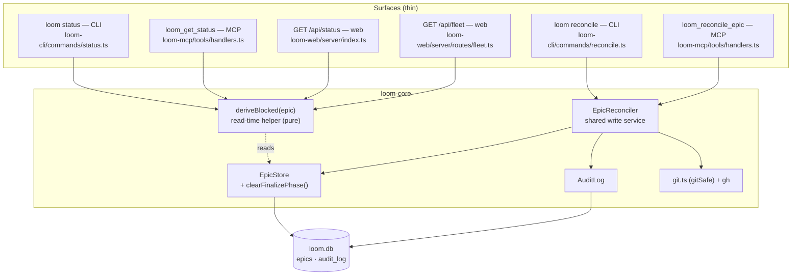

# Architecture — Finalize Reconciliation & Gate-Block Surfacing (epic-008)

## Architecture Philosophy

This epic adds two operator-facing capabilities — a derived `blocked` indicator (read) and a `reconcile` command (write) — onto loom's existing epic lifecycle. The design is driven by four constraints:

1. **The data already exists; don't store more.** A gate-blocked epic is *already* representable in the DB: `EpicFinalizer.finalize()` leaves `status='in_progress'` with `finalize_phase='gate'` when `integration_gate=block` fails (`EpicFinalizer.ts:507` calls `updateStatus(epicId,'in_progress',…)`, which does **not** clear `finalize_phase`). The `blocked` signal is therefore *derived at read time* from those two columns — never persisted. A stored boolean would be a third source of truth that drifts from `status`.
2. **Additive, never breaking.** `blocked` / `blocked_reason` are new response fields. The `status` string contract is untouched on all four surfaces, and the `loom run` resume candidate set (`Supervisor.selectEpics`, `RUNNABLE = {approved, in_progress}`) is byte-identical for the same DB state (NFR-2, NFR-3).
3. **One core service, thin surfaces.** Both write entry points (`loom reconcile` CLI, `loom_reconcile_epic` MCP) wrap a single `EpicReconciler`, exactly as `loom revert` / `loom_revert_epic` both wrap `EpicReverter`. No reconcile logic lives on a surface.
4. **Fail closed; a "merge" is a claim that must be verified.** Reconcile never assumes merged. It verifies via `gh` (PR-URL path) or `git` ancestry, and any tool/availability error *refuses* rather than guessing. The `done ⇒ epic_pr_url != null` invariant the finalizer's done-gate already upholds (`Supervisor.finalizeAndGateDone`, `EpicFinalizer.ts:706`) is preserved by writing `epic_pr_url` before any `done` write.

A consequence worth stating up front: **no schema migration.** Both capabilities use existing columns (`epics.status`, `epics.finalize_phase`, `epics.epic_pr_url`) and one new `audit_log.action` value. `SCHEMA_VERSION` stays at 18.

## Component Diagram



The read path (left) is a pure function fanned out to four call sites. The write path (right) is one service with two verification strategies. They share `EpicStore` but never each other.

## Tech Stack

| Layer | Choice | Rationale |
|---|---|---|
| Language / runtime | TypeScript, Node 20+ | Existing stack; no change. |
| State | `better-sqlite3` (synchronous) | Existing. Synchronous writes make the FR-9 ordered-write sequence trivially observable in-order without transactions or async races. |
| Merge verification (PR path) | `gh pr view <url> --json state,headRefName,baseRefName` via `execFileSync` (arg array, no shell) | `gh` is the authoritative source for PR merge state + refs; arg arrays prevent injection from the operator-supplied URL. |
| Merge verification (ancestry path) | `git merge-base --is-ancestor` via existing `gitSafe()` (`orchestrator/git.ts`) | Boring, offline-capable, already the repo's git wrapper. Returns `{ok, output}` instead of throwing — natural fit for fail-closed branching. |
| Derived signal | Pure function `deriveBlocked()` in loom-core | No I/O, trivially unit-testable, importable by all four surfaces. |
| CLI | `commander` | Existing; one new `program.command('reconcile')`. |
| MCP | `@modelcontextprotocol/sdk` | Existing; one new entry in `TOOL_DEFINITIONS` + `HANDLERS`. |
| New dependencies | **none** | No library justifies itself here. |
| Schema | **no migration** | Uses existing columns; one new audit action string. |

## Data Models

No DDL changes. The relevant existing columns (`Database.ts`, `types.ts`):

```sql
-- epics (existing, abbreviated to the columns this epic reads/writes)
CREATE TABLE epics (
  id              TEXT PRIMARY KEY,
  status          TEXT NOT NULL,          -- 'in_progress' for a gate-blocked epic
  finalize_phase  TEXT,                   -- 'gate' when blocked at the integration gate; NULL otherwise
  epic_pr_url     TEXT,                   -- the PR of record; MUST be non-null before any 'done' write
  base_sha        TEXT,
  yaml_path       TEXT,
  reason          TEXT,
  error           TEXT
  -- … unchanged …
);
```

`FinalizePhase` (unchanged) = `'merging' | 'gate' | 'review' | 'pushing' | 'opening_pr'`.

### Derived `blocked` signal (computed, never stored)

```ts
// loom-core: new module, e.g. orchestrator/blockedIndicator.ts
export interface BlockedSignal {
  blocked: true;
  blocked_reason: 'integration_gate';
}

/** The ONLY rule. Returns null for every other epic state — normal in_progress,
 *  finalizing, planning, done, failed, rejected. Pure; reads two fields. */
export function deriveBlocked(
  epic: Pick<EpicRecord, 'status' | 'finalize_phase'>
): BlockedSignal | null {
  return epic.status === 'in_progress' && epic.finalize_phase === 'gate'
    ? { blocked: true, blocked_reason: 'integration_gate' }
    : null;
}
```

### `epic_reconciled` audit row (new action; existing table)

```jsonc
// audit_log row written by EpicReconciler on a verified merge (FR-9 step 3)
{
  "action": "epic_reconciled",
  "command": "epic-003",          // the epic id
  "allowed": true,
  "detail": {
    "path": "pr-url",             // "pr-url" | "ancestry"
    "pr_url": "https://github.com/…/pull/6",
    "verified_via": "gh pr view",
    "head_ref": "epic/epic-003",
    "base_ref": "main"
  }
}
```

### New `EpicStore` method (code, not schema)

```ts
/** Sets finalize_phase = NULL without touching status. Needed for the ordered
 *  reconcile write (FR-9 step 2) — updateFinalizePhase() only sets a non-null
 *  phase; fail()/reject() clear it but also change status. */
clearFinalizePhase(id: string): void;
```

## API / Interface Contracts

### Read seam — four surfaces, one helper

Every surface that currently emits epic-level fields gains an additive spread of `deriveBlocked(epic)`. None expose raw `finalize_phase` for a non-gate `in_progress` epic (FR-4).

```ts
// 1. MCP loom_get_status — handlers.ts renderEpic(), beside the existing
//    finalize_phase spread (handlers.ts:391). The existing line keeps gating
//    finalize_phase to status==='finalizing', so a normal in_progress epic
//    still exposes neither field.
...(deriveBlocked(epic) ?? {}),

// 2. CLI loom status — status.ts. Human tree: a "blocked: integration_gate"
//    line under the epic header. --json path (collectJsonEpics): add the
//    blocked fields to JsonEpic.

// 3. web GET /api/status — index.ts rollupEpics(): spread into the EpicStatus
//    object (the rollup omits finalize_phase entirely, so this is the only
//    phase-derived field it carries).

// 4. web GET /api/fleet — routes/fleet.ts buildProjectCards(): spread into
//    the FleetCard object.
```

The shared response shape these four agree on (pinned in the implementation contract):

```ts
// additive, optional, present ONLY for an in_progress + gate epic
blocked?: true;
blocked_reason?: 'integration_gate';
```

### Write seam — `EpicReconciler` (shared core service)

```ts
// loom-core: new orchestrator/EpicReconciler.ts — mirrors EpicReverter.
export interface EpicReconcilerOptions {
  projectRoot: string;
  db: Database.Database;
  /** Base branch the epic merges into. Default 'main' (FR-6/FR-7). Injectable for tests. */
  baseBranch?: string;
  /** Override binaries for tests. */
  gitBin?: string;   // default 'git'
  ghBin?: string;    // default 'gh'
}

export type ReconcileStatus = 'reconciled' | 'noop' | 'refused' | 'failed';

export interface ReconcileResult {
  status: ReconcileStatus;
  epicId: string;
  prUrl?: string;
  /** Set on 'refused' — lets the surface distinguish offline from not-merged (FR-8). */
  reason?:
    | 'not_merged'           // gh says state != MERGED, or ancestry says not an ancestor
    | 'unverifiable_offline' // gh/git ran but could not reach a verdict (network)
    | 'tool_unavailable'     // gh/git binary missing
    | 'ref_mismatch'         // PR head/base != epic/<id> / base (FR-6)
    | 'no_epic_branch'       // ancestry path: epic/<id> doesn't exist locally
    | 'epic_not_found';
  /** Human-readable; carries the squash-merge --pr hint on ancestry false-negatives (FR-12). */
  note: string;
}

export class EpicReconciler {
  constructor(opts: EpicReconcilerOptions);
  reconcile(epicId: string, opts?: { prUrl?: string }): ReconcileResult;
}
```

**Control flow inside `reconcile()`:**

1. **Load + idempotency (FR-11).** `epicStore.get(epicId)`; if missing → `refused/epic_not_found`. If `status==='done'` **or** `epic_pr_url != null` → `{status:'noop'}`, no re-record, no verification.
2. **Verify merge (fail closed):**
   - *PR-URL path* (`opts.prUrl` set, FR-6): `execFileSync(gh, ['pr','view', url, '--json','state,headRefName,baseRefName'])`. `ENOENT` → `refused/tool_unavailable`; other throw → `refused/unverifiable_offline`. `state !== 'MERGED'` → `refused/not_merged`. `headRefName !== 'epic/'+epicId || baseRefName !== baseBranch` → `refused/ref_mismatch`.
   - *Ancestry path* (no URL, FR-7): if `git rev-parse --verify refs/heads/epic/<id>` fails → `refused/no_epic_branch`; `gitSafe(['merge-base','--is-ancestor','epic/<id>', baseBranch])` — `ok` ⇒ merged; not-ok with a clean git ⇒ `refused/not_merged` **with the squash-merge `--pr <url>` hint** (FR-12); git missing ⇒ `tool_unavailable`.
3. **Ordered write on verified merge (FR-9 / NFR-1 / NFR-4), exactly:**
   1. `epicStore.recordPrUrl(epicId, prUrl)` *(ancestry path: the resolved PR URL if known, else the merge-base SHA marker — see ADR-6 trade-off)*
   2. `epicStore.clearFinalizePhase(epicId)`
   3. `audit.record({ action:'epic_reconciled', command: epicId, allowed:true, detail:{…} })`
   4. `epicStore.updateStatus(epicId, 'done')`
   → return `{status:'reconciled', prUrl, note}`.

### CLI + MCP wrappers (FR-5)

```ts
// loom-cli/commands/reconcile.ts — registered in index.ts:
//   loom reconcile <epic-id> [--pr <url>]
program.command('reconcile')
  .argument('<epic-id>')
  .option('--pr <url>', 'PR URL to verify via gh (squash-merged epics REQUIRE this)')
  .action((epicId, opts) => runReconcile(epicId, { pr: opts.pr }));

// loom-mcp: TOOL_DEFINITIONS entry + HANDLERS['loom_reconcile_epic']
//   inputSchema: { epic_id (required), pr_url? }
```

Both construct `new EpicReconciler({ projectRoot, db })` and return/print `ReconcileResult` verbatim. Identical outcomes for identical inputs is structural — there is exactly one `reconcile()` implementation.

## Security Model

| Threat | Control |
|---|---|
| Command injection via the operator-supplied `--pr <url>` or epic id | All shell-outs use `execFileSync(bin, [args])` / `gitSafe()` — argument arrays, never a shell string. No interpolation into a command line. |
| A **false `done`** — recording an epic as merged when it isn't | Verification is mandatory and fail-closed (FR-8/FR-10): `gh`/`git` must return an affirmative merged verdict. Any missing-tool, offline, or non-merged result *refuses*. The signal is never inferred from DB state alone. |
| Recording the **wrong PR** against an epic | PR-URL path enforces `headRefName === epic/<id>` and `baseRefName === base` (FR-6) before any write — a merged-but-unrelated PR is rejected as `ref_mismatch`. |
| Silent / automated state change | No background reconciler (explicitly out of scope). Reconcile only runs on explicit operator invocation, and every success writes an `epic_reconciled` audit row before returning (NFR-4) — the same audit-before-return invariant the rest of loom upholds. |
| Blast radius | Reconcile performs **no remote mutation** — it does not push, open, or close anything. It is a local DB + audit write gated on a read-only `gh`/`git` probe. (Contrast `EpicReverter`, which can delete remote refs.) |

## ADR Log

### ADR-1 — Derive `blocked` at read time; never store it
- **Decision:** Compute `blocked` / `blocked_reason` from `(status, finalize_phase)` in a pure helper at every read surface. Add no column.
- **Context:** The block-mode gate path (`EpicFinalizer.ts:507`) already leaves `status='in_progress'` + `finalize_phase='gate'`. The information needed for the signal is fully present.
- **Rationale:** A stored boolean is a third source of truth that can disagree with `status`/`finalize_phase` after a crash or a resume. Deriving guarantees the signal can never contradict the lifecycle, and keeps NFR-3 (no resume drift) free — nothing new is written.
- **Trade-off:** Four call sites must remember to call the helper; we accept that (and pin the field shape in the implementation contract) in exchange for zero drift and zero migration.

### ADR-2 — One `EpicReconciler`; CLI and MCP are thin wrappers
- **Decision:** Put all reconcile logic in `loom-core/orchestrator/EpicReconciler.ts`; `loom reconcile` and `loom_reconcile_epic` only marshal arguments and render the result.
- **Context:** loom already does this for teardown (`EpicReverter` ← `loom revert` / `loom_revert_epic`).
- **Rationale:** Two surfaces with copy-pasted verification logic would inevitably diverge on edge cases (offline handling, idempotency). FR-5 demands identical outcomes; a single implementation makes that structural rather than tested-by-hope.
- **Trade-off:** One extra indirection layer for surfaces that are individually trivial. Worth it for the single-source-of-truth guarantee.

### ADR-3 — Fail closed, with two verification strategies
- **Decision:** Verify via `gh pr view` (PR-URL path) or `git merge-base --is-ancestor` (ancestry path). Treat *every* tool-missing / offline / non-affirmative result as a refusal.
- **Context:** The stranded epic-003 was merged via PR 6 outside the finalize flow; the operator knows the PR. Other epics may be merged with the branch still present locally.
- **Rationale:** The cost of a false `done` (an epic wrongly marked complete, breaking the `done ⇒ epic_pr_url` invariant) is far higher than the cost of an occasional false refusal the operator can re-run.
- **Trade-off:** A squash-merged epic false-negatives on the ancestry path (the branch tip is not an ancestor of base). Mitigated by ADR-6's `--pr` hint, not by loosening the check.

### ADR-4 — Ordered write preserving `done ⇒ epic_pr_url != null`
- **Decision:** On a verified merge, write in this exact order: (1) `recordPrUrl`, (2) `clearFinalizePhase`, (3) `epic_reconciled` audit row, (4) `updateStatus('done')`.
- **Context:** The finalizer's done-gate (`Supervisor.finalizeAndGateDone`) already establishes that `epic_pr_url` must be durable before `done`; reconcile is a second writer into the same terminal state and must honor the same invariant (NFR-1).
- **Rationale:** A crash between any two steps leaves a *safe* state: after step 1 the epic is still `in_progress` (not `done`) with a PR URL recorded; `done` is only reachable after the URL and audit row are durable. better-sqlite3's synchronous writes make the ordering real, not best-effort.
- **Trade-off:** Four separate statements rather than one transaction. Acceptable: ordering (not atomicity) is what protects the invariant, and a partial sequence is recoverable by re-running reconcile (which is idempotent — ADR-5).

### ADR-5 — Idempotent noop on already-resolved epics
- **Decision:** If the epic is already `done` or already has a non-null `epic_pr_url`, reconcile returns `noop` without verifying or re-recording. Applied identically in CLI and MCP (they share the service).
- **Context:** FR-11's open idempotency question, resolved as noop.
- **Rationale:** Re-recording would write a duplicate `epic_reconciled` row and could overwrite the PR of record. A noop makes reconcile safe to run repeatedly (e.g. a retry after a flaky `gh`).
- **Trade-off:** Reconcile cannot *re-point* an epic at a corrected PR URL. That's intentional — repointing is a destructive correction that belongs to `revert` + re-finalize, not to reconcile.

### ADR-6 — Strict head/base ref match on the PR-URL path
- **Decision:** The PR-URL path records `done` only if the PR's `headRefName === epic/<id>` and `baseRefName === base` (default `main`).
- **Context:** An operator could paste any merged PR URL; without a ref check, reconcile would happily mark an epic done against an unrelated PR.
- **Rationale:** The ref match ties the verified merge to *this* epic's branch, which is the whole point of "verify before recording."
- **Trade-off:** An epic whose branch was renamed before merge will `ref_mismatch` and require manual handling. We keep the base comparison hardcoded to `main` (per FR-6) rather than deriving the repo's default branch — boring and predictable; revisit only if a non-`main` base becomes real. For the ancestry path, when no PR URL is known the recorded `epic_pr_url` is a merge marker (the merge-base SHA), since the invariant requires a non-null value and the operator chose not to supply a URL.
