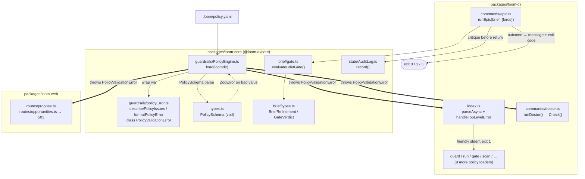

# Architecture — Legible Failure for Invalid Policy and a Clear Brief-Quality Gate

## Architecture Philosophy

This work fixes two failure-mode papercuts. It touches presentation and control flow only — never scoring, enforcement, or guardrail semantics. Four constraints drive every decision below.

1. **`loom-core` stays a pure library.** The load path and gate evaluator live in `@loom-ai/core`, which is consumed by the CLI *and* the web server (`packages/loom-web/src/server/routes/*`). Core must not call `process.exit` or write to the console — it raises typed errors and returns verdicts; each surface decides how to present them. This is what lets the same fix serve all 12 policy-loading CLI commands and the two web routes without duplication.
2. **One render, many consumers — render where the data is, present at the boundary.** FR-3 and FR-4 demand that the load path and the doctor produce *identical* detail. The only way to guarantee no drift is a single render function in core, consumed by the CLI boundary, the doctor, and the web routes alike.
3. **Friendly for the operator's mistakes, loud for ours.** A policy *validation* error is the operator's config bug and gets a structured, stack-trace-free message. Any *other* thrown error is presumed to be a loom bug and keeps its stack trace — masking it would trade one legibility problem for a worse one (NFR-1 covers validation errors specifically, not all errors).
4. **Communication changes, not outcomes.** The gate's three outcomes already exist in the data (`quality_score` vs. `threshold`, and `ready`); today two of them render identically. We make them *distinguishable* — a new discriminant and exit code — while the decision each reaches (plan / don't plan) is byte-for-byte the one reached today (NFR-4).

## Component Diagram



The two epics are independent: epic-011 lives entirely on the `policy.yaml → PolicyEngine.load → PolicyValidationError` path plus the doctor; epic-012 lives entirely on the `epic.ts → evaluateBriefGate` path. They share no files (see the companion contract document), so either can ship alone.

## Tech Stack

No new dependencies. The architectural decision here is deliberately *not* to add one — every capability needed already exists in the stack. Adding a logging or error-formatting library to render a `ZodError` would be novelty for its own sake.

| Layer | Choice | Rationale |
|---|---|---|
| Language / runtime | TypeScript, Node.js 20+ | Existing; no change. |
| Schema / validation | `zod` (`PolicySchema` in `types.ts`) | The `ZodError.issues[]` array already carries field path, received value, and (for enums) allowed `options`. We *render* it; we add no validation. |
| Config parsing | `js-yaml` (`yaml.load` in `PolicyEngine.ts`) | Unchanged. Parse errors remain out of scope (see Security Model). |
| Error transport | A typed `Error` subclass (`PolicyValidationError`) | Boring, zero-dep, instanceof-checkable at every boundary. |
| State / audit | `better-sqlite3` via `state/AuditLog.ts` | Synchronous insert preserves the "logged before returning" ordering invariant for the gate critique. |
| CLI framework | `commander` (`index.ts`) | `parseAsync()` already surfaces async action rejections to one top-level catch. |
| Tests | `node:test` + the `capture()` helper in `packages/loom-cli/src/__tests__/` | Intercepts `console.*` and `process.exit`; the established way to assert output + exit code. |

## Data Models

### Policy error (new — `packages/loom-core/src/guardrails/policyError.ts`)

```typescript
/** One invalid knob, derived from a single zod issue. No new validation —
 *  every field is read off the existing ZodError.issues[] entry. */
export interface PolicyIssue {
  fieldPath: string;     // dotted path, e.g. "agents.review_strategy"
  received: unknown;     // the value the operator wrote
  constraint: string;    // human render of allowed values / bound,
                         //   e.g. "one of: off, comment, block-and-revise"
                         //   or  "integer between 1 and 10"
  hint: string;          // one-line fix hint, e.g.
                         //   "Set agents.review_strategy to one of the allowed values."
}

/** Thrown by PolicyEngine.load on a *validation* (not parse/IO) failure.
 *  .message is the full multi-line FR-1 render; .issues is the structured form. */
export class PolicyValidationError extends Error {
  readonly policyPath: string;   // absolute path to .loom/policy.yaml
  readonly issues: PolicyIssue[];
}
```

### Brief gate verdict (extended — `packages/loom-core/src/brief/types.ts`)

```typescript
export type GateOutcome =
  | 'pass-clean'              // quality_score >= threshold && ready === true
  | 'pass-with-clarifications'// quality_score >= threshold && ready === false
  | 'below-threshold';        // quality_score <  threshold

export interface GateVerdict {
  outcome: GateOutcome;       // NEW — the discriminant the CLI branches on
  pass: boolean;              // KEPT — equals (outcome === 'pass-clean') for back-compat
  ready: boolean;
  quality_score: number;
  threshold: number;
}
```

`BriefRefinement` (existing, unchanged) remains the source of `ready`, `quality_score`, `questions[]`, and `critique{}`. The `outcome` is derived purely from `quality_score`, `threshold`, and `ready` — no new fields on the refiner.

### Doctor check (existing — reused as-is, `packages/loom-cli/src/commands/doctor.ts`)

```typescript
interface Check { name: string; ok: boolean; detail: string; required: boolean; }
```

The new policy check is one more `Check` with `required: true`; `detail` carries a condensed render from the same `PolicyIssue[]`.

### Exit-code map (documented in each command's `spec.exitCodes`)

| Command | Code | Meaning | Status |
|---|---|---|---|
| any policy loader | `1` | Policy validation failed — friendly message, no stack trace | new behavior, same code |
| `doctor` | `1` | A required check (now incl. policy) failed | unchanged code |
| `epic` | `0` | Pass-clean — planning proceeded | unchanged |
| `epic` | `1` | Below-threshold (or not-init / LLM error) | **unchanged (FR-8)** |
| `epic` | `3` | **Pass-with-clarifications** — distinct from below-threshold | new |

Exit `2` is avoided for the gate: it already carries a "blocked-with-feedback (Claude Code hook protocol)" meaning in `commands/guard.ts`, and reusing it would muddy that convention.

## API / Interface Contracts

These are the seams the stories must agree on; the companion contract document carries the authoritative copy.

```typescript
// packages/loom-core/src/guardrails/policyError.ts  (story-011-001)
export function describePolicyIssues(err: ZodError): PolicyIssue[];
export function formatPolicyError(policyPath: string, issues: PolicyIssue[]): string;
export class PolicyValidationError extends Error { /* see Data Models */ }

// packages/loom-core/src/guardrails/PolicyEngine.ts  (story-011-002)
// Signature UNCHANGED. Behavior: catches ZodError from PolicySchema.parse,
// wraps it via describePolicyIssues + formatPolicyError into a
// PolicyValidationError, and throws that instead of the raw ZodError.
static load(loomdir: string): PolicyEngine;

// packages/loom-cli/src/index.ts  (story-011-002)
// Single top-level boundary: parseAsync().catch(handleTopLevelError).
// PolicyValidationError -> print err.message to stderr, process.exit(1).
// Anything else -> rethrow (keep the stack trace; it's a loom bug).
function handleTopLevelError(err: unknown): never;

// packages/loom-core/src/brief/gate.ts  (story-012-001)
// Signature UNCHANGED. Now also computes `outcome`; `pass` keeps its meaning.
export function evaluateBriefGate(
  refinement: Pick<BriefRefinement, 'ready' | 'quality_score'>,
  minScore: number,
): GateVerdict;
```

**Doctor consumption (story-011-003):** the doctor calls `PolicyEngine.load(loomDir)` inside a `try/catch`; on `PolicyValidationError` it pushes `{ name: 'policy', ok: false, required: true, detail: <render of e.issues> }`. It must *not* let the error escape — that would reintroduce the crash the epic is removing.

**Gate presentation (story-012-001 / 012-002):** `runEpic` in `commands/epic.ts` switches on `verdict.outcome`:
- `pass-clean` → existing `console.log("Brief scored …Proceeding.")`, proceed to planning, exit 0.
- `below-threshold` → existing `console.error` rejection block, `process.exit(1)` — untouched.
- `pass-with-clarifications` → new clearly labeled `console.log` block (questions listed as *optional*, names the `--force` flag verbatim), `process.exit(3)`.

`--force` continues to bypass all three branches and proceed to planning, writing the existing `brief_gate_forced` audit row before the planner runs.

## Security Model

The policy engine is a guardrail; "make the error friendly" must not become "make the invalid policy easier to load." Threats and controls:

| Threat | Control |
|---|---|
| Friendly handling silently falls back to default policy on an invalid value, weakening enforcement (NFR-3) | `PolicyEngine.load` still calls `PolicySchema.parse` and still **throws** on a bad value. The only change is *which* error type is thrown. There is no new `catch`-and-default path. A story-level test asserts an invalid policy never yields a usable `PolicyEngine`. |
| The catch-all boundary swallows real loom bugs, hiding regressions | `handleTopLevelError` special-cases **only** `instanceof PolicyValidationError`; every other error is rethrown with its stack intact (Philosophy #3). |
| Doctor's policy check throws and crashes the doctor (regressing the very crash we fix) | Doctor wraps `load` in `try/catch` and converts the error to a failed `Check`; it never rethrows. |
| Error message discloses sensitive data | The render echoes only the operator's own `fieldPath` + `received` value from their own `.loom/policy.yaml`; no secrets, environment, or filesystem content beyond the policy path are surfaced. |
| Gate change weakens the quality bar or loses the audit trail | Scoring/threshold/force semantics are untouched (NFR-4); the critique is written via `AuditLog.record()` **before** the command returns or exits, preserving NFR-2 and the "all agent actions logged" invariant. New per-outcome audit writes are additive — more logging, never less. |

Out of scope by design: **malformed/missing** policy files (unparseable YAML, absent file). `yaml.load` failures and the existing `fs.existsSync → default` path are a different failure class (FR targets validation errors). If a YAML parse error proves trivially adjacent at implementation, it may reuse the boundary, but it is not a requirement.

## ADR Log

### ADR-1 — Throw a typed `PolicyValidationError` from the load path; render at the CLI boundary
**Decision.** `PolicyEngine.load` catches the `ZodError`, wraps it into a `PolicyValidationError` (carrying both the rendered message and structured `issues`), and throws that. The CLI prints it stack-trace-free at a single top-level catch in `index.ts`; the web routes read `err.message` for their 503.
**Context.** FR-3 wants the friendly render "at the shared load/validate path so every command benefits." But `loom-core` is also consumed by `loom-web`, which wants a 503, not a `process.exit`. 12 CLI commands call `load`.
**Rationale.** A typed error renders once (in core, where the `ZodError` lives) and is presented once per surface (CLI boundary, web route). "Every command benefits" is satisfied by *one* catch in `index.ts`, not by wrapping 12 call sites.
**Trade-off.** Adds a top-level `parseAsync().catch()` to `index.ts`, which previously had none. We accept a small change to the entry point in exchange for keeping core pure and the fix DRY.

### ADR-2 — A single shared renderer in `loom-core`, consumed by the boundary, the doctor, and the web routes
**Decision.** `describePolicyIssues` + `formatPolicyError` live in `packages/loom-core/src/guardrails/policyError.ts` and are re-exported from the core index.
**Context.** FR-4 requires the doctor's detail to not drift from the load-path message.
**Rationale.** The only structural guarantee against drift is a single function with one set of consumers. Putting it in the CLI would make it unreachable from `loom-web`; putting it in core makes it reachable from all three.
**Trade-off.** `loom-core` now owns operator-facing English strings (the fix hints), which sits slightly awkwardly in a "pure logic" library. We judge the no-drift guarantee worth that smell, and keep the *presentation choices* (full block vs. condensed) at each consumer.

### ADR-3 — Derive allowed-values by switching on `ZodError` issue codes; add no validation
**Decision.** `describePolicyIssues` maps each `issue` by `issue.code` — `invalid_enum_value` → its `options`, `too_small`/`too_big` → its bound — into a `PolicyIssue`.
**Context.** The PRD's standing assumption: the structured message is a *render* of the existing zod error, which already exposes path, received value, and expected values.
**Rationale.** Reusing zod's own issue taxonomy means zero new validation logic and zero chance of the message disagreeing with what `parse` actually rejected.
**Trade-off.** The renderer is coupled to zod's issue-code shape; a future zod major that renames codes would require a render update. Acceptable — zod is already load-bearing across the schema layer, so we are not taking on a *new* dependency risk.

### ADR-4 — Model the gate's three outcomes as a discriminant on `GateVerdict`, keeping `pass`
**Decision.** Add `outcome: GateOutcome` to `GateVerdict`; keep `pass` as `outcome === 'pass-clean'`.
**Context.** Today `pass = ready && score >= threshold`. A brief that scores at/above threshold but has open questions (`ready: false`) collapses into `pass: false` and renders identically to a below-threshold reject — the exact bug.
**Rationale.** A discriminant lets `epic.ts` branch cleanly into three presentations without any caller that only reads `pass` having to change.
**Trade-off.** `GateVerdict` carries two overlapping fields (`pass` and `outcome`). We accept the minor redundancy to avoid a breaking signature change to `evaluateBriefGate` and its existing callers/tests.

### ADR-5 — Assign exit code `3` to pass-with-clarifications
**Decision.** Pass-with-clarifications exits `3`; below-threshold stays `1`; pass-clean stays `0`. Documented in `epic`'s `spec.exitCodes`.
**Context.** FR-7 requires an exit status *distinct* from the below-threshold failure (`1`). There is no central exit-code enum; codes are per-command literals.
**Rationale.** `3` is unused by `epic`, unambiguously not the `1` reject code, and avoids `2`, which already means "blocked-with-feedback" in `commands/guard.ts`. Documenting it in the command spec keeps `loom describe` and the help text honest.
**Trade-off.** Expands `epic`'s exit-code surface from {0,1} to {0,1,3}. Any script that treated "non-zero = failure" still works; only scripts that branch on the *specific* code need awareness — and they now have a documented code to branch on, which is the point.

---

That completes Headless task A. The architecture keeps the two papercut fixes on fully separate file paths (core guardrails + doctor for epic-011; core brief + epic command for epic-012), routes every policy error through one renderer to satisfy the no-drift requirement, and preserves enforcement, scoring, and audit semantics exactly — the only changes are the *type* of error thrown and the *outcome label + exit code* the gate communicates.
