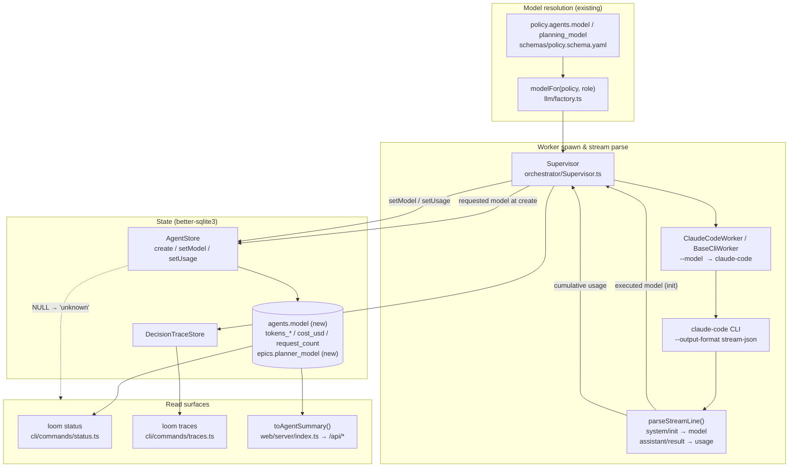

# Worker Model Attribution & Accurate Token Telemetry — System Architecture

## Architecture Philosophy

This work closes two observability defects found while dogfooding loom. Both fixes are **additive and read-mostly**: they add columns and surface existing-but-lost signal. They must not perturb cost, guardrails, or write paths. Four constraints drive every decision below.

1. **Additive-only persistence; never rewrite history.** The schema layer (`Database.ts`) already uses idempotent `ALTER TABLE … ADD COLUMN` guarded by `PRAGMA table_info`. New columns must follow that exact pattern. Pre-migration rows keep `NULL`; misclassifying an old row to a model is worse than admitting `unknown`. This is a hard NFR (NFR-1, FR-6).
2. **Cost is sacred; tokens are telemetry.** `cost_usd` is the backend-reported authoritative figure and must remain byte-for-byte unchanged. The token-harvest fix touches `usage` accumulation only — it must not pass through, recompute, or re-derive cost (NFR-2). The two are persisted by the same call (`AgentStore.setUsage`) but are independent fields.
3. **One signal, one seam.** Model id and token usage already flow through a single parsed-event channel out of the worker (`parseStreamLine` → `WorkerResult`) and a single persistence call per concern (`setModel`/`setUsage`). Surface the model through the existing display seams (`toAgentSummary` for web, the inline renderer in `status.ts` for CLI) rather than inventing new ones. The trade-off: CLI and web do not share a formatter today, so model display must be added in both places — that divergence is pre-existing and out of scope to unify here.
4. **The fix follows the evidence, not the hypothesis.** The token under-count has a leading suspect (below), but the harvest investigation (story-014-001) must confirm root cause before changing code, and the regression test (story-014-002) locks whatever the cumulative truth turns out to be.

## Component Diagram



## Tech Stack

| Layer | Choice | Rationale |
|---|---|---|
| Language / runtime | TypeScript, Node.js 20+ | Existing codebase; no new toolchain. |
| State | `better-sqlite3` | Already the state engine; synchronous `ALTER TABLE` migration fits the established `runMigrations` pattern in `Database.ts`. |
| Schema versioning | Explicit `schema_version` table + idempotent column guards | Existing convention (`SCHEMA_VERSION` const, `PRAGMA table_info` checks). Bump to next version; add guarded `ADD COLUMN`. No new migration framework. |
| Worker backend | claude-code CLI, `--output-format stream-json` | Source of both signals: `system/init.model` (executed model) and per-event `usage`. Boring, already wired. |
| Process I/O | `node:child_process.spawn` (in `BaseCliWorker`) | Stream is parsed line-by-line by `parseStreamLine`; the fix lives inside that existing parser. |
| CLI surface | `commander` + `console.log` rendering | `status.ts` renders agent lines inline; add a model token to that line. |
| Web surface | Express + `toAgentSummary` serializer | Single AgentRecord→AgentSummary transform; add `model` passthrough. |
| Validation | `zod` (policy), TypeScript interfaces (rows) | `AgentRecord` in `types.ts` mirrors DDL exactly; keep that 1:1. |
| Regression test | `node:test` + scripted stream fixture | Matches existing `WorkerUsageAccumulation.test.ts` / `CursorAgentWorkerStream.test.ts` style — replay a `stream-json` sequence, assert persisted totals. |

## Data Models

### Additive migrations (Epic 1) — `packages/loom-core/src/state/Database.ts`

```sql
-- guarded exactly like existing v10/v14 column adds in runMigrations()
-- if (!agentCols.some(c => c.name === 'model'))
ALTER TABLE agents ADD COLUMN model TEXT;          -- worker's EXECUTED model id; NULL for pre-migration rows

-- planner metrics already live on the epic row (planner_tokens_*), so the
-- planner's model belongs there, not on agents:
ALTER TABLE epics  ADD COLUMN planner_model TEXT;  -- resolved planning_model; NULL if not resolved

-- bump SCHEMA_VERSION (currently 19) to the next integer
```

> The reviewer annotates the worker's `agents` row (`review_status`, `review_summary`) and resolves `policy.agents.model`. ADR-003 decides whether reviewer attribution needs its own column or rides the worker's `model`. `[ASSUMPTION]` — confirm during story-013-002 that the reviewer has no distinct persisted record.

### Row types — `packages/loom-core/src/types.ts`

```typescript
export interface AgentRecord {
  // …existing fields…
  tokens_input: number | null;
  tokens_output: number | null;
  tokens_cached: number | null;
  tokens_cache_creation: number | null;
  cost_usd: number | null;            // UNCHANGED — backend authoritative
  request_count: number | null;       // Epic 2: now cumulative, not hardcoded 1
  model: string | null;               // NEW (Epic 1): executed model; NULL ⇒ rendered 'unknown'
}
```

### Cumulative usage shape (Epic 2) — already exists, semantics clarified

```typescript
// WorkerUsage (BaseCliWorker.ts). Accumulation is already correct ACROSS spawns
// via mergeWorkerUsage(); the defect is in what a single stream contributes.
interface WorkerUsage {
  inputTokens: number;
  outputTokens: number;
  cacheReadTokens: number;        // → tokens_cached
  cacheCreationTokens: number;    // → tokens_cache_creation
  totalTokens: number;
  requestCount?: number;          // FR-8: derive from stream (e.g. num_turns), not literal 1
  costUsd?: number;               // FR-7/NFR-2: untouched, backend value
}
```

## API / Interface Contracts

These are the seams every story must agree on.

```typescript
// ── State writes (AgentStore.ts) ──────────────────────────────────────────
// NEW: model is set at spawn (requested) then upgraded on init (executed).
setModel(id: string, model: string): void;        // story-013-001/002

// EXISTING — unchanged signature; request_count now carries real cumulative value
setUsage(id: string, usage: {
  tokens_input?: number; tokens_output?: number;
  tokens_cached?: number; tokens_cache_creation?: number;
  cost_usd?: number; request_count?: number;
}): void;

// EpicStore — planner model (parallels existing planner_tokens_* setter)
setPlannerModel(epicId: string, model: string): void;   // story-013-002 (planner)

// ── Worker → Supervisor signal channel (ClaudeCodeWorker.parseStreamLine) ──
// Extend the parsed result so the EXECUTED model rides the same channel as usage.
interface ParsedStreamLine {
  humanText?: string;
  usage?: WorkerUsage;
  trace?: DecisionTraceInput;
  model?: string;        // NEW — emitted from `type:'system', subtype:'init'` (obj.model)
}
// Supervisor consumes parsed.model and calls agents.setModel(agentId, parsed.model).

// ── Display helper (loom-core, shared by all read surfaces) ───────────────
// Single source of truth for FR-6. NULL/empty ⇒ 'unknown', never a model guess.
export function displayModel(model: string | null | undefined): string; // → model ?? 'unknown'

// ── Web serializer (web/server/index.ts) ─────────────────────────────────
function toAgentSummary(a: AgentRecord): AgentSummary; // add: model: a.model ?? null
// AgentSummary (web/src/shared/types.ts) gains:  model: string | null;
```

**Persistence timing (FR-2).** Write the **requested** model at agent creation (guarantees 100% populated even if the worker dies before emitting), then **upgrade to the executed model** when the `system/init` event arrives (`obj.model`, already parsed at `ClaudeCodeWorker.ts:260`). This is the only point the backend's actual model is observable.

## Security Model

| Threat | Control |
|---|---|
| Leaking credentials onto an operator surface (NFR-3) | Only the model **id string** is read from `system/init.model` and persisted to `agents.model`. The API key path (`workerEnv`, stripped under `workerAuth='session'`) is never read by this code. No endpoint, key, or auth token is added to `AgentRecord`, `AgentSummary`, or any trace field. |
| Mislabeling a historical run as a model it never used (FR-6) | `displayModel()` maps `NULL → 'unknown'`. No backfill, no default-to-policy-model. The DB never stores a guessed value. |
| Telemetry treated as a billing source of truth | `cost_usd` remains the backend `total_cost_usd`; token counts are explicitly telemetry (NFR-2). Cost and tokens are separate columns; the harvest fix touches only `usage`. |
| Weakening a guardrail as collateral (NFR-4) | No change to the policy engine, `guard check`, or worktree isolation. Spawn args, `--permission-mode`, and branch protection are untouched; this work is downstream of spawn (parse + persist + display). |

## ADR Log

### ADR-001 — Persist requested model at spawn, upgrade to executed model on `init`
**Decision.** `AgentStore.create` (or an immediate `setModel`) records the resolved/requested model when the agent row is created; the Supervisor then overwrites it with `obj.model` from the `system/init` stream event when it arrives.
**Context.** FR-2 wants the *executed* model where a backend remaps it, but the executed model is only known after the worker emits `init` — and a worker can crash before that. FR-1 demands 100% populated.
**Rationale.** Two-phase write satisfies both: every row is populated immediately; rows that reach `init` carry ground truth. The signal reuses the existing `parseStreamLine → Supervisor` channel.
**Trade-off.** A worker that dies between spawn and `init` keeps the *requested* model, which may differ from what a remapping backend would have run. Accepted: a plausible requested value beats `unknown` for a run that never started, and crashes-before-init are rare.

### ADR-002 — `NULL → 'unknown'` at the display layer, never in storage
**Decision.** A shared `displayModel()` helper in loom-core renders `NULL`/empty as the literal `unknown`; all surfaces (CLI status, traces, web) call it. The DB is never backfilled.
**Context.** FR-6 / NFR-1: pre-migration rows must read as `unknown` and never be rewritten or misclassified.
**Rationale.** Keeping the sentinel out of storage preserves "additive, no row rewrite" and gives one place to change the rendered label. Three surfaces stay consistent by construction.
**Trade-off.** Each surface must remember to route through the helper rather than printing `agent.model` raw — a small discipline cost, mitigated by a single exported function and code review.

### ADR-003 — Planner model on `epics`, reviewer attribution folded onto the worker row
**Decision.** Planner model → new `epics.planner_model` (planner metrics already live on the epic row). The reviewer reuses the worker's `agents.model` rather than gaining its own column, unless story-013-002 finds the reviewer persists a distinct record.
**Context.** FR-5 says attribute "planner and reviewer records wherever a model is resolved." Planner usage is recorded on the epic; the reviewer (`CodeReviewAgent`, `policy.agents.model`) annotates the worker's agent row and has no separate row in the current code.
**Rationale.** Put each role's model where that role's metrics already live — no orphan tables, fewest new columns, all additive. The reviewer in the default config runs the same tier as the worker, so a separate column buys little.
**Trade-off.** If a future config gives the reviewer a distinct model and a distinct record, attribution will need a `review_model` column then. Accepted now as YAGNI; flagged as `[ASSUMPTION]` to verify the reviewer has no separate persisted record before finalizing.

### ADR-004 — Investigate the harvest before changing it; fix lives in the stream parser, not the accumulator
**Decision.** story-014-001 first confirms root cause. The leading hypothesis: `mergeWorkerUsage` (cross-spawn) and the cross-spawn fold are already correct, so the loss is *within a single stream* — `result.usage` (`ClaudeCodeWorker.ts:193`) appears to carry only the **final turn's** delta, while the cumulative session total must come from summing `assistant`-event `message.usage` (line 216) or reading a session-cumulative field. The fix targets `parseStreamLine` / `parseUsage`, not `mergeWorkerUsage`.
**Context.** Counts are implausibly low (tens of input tokens vs. multi-hundred-line diffs); output/request columns often empty. FR-7 mandates evidence-led, not hypothesis-led.
**Rationale.** The existing comments assert "stream-json emits cumulative session totals," yet the symptom contradicts that — so the assumption itself is the prime suspect. Changing the accumulator without evidence risks double-counting.
**Trade-off.** Investigation adds latency before code changes, and the true within-spawn semantics (REPLACE vs. ADD across `assistant` events) must be pinned precisely to avoid over- or under-counting. Accepted: a wrong fix here silently corrupts telemetry, which is exactly the defect we are closing.

### ADR-005 — Request count derived from the stream, lock everything with a replay test
**Decision.** Populate `request_count` from a real stream signal (e.g. `num_turns` on the `result` event / summed turns) instead of the hardcoded `requestCount: 1` at `ClaudeCodeWorker.ts:200`. A `node:test` regression replays a representative `stream-json` sequence through the harvest and asserts persisted `tokens_*` and `request_count` equal the summed stream usage (FR-9).
**Context.** FR-8 needs request-count populated from the same accumulated harvest; FR-9 needs the totals locked against regression.
**Rationale.** Following the `WorkerUsageAccumulation.test.ts` pattern, the replay test is the executable definition of "cumulative" — it pins the semantics ADR-004 discovers so a future refactor cannot silently reintroduce the under-count.
**Trade-off.** The fixture encodes claude-code's current stream shape; if the backend changes its event format, the test must be updated. Accepted: an explicit, updatable fixture is preferable to trusting an undocumented field shape implicitly.
