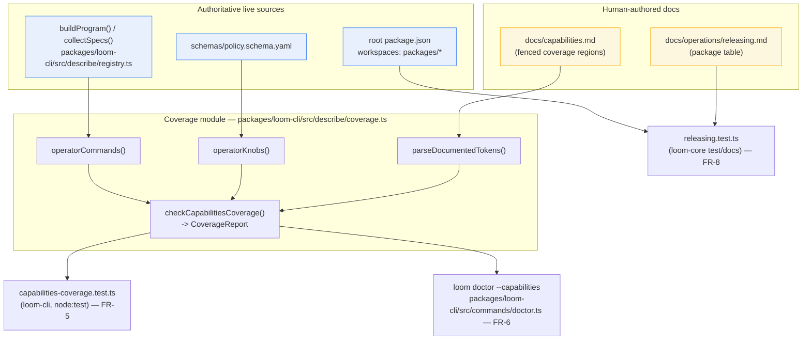

# Capabilities Documentation Drift Guard — System Architecture

## Architecture Philosophy

This is a documentation-*integrity* feature, not a behavior feature. Four constraints drive every decision below:

1. **Authoritative sources only, no parallel inventory.** The check must read the command surface from the live registry and the knob surface from `schemas/policy.schema.yaml`. The moment we hand-maintain a second list of "what exists," that list becomes the next thing to drift. Every enumeration traces back to a source that the rest of the system already depends on.
2. **The dependency graph is fixed and one-directional.** `loom-cli` (`loom-ai`) depends on `loom-core` (`@loom-ai/core`) and `loom-web`, never the reverse. The command registry lives in `loom-cli`. That single fact dictates *where the check can physically live* — and it is the first thing most designs get wrong.
3. **Coverage, never prose.** The check asserts that every real command/knob is named on the page and that nothing phantom is named — it does not read, score, or rewrite the human-written descriptions. The page stays hand-authored (NFR-3).
4. **One implementation, two callers.** The test suite (the binding requirement, FR-5) and the prerequisites doctor (best-effort, FR-6) must report identically. That is only guaranteed if they call the *same* function. Duplicated matching logic is duplicated drift.

The boring-technology bias shows up as: reuse the existing `node:test` + `js-yaml` + commander stack, reuse the existing `test/docs/*.test.ts` pattern already in the repo, and add exactly one new module plus one new test file per surface. No new dependencies.

## Component Diagram



## Tech Stack

| Layer | Choice | Rationale |
|---|---|---|
| Test runner | `node:test` (built-in) | Already the runner for all three packages; `packages/loom-core/test/docs/` proves the pattern. No new dep. |
| Command enumeration | commander, via existing `enumerateRegisteredCommands(program)` / `collectSpecs()` in `packages/loom-cli/src/describe/registry.ts` | The registry already walks `program.commands`; reuse it rather than reflect over commander a second way. |
| Knob enumeration | `js-yaml` (`yaml.load`) reading `schemas/policy.schema.yaml` | Same loader used by `PolicyEngine.load` and `eval/cases.ts`. The YAML is the *declared* public schema (FR-2). |
| Page parsing | Hand-rolled regex over inline code spans within fenced regions | "Exact token/identifier matching" (FR-4) needs nothing more than anchored regex; a markdown AST library is overkill and a new dependency. |
| Workspace enumeration | `JSON.parse` of root `package.json` `workspaces` + `fs.readdirSync` | The workspace set is already the source npm uses; read it directly (FR-8). |
| Doctor wiring | extend `packages/loom-cli/src/commands/doctor.ts` | The doctor already has the program in hand and already validates policy; a coverage mode fits its remit. |

## Data Models

The check is stateless — no persistence, no SQLite. The only "models" are the in-memory shapes passed between the enumeration, parsing, and diff stages.

```ts
// packages/loom-cli/src/describe/coverage.ts

/** A normalized identifier as it appears on the page and in the registry. */
type Token = string; // e.g. "epic", "approve", "agents.phases", "git.protected_branches"

/** One axis of coverage (commands or knobs). */
interface SurfaceDiff {
  surface: 'command' | 'knob';
  missing: Token[];   // exists in the live source, absent from the page  -> page is stale
  phantom: Token[];   // present on the page, not in the live source       -> page is fictional
}

interface CoverageReport {
  ok: boolean;                 // true iff every diff is empty
  diffs: SurfaceDiff[];        // one per surface
  // human-readable lines for doctor/test failure output, e.g.
  // "capabilities.md omits real command `loom autonomy`"
  messages: string[];
}
```

The command surface is already typed in the registry. This feature *extends* that type with two declarative fields so the operator subset and aliases stay co-located with the command definition (see ADR-3):

```ts
// packages/loom-cli/src/describe/registry.ts  (extend existing CommandDescription)
interface CommandDescription {
  name: string;                    // existing — full path, e.g. "guard check"
  // ...existing fields...
  audience?: 'operator' | 'internal'; // NEW — default 'operator'; 'internal' excluded from coverage
  aliases?: string[];                 // NEW — synonyms the page may legitimately use (FR-4)
}
```

The knob surface is derived, not stored. Operator knobs are the leaf scalar paths under the `git`, `filesystem`, and `agents` blocks of `schemas/policy.schema.yaml`, minus any field carrying the custom extension keyword `x-internal: true`:

```yaml
# schemas/policy.schema.yaml  (illustrative — mark engine-tuning fields)
agents:
  max_concurrent: { type: integer, default: 5 }     # operator knob -> "agents.max_concurrent"
  integrator_max_attempts: { type: integer, x-internal: true }  # excluded from coverage
```

## API / Interface Contracts

The single seam every consumer goes through:

```ts
// packages/loom-cli/src/describe/coverage.ts

/** Resolve the monorepo root (reuse the walk-up helper the existing docs tests use). */
export function repoRoot(fromDir?: string): string;

/** Operator-facing command tokens from the live registry (FR-1).
 *  = collectSpecs().filter(s => (s.audience ?? 'operator') === 'operator')
 *    expanded over s.name + s.aliases */
export function operatorCommands(program?: Command): Set<Token>;

/** Operator-visible knob tokens from schemas/policy.schema.yaml (FR-2).
 *  Subset rule: leaf scalars under git|filesystem|agents, excluding x-internal. */
export function operatorKnobs(schemaPath?: string): Set<Token>;

/** Exact code-span tokens documented inside the named fenced region of a page (FR-4).
 *  Region delimited by <!-- coverage:<kind>:start --> / <!-- coverage:<kind>:end -->.
 *  Commands captured from `loom <name>` spans; knobs from `policy.<path>` spans. */
export function parseDocumentedTokens(
  markdown: string,
  kind: 'command' | 'knob',
): Set<Token>;

/** The one function both the test and the doctor call (ADR-2). Pure, read-only. */
export function checkCapabilitiesCoverage(opts?: {
  root?: string;
  program?: Command;
}): CoverageReport;
```

Test consumer (binding — FR-5), living in `loom-cli` because that is where the registry is (ADR-1):

```ts
// packages/loom-cli/src/__tests__/capabilities-coverage.test.ts
import { test } from 'node:test';
import assert from 'node:assert/strict';
import { checkCapabilitiesCoverage } from '../describe/coverage.js';

test('docs/capabilities.md covers every command and operator knob, and nothing phantom', () => {
  const report = checkCapabilitiesCoverage();
  assert.ok(report.ok, report.messages.join('\n'));
});
```

Doctor consumer (best-effort — FR-6):

```ts
// packages/loom-cli/src/commands/doctor.ts  (new mode)
// loom doctor [--capabilities]
const report = checkCapabilitiesCoverage({ program });
// emit report.messages as a doctor check; non-ok -> doctor reports a failing check
```

Workspace-parity consumer (FR-8), kept in `loom-core` alongside the existing `releasing.test.ts` (it needs no command registry, only the root manifest):

```ts
// packages/loom-core/test/docs/releasing.test.ts  (extend)
// workspaces = JSON.parse(rootPkg).workspaces -> resolve packages/* -> npm names
// assert the releasing.md package table lists exactly that set (FR-8, NFR-2)
```

## Security / Integrity Model

This change touches no guardrail and no runtime behavior (NFR-1). Still, three integrity properties are worth stating because the feature's whole purpose is trustworthiness:

| Concern | Property / control |
|---|---|
| Check could weaken policy enforcement | The coverage module is read-only — it imports `buildProgram()` for *enumeration* and parses YAML/Markdown as text. It never instantiates `PolicyEngine`, never mutates policy, never shells out. The structural guardrail (`loom guard check`) is untouched. |
| The YAML knob source could itself drift from the *enforced* Zod `PolicySchema` (`packages/loom-core/src/types.ts`) | Named risk, not silently accepted. FR-2 fixes the page-coverage source to `schemas/policy.schema.yaml`; an optional belt-and-suspenders assertion (knob leaves in the YAML == operator keys in the Zod schema) closes the gap. See ADR-6. |
| A contributor could silence the check by deleting region fences | The parser treats a *missing* region as zero documented tokens, which makes every real command/knob report as `missing` — failing loud, not passing quiet. Fail-toward-visibility (ADR-3) is the same bias applied to the markup itself. |

## ADR Log

### ADR-1 — The coverage check lives in `loom-cli`, not `loom-core`
**Decision.** Place `coverage.ts` and `capabilities-coverage.test.ts` in `packages/loom-cli`, even though the repo's existing docs tests sit in `packages/loom-core/test/docs/`.
**Context.** The command registry (`buildProgram`, `collectSpecs`, `enumerateRegisteredCommands`) is defined in `loom-cli`. `loom-cli` depends on `loom-core`; the reverse import is forbidden and would create a cycle.
**Rationale.** The check needs the live command surface. The only place that surface exists *as code* is `loom-cli`. Reading it from anywhere else would mean re-deriving a command list — exactly the hand-maintained inventory NFR-2 forbids.
**Trade-off.** The docs-coverage logic is now split across two packages: command/knob coverage in `loom-cli`, workspace parity in `loom-core`. We accept that split because the alternative — exporting the registry as serialized data for `loom-core` to consume — adds a build-time artifact that can itself go stale.

### ADR-2 — One `checkCapabilitiesCoverage()` consumed by both the test and the doctor
**Decision.** Implement the enumeration + parse + diff once; the test and `loom doctor --capabilities` both call it.
**Context.** FR-5 makes the test binding; FR-6 asks for a doctor mode "where that surface fits." Two callers, one truth.
**Rationale.** "The doctor reports drift consistently with the test" (story-015-004 AC) is guaranteed by construction if there is literally one code path. Two implementations would be two things to keep in sync.
**Trade-off.** The module must be import-clean (no top-level argv parsing, no side effects) so the doctor can call it mid-process. We pay a small structural discipline to keep `buildProgram()` a pure factory — which it already is.

### ADR-3 — The operator subset is declared at the source, defaulting to "documented"
**Decision.** Classify commands with an `audience: 'operator' | 'internal'` field on `CommandDescription` (default `operator`) and mark internal knob fields with `x-internal: true` in `schemas/policy.schema.yaml` (default operator-visible).
**Context.** The registry surfaces ~40 commands including internal ones (`describe`, `release`, `publish`, `guard hook`); not every schema field is an operator knob (`integrator_max_attempts` was deliberately de-published). FR-1/FR-2 require a *defined, explicit* subset, not a guess.
**Rationale.** Co-locating the classification with the definition keeps it authoritative — it is not a parallel list in the check, it is metadata on the thing itself (NFR-2). Defaulting to `operator`/visible means a newly added command or knob fails the check *until documented* — the drift is caught in the direction that matters.
**Trade-off.** Adding an internal command/knob now requires one explicit annotation. That is a real maintenance touch, but it is at the source of truth and biased safe: forget it, and the worst case is the check demands you document something — never that it hides something.

### ADR-4 — Defined page region via HTML-comment fences + exact code-span tokens
**Decision.** Delimit the coverage zones in `docs/capabilities.md` with `<!-- coverage:command:start -->…<!-- coverage:command:end -->` (and `:knob:`) fences, and match by extracting inline code spans (`` `loom <name>` ``, `` `policy.<path>` ``) and comparing the captured identifier for *exact* equality against the enumerated set.
**Context.** FR-4 demands exact token matching against "a defined region," tolerant of documented aliases, immune to substring coincidence. The page already documents commands and knobs as backtick spans inside tables.
**Rationale.** Anchored regex on code-span contents gives exact-identifier matching with no fuzzy/semantic machinery (explicitly out of scope). Invisible HTML-comment fences make "defined region" concrete and reviewable without altering the rendered page. Aliases are honored via `CommandDescription.aliases`, so a synonym documented on purpose does not read as missing.
**Trade-off.** We introduce non-rendering markup into a human-authored doc, and editors must keep new commands/knobs inside the fences. The alternative — scanning every code span in the whole document — is simpler but lets an offhand mention of `` `loom run` `` in prose satisfy coverage, defeating the point. We accept a little markup to make the region unambiguous.

### ADR-5 — The releasing runbook is *verified against* workspaces, not autogenerated from them
**Decision.** Assert in `releasing.test.ts` that the package table in `docs/operations/releasing.md` lists exactly the npm names resolved from the root `package.json` `workspaces` glob; do not generate the table.
**Context.** FR-8 allows "derive from, or be verified against." The runbook table carries human prose (Purpose column, publish-order narrative) we must not clobber (NFR-3).
**Rationale.** Verification catches the only failure that matters — a package added or removed without updating the runbook — while leaving the human-written columns intact. Generation would either lose that prose or require a templating step that is itself a thing to maintain.
**Trade-off.** A maintainer adding a package must still hand-edit the runbook; the test only tells them they forgot. That is the same honor-system-plus-mechanical-backstop model as the capabilities page, applied consistently.

### ADR-6 — Knob source is `schemas/policy.schema.yaml`, with the Zod schema as an optional cross-check
**Decision.** Enumerate knobs from `schemas/policy.schema.yaml` (FR-2). Optionally add a defense-in-depth assertion that its operator-leaf set matches the operator keys of the Zod `PolicySchema` in `packages/loom-core/src/types.ts`.
**Context.** Two representations of the policy schema exist: the YAML (declared/public, documentation-shaped) and the Zod schema (what `PolicyEngine` actually enforces at runtime). The page documents `policy.*` knobs; FR-2 names the YAML as the source.
**Rationale.** The YAML is the *declared public contract* the page mirrors, and it is language-agnostic — the right thing for the page to be checked against. Following the PRD keeps the source unambiguous.
**Trade-off.** Sourcing from the YAML means the YAML could drift from the enforced Zod schema and the page would still pass. The cross-check closes that gap, but it reaches across the package boundary (the Zod schema is in `loom-core`, which `loom-cli` already depends on — so this import direction is legal). If the cross-check proves noisy, it can be dropped without weakening the FR-2 requirement; that is why it is optional rather than primary.
