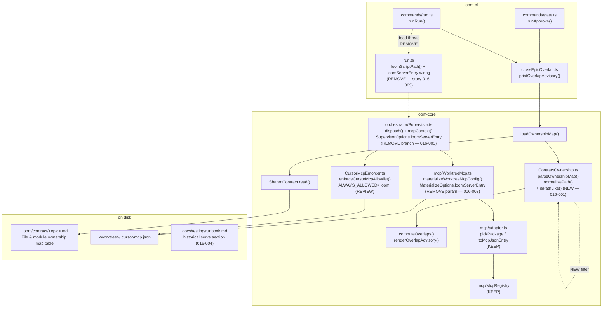

# Architecture: Trustworthy Overlap Advisory & Dead MCP-Server Residue Removal (epic-016)

## Architecture Philosophy

This is a cleanup epic, not a redesign. The architecture is therefore governed by what it must *not* disturb as much as by what it changes. Four constraints drive every decision below:

1. **Tighten the existing seam; do not invent a new one.** The overlap advisory already has a clean, total, hand-rolled pipeline (`parseOwnershipMap → computeOverlaps → renderOverlapAdvisory`). The defect is a single over-permissive token filter inside it. We fix the filter, not the pipeline. Boring beats clever here precisely because the whole epic-007 effort that built this code existed to kill smart-matching false positives — re-introducing cleverness would regress it.

2. **Preserve the no-filesystem invariant.** `ContractOwnership.ts` carries an explicit security contract (lines 3–7): a parsed path is *only* ever string-compared or displayed — never opened, statted, or executed. FR-2 ("existence is a tiebreaker, not a gate") is reconciled in favor of this invariant: we add no `fs` access at all. The path-*shape* test is sufficient and keeps the guardrail intact (NFR-1).

3. **Deletion must be provably safe before it happens.** The dead loom-self-server path threads through three layers (CLI → Supervisor → materializer). Removal is gated on a repo-wide search proving no live caller (FR-6), and bounded by a hard line: the retained third-party MCP provisioning and its tests change by zero bytes (FR-10, NFR-3), and the loom server is never reintroduced in any form (NFR-2).

4. **Stories must land in parallel without colliding.** The work spans two independent subsystems (advisory vs. MCP residue) plus a doc and a final integration pass. The architecture assigns each subsystem to disjoint files so independent agents never edit the same source.

## Component Diagram



## Tech Stack

These stories touch an existing stack; no new dependencies are introduced. The table records what each change relies on and why that choice stands.

| Layer | Choice | Rationale |
|---|---|---|
| Language | TypeScript / Node 20+ | Existing; no change. |
| Path-candidacy detection | Hand-rolled regex predicate (`isPathLike`) in `ContractOwnership.ts` | The module is deliberately dependency-free and total (never throws). A regex predicate keeps it that way; no path/glob library is warranted for a separator-or-extension check. |
| Contract source of truth | `.loom/contract/<epic>.md` via `SharedContract.read` | Already the materialized declaration; the advisory consumes it. Reused unchanged. |
| Epic/story state | `better-sqlite3` via `EpicStore.listByStatus` | In-flight epic enumeration already runs here (`crossEpicOverlap.ts:94`). Unchanged. |
| Schema validation | `zod` (`StorySchema`, `types.ts:578`) | Confirmed: no file-ownership field exists on a story. Drives the FR-3 decision (ADR-3). |
| Worker MCP config | `materializeWorktreeMcpConfig` → `.cursor/mcp.json` (whole-file overwrite) | Retained for third-party servers; the loom-self entry is excised. |
| Tests | existing core/cli test suites (`*.test.ts`) | Advisory and materializer both have dedicated suites that must stay green or be updated in lockstep. |
| Docs | MkDocs (`docs/testing/runbook.md`) | Historical correction only. |

## Data Models

### Overlap advisory (unchanged shapes; tightened producer)

```typescript
// packages/loom-core/src/orchestrator/ContractOwnership.ts
interface OwnershipEntry {
  epicId: string;          // 'epic-016'
  storyId?: string;        // 'story-016-001' when the owner cell names one
  path: string;            // repo-relative POSIX path, normalized
}
type OwnershipMap = OwnershipEntry[];

interface Overlap {
  path: string;                                       // exact shared path
  owners: Array<{ epicId: string; storyId?: string }>; // length >= 2
}
```

### Story schema — the FR-3 reality

```typescript
// packages/loom-core/src/types.ts  (StorySchema, ~line 578) — VERIFIED
interface Story {
  id: string;
  title: string;
  description: string;
  acceptance_criteria: string[];
  estimated_complexity: string;
  dependencies: string[];
  tech_notes?: string;
  test_plan?: string;
  images?: unknown[];
  // NO files / owns / file_ownership / owned_files / paths field.
}
```

There is **no per-story file-ownership field**. The only structured declaration of file ownership is the **owner column of the contract's "File & module ownership map" table**, where each row attributes paths to a `story-NNN-NNN` id (`parseOwner`, `ContractOwnership.ts:133`). That table *is* the story-declared ownership the PRD's FR-3 refers to. This resolves the FR-3 `[ASSUMPTION]`: no schema field exists, so the contract table is the declaration and the same path-validity filter guards it (ADR-3).

### Contract file shape (input the parser keys on)

```markdown
## File & module ownership map        <- matched by OWNERSHIP_HEADING (loose, case-insensitive)

| Story | Files owned |
| --- | --- |
| story-016-001 | `packages/loom-core/src/orchestrator/ContractOwnership.ts` |
| story-016-003 | `packages/loom-core/src/mcp/WorktreeMcp.ts`, `.../Supervisor.ts` |
```

Path tokens are split on `, · <br>` (`PATH_DELIMITER`, line 36) and normalized per-token.

### Worker MCP materialization — before / after

```typescript
// packages/loom-core/src/mcp/WorktreeMcp.ts
// BEFORE
interface MaterializeOptions {
  worktreePath: string;
  registry: McpRegistry | null;
  loomServerEntry?: McpJsonEntry;   // <-- REMOVE (story-016-003, FR-7)
}
interface MaterializeResult {
  configPath: string;
  serverNames: string[];            // comment "includes 'loom' iff loomServerEntry was given" -> retire
}

// AFTER
interface MaterializeOptions {
  worktreePath: string;
  /** null = policy.mcp.registry unset -> empty config. */
  registry: McpRegistry | null;
}
interface MaterializeResult {
  configPath: string;
  serverNames: string[];            // exactly the policy-registry servers, sorted
}
```

## API / Interface Contracts (the main seams)

These signatures are the seams across which independent agents must agree. Stories 001/002 must not change the *callable surface* of the advisory; story 003 changes exactly one signature and removes one config field.

```typescript
// ── Overlap advisory — public surface UNCHANGED across 016-001 / 016-002 ──
export function parseOwnershipMap(markdown: string, epicId: string): OwnershipMap;
export function loadOwnershipMap(projectRoot: string, epicId: string): OwnershipMap | null;
export function computeOverlaps(target: OwnershipMap,
                                others: Map<string, OwnershipMap>): Overlap[];
export function renderOverlapAdvisory(overlaps: Overlap[]): string[];
export function printOverlapAdvisory(projectRoot: string, targetEpicId: string,
                                     deps?: OverlapAdvisoryDeps): void;

// NEW internal predicate (not exported; private to ContractOwnership.ts) — story-016-001
// A token is a candidate path IFF it contains a path separator OR ends in a
// known source-file extension. No fs access. Applied inside / after normalizePath.
function isPathLike(token: string): boolean;

// ── Worker MCP materializer — signature CHANGES once, in story-016-003 ──
export function materializeWorktreeMcpConfig(opts: MaterializeOptions): MaterializeResult;

// ── Supervisor — SupervisorOptions.loomServerEntry field REMOVED (story-016-003) ──
// The dispatch branch `backend === 'cursor-cli' ? this.opts.loomServerEntry : undefined`
// (Supervisor.ts ~1378) is deleted; the materialize call drops the loomServerEntry arg;
// audit detail `loomServerIncluded` / `loomServerEntry` is dropped from the
// 'worker_mcp_servers' record.

// ── KEEP UNCHANGED (FR-10 / NFR-3) ──
export function pickPackage(def: McpServerDef): McpPackage;        // mcp/adapter.ts
export function toMcpJsonEntry(pkg: McpPackage): McpJsonEntry;     // secrets stay ${VAR}
export function enforceCursorMcpAllowlist(opts): CursorEnforceResult; // CursorMcpEnforcer.ts
```

The `isPathLike` predicate is the single new contract. Recommended definition, expressed so 001 and 002 cannot diverge:

```typescript
// separator OR a known source extension; case-insensitive on the extension.
const KNOWN_EXT = /\.(ts|tsx|js|jsx|mjs|cjs|json|md|ya?ml|sql|sh|css|html)$/i;
function isPathLike(token: string): boolean {
  return token.includes('/') || KNOWN_EXT.test(token);
}
```

Apply it as the final gate in `normalizePath` (return `''` when `!isPathLike(posix)`), so *every* producer — table parsing now, any free-text fallback later — inherits the bar (FR-4). The extension allow-list is the one knob 001 and 002 share; pin it in this contract so neither story re-derives a different set.

## Security Model

This epic is a guardrail-preservation exercise; NFR-1/NFR-2/NFR-3 are non-negotiable. Threats and the controls that hold them:

| Threat | Control | Where |
|---|---|---|
| Tightening the parser silently hides a *real* overlap (advisory goes dark) | Companion test asserts a genuinely shared, path-shaped file is still reported (story-016-001 AC #5) | advisory test suite |
| Adding a file-existence check to validate paths would (a) breach the no-fs invariant and (b) drop legitimately not-yet-created files of in-flight epics | **Do not add `fs` access.** Candidacy is shape-only; existence is neither gate nor tiebreaker (ADR-1, ADR-2). Existing security test "no fs access keyed on parsed paths" stays green | `ContractOwnership.ts:3-7` |
| Removing loom-self-server code accidentally strips third-party server provisioning | Hard scope line: `pickPackage`/`toMcpJsonEntry`/registry loop and their tests untouched; materializer keeps emitting exactly the registry servers (FR-10) | `mcp/adapter.ts`, `worktree-mcp.test.ts` |
| Removal weakens worker MCP isolation | `--strict-mcp-config` (claude-code) and `enforceCursorMcpAllowlist` (cursor-cli) are out of removal scope and remain in force; secrets stay as `${VAR}` references | `ClaudeCodeWorker.ts`, `CursorMcpEnforcer.ts` |
| loom MCP server is reintroduced via a lingering reference | FR-6 repo-wide search proves no live caller before deletion; `loomScriptPath()` and any now-orphaned helper in `run.ts` are swept in the same story (NFR-2) | `commands/run.ts` |

**Open boundary to decide in story-016-003:** `CursorMcpEnforcer.ts` defines `ALWAYS_ALLOWED = 'loom'` with the comment *"the worker's link back to the orchestrator."* Once loom never injects its own server, that constant protects a server that can no longer be materialized, and the comment implies the very injection FR-9 says must not be implied. The repo-wide search (FR-6) must surface this. Recommended resolution: treat the enforcer's *mechanism* as retained third-party tooling (do not change its behavior), but bring its `loom`-specific comment and the dead `ALWAYS_ALLOWED='loom'` protection under FR-9's "no comment implies loom injects its server" — verifying against `cursor-mcp-enforcer.test.ts` that no third-party enforcement regresses. If a test depends on `loom` being always-allowed, that dependency is itself residue and is updated with it.

## ADR Log

### ADR-1 — Path candidacy is decided by shape (separator or known extension), not by smart matching

- **Decision.** A token becomes a candidate path only if it contains `/` or ends in a known source-file extension (`isPathLike`), applied as the final gate of `normalizePath`. Tokens failing the bar are dropped (FR-1, FR-4).
- **Context.** Today `normalizePath` (`ContractOwnership.ts:159`) rejects only pure-punctuation tokens (`if (!/[A-Za-z0-9]/.test(posix))`, line 172). Any bare word or code identifier that lands in the path column survives and is reported as a file, burying real overlaps.
- **Rationale.** A shape test is total, dependency-free, and consistent with the module's existing "dumbest thing that can work" philosophy (line 180). It closes the false-positive hole without re-introducing the globbing/prefix-inference that epic-007 deliberately removed.
- **Trade-off.** Extensionless, separator-less real files at repo root — `Makefile`, `Dockerfile`, `LICENSE` — are excluded as candidates. Accepted: such files are rare cross-epic overlap subjects, and the cost of false positives (operators learning to ignore the advisory) dominates the cost of missing a bare `Dockerfile` collision. If one matters, it can be declared with a leading `./` to gain a separator.

### ADR-2 — Existence is neither gate nor tiebreaker; the no-filesystem invariant holds

- **Decision.** The detector performs no `fs` access on parsed paths. A path-shaped token is included whether or not the file exists (FR-2).
- **Context.** FR-2 phrases existence as "a tiebreaker, not a gate," which invites adding a stat-based tiebreak. But `ContractOwnership.ts:3-7` establishes a hard security invariant: a parsed path is never opened or statted, and there is a regression test asserting exactly that.
- **Rationale.** In-flight epics legitimately create files that do not yet exist, so an existence *gate* is wrong on the merits. Once existence cannot gate, using it as a *tiebreaker* buys nothing — the shape test already disambiguates — while it would breach the security invariant and the no-fs test. The boring choice is to add nothing.
- **Trade-off.** Two distinct files that happen to share a normalized path string still can't be told apart (no semantic check), and a path-shaped token pointing at a typo'd filename is reported as a real claim. Accepted: this matches the existing exact-lexical-equality contract of `computeOverlaps`.

### ADR-3 — The contract ownership table is the story-declared source; no new story-schema field is added

- **Decision.** FR-3's "story-declared file ownership" is satisfied by the existing per-story rows of the contract's "File & module ownership map" table, which `parseOwnershipMap`/`parseOwner` already attribute to story ids. The free-text fallback is gated by the same `isPathLike` filter (FR-4). No field is added to `StorySchema`.
- **Context.** `StorySchema` (`types.ts:578`) carries no `files`/`owns`/`file_ownership` field — verified. The PRD's FR-3 `[ASSUMPTION]` ("if schemas don't carry it, use the fallback") therefore resolves to: use the contract table, which is itself the structured declaration.
- **Rationale.** Adding a validated schema field is redesign, explicitly out of scope. The contract table is already authored by Winston with one row per story and is already the advisory's input — reusing it is the minimal, boring move.
- **Trade-off.** The declaration lives in an LLM-generated markdown contract rather than a zod-validated field, so it is not schema-enforced; a malformed table degrades to fewer entries (the parser is total and silently skips bad rows). Accepted for this cleanup; a future epic could promote it to a typed field.

### ADR-4 — Delete the loom-self-server path outright rather than feature-flag it

- **Decision.** Remove `MaterializeOptions.loomServerEntry`, the `SupervisorOptions.loomServerEntry` field, the `backend === 'cursor-cli'` branch that fed it, the CLI wiring (`loomScriptPath` thread in `run.ts`), and the misleading comments — no flag, no dormant code (FR-6–FR-9).
- **Context.** The loom MCP server is already removed; this is orphaned scaffolding kept alive only by an optional, now-unused parameter. Existing ADR-3/ADR-5 of epic-002 ("only cursor-cli gets it" / "core can't compute it") describe a feature that no longer exists.
- **Rationale.** NFR-2 mandates the server is never reintroduced. A feature flag or dormant branch is exactly the residue that erodes contributor trust — the problem this epic exists to fix. A repo-wide search (FR-6) makes the deletion provably safe.
- **Trade-off.** Re-enabling a loom-self-server later would require re-writing the threading rather than flipping a flag. Acceptable, and in fact desirable, given NFR-2.

### ADR-5 — Mark the runbook's serve section historical rather than delete it

- **Decision.** In `docs/testing/runbook.md`, the MCP-server-epic section (the `node $LOOM serve` block ~lines 1615–1630 and the `loom serve` line ~1634) is retained but unambiguously banner-marked as a record of a *removed* feature (FR-11).
- **Context.** The section currently reads as current behavior; a contributor could mistake `serve` for a live command. A sibling note already exists at `docs/dogfooding/mcp-removal-notes.md`.
- **Rationale.** Marking over deleting preserves institutional memory of why the command existed and was removed, per the PRD's stated preference, while removing the false "this is current" signal.
- **Trade-off.** The stale command text remains visible in the doc; mitigated by an explicit "REMOVED — historical record" banner at the top of the section and a cross-link to `mcp-removal-notes.md`.

### ADR-6 — Stories partition by subsystem so parallel agents never share a file

- **Decision.** Advisory work (016-001, 016-002) owns `ContractOwnership.ts` and `crossEpicOverlap.ts`; MCP-residue work (016-003) owns `WorktreeMcp.ts`, `Supervisor.ts`, and the `run.ts` loom-server wiring; doc work (016-004) owns `runbook.md`; 016-005 is the integration pass that owns no source but runs the full build/test suite.
- **Context.** 016-001 and 016-002 both edit `ContractOwnership.ts` and have a declared dependency (002 → 001), so they are sequential, not parallel — one owner, ordered. The two subsystems are otherwise disjoint and run concurrently.
- **Rationale.** Disjoint file ownership is the only reliable way independent branch-isolated agents avoid merge conflicts; the dependency edge serializes the one genuine shared-file case.
- **Trade-off.** 016-005 cannot begin until all four predecessors land, serializing the tail. Accepted: cross-cutting regressions (e.g. a now-dead `loomScriptPath` import, or a `cursor-mcp-enforcer` test that assumed `loom` always-allowed) only surface when the whole suite runs together, which is precisely 016-005's job.
