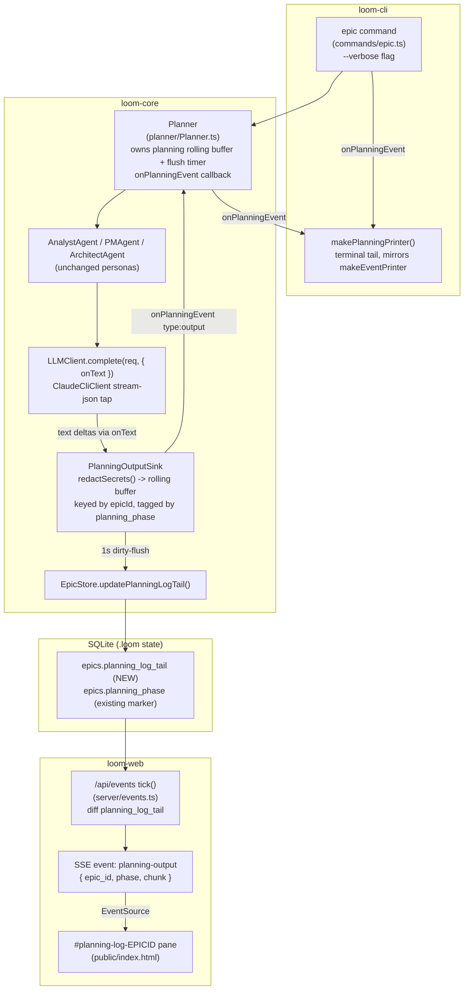

# Planning Phase Observability — System Architecture

## Architecture Philosophy

Four constraints drive every decision below. The third is the one the PRD did not anticipate, and it reshapes the design.

1. **Reuse the transport, replicate the capture.** The PRD mandates riding the existing worker pipeline (NFR-3). That pipeline has two halves. The **transport + presentation half** — a `*_log_tail` column → the `/api/events` SSE poll-diff-emit loop → the `EventSource` log pane → the `run --verbose` line printer — is genuinely reusable and is reused almost verbatim. The **capture half** — subprocess stdout → `Supervisor.appendToTail` rolling buffer → 1 s dirty-flush — is structurally worker-specific and cannot be literally reused, because the planner is not a stdout-streaming subprocess. We replicate its *pattern* (bounded rolling buffer keyed to a subject, periodic dirty-flush) inside the `Planner`, reusing the same constants and shapes.

2. **The planning personas run in-process and do not stream today.** `LLMClient.complete()` returns only the final text (`packages/loom-core/src/llm/LLMClient.ts:56`, `ClaudeCliClient.ts:43-81`). To produce *live* output (Goal 1, FR-4/FR-5) rather than a single end-of-persona dump, we add one narrow streaming tap to the LLM client. This is the only load-bearing change; everything else is additive plumbing. Workers are unaffected because they run on a separate path (`BaseCliWorker`), not through `LLMClient`.

3. **Redaction must be honest, not assumed.** There is *no* content-level scrubbing on the worker stream (verified). The only protection is env-hygiene. So "reuse the existing redaction" (NFR-1) cannot mean reusing a scrub that does not exist; it means reusing the env-hygiene posture and adding one small shared scrub at the single flush seam. The Security Model section makes this explicit.

4. **The default path stays silent; the phase label stays intact.** All new output is opt-in (verbose) or pull-only (dashboard). The existing `epics.planning_phase` marker — already rendered as `planning · analyst` in the dashboard and `loom status` — is left untouched and is *reused* as the active-persona attribution (FR-2, FR-7, NFR-4), not reinvented.

## Component Diagram



## Tech Stack

No new technology is introduced — that is the point (NFR-3). The table records the *existing* choices each layer extends.

| Layer | Choice (existing) | Rationale |
|---|---|---|
| Capture buffer | In-memory `{ buffer, dirty }` rolling string, bounded to `LIVE_TAIL_CHARS = 4096`, in `Planner` | Mirrors `Supervisor.outputTails` exactly; boring, proven, already tuned for this purpose |
| Durable flush | `better-sqlite3`, new `epics.planning_log_tail` column, 1 s dirty-flush (`TAIL_FLUSH_MS`) | Same store, same cadence, same column shape as `agents.log_tail`; migration via the established `ALTER TABLE` pattern in `Database.ts` |
| LLM streaming tap | `claude -p --output-format stream-json` parsed line-by-line in `ClaudeCliClient` | The CLI already emits stream-json; we consume deltas instead of waiting for the final blob. No SDK swap |
| Live transport | Existing `/api/events` SSE channel (Express), one new event kind | Same endpoint, same poll-diff-emit loop, same heartbeat — an additional message type, not a parallel mechanism |
| Browser render | Vanilla JS `EventSource` + a `log-pane` div | Identical to the worker log pane; one new listener + one new pane keyed by epic id |
| Terminal tail | `commander` `--verbose` flag + a push-callback printer | Mirrors `run --verbose` / `makeEventPrinter`; partial-line buffering reused |
| Active-persona marker | Existing `epics.planning_phase` enum (`analyst`\|`pm`\|`architect`) | Already persisted, already streamed in the `epic` SSE event — reuse, don't add a field |

## Data Models

### New durable state

One column, mirroring `agents.log_tail`. The active-persona marker already exists as `epics.planning_phase` and is **not** changed.

```sql
-- Migration in packages/loom-core/src/state/Database.ts, alongside the
-- existing `if (!epicCols.some(c => c.name === 'planning_phase'))` block:
ALTER TABLE epics ADD COLUMN planning_log_tail TEXT;   -- rolling tail, <= 4096 chars, nullable

-- Already present, reused verbatim as the active-persona attribution:
--   epics.planning_phase  TEXT   -- 'analyst' | 'pm' | 'architect' | NULL
```

### In-memory capture buffer (Planner)

```typescript
// packages/loom-core/src/planner/Planner.ts — mirrors Supervisor.outputTails,
// but a single entry because one Planner run plans exactly one epic.
private planningTail: { buffer: string; dirty: boolean } = { buffer: '', dirty: false };
private tailFlushTimer: ReturnType<typeof setInterval> | null = null;

private static readonly LIVE_TAIL_CHARS = 4096;   // same constant as Supervisor
private static readonly TAIL_FLUSH_MS   = 1000;    // same cadence as Supervisor
```

### Planning event (mirrors `WorkerEvent`)

```typescript
// packages/loom-core/src/planner/PlanningEvent.ts (new), shape parallels
// orchestrator/WorkerRunner.ts WorkerEvent.
export type PlanningPhase = 'analyst' | 'pm' | 'architect';   // existing, types.ts:54

export type PlanningEvent =
  | { type: 'phase';  phase: PlanningPhase }                 // persona transition
  | { type: 'output'; phase: PlanningPhase; chunk: string }; // redacted streamed text
```

## API / Interface Contracts

These are the seams the four stories must agree on. Signatures are the contract.

```typescript
// ─── loom-core: LLM streaming tap (the one load-bearing change) ──────────────
// packages/loom-core/src/llm/LLMClient.ts
export interface LLMRequest {
  model: string;
  system: SystemBlock[];
  messages: LLMMessage[];
  maxTokens?: number;
  onText?: (delta: string) => void;   // NEW, optional. Called per streamed text
                                       // delta. Omitted => current buffered behavior.
}
// ClaudeCliClient: when onText is present, spawn with --output-format stream-json,
// parse line-delimited events, call onText(delta) per assistant text delta, and
// still resolve LLMResponse with the accumulated text. Backends that cannot
// stream ignore onText and still return final text (graceful degradation).

// ─── loom-core: Planner observability hook (mirrors Supervisor.onWorkerEvent) ─
// packages/loom-core/src/planner/Planner.ts (PlannerOptions)
export interface PlannerOptions {
  // ...existing fields (projectRoot, llm, model, db, sharedContract, qaPlanning)...
  onPlanningEvent?: (e: PlanningEvent) => void;   // NEW, optional
}

// ─── loom-core: durable flush (mirrors AgentStore.updateLogTail) ─────────────
// packages/loom-core/src/state/EpicStore.ts
updatePlanningLogTail(id: string, logTail: string): void;   // NEW

// ─── loom-core: shared redaction (the honest NFR-1 control) ──────────────────
// packages/loom-core/src/util/redact.ts (new, shared by planner now, worker later)
export function redactSecrets(chunk: string): string;   // masks known token shapes

// ─── loom-web: SSE event kind on the EXISTING /api/events channel ────────────
// packages/loom-web/src/shared/types.ts — add to the LiveEvent union
type LiveEvent =
  | { kind: 'hello';  data: { epoch: string } }
  | { kind: 'epic';   data: EpicStatus }
  | { kind: 'agent';  data: AgentSummary & { epic_id: string } }
  | { kind: 'output'; data: { agent_id: string; story_id: string; chunk: string } }
  | { kind: 'planning-output';                                   // NEW
      data: { epic_id: string; phase: PlanningPhase | null; chunk: string } };

// server/events.ts tick(): maintain planningTailSnapshots: Map<epicId,string>,
// diff epic.planning_log_tail with the SAME startsWith()/slice() logic used for
// agents.log_tail, and emit('planning-output', { epic_id, phase, chunk }).

// ─── loom-cli: verbose flag (mirrors run --verbose) ──────────────────────────
// packages/loom-cli/src/commands/epic.ts spec.options += 
//   { name: '--verbose', type: 'boolean',
//     description: 'Stream live persona output to the terminal',
//     changesOutputShape: true }
// Wiring passes onPlanningEvent: makePlanningPrinter({ verbose }) into new Planner(...).
```

## Security Model

The PRD's NFR-1 assumes a worker-stream scrubber exists to reuse. **It does not.** This section states the real controls and the one honest addition.

| Threat | Reality of the worker path (verified) | Control for planning |
|---|---|---|
| API key / auth token in captured output | Worker stdout is stored **unredacted**; protection is env-hygiene only — `worker_auth: 'session'` deletes `ANTHROPIC_API_KEY`/`ANTHROPIC_AUTH_TOKEN` before spawn (`BaseCliWorker.workerEnv`, `types.ts:530`) | The planner's `claude -p` subprocess inherits the operator env. Apply the **same env-hygiene posture**: when `worker_auth: 'session'`, ensure the planner's LLM subprocess is spawned without the raw key. This is the true "reuse the existing mechanism." |
| Secret echoed *into* generated persona text (e.g. an API response the model was shown) | No content-level scrub exists anywhere on the worker path | Add **one** shared `redactSecrets()` applied at the single planning-flush seam (in `PlanningOutputSink`, before `appendToTail` and before `onPlanningEvent`). This masks known token shapes (`sk-ant-…`, GitHub PAT prefixes). Defense-in-depth for the NFR-1 `[ASSUMPTION]` the PRD flagged. |
| Leak via the dashboard SSE | `/api/events` emits `agents.log_tail` with zero filtering | Planning output is redacted *before* it reaches `planning_log_tail`, so the SSE path inherits a clean column. No SSE-layer change needed. |
| Leak via the verbose terminal | n/a (worker tail prints the raw chunk) | The CLI printer consumes the **already-redacted** `onPlanningEvent` chunk, never the raw delta (story-017-003 AC). |

Honest scope note: `redactSecrets()` is *more* than the worker path does today. We apply it only to the planning seam now; retrofitting the worker `appendToTail` to the same util is a recommended follow-up, not this epic's work. We do not weaken any existing control (NFR-2).

## ADR Log

### ADR-001 — Reuse the transport half of the worker pipeline; replicate the capture half in the Planner
**Decision.** Reuse the SSE channel, the `*_log_tail` column shape, the EventSource pane, and the verbose line-printer verbatim. Re-implement the rolling-buffer + dirty-flush *pattern* inside `Planner`, reusing `Supervisor`'s `LIVE_TAIL_CHARS`/`TAIL_FLUSH_MS` values.
**Context.** `Supervisor.appendToTail`/`flushTails` are bound to worker subprocess lifecycle and keyed by `agentId`; the planner has no agent rows and no stdout subprocess to hook.
**Rationale.** The valuable, hard-to-rebuild parts (transport, presentation) are reused. The capture loop is ~20 lines and copying its shape is cheaper and safer than abstracting a shared base out of the Supervisor mid-flight.
**Trade-off.** A second small buffer+flush implementation exists. Mitigated by sharing the constants and keeping the structure identical, so the two read the same.

### ADR-002 — Persist to a new `epics.planning_log_tail` column, not `agents.log_tail` or a new table
**Decision.** Add `epics.planning_log_tail TEXT` via the established `ALTER TABLE epics` migration.
**Context.** A planning epic has **no stories and no agent rows** (`agents.story_id` is `NOT NULL`), so `agents.log_tail` cannot host planning output. The dashboard already special-cases "Stories appear once planning completes."
**Rationale.** The tail lives next to its subject, exactly as `agents.log_tail` lives next to the agent. The active-persona marker (`planning_phase`) is already on this row.
**Trade-off.** One planning-specific column on `epics`. A separate `planning_logs` table was rejected as more surface for no parity gain.

### ADR-003 — Add an optional `onText` streaming tap to `LLMClient`, with per-persona-completion as the floor
**Decision.** Extend `LLMRequest` with optional `onText`; `ClaudeCliClient` switches to `--output-format stream-json` when it is present and emits deltas. Backends without streaming ignore it. Regardless of streaming, the Planner flushes each persona's full text on `complete()` return.
**Context.** `complete()` is buffered today (`ClaudeCliClient.ts:43-81`); without a tap the dashboard would update only three times total (Goal 1 wants "as it is produced").
**Rationale.** This is the single load-bearing change and it is opt-in. Workers do not use `LLMClient` (they run via `BaseCliWorker`), so worker behavior is provably unchanged. The per-persona flush guarantees a useful floor even on a non-streaming backend.
**Trade-off.** Touches a shared, load-bearing client. Mitigated by optionality (absent `onText` = today's behavior) and by the separate worker path. On non-streaming backends, "live" degrades to per-persona granularity.

### ADR-004 — New `planning-output` SSE event kind on the existing channel, not an overloaded `output` event or a new endpoint
**Decision.** Add `planning-output { epic_id, phase, chunk }` to the `LiveEvent` union and emit it from the same `tick()` loop.
**Context.** The existing `output` event is keyed by `agent_id`; planning has none. NFR-3 forbids a parallel streaming mechanism.
**Rationale.** Same `/api/events` endpoint, same poll-diff-emit loop, same `emit()` helper, same `EventSource` — this is an additional message *type* on one channel (exactly as `agent` and `output` already coexist), not a parallel pipeline. Keeps the agent-keyed pane semantics clean.
**Trade-off.** One more event kind and one more `*Snapshots` map in `tick()`. Trivial against the clarity won by not overloading `output`.

### ADR-005 — A single epic-scoped rolling tail with phase-marker prefixes, not per-persona segmented stores
**Decision.** One `planning_log_tail` per epic, bounded to 4096 chars; on each phase transition, prefix a marker (`\n── pm ──\n`) so attribution survives within the tail.
**Context.** The PRD's "Should" wants a persona-attributed diagnostic record; Out of Scope defers segmentation "unless the architect determines it is required." I determine it is not.
**Rationale.** Parity with workers means a bounded *tail*, not a full transcript. `planning_phase` plus inline markers give attribution at no extra storage.
**Trade-off.** Only the most recent ~4096 chars survive; a persona whose output scrolled past is partially lost — the identical limitation `agents.log_tail` already accepts. Full retention is deferred per Out of Scope.

### ADR-006 — Honor NFR-1 with reused env-hygiene plus one shared `redactSecrets()`, and say plainly that no worker content-scrubber exists to inherit
**Decision.** Apply the planner's LLM subprocess the same `worker_auth: 'session'` env-stripping the worker path uses, and add a single shared `redactSecrets()` at the planning flush seam.
**Context.** NFR-1 says reuse the worker stream's redaction; verification shows the worker stream applies no content-level redaction — only env-hygiene.
**Rationale.** Reusing env-hygiene is the faithful "existing mechanism." The small shared scrub addresses the persona-specific exposure (API responses) the PRD itself flagged, without weakening anything (NFR-2).
**Trade-off.** The planning path becomes slightly *stricter* than the worker path. Retrofitting workers to the same util is a recommended follow-up, explicitly out of this epic's scope.
