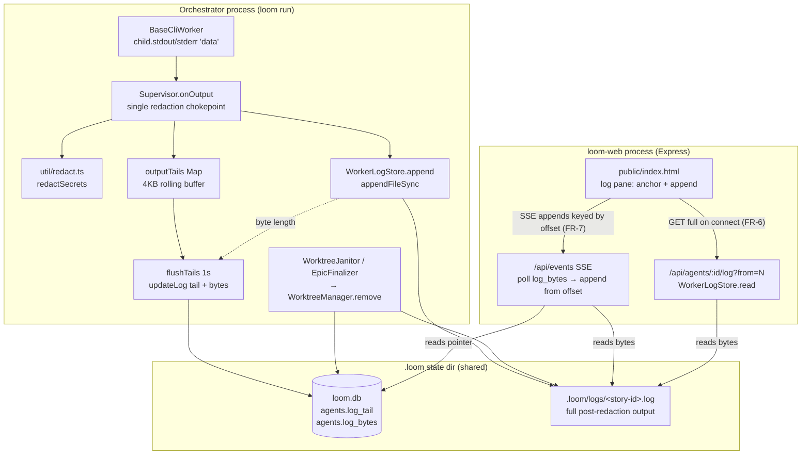

I'll ground this architecture in the actual loom codebase before writing. Let me explore the relevant subsystems in parallel.# Durable Worker Logs & Authoritative Log Reconnect — System Architecture

## Architecture Philosophy

Four constraints drive every decision below. Each one rules out an otherwise-tempting design.

1. **The orchestrator and the dashboard are separate processes that share only `.loom/`.** The Supervisor (`loom run`) writes; `loom-web` (a separate Express process) reads. They never share memory — today they communicate exclusively through `.loom/loom.db` and the filesystem (the web SSE handler *polls* SQLite, it does not receive in-process events). **Therefore the durable record must be a real file on disk, and the read path must be a filesystem read by the web process.** A DB blob or an in-memory buffer cannot cross this boundary.

2. **The offset must have exactly one definition.** Three consumers — the file writer, the DB pointer, and the SSE append cursor — must agree byte-for-byte or reconnect merges corrupt. We define the offset *once* (`WorkerLogStore`, post-redaction byte length) and have all three derive from it. No component recomputes it independently.

3. **Redaction is load-bearing and must happen before *any* persistence.** Worker stdout currently reaches `agents.log_tail` **unredacted** (`redactSecrets` is wired only into the planner's `PlanningOutputSink`, not the worker path). Durable on-disk storage raises the cost of a leak from "ephemeral 4 KB tail" to "complete permanent record." We close that gap by redacting at a single ingestion chokepoint that feeds both the tail and the file.

4. **No regression in live latency or status rendering.** The 4 KB DB tail (`Supervisor.LIVE_TAIL_CHARS`) and its 1 s flush (`TAIL_FLUSH_MS`) still drive status views. The durable path is *additive*: it reuses the same 1 s flush cycle, so the new write volume to SQLite stays at one row update per second per agent.

## Component Diagram



## Tech Stack

| Layer | Choice | Rationale |
|---|---|---|
| Durable log storage | Plain append-only file per story under `.loom/logs/<story-id>.log` | Survives process exit and crosses the orchestrator↔web process boundary; covered by existing `.loom` ignore conventions (NFR-1). |
| File write primitive | `fs.appendFileSync` (Node `fs`, no new dep) | Each write reaches the OS page cache immediately, which *is* the durability guarantee (NFR-4); avoids userspace buffering that a `WriteStream` could lose on crash. Boring, dependency-free. |
| Offset / byte accounting | `Buffer.byteLength(redacted, 'utf8')`, accumulated in `WorkerLogStore` | Single source of the post-redaction byte length (FR-3); UTF-8-safe because offsets fall on whole-chunk boundaries. |
| Durable pointer | New `agents.log_bytes INTEGER` column, `better-sqlite3` (existing) | Lets the web poller learn the durable length without statting the file on every 500 ms tick; flushed on the existing 1 s cadence. |
| Redaction | Existing `util/redact.ts` `redactSecrets` (existing) | Reuse, not reinvent (NFR-2); no new or weaker patterns. |
| Read path | New `GET /api/agents/:id/log` on existing Express router (existing `commander`/Express stack) | Matches existing per-agent route conventions (`/api/agents/:id`, `/api/agents/:id/audit`). |
| Live transport | Existing SSE `/api/events` (`events.ts`) | Reuse the existing EventSource channel and its `hello`/`epoch` signal rather than add a transport. |
| Client | Existing vanilla JS in `public/index.html` | No framework added; change is to the buffer-merge logic only. |

## Data Models

### Database — additive column (schema v21 → v22)

```sql
-- packages/loom-core/src/state/Database.ts : agents table
ALTER TABLE agents ADD COLUMN log_bytes INTEGER;   -- durable post-redaction byte length of .loom/logs/<story-id>.log
-- log_tail TEXT stays exactly as-is: bounded 4096-char rolling tail for fast status rendering (FR-2)
```

Migration is additive and nullable (`log_bytes` is `NULL`/`0` for pre-existing agents); bump `SCHEMA_VERSION` to 22 and add a migration step in `runMigrations`.

### On-disk file

```
.loom/logs/<story-id>.log     # append-only, UTF-8, post-redaction bytes only, never overwritten/truncated at completion
```

Keyed by **story id** (not agent id) to match loom's existing per-story file convention (`.loom/context/<story-id>.md`, `.loom/guidance/<story-id>.md`, `.loom/signals/<story-id>.md`) and to make pruning align 1:1 with the per-story worktree lifecycle. The read endpoint resolves `agent.story_id` from the `:id` param (see ADR-006).

### In-memory (Supervisor, per run)

```ts
// extends existing outputTails: Map<agentId, { buffer, dirty }>
logBytes: Map<storyId, number>   // running post-redaction byte count == file size; flushed to agents.log_bytes every TAIL_FLUSH_MS
```

## API / Interface Contracts

### `WorkerLogStore` (new — `packages/loom-core/src/state/WorkerLogStore.ts`)

The single definition of path + offset semantics, imported by **both** the orchestrator (writer) and `loom-web` (reader), so the two sides cannot drift (FR-3).

```ts
class WorkerLogStore {
  constructor(loomdir: string);                       // roots at <loomdir>/logs
  pathFor(storyId: string): string;                   // <loomdir>/logs/<storyId>.log
  append(storyId: string, redacted: string): number;  // appendFileSync; returns new total byte length
  byteLength(storyId: string): number;                // statSync().size, or 0 if absent
  read(storyId: string, fromOffset?: number, upTo?: number): Buffer; // bytes in [fromOffset, upTo)
  remove(storyId: string): void;                      // unlink if present; idempotent
}
```

### Supervisor ingestion chokepoint (modify `Supervisor.onOutput`, ~`Supervisor.ts:1449`)

```ts
const onOutput = (chunk: string, stream: 'stdout' | 'stderr'): void => {
  const redacted = redactSecrets(chunk);                 // (3) redact ONCE, before any persistence
  this.opts.onWorkerEvent?.({ type: 'output', storyId, stream, chunk: redacted });
  this.appendToTail(task.agentId, redacted);             // (4) DB tail derives from redacted
  this.logBytes.set(storyId, this.workerLogs.append(storyId, redacted)); // (4) file + offset derive from redacted
};
```

```ts
// flushTails() — one UPDATE per agent per second, now carrying both fields
this.agents.updateLog(agentId, trimmedTail, this.logBytes.get(storyId) ?? 0);
// AgentStore: updateLog(id, logTail, logBytes) — UPDATE agents SET log_tail=?, log_bytes=?, updated_at=? WHERE id=?
```

> Ordering invariant: the file is appended **before** the DB pointer is flushed, so `agents.log_bytes ≤ file size` always. Readers bound to `log_bytes` therefore never read past a durably-recorded offset.

### Read path (new — `loom-web` `index.ts`, alongside `/api/agents/:id`)

```
GET /api/agents/:id/log[?from=<int>]
  → 200 text/plain; charset=utf-8
     X-Log-Length: <agents.log_bytes>             # authoritative durable length
     body = WorkerLogStore.read(storyId, from ?? 0, log_bytes)
  · from == log_bytes  → empty body, 200 (boundary case, FR-5)
  · :id resolved via AgentStore → story_id (never used directly as a path; see Security Model)
  · read bounded to log_bytes so a concurrently-appending writer is tolerated (NFR-5)
```

### SSE append contract (modify `events.ts`)

```ts
// On connect, per agent: emittedOffset[agentId] = current agents.log_bytes  (stream only NEW appends, never replay history)
// Each 500ms tick, if log_bytes > emittedOffset[agentId]:
emit(res, 'output', {
  agent_id, story_id,
  from: emittedOffset[agentId],                                   // absolute post-redaction byte offset
  bytes: WorkerLogStore.read(storyId, emittedOffset, log_bytes).toString('utf8'),
});
emittedOffset[agentId] = log_bytes;

emit(res, 'hello', { epoch: `${process.pid}-<ts>` });            // already emitted at events.ts:43 — now consumed by client
```

### Client reconcile (modify `public/index.html`, replacing the `startsWith` merge at ~line 702)

```js
// Per visible pane, anchored at clientOffset[agent_id]:
on 'hello'(epoch):  if (epoch !== lastEpoch) { lastEpoch = epoch; rebuildAllVisible(); }  // (FR-8) server restart
on view-enter/reload: for each visible agent → GET /api/agents/:id/log;
                      pane.textContent = body; clientOffset[id] = X-Log-Length;           // (FR-6) authoritative rebuild
on 'output'({from, bytes}):
  if (from > clientOffset[id]) { refetchFull(id); return; }   // gap → re-anchor (self-healing)
  pane.textContent += bytes.slice(clientOffset[id] - from);   // append-only; overlap trimmed by absolute offset
  clientOffset[id] += bytes.length - (clientOffset[id] - from);
// No truncation, no duplication — every decision is keyed to the absolute durable offset (FR-7/FR-8).
```

### Pruning hook (modify `WorktreeManager.remove`, `WorktreeManager.ts:136`)

```ts
remove(storyId: string, opts: { deleteBranch?: boolean } = {}): void {
  // ...existing git worktree remove...
  this.workerLogs?.remove(storyId);   // single chokepoint: both WorktreeJanitor.prune and EpicFinalizer route here
}
```

`failed`/`blocked` agents are in `WorktreeJanitor.PRESERVE`, so their worktrees are never removed and their logs are therefore retained automatically (FR-9). Only `done` (orphan reason `completed`) and `no-agent` removals reach `remove()`.

## Security Model

| Threat | Control |
|---|---|
| Secrets (`sk-ant-…`, `ghp_…`, `github_pat_…`, `gh[ousf]_…`) persisted permanently on disk | `redactSecrets` applied at the **single** `Supervisor.onOutput` chokepoint *before* the file append and the DB tail. This also closes the pre-existing gap where worker tails were stored unredacted (NFR-2). Known limitation, unchanged from today: redaction is per-chunk, so a secret split across two stdout `data` events can evade the regex — fixing chunk-boundary redaction is out of scope. |
| Durable logs committed to git | Add `.loom/logs/` to the loom-managed block in `.gitignore` (alongside `.loom/worktrees/`, `.loom/scratch/`). Logs live under `.loom/`, never in the system temp dir, never as DB blobs (NFR-1). |
| Path traversal via `:id` in `GET /api/agents/:id/log` | The `:id` is resolved through `AgentStore` to a validated `story_id`; the raw param is never concatenated into a filesystem path. An unknown id → 404, not a file read. |
| Guardrail / policy weakening | None. No policy or guardrail is touched; the change is purely additive persistence + read plumbing (NFR-3). The structural policy engine and protected-branch invariants are untouched. |

## ADR Log

### ADR-001 — Durable record is an on-disk file, read by the web process via the filesystem
- **Decision:** Persist full output to `.loom/logs/<story-id>.log`; the web read path and SSE poller read that file directly.
- **Context:** The orchestrator and `loom-web` are separate processes; `events.ts` already communicates only by polling `loom.db`. Worker output today lives in a 4 KB `agents.log_tail` overwritten with the last chars.
- **Rationale:** A file is the only medium that both survives worker exit and is reachable by the other process without IPC. A DB blob would bloat `loom.db` and abuse SQLite as a log store.
- **Trade-off:** Two storage media to keep coherent (file for the body, DB for the pointer/tail). We accept this and bound the coherence problem with a strict write-ordering invariant (file before pointer).

### ADR-002 — One offset definition: post-redaction byte length, owned by `WorkerLogStore`
- **Decision:** Define the offset once as cumulative post-redaction UTF-8 byte length in `WorkerLogStore`, imported by both writer and reader packages.
- **Context:** FR-3 requires the writer, DB pointer, and SSE cursor to agree. Three independent counters would diverge under multibyte input or truncation.
- **Rationale:** A shared module in `loom-core` (which `loom-web` depends on) makes drift a compile-time impossibility rather than a convention.
- **Trade-off:** `loom-web`'s read path takes a `loom-core` dependency on a storage class rather than reimplementing a trivial file read — accepted to guarantee identical semantics.

### ADR-003 — `appendFileSync` per chunk, no `WriteStream`, no fsync
- **Decision:** Append each redacted chunk with `fs.appendFileSync`; do not keep a long-lived `WriteStream`, do not fsync.
- **Context:** Goal 1 ("no log is ever lost") vs NFR-4 (flushed output is the guarantee; fsync-per-write not required). Worker stdout volume is modest (LLM token stream), not high-throughput logging.
- **Rationale:** `appendFileSync` pushes each write to the OS page cache immediately, so a process crash loses nothing already written — exactly the NFR-4 guarantee. A userspace `WriteStream` buffer could be lost on crash.
- **Trade-off:** Per-chunk fd open/close costs more than a held stream. Accepted given the low write rate; if profiling ever shows fd churn, a per-agent held append fd is the documented fallback.

### ADR-004 — Reuse the 1 s tail-flush cycle for the durable pointer; per-chunk only for the file
- **Decision:** Append to the file per chunk, but flush `agents.log_bytes` (and `log_tail`) on the existing `TAIL_FLUSH_MS` (1 s) cadence in `flushTails`.
- **Context:** NFR / Goal 3 forbid live-latency or status-rendering regressions. The web poller ticks at 500 ms.
- **Rationale:** Keeping DB writes at one update/second/agent preserves current SQLite write pressure; the web poller sees the pointer advance every second, matching today's tail latency.
- **Trade-off:** Up to ~1 s lag between bytes hitting the file and the web learning of them via the pointer — identical to today's tail behavior, so no perceived regression.

### ADR-005 — SSE carries absolute-offset appends; client anchors and appends, with gap-recovery refetch
- **Decision:** Replace the `chunk.startsWith(prev) ? chunk : prev+chunk` merge with: server emits `{from, bytes}` keyed to the absolute durable offset; client appends `bytes.slice(clientOffset - from)`; if `from > clientOffset`, refetch full.
- **Context:** The current heuristic truncates or duplicates when the server resends a tail or the buffer is wiped on re-entry (the documented bug).
- **Rationale:** An absolute offset makes every merge deterministic and idempotent — overlap is sliced off, gaps trigger an authoritative refetch. The full GET on connect (FR-6) gives the anchor; SSE only ever extends it (FR-7/FR-8).
- **Trade-off:** The connect handshake has a small window where the GET and the first SSE append can overlap or gap; we resolve overlap by slicing and gaps by one refetch, rather than adding a stateful subscribe protocol to EventSource (which is GET-only).

### ADR-006 — Key log files by story id, not agent id
- **Decision:** Name files `.loom/logs/<story-id>.log`; the read endpoint resolves `:id` (agent id) → `story_id`.
- **Context:** The PRD says "per-agent file," but the read route is per-agent (`/api/agents/:id`) while the lifecycle (worktrees, prune, `AgentStore.getByStory`) and every existing per-story file are keyed by story id.
- **Rationale:** Story-id keying aligns the file 1:1 with the worktree it documents, so pruning is a single `workerLogs.remove(storyId)` in `WorktreeManager.remove`, and a clean retry (which removes the worktree) naturally starts a fresh log while a checkpoint-resume (which keeps the worktree) appends.
- **Trade-off:** One extra `AgentStore` lookup per read to map agent→story. Negligible; one indexed primary-key read.

### ADR-007 — Prune at the `WorktreeManager.remove` chokepoint, not a separate sweep
- **Decision:** Delete the log inside `WorktreeManager.remove`, which both `WorktreeJanitor.prune` and `EpicFinalizer` already call.
- **Context:** FR-9 wants done logs removed and failed/blocked retained, "wired into the existing prune behavior rather than a separate mechanism." There are two removal sites (janitor for crash leftovers, finalizer for clean merge).
- **Rationale:** Hooking the lowest common chokepoint gives one owner for log removal and covers both paths; `PRESERVE` statuses never reach `remove()`, so failed/blocked logs are retained with no extra branching.
- **Trade-off:** `WorktreeManager` gains an optional `WorkerLogStore` dependency. Accepted as the price of a single removal owner; the dependency is injected and nullable so existing constructions keep working.
