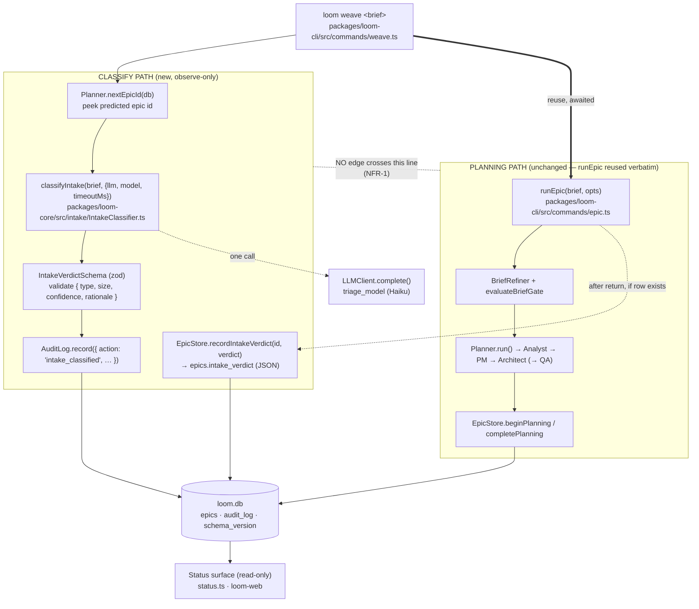

I'll ground the architecture in the actual codebase before writing. Let me explore the relevant seams in parallel.# `loom weave` — Phase 0 (Observe-Only Intake Classifier) Architecture

## Architecture Philosophy

Three constraints drive every decision in this epic. Each one is load-bearing; where they pull against convenience, they win.

1. **Observe-only is physical, not disciplinary (NFR-1).** The guarantee that planning and execution never change because a verdict exists is enforced by *topology*, not by a code-review promise. The classify path and the planning path share no abstraction, no import edge, and no awaited value. The verdict flows *out* of the run into `audit_log` and one new `epics` column; nothing flows *back in*. The regression test (`story-020-005`) exists to fail the moment that topology is violated.

2. **`loom epic` stays byte-identical — reuse, never fork (story-020-001 AC).** `loom weave` wraps `runEpic` and calls it unmodified. The verdict is attached *around* the existing call, never threaded *through* it. We accept a small amount of decoupling cost (predicting the epic id rather than receiving it) to keep `packages/loom-cli/src/commands/epic.ts` untouched.

3. **Additive-only, cheap, and bounded (FR-2, FR-4, NFR-3).** One migration, `ALTER TABLE … ADD COLUMN` only, version `22 → 23`. Exactly one triage-model call per invocation, reusing `policy.agents.triage_model` — zero new knobs. The classifier is best-effort: a failure records itself and the run continues untouched (FR-7).

The shape of P0 is therefore: **`loom weave` = `loom epic` + one recorded verdict that controls nothing.**

---

## Component Diagram



The only coupling between the two paths is the **predicted epic id** (read once, before either path runs) and the *post-hoc* verdict write. Planning never reads `epics.intake_verdict` or `classifyIntake`'s return value.

---

## Tech Stack

| Layer | Choice | Rationale |
|---|---|---|
| Command surface | `commander` + the `describe` spec system (`packages/loom-cli/src/describe/`) | `loom weave` registers exactly like `loom epic` via `applySpec(program.command('weave'), spec)`; the spec also satisfies FR-8's completeness test for free. |
| Classifier model call | Existing `LLMClient.complete()` (`ClaudeCliClient`) with `model: policy.agents.triage_model` | Reuses the proven LLM seam and the *existing* cheap-model knob (default `claude-haiku-4-5-20251001`). No new model wiring, no new knob (FR-2). |
| Verdict validation | `zod` (`IntakeVerdictSchema`) | Matches existing schema discipline (`CommandDescriptionSchema`, policy schemas). A malformed model response fails validation and is treated as a classification failure — never persisted as a fabricated class. |
| Persistence | `better-sqlite3`, additive migration in `runMigrations` (`packages/loom-core/src/state/Database.ts`) | Same per-column idempotent `ALTER TABLE … ADD COLUMN` pattern as migrations v20/v21/v22; one new column, version bump `22 → 23`. |
| Audit | `AuditLog.record()` (`packages/loom-core/src/state/AuditLog.ts`) | Durable, structured (`detail` is JSON) — the primary analysis surface for "how often does the verdict match the planner's output." |
| Status surface | `status.ts` (`renderLoomDir` + `JsonEpic`) and `loom-web` (`EpicStatus`/`EpicDetail`) | Read-only display only; mirrors how `gate:` is already surfaced per epic. |
| Docs / drift | `docs/capabilities.md` coverage fences + `loom doctor --capabilities` | FR-9: one row + one `` `loom weave` `` token inside the `<!-- coverage:command -->` fence. |

The deliberate non-decision: **no new technology enters the system.** Every layer is something loom already runs in production. That is the point of an observe-first phase.

---

## Data Models

### New `epics` column (migration v23 — additive)

```sql
-- packages/loom-core/src/state/Database.ts, inside runMigrations(db)
-- v23: observe-only intake verdict from `loom weave`. JSON blob of the
-- validated IntakeVerdict, or NULL for rows that were never classified
-- (every `loom epic` row, and any weave run whose classifier failed).
-- Additive only (ADR-005 / NFR-3); never DROP/TRUNCATE. Never read by any
-- planning or execution code path (NFR-1).
if (!epicCols.some((c) => c.name === 'intake_verdict')) {
  db.exec('ALTER TABLE epics ADD COLUMN intake_verdict TEXT');
}
```

Then bump the constant and let the existing tail logic persist it:

```typescript
const SCHEMA_VERSION = 23; // was 22
```

`NULL` is the canonical "no verdict recorded" state (FR-5): pre-existing rows, all `loom epic` rows, and any weave run where the single classification call failed.

### `IntakeVerdict` — the validated verdict shape (FR-3)

```typescript
// packages/loom-core/src/intake/IntakeClassifier.ts
import { z } from 'zod';

export const IntakeVerdictSchema = z.object({
  type:       z.enum(['feature', 'bug', 'chore']), // 'chore' is in-schema for MEASUREMENT ONLY (out of scope to consume)
  size:       z.enum(['story', 'epic']),
  confidence: z.enum(['low', 'medium', 'high']),
  rationale:  z.string().min(1).max(280),          // short, human-readable; bounded
});
export type IntakeVerdict = z.infer<typeof IntakeVerdictSchema>;

// Best-effort result — failure is a value, not a thrown control-flow signal (ADR-006).
export type ClassifyResult =
  | { ok: true;  verdict: IntakeVerdict }
  | { ok: false; reason: 'llm_error' | 'timeout' | 'invalid_output'; detail: string };
```

### `audit_log` row for the verdict (FR-4, distinguishable success/failure — story-020-003 AC)

The `audit_log` table is unchanged (`detail` already holds arbitrary JSON). The new **action** is `intake_classified`:

```jsonc
// success — detail column (JSON)
{ "epic_id": "epic-021", "ok": true,
  "verdict": { "type": "bug", "size": "story", "confidence": "high", "rationale": "…" },
  "model": "claude-haiku-4-5-20251001" }

// failure — same action, ok:false → distinguishable from a real verdict
{ "epic_id": "epic-021", "ok": false, "reason": "timeout", "detail": "triage call exceeded 20000ms" }
```

The audit row is the **durable, queryable** record (analysis surface). The `epics.intake_verdict` column is the **convenience** surface for status rendering; it is written only on success.

---

## API / Interface Contracts

These are the seams the seven stories must agree on. Signatures are the contract; prose is not.

```typescript
// ── classifier (loom-core) ─────────────────────────────────────────────
// packages/loom-core/src/intake/IntakeClassifier.ts
export async function classifyIntake(
  brief: string,
  opts: { llm: LLMClient; model: string; timeoutMs?: number /* default 20_000 */ }
): Promise<ClassifyResult>;
// Makes EXACTLY ONE llm.complete() call (FR-2). Wraps it in a timeout race so a
// hung triage call can never delay planning (FR-7/NFR-2). Any LLM error, parse
// error, zod failure, or timeout → { ok:false, … }. Never throws for these.

// ── persistence (loom-core) ────────────────────────────────────────────
// packages/loom-core/src/state/EpicStore.ts
recordIntakeVerdict(id: string, verdict: IntakeVerdict): void;  // UPDATE epics SET intake_verdict = json
getIntakeVerdict(id: string): IntakeVerdict | null;            // parse + zod-revalidate; NULL/garbage → null

// ── audit (loom-core) — existing signature, new action value ────────────
auditLog.record({ action: 'intake_classified', detail: { epic_id, ok, verdict? , reason?, detail?, model? } });

// ── command (loom-cli) ─────────────────────────────────────────────────
// packages/loom-cli/src/commands/weave.ts
export async function runWeave(
  brief: string,
  opts?: { force?: boolean; verbose?: boolean; llm?: LLMClient }
): Promise<void>;
export const spec: CommandDescription;   // FR-8 — appears in manifest, passes completeness test
```

### `runWeave` orchestration (the one non-obvious flow)

```typescript
export async function runWeave(brief, opts = {}) {
  const db = createDatabase(loomDir);
  const policy = PolicyEngine.load(loomDir).policyData;

  // 1. Peek the id runEpic WILL reserve. nextEpicId is read-only and deterministic
  //    within a single process; runEpic re-derives the same value on entry (ADR-002).
  const predictedId = Planner.nextEpicId(db);

  // 2. The single classification call — BEFORE planning (FR-2). Best-effort.
  const result = await classifyIntake(brief, {
    llm: opts.llm ?? defaultLlm(),
    model: policy.agents.triage_model,
  });

  // 3. Durable record, success OR failure (FR-4, FR-7). Always written.
  new AuditLog(db).record({
    action: 'intake_classified',
    detail: result.ok
      ? { epic_id: predictedId, ok: true, verdict: result.verdict, model: policy.agents.triage_model }
      : { epic_id: predictedId, ok: false, reason: result.reason, detail: result.detail },
  });

  // 4. REUSE runEpic verbatim — identical gate, planner, execution, epic (story-020-001).
  await runEpic(brief, opts);

  // 5. Opportunistic surfacing write. Decoupled from planning success: if the
  //    predicted row exists, attach the verdict; otherwise the audit row stands alone.
  if (result.ok) {
    const store = new EpicStore(db);
    if (store.get(predictedId)) store.recordIntakeVerdict(predictedId, result.verdict);
  }
}
```

Note what is *absent*: `runEpic` is called with no extra arguments, no callback, no shared classifier state. Step 5 reads `result` (a local) — never the database column. The planning path inside `runEpic` cannot observe any of this.

### Status surface contract (FR-6 — read-only)

- **CLI** (`packages/loom-cli/src/commands/status.ts`): in `renderLoomDir`, after the existing `gate:` line, render `verdict:` from `EpicStore.getIntakeVerdict(epic.id)`. `null` → print `verdict: no verdict`. Extend `JsonEpic` with `intake_verdict?: IntakeVerdict | null`.
- **Web** (`packages/loom-web/src/shared/types.ts`): add `intake_verdict?: IntakeVerdict | null` to `EpicStatus`/`EpicDetail`; render it as a read-only label in `renderDetail()`. Absent → `no verdict`, never a default class.

---

## Security & Integrity Model

This is internal maintainer tooling, so the "threats" are integrity and invariant-breach risks rather than external attackers.

| Threat | Control |
|---|---|
| **Observe-only breach** — planning/execution/gate/persona code reads or branches on the verdict (the constraint we will most regret violating). | Physical separation: classifier lives in a new `intake/` module the planner never imports; the verdict column is never read by `Planner`, personas, gate, or execution. Pinned by the `story-020-005` regression test asserting byte-identical planning across *no verdict / verdict present / every verdict value*, and asserting `loom epic` ≡ `loom weave` for the same brief. |
| **Fabricated classification** — a malformed or adversarial model response persisted as a real class. | `IntakeVerdictSchema` zod validation; any failure → `{ ok:false, reason:'invalid_output' }` → column stays `NULL`, failure audited. `getIntakeVerdict` re-validates on read so corrupt JSON degrades to "no verdict," never a default class (FR-5/FR-6). |
| **Migration data loss** — destroying or rewriting pre-existing epic data. | Migration is `ALTER TABLE … ADD COLUMN` only; no `DROP`/`TRUNCATE` (NFR-3). Pre-existing rows get `NULL` by definition of `ADD COLUMN`. Guarded by the same `schema_version` row update as every prior migration. |
| **Classifier stalls/fails the run** — triage call hangs or errors and blocks planning. | `classifyIntake` is best-effort with a `timeoutMs` race; all failures return a value, never throw past the caller; planning proceeds unchanged (FR-7/NFR-2). |
| **Cost blowup** — more than one model call, or an expensive model. | Exactly one `llm.complete()` call, bounded `maxTokens`, pinned to `policy.agents.triage_model` (Haiku). Asserted by the `story-020-002` test. |
| **Guardrail weakening** — relaxing a gate to fit the new command. | `loom weave` reuses `runEpic`'s gate and execution unmodified; no guardrail is touched (NFR-4). |

---

## ADR Log

### ADR-001 — `loom weave` wraps `runEpic`; it does not fork or modify it
**Decision.** `runWeave` calls `runEpic(brief, opts)` directly and unchanged. `packages/loom-cli/src/commands/epic.ts` is not edited.
**Context.** Story-020-001 requires identical gate/planner/execution and an identical epic, with `loom epic` source and behavior unchanged. The tempting alternative — extract a shared `planEpicCore()` and have both commands call it — *edits* `epic.ts`.
**Rationale.** Wrapping gives provable identity (same function, same bytes) and lets the `story-020-005` regression test assert equivalence trivially. The "reuse not fork" AC is satisfied literally.
**Trade-off.** `runEpic` returns `void`, so weave cannot *receive* the created epic id and must *predict* it (see ADR-002). We accept indirection in exchange for an untouched `loom epic`.

### ADR-002 — Attach the verdict by predicting the epic id via `Planner.nextEpicId(db)`
**Decision.** Read `Planner.nextEpicId(db)` once before classifying; treat that as the id `runEpic` will reserve; attach the verdict to that row after `runEpic` returns.
**Context.** Because of ADR-001 the id can't be returned. `nextEpicId` is the same static method `runEpic` itself calls on entry, and it is read-only.
**Rationale.** In a single CLI process nothing creates an epic between the peek and `runEpic`'s reservation, so predicted == actual. Cleaner than diffing "epics before/after," and it pre-computes the id for the audit row written *before* planning.
**Trade-off.** Relies on single-process determinism — a concurrent epic creation between peek and reserve would mis-attach. Acceptable for a single-user CLI; the durable audit row (which also carries `epic_id`) is the source of truth regardless.

### ADR-003 — Classify *before* planning, persist *independently* of it
**Decision.** The one classification call happens before `runEpic`; the audit row is written immediately and always; the epic-column write is opportunistic and post-hoc.
**Context.** FR-2 mandates the call precede planning; NFR-1 mandates zero behavioral coupling.
**Rationale.** Writing the audit row before planning guarantees the measurement record exists even if planning later fails or the process dies mid-plan (Goal 1: 100% of runs produce a readable verdict or a recorded failure). Decoupling the column write from planning success keeps the observe-only boundary clean.
**Trade-off.** The brief is loaded/handled twice (once by the classifier, once by `runEpic`). We accept minor duplication rather than share an abstraction that would create an edge across the observe-only line.

### ADR-004 — Single JSON `intake_verdict TEXT` column, not four typed columns
**Decision.** One additive column holding the validated verdict as JSON; structured/aggregable history lives in `audit_log.detail`.
**Context.** FR-4 permits "column(s)." The maintainer's analysis ("how often bug/story/epic, does it match the planner") is naturally a query over the audit log.
**Rationale.** Minimizes the migration to a single `ALTER`, keeps the epic row's verdict-vs-actual comparison co-located, and avoids four parallel nullable columns that must stay mutually consistent.
**Trade-off.** Cannot `WHERE intake_verdict.type = 'bug'` directly on `epics`; verdict analytics must parse JSON or query `audit_log`. Given audit_log is the intended analysis surface, this is the right place to pay the cost.

### ADR-005 — `NULL` means "no verdict"; the column is written only on success
**Decision.** `epics.intake_verdict` is `NULL` for every `loom epic` row and every failed classification; only a validated verdict is ever written.
**Context.** FR-5/FR-6 demand absent verdicts render honestly, never as a fabricated default. Story-020-003 demands success be distinguishable from failure.
**Rationale.** `NULL` is unfakeable and is the natural result of an additive `ADD COLUMN`. Failure is still fully recorded — in `audit_log` with `ok:false` — so success vs. failure vs. never-classified are three distinguishable states.
**Trade-off.** "Classified-but-failed" is not visible on the epic row itself; you must consult the audit log to see a failure. Acceptable: the status surface only needs the success/absent distinction, and "no verdict" is the honest rendering for both absent and failed.

### ADR-006 — Reuse `policy.agents.triage_model`; classifier returns a Result, never throws
**Decision.** Pin the call to the existing `triage_model` knob (no new config), and have `classifyIntake` return a `ClassifyResult` discriminated union instead of throwing for failures.
**Context.** FR-2 forbids new model knobs; FR-7/NFR-2 require best-effort, non-blocking behavior.
**Rationale.** Reusing the knob keeps the model surface flat (Goal 3) and aligns with the design-of-record's "reuse triage_model." A Result type makes "best-effort" a property of the *type signature*, so a caller physically cannot let a classifier failure abort planning.
**Trade-off.** `triage_model` now serves two consumers (intake classification and the intended per-story triage). A future need to tune them separately would require splitting the knob — a deliberate deferral, since both are cheap meta-work today.
