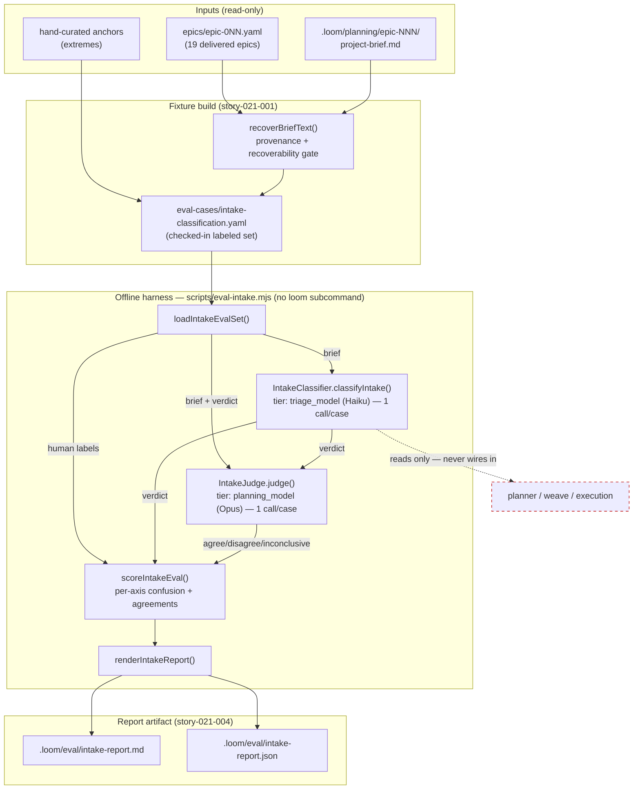

# Architecture — Classifier Evaluation Harness (Phase 0.5 Go/No-Go Gate)

Design of record: `docs/architecture/intake-classification.md`. This document specifies the **offline evaluation harness** that grades the Phase 0 `IntakeClassifier` and emits the go/no-go verdict for Phase 1. It measures the classifier and changes nothing the classifier feeds.

## Architecture Philosophy

Four constraints drive every decision below. Each one closes off otherwise-tempting designs.

1. **Observe-only is a physical invariant, not a convention.** Phase 0 already enforces — with a dedicated test, `packages/loom-cli/src/__tests__/weave-observe-only.test.ts` — that no planning-side module imports from the intake layer or reads `epics.intake_verdict`. The harness extends that boundary: it *reads* `classifyIntake` and the epic corpus, and it writes one report artifact. It imports nothing into the planner, the `weave` pipeline, or execution, and it adds no `loom` subcommand. The trade-off: the harness gets zero leverage from existing operator plumbing (no `loom` command, no DB-backed run state by default) — we pay that to keep the operator surface and the planning topology untouched.

2. **Reuse the established eval and judge conventions; add no parallel infrastructure.** Two patterns already exist and are load-bearing: the eval convention (`scripts/eval.mjs` + `npm run eval` driving `EvalRunner` over a checked-in YAML fixture in `packages/loom-core/eval-cases/`), and the LLM-as-judge convention (`SkillJudge` — zod-validated output, prompt bundled via `loadBundledPrompt`, `modelFor(policy, role)` for tier selection). We follow both. The trade-off named in ADR-001: `SkillJudge`'s *permissive-accept* degradation is wrong for evaluation, so we reuse the *pattern* (validation, bundled prompt, model resolution) in an eval-local `IntakeJudge` rather than calling `SkillJudge` itself.

3. **Three independent signals, never two.** Classifier vs. human, judge vs. human, judge vs. classifier. The judge is only trustworthy once it agrees with the human labels; agreement between judge and classifier alone could be two models sharing one blind spot. This forces the judge onto a *strictly stronger tier* (NFR-2) and forces the report to print judge-vs-human agreement as a first-class number.

4. **Honest counts over headline accuracy.** The corpus is ~19 epics plus a handful of anchors — small. A single accuracy figure would lie by rounding. The load-bearing output is a per-axis confusion matrix in raw counts, and the verdict is expressed in terms of *dangerous confusions* (epic→story under-sizing, per the asymmetric-cost rule) rather than one threshold. The trade-off: the report is longer and demands a human read it — that is the point of a go/no-go gate.

## Component Diagram



The dashed edge is the invariant: the harness consumes `classifyIntake` but no arrow runs from the harness into `planner / weave / execution`.

## Tech Stack

| Layer | Choice | Rationale |
|-------|--------|-----------|
| Language / runtime | TypeScript, Node.js 20+ | Matches the monorepo; no new toolchain. |
| Harness entry | `scripts/eval-intake.mjs` + `npm run eval:intake` | Mirrors `scripts/eval.mjs` exactly — the proven eval convention. NOT a `loom` commander subcommand (ADR-005). |
| Orchestration logic | `packages/loom-core/src/eval/Intake*.ts`, exported via `@loom-ai/core` | Lives beside `EvalRunner`; the `.mjs` stays a thin shell, so logic is unit-testable in-process. |
| Classifier (under test) | `classifyIntake()`, tier `triage_model` (`claude-haiku-4-5-20251001`) | The exact Phase 0 component and tier; calling it any other way would not measure Phase 0. |
| Judge | `IntakeJudge`, tier `planning_model` (`claude-opus-4-7`) via `modelFor(policy,'planning')` | Strictly stronger tier than triage (NFR-2); independent blind spots. |
| Judge prompt | `packages/loom-core/personas/intake-judge.md` via `loadBundledPrompt()` | Same bundling mechanism as `skill-judge.md`; prompt caching applies to the static rubric (CLAUDE.md invariant 3). |
| Validation | `zod` | Same library guarding `IntakeVerdictSchema` and `JudgeResultSchema` today. |
| Fixture format | YAML in `packages/loom-core/eval-cases/intake-classification.yaml` | Neighbour of `planning.yaml`; human-editable, diff-reviewable labels. |
| LLM transport | `createLLMClient(backend)` + Anthropic SDK w/ prompt caching | Reuses the one client factory; env knobs `LOOM_EVAL_BACKEND`, `LOOM_EVAL_MODEL` already understood by `scripts/eval.mjs`. |
| Report artifact | Markdown (human go/no-go) + JSON sidecar under `.loom/eval/` | Markdown is the thing a maintainer reads to decide; JSON sidecar keeps it machine-diffable. |
| Run history (optional) | `EvalRunStore` (`better-sqlite3`) | May record a one-number summary for drift; not load-bearing and off by default. |

## Data Models

### Fixture case (checked-in, human-authored labels)

```typescript
// packages/loom-core/src/eval/intakeEvalTypes.ts
import { z } from 'zod';

export const IntakeEvalCaseSchema = z.object({
  id:          z.string(),                          // 'epic-007' | 'anchor-obvious-bug'
  source:      z.enum(['epic', 'anchor']),
  brief:       z.string().min(1),                   // recovered brief text fed to the classifier
  brief_source: z.string().optional(),             // provenance, e.g. '.loom/planning/epic-007/project-brief.md'
  label: z.object({                                 // HUMAN ground truth
    type: z.enum(['feature', 'bug', 'chore']),      // matches IntakeVerdict.type
    size: z.enum(['story', 'epic']),                // matches IntakeVerdict.size
  }),
  rationale:    z.string().min(1),                  // why the human labeled it so
  story_count:  z.number().int().optional(),        // EVIDENCE ONLY (FR-3) — never the size ground truth
});

export const IntakeEvalSetSchema = z.object({ cases: z.array(IntakeEvalCaseSchema).min(1) });
export type IntakeEvalCase = z.infer<typeof IntakeEvalCaseSchema>;
```

`story_count` is recorded for context but is structurally barred from being the size label: size truth comes only from `label.size`, anchored on the hand-curated extremes (FR-3, ADR-004). The planner over-decomposes, so a high story count is weak evidence, not proof.

### Classifier verdict (existing — consumed unchanged)

```typescript
// packages/loom-core/src/intake/IntakeClassifier.ts  (DO NOT MODIFY)
export const IntakeVerdictSchema = z.object({
  type:       z.enum(['feature', 'bug', 'chore']),
  size:       z.enum(['story', 'epic']),
  confidence: z.enum(['low', 'medium', 'high']),
  rationale:  z.string().min(1).max(280),
});
export type ClassifyResult =
  | { ok: true;  verdict: IntakeVerdict }
  | { ok: false; reason: 'llm_error' | 'timeout' | 'invalid_output'; detail: string };
```

A `{ ok: false }` classifier result is recorded against the case as a classifier failure (it is a fact about Phase 0, distinct from a judge `inconclusive`).

### Judge outcome (eval-local; reuses the SkillJudge pattern, not its degradation)

```typescript
// packages/loom-core/src/eval/IntakeJudge.ts
export const IntakeJudgeResultSchema = z.object({
  type:  z.enum(['feature', 'bug', 'chore']),       // judge's INDEPENDENT classification
  size:  z.enum(['story', 'epic']),
  grade: z.enum(['agree', 'disagree']),             // grades the classifier verdict + rationale
  reason: z.string().default(''),
});

export type JudgeOutcome =
  | { status: 'ok';            result: z.infer<typeof IntakeJudgeResultSchema> }
  | { status: 'inconclusive';  detail: string };    // FR-9: outage/parse-fail → inconclusive, NEVER agreement
```

### Per-case run record and the scored report

```typescript
export interface IntakeRunRecord {
  case: IntakeEvalCase;
  classifier: ClassifyResult;     // exactly one classifier call (FR-4)
  judge: JudgeOutcome;            // exactly one judge call (FR-6)
}

export interface ConfusionMatrix {            // raw counts only (FR-10)
  axis: 'type' | 'size';
  labels: string[];                           // type: ['feature','bug','chore']; size: ['story','epic']
  counts: Record<string, Record<string, number>>;  // counts[labeled][predicted]
}

export interface AxisReport {
  axis: 'type' | 'size';
  accuracy: { correct: number; scored: number };    // exact-match vs human (FR-5)
  confusion: ConfusionMatrix;
  judgeVsClassifier: { agree: number; disagree: number; inconclusive: number };
  judgeVsHuman:      { agree: number; disagree: number; inconclusive: number };  // FR-7
  disagreements: Array<{ caseId: string; labeled: string; predicted: string;
                         judge: string; rationale: string }>;
  dangerousConfusions: Array<{ from: string; to: string; count: number; caseIds: string[] }>;
  verdict: { clearsBar: boolean; statement: string };   // plain-language (FR-8)
}

export interface IntakeEvalReport {
  generatedFromCases: number;
  classifierModel: string;        // echoed for auditability
  judgeModel: string;
  axes: AxisReport[];             // one per axis: type, size
  inconclusiveJudgeCount: number;
  overall: { proceed: boolean; statement: string };
}
```

## API / Interface Contracts

These are the seams the six stories must agree on. (The cross-story ownership of each lives in the separate implementation contract.)

```typescript
// Fixture build (story-021-001) — recoverability gate per FR-2
function recoverBriefText(epicId: string): { ok: true; text: string; source: string }
                                         | { ok: false; reason: string };
//   Resolution order: .loom/planning/<epicId>/project-brief.md  →  epic YAML title+description fallback.
//   A case whose brief is NOT recoverable is EXCLUDED from the fixture and logged — never fabricated.

// Loader (story-021-002)
function loadIntakeEvalSet(path?: string): IntakeEvalCase[];   // default: eval-cases/intake-classification.yaml

// Judge (story-021-003) — reuses loadBundledPrompt('intake-judge') + zod validation
class IntakeJudge {
  constructor(opts: { llm: LLMClient; model: string });        // model = modelFor(policy, 'planning')
  judge(brief: string, verdict: IntakeVerdict): Promise<JudgeOutcome>;
}

// Orchestration (story-021-002 scaffolds; 021-003/004 extend)
async function runIntakeEval(
  cases: IntakeEvalCase[],
  deps: { llm: LLMClient; classifierModel: string; judgeModel: string },
): Promise<IntakeRunRecord[]>;                                  // 1 classifier + 1 judge call per case (NFR-1)

// Scoring + report (story-021-004)
function scoreIntakeEval(records: IntakeRunRecord[]): IntakeEvalReport;
function renderIntakeReport(report: IntakeEvalReport): { markdown: string; json: string };
```

Contract notes the implementers must honour:

- **Exactly one call each.** `runIntakeEval` issues one `classifyIntake` and one `IntakeJudge.judge` per case. No retries-as-extra-samples (NFR-1).
- **The classifier is consumed, never reconstructed.** The harness calls `classifyIntake` from `@loom-ai/core` with `model = triage_model`. It does not re-implement the prompt or read the verdict from `epics.intake_verdict`.
- **`inconclusive` is excluded from agreement denominators.** Both `judgeVsClassifier` and `judgeVsHuman` count `agree`/`disagree` over scored cases; `inconclusive` is reported separately and never folds into agreement (FR-9, ADR-001).

## Integrity & Invariant Model

This harness has no network ingress and no operator surface, so the relevant threats are to *measurement integrity* and to the *observe-only invariant* — the things that, if violated, make the go/no-go gate lie or make Phase 0 stop being observe-only.

| Threat | Control |
|--------|---------|
| Harness silently alters what the classifier feeds (breaks observe-only, NFR-3) | No import from harness into `planner/`, `brief/`, `guardrails/`, `weave.ts`; the existing `weave-observe-only.test.ts` topology guard remains green. Harness reads `classifyIntake` and writes only `.loom/eval/`. |
| Judge outage/non-determinism silently inflates agreement (FR-9) | `IntakeJudge` returns `inconclusive` on any failure (no permissive-accept); scorer excludes it from agreement and prints `inconclusiveJudgeCount`. ADR-001. |
| Judge shares the classifier's blind spot (NFR-2) | Judge pinned to `planning_model` (Opus 4.7), strictly stronger than triage `Haiku`; report prints judge-vs-human so a colluding judge is visible. |
| Fabricated or mismatched brief text makes the score meaningless (FR-2) | `recoverBriefText` is a hard gate with recorded `brief_source` provenance; unrecoverable cases are excluded, not stubbed. |
| Story counts smuggled in as size truth (FR-3) | `story_count` is a separate optional field; size truth is `label.size` only; scorer never reads `story_count`. |
| Small sample read as authoritative (FR-10) | Confusion cells are raw counts; verdict is phrased in dangerous-confusion counts, not a rounded accuracy. |
| A guardrail weakened in passing (NFR-4) | No policy/guardrail file is in any story's ownership; story-021-006 runs the full suite to prove it. |

## ADR Log

### ADR-001 — Reuse the `SkillJudge` *pattern* in an eval-local `IntakeJudge`, not `SkillJudge` itself
**Decision.** Build `IntakeJudge` in `packages/loom-core/src/eval/`, following the `SkillJudge` convention (zod-validated output, `loadBundledPrompt`, `modelFor`), with a new prompt `personas/intake-judge.md`.
**Context.** FR-11 says reuse the `SkillJudge` LLM-judge pattern; the Out-of-Scope list forbids net-new judge infrastructure parallel to it. But `SkillJudge.judge()` catches all failures and returns `{ score: 999, verdict: 'accept' }` — *permissive-accept*. FR-9 demands the opposite: a missing judge result is `inconclusive`.
**Rationale.** The judge's *output shape* and *failure semantics* differ from `SkillJudge` (it classifies two axes and grades, and it must surface failure), so calling `SkillJudge` directly would be wrong, while cloning its whole class would be the forbidden parallel infrastructure. Reusing the pattern — same three primitives — threads both requirements.
**Trade-off.** A second judge prompt and result type now exist. We accept that small duplication to get correct `inconclusive` handling, rather than bending `SkillJudge`'s degradation (which the skill-generation path depends on).

### ADR-002 — Judge on `planning_model` (Opus), classifier stays on `triage_model` (Haiku)
**Decision.** `IntakeJudge` resolves its model via `modelFor(policy, 'planning')`; the classifier is invoked with `triage_model`.
**Context.** NFR-2 requires a strictly stronger, independent tier. Defaults today: `triage_model = claude-haiku-4-5-20251001`, `planning_model = claude-opus-4-7`.
**Rationale.** Reusing the existing tier knobs keeps the harness configuration-driven and guarantees the judge is not the same model as the thing it grades.
**Trade-off.** One Opus call per case is the harness's dominant cost. Acceptable because NFR-1 keeps the set small (~22 cases) and one call per case caps the bill.

### ADR-003 — Recover brief text from planning artifacts with a hard recoverability gate; exclude what cannot be recovered
**Decision.** `recoverBriefText` resolves `.loom/planning/<epicId>/project-brief.md` first, falls back to the epic YAML `title`+`description`, and records `brief_source`. Cases with no recoverable brief are excluded and logged.
**Context.** FR-2 requires confirming recoverability for every included case. Only ~12 of the 19 epics currently retain a `project-brief.md`; `prd_ref` paths in the YAMLs are stale.
**Rationale.** Feeding the classifier a fabricated or reverse-engineered brief would measure the fixture author, not Phase 0. A hard gate keeps the corpus honest even if it shrinks.
**Trade-off.** The bootstrapped set may be smaller than 19. We accept fewer, trustworthy cases over more, contaminated ones — and the anchors backstop the extremes regardless.

### ADR-004 — Size ground truth is anchored on human anchors; story counts are evidence only
**Decision.** `label.size` is the only size truth; `story_count` is an optional context field the scorer never reads.
**Context.** FR-3: the planner over-decomposes, so historical story counts overstate size.
**Rationale.** Anchoring on hand-curated extremes (an obvious single-story change, an obviously large multi-story epic) pins the scale to human judgment, immune to planner inflation.
**Trade-off.** Size labels carry human subjectivity on the middle cases. The rationale field and the anchors make that judgment auditable, which is the best available with a small corpus.

### ADR-005 — Harness entry is `scripts/eval-intake.mjs` + `npm run eval:intake`; no `loom` subcommand, no new bin
**Decision.** A thin `.mjs` shell over `@loom-ai/core` logic, invoked by an npm script, mirroring `scripts/eval.mjs`.
**Context.** FR-11/NFR-3 forbid an operator-facing command. `loom-bench` exists as a dev binary, but adding a subcommand there is heavier than the `scripts/eval.mjs` precedent and risks reading as operator tooling.
**Rationale.** The eval convention is already a dev-only, npm-driven entry; matching it keeps the operator CLI (`loom`'s commander) byte-identical and the logic unit-testable in `loom-core`.
**Trade-off.** Maintainers discover the harness via `package.json` scripts, not `loom --help`. That is correct: this is a maintainer gate, not an operator feature.

### ADR-006 — Verdict is expressed in dangerous-confusion counts, not a single accuracy threshold
**Decision.** Each `AxisReport` lists `dangerousConfusions` (notably the `epic`-labeled→`story`-predicted cell) and phrases `verdict.statement` against those counts; thresholds live in config, not in code.
**Context.** FR-8/FR-10 and the asymmetric-cost rule in the design of record: under-sizing yields a thin unit that fails; over-sizing only wastes planning. Setting final thresholds is explicitly Out of Scope.
**Rationale.** With ~22 cases, a headline accuracy rounds away exactly the rare, costly confusions the gate exists to catch. Counting the dangerous cell directly is both honest and decision-relevant for the Phase 2 author calibrating default-to-richer.
**Trade-off.** The verdict needs a human to read it against a stated bar rather than a green/red bit. That deliberation is the gate's purpose.

### ADR-007 — Report artifact is Markdown for the human plus a JSON sidecar, written under `.loom/eval/`
**Decision.** `renderIntakeReport` emits both; the `.mjs` writes `intake-report.md` and `intake-report.json` to `.loom/eval/`.
**Context.** `scripts/eval.mjs` prints to console only; SWE-bench writes `predictions.json`. The go/no-go output must persist and be readable.
**Rationale.** Markdown is what a maintainer reads to authorize Phase 1; the JSON sidecar keeps the matrices diffable across reruns and machine-checkable in tests.
**Trade-off.** Two artifacts to keep in sync. The single `renderIntakeReport` function is their one source, so they cannot drift.

### ADR-008 — Register Phase 0.5 explicitly in the design of record
**Decision.** Add a Phase 0.5 entry to `docs/architecture/intake-classification.md` (story-021-005) naming this harness the go/no-go gate and pointing at the report artifact as the evidence basis.
**Context.** FR-12 (`[ASSUMPTION]`): the doc currently folds the measurement into Phase 0's "Measures:" bullet with no named gate.
**Rationale.** The phased rollout claims Phase 0 "proves the classifier is trustworthy before it decides anything" — that proof needs a named, locatable gate, not a buried bullet.
**Trade-off.** A documentation edit ships in an otherwise code-centric epic. Cheap, and it makes the gate referenceable by the Phase 1 author.
