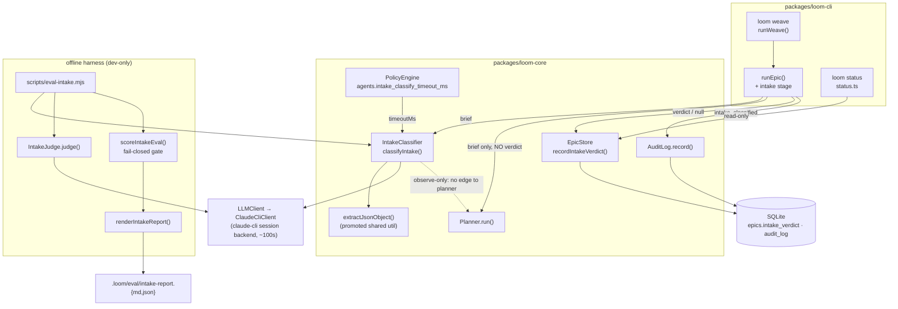

I'll ground this architecture in the actual Phase 0 code before writing. Let me explore the relevant subsystems.# Architecture — Phase 0.5: Wire and Harden the Intake Classifier

## Architecture Philosophy

This is a hardening phase, not a build phase. Phase 0 already shipped every component named below; the machinery is present, tested green, and wrong in four specific places. The architecture's job is to wire what exists and close the gaps without inventing new abstractions. Four constraints drive every decision:

1. **Observe-only is structural, not behavioral (NFR-1, sacred).** The verdict must never reach a decision. We enforce this by topology — the planner is handed only the `brief`, there is no code path from `epics.intake_verdict` back into planning, persona selection, the quality gate, or execution — and we guard it with a diff test that asserts byte-identical planning/execution output with the verdict present vs. absent. Safety is a property of the wiring diagram, not of careful coding.
2. **Best-effort intake must never degrade the core path (FR-3).** Classification is a side-signal bolted onto a working pipeline. Every failure mode — timeout, parse failure, backend outage — collapses to a recorded `null` verdict and a logged reason; `loom weave` still plans and creates the epic. The classifier is allowed to fail; it is not allowed to abort.
3. **Gates fail closed (FR-7, FR-8, FR-9).** The Phase 0 gate failed *open*: it derived `PROCEED` from "zero dangerous confusions" while silently `continue`-ing past every failed case, so 22 failures read as a clean bill of health. A trustworthy gate treats absence of data as absence of evidence. `PROCEED` must require a floor of successfully scored cases and low failure/inconclusive rates; everything else is `DO_NOT_PROCEED` or `INCONCLUSIVE`, with honest counts surfaced and a non-zero exit code.
4. **Reuse, don't rebuild (NFR-5).** The classifier, judge, eval harness, three persistence sinks, and the `intake_verdict` column all exist. We extend their seams. The one new artifact is a *shared* JSON extractor promoted out of the judge — because the divergence between the judge's tolerant `extractJsonBlock` and the classifier's bare `JSON.parse` is itself one of the four defects.

## Component Diagram



The load-bearing fact in this diagram is the *absence* of an edge: `classifier` never feeds `planner`, `store`'s verdict read is consumed only by `status`, and the eval subgraph shares no state with the runtime path. That topology is the observe-only invariant.

## Tech Stack

| Layer | Choice | Rationale |
|---|---|---|
| Runtime | TypeScript / Node.js 20+ | Existing stack; no change. Hardening must not introduce a new toolchain. |
| LLM transport | `LLMClient` interface → `ClaudeCliClient` | Already abstracts the `claude-cli` session backend. The ~100s latency that broke the 20s timeout is a property of *this* backend; the interface lets the eval inject `MockLLMClient` unchanged. |
| Classifier model | `claude-haiku-4-5-20251001` (`policy.agents.triage_model`) | One cheap call per classification (NFR-3). Already the configured default; unchanged. |
| Judge model | `claude-opus-4-8` (`policy.planning_model`, override `LOOM_JUDGE_MODEL`) | One stronger call per case (NFR-3). The judge stays Opus to grade Haiku's verdicts credibly. |
| Validation | `zod` (`IntakeVerdictSchema`, `IntakeJudgeResultSchema`, `IntakeEvalCaseSchema`) | Defense-in-depth behind the tolerant extractor: extract permissively, then validate strictly. |
| State | `better-sqlite3` — `epics.intake_verdict TEXT` (migration v23), `audit_log` | Verdict is JSON-in-TEXT, `NULL` = no verdict. Column already migrated; nothing schema-level to add. |
| Config | `PolicySchema` (`policy.yaml`, loaded by `PolicyEngine.load`) | New key `agents.intake_classify_timeout_ms` rides the existing policy loader — no new config surface (Invariant: policy is the one knob registry). |
| Eval reporting | `renderIntakeReport()` → `.loom/eval/intake-report.{md,json}` | Single report object renders both artifacts so `.md` and `.json` cannot drift. Unchanged mechanism; the *report shape* gains failure counts. |

## Data Models

### Verdict (unchanged — the contract every sink serializes)

```typescript
// packages/loom-core/src/intake/IntakeClassifier.ts:4
const IntakeVerdictSchema = z.object({
  type:       z.enum(['feature', 'bug', 'chore']),  // → (future) worker template + gate rubric
  size:       z.enum(['story', 'epic']),            // → (future) planning depth
  confidence: z.enum(['low', 'medium', 'high']),
  rationale:  z.string().min(1).max(280),
});
type IntakeVerdict = z.infer<typeof IntakeVerdictSchema>;

// Result is a value, never a throw — every failure is a typed outcome:
type ClassifyResult =
  | { ok: true;  verdict: IntakeVerdict }
  | { ok: false; reason: 'llm_error' | 'timeout' | 'invalid_output'; detail: string };
```

### Persistence — the three sinks (existing)

```sql
-- Sink A: database. Migration v23, Database.ts:383. NULL = no verdict; never read by planning.
ALTER TABLE epics ADD COLUMN intake_verdict TEXT;   -- JSON.stringify(IntakeVerdict)

-- Sink B: audit log. One row per classification ATTEMPT (success or failure).
CREATE TABLE audit_log (
  id INTEGER PRIMARY KEY AUTOINCREMENT,
  agent_id TEXT, action TEXT NOT NULL, command TEXT,
  allowed INTEGER, policy_rule TEXT, detail TEXT,
  timestamp DATETIME NOT NULL DEFAULT CURRENT_TIMESTAMP
);
-- action = 'intake_classified' (INTAKE_AUDIT_ACTION), detail = JSON {epicId, ok, reason?, verdict?}
```

Sink C (status surface) is a *read* of Sink A: `status.ts:321` renders `verdict: ${type}/${size} (${confidence})` or `no verdict`, and emits `intake_verdict: IntakeVerdict | null` in JSON mode.

### Eval report — shape change for fail-closed reporting (story-022-004)

```typescript
// EXTEND IntakeEvalReport (intakeEvalTypes.ts). Additions marked [+].
type GateDecision = 'PROCEED' | 'DO_NOT_PROCEED' | 'INCONCLUSIVE';   // [+] replaces boolean

interface IntakeEvalReport {
  generatedFromCases: number;
  classifierModel: string;
  judgeModel: string;
  axes: AxisReport[];                 // per-axis accuracy + confusion (unchanged)
  inconclusiveJudgeCount: number;

  // [+] Honest accounting — no case is silently dropped:
  failureCounts: {                    // FR-9
    timeout: number;
    invalid_output: number;
    llm_error: number;
    scored: number;                   // classifier.ok === true
    total: number;
  };
  thresholds: {                       // FR-8 — recorded in the artifact for auditability
    minScoredCases: number;
    maxClassifierFailureRate: number;
    maxJudgeInconclusiveRate: number;
  };

  overall: { decision: GateDecision; statement: string };  // [+] was { proceed: boolean }
}
```

## API / Interface Contracts

These are the seams independent story-agents must agree on.

```typescript
// 1. Classifier (story-022-002, -003). Signature stable; default and internals change.
function classifyIntake(
  brief: string,
  opts: { llm: LLMClient; model: string; timeoutMs?: number },
): Promise<ClassifyResult>;
// Default timeout: 20_000 → INTAKE_TIMEOUT_DEFAULT_MS (180_000). Enforced via Promise.race (unchanged).

// 2. Shared JSON extractor (story-022-003). PROMOTED from IntakeJudge's extractJsonBlock to a
//    single owned module; both classifier and judge call it. Tolerant of prose + ```json fences.
//    packages/loom-core/src/llm/extractJson.ts
function extractJsonObject(text: string): unknown;   // throws on no recoverable object; caller Zod-validates

// 3. Timeout config (story-022-002). New policy key + clamp floor.
// PolicySchema.agents:
//   intake_classify_timeout_ms?: z.number().int().min(1000).optional()
// Effective value = max(policy.agents.intake_classify_timeout_ms ?? INTAKE_TIMEOUT_DEFAULT_MS,
//                       INTAKE_TIMEOUT_FLOOR_MS)   // FR-5: never capped below backend latency

// 4. Persistence (story-022-001). Existing methods; weave path now calls them.
EpicStore.recordIntakeVerdict(id: string, verdict: IntakeVerdict): void;  // EpicStore.ts:454
AuditLog.record(entry: { action: string; command?: string; allowed?: boolean;
                         detail?: Record<string, unknown>; agent_id?: string }): void;

// 5. Intake stage in the create path (story-022-001). runEpic gains an OPTIONAL intake hook;
//    `loom weave` passes it, `loom epic` does not. Best-effort: wrapped so it never throws upward.
type IntakeStage = { llm: LLMClient; model: string; timeoutMs: number };
function runEpic(brief: string, opts?: { /* existing */ intake?: IntakeStage;
                                         _classifyIntake?: typeof classifyIntake }): Promise<void>;

// 6. Fail-closed gate (story-022-004). Pure decision over the run records — no I/O.
function decideGate(report: Omit<IntakeEvalReport, 'overall'>): { decision: GateDecision; statement: string };
//   scored < minScoredCases                         → INCONCLUSIVE
//   classifierFailureRate > maxClassifierFailureRate → DO_NOT_PROCEED
//   judgeInconclusiveRate > maxJudgeInconclusiveRate → INCONCLUSIVE
//   !(typeAxis.clearsBar && sizeAxis.clearsBar)      → DO_NOT_PROCEED
//   else                                             → PROCEED
// scripts/eval-intake.mjs exit code: PROCEED→0, DO_NOT_PROCEED→1, INCONCLUSIVE→2
```

**Recommended starting thresholds** (fixed during implementation, recorded in the report per FR-8): `minScoredCases = 18` of 22 (~80%), `maxClassifierFailureRate = 0.10`, `maxJudgeInconclusiveRate = 0.10`. These are deliberately strict so the canonical failure case — all 22 calls fail → `scored = 0 < 18` → `INCONCLUSIVE`, never `PROCEED`.

## Security Model

The threats here are integrity/trust threats, not classic confidentiality ones — the danger is a wrong signal silently influencing real decisions, or a green light issued on no evidence.

| Threat | Control |
|---|---|
| **Verdict leaks into a decision** (planner, quality gate, persona selection, execution) — NFR-1, sacred | Structural: `intake_verdict` has no reader on any runtime path; `Planner.run` receives only `brief`. Guarded by a diff test asserting byte-identical planning + execution output with verdict present vs. absent (story-022-001 AC). No consumer is added this phase. |
| **Fail-open gate green-lights Phase 1 on no data** | `decideGate` requires `scored ≥ minScoredCases` before `PROCEED` is reachable; failures are counted, not `continue`-d. Non-zero exit code on non-`PROCEED` so an operator/CI cannot miss it. |
| **Best-effort swallows a real backend outage silently** | Every classification *attempt* writes an `audit_log` row with `ok`/`reason`; failures persist `NULL` verdict and surface as `no verdict` in `loom status`. Absence is visible, not hidden. |
| **Tolerant JSON extractor accepts adversarial/garbage output** | Extract permissively, then `IntakeVerdictSchema.safeParse`; `rationale` is length-bounded (≤280) and the verdict is observe-only, so a malformed verdict can corrupt nothing downstream. |
| **Hardening weakens a guardrail** — NFR-2 | No policy relaxation. The one new policy key (`intake_classify_timeout_ms`) only *raises* a timeout; classification runs in the existing trust boundary and issues no new commands. `loom guard check` semantics unchanged. |

## ADR Log

These continue the numbered log in `docs/architecture/intake-classification.md` (latest there is ADR-008).

### ADR-009 — Run intake as an optional stage inside `runEpic`, not a separate orchestrator
**Decision.** `runEpic` gains an optional `intake` stage that fires right after epic-id reservation; `loom weave` enables it, `loom epic` does not.
**Context.** The verdict must persist *against the epic `weave` creates* (FR-2), and the epic id is reserved inside `runEpic` (`epic.ts:89`). Persistence (`recordIntakeVerdict`), audit, and status all key on that id.
**Rationale.** Co-locating classification with id reservation and the three sinks means the verdict and the epic it describes are written in one place, against one id, with no id plumbed across module boundaries. It reuses the dormant `_classifyIntake` seam rather than building a new coordinator (NFR-5).
**Trade-off.** `runEpic` carries an optional branch it didn't before — a small altitude cost — instead of a clean standalone `IntakeOrchestrator`. We accept the coupling to avoid threading a reserved id out of `runEpic` and back in.

### ADR-010 — Classify before planning, serially
**Decision.** The intake stage awaits the classifier (bounded by timeout) before `Planner.run`, rather than racing classification concurrently with planning.
**Context.** FR-1/AC require the classifier to run "before the epic planner." The backend is ~100s; planning is also slow.
**Rationale.** Serial ordering satisfies the literal contract, keeps the control flow boring and linear (one thing at a time, easy to reason about for the observe-only diff test), and the verdict is guaranteed present before planning starts.
**Trade-off.** Weave wall-clock grows by up to the classification time (~100s typical, timeout worst case). Acceptable for a developer-facing command; concurrent classify-while-planning is a future optimization, explicitly deferred.

### ADR-011 — Generous fixed timeout default with a hard floor, configurable upward
**Decision.** Default `INTAKE_TIMEOUT_DEFAULT_MS = 180_000`; configurable via `policy.agents.intake_classify_timeout_ms`; clamped to `INTAKE_TIMEOUT_FLOOR_MS = 120_000`.
**Context.** The hardcoded 20s default guaranteed a timeout against a ~100s backend; FR-4/FR-5 require a bound comfortably above real latency that can never be set below it.
**Rationale.** A fixed generous default is boring and predictable. The floor enforces FR-5 structurally — even a misconfigured `policy.yaml` cannot cap a single cheap call below the backend's real latency. Per-backend adaptive timeouts were rejected as over-engineering for one backend.
**Trade-off.** A genuinely hung backend now stalls weave for up to 3 minutes before the best-effort path gives up. Best-effort means it still completes; it just waits. We trade latency-under-failure for zero false timeouts under normal load.

### ADR-012 — One shared, tolerant JSON extractor + assistant prefill
**Decision.** Promote the judge's `extractJsonBlock` to a single owned module `src/llm/extractJson.ts` (`extractJsonObject`), call it from both classifier and judge, and add a forceful system instruction plus an assistant-turn prefill that opens the JSON object (`{`).
**Context.** The classifier used bare `JSON.parse(response.text)` (`IntakeClassifier.ts:57`) while the judge already tolerated fences via `extractJsonBlock`. The cheap model returns prose; the classifier choked, the judge didn't. Divergent parsers are the defect.
**Rationale.** One extractor is one source of truth — the classifier inherits the judge's already-proven tolerance, and they cannot drift again. Prefill (`messages: [..., { role: 'assistant', content: '{' }]`, then re-prepend `{`) steers the cheap model toward emitting the object directly, reducing reliance on recovery.
**Trade-off.** A permissive extractor can accept a *malformed* object that prose-stripping happened to salvage. Mitigated by mandatory `IntakeVerdictSchema` validation downstream and the verdict's observe-only status, so a bad parse degrades to `invalid_output`, never to a corrupt decision.

### ADR-013 — Tri-state, fail-closed gate keyed on scored-case floor and failure rates
**Decision.** Replace `overall: { proceed: boolean }` with `overall: { decision: 'PROCEED' | 'DO_NOT_PROCEED' | 'INCONCLUSIVE' }`, gate `PROCEED` behind a minimum scored-case count and low failure/inconclusive-rate thresholds, surface failure-reason counts, and map the decision to process exit codes.
**Context.** The Phase 0 gate derived `proceed` from dangerous-confusion counts while `continue`-ing past failed cases (`scoreIntakeEval.ts:29,95`), so 22 failures → 0 confusions → `PROCEED`. It failed open.
**Rationale.** A boolean cannot distinguish "passed" from "no evidence." The third state, `INCONCLUSIVE`, names insufficient data explicitly; the scored-case floor makes `PROCEED` unreachable without real evidence; surfaced counts make the failure honest (FR-9). Exit codes propagate the verdict to CI/operators.
**Trade-off.** More report surface and three branches instead of one boolean. Thresholds are judgment calls that need recording and occasional tuning. We accept the extra surface as the price of a gate you can trust.

### ADR-014 — Record the honest re-run as the evidence artifact, even if it says DO NOT PROCEED
**Decision.** Story-022-005 re-runs the harness against the labeled set and commits `.loom/eval/intake-report.{md,json}` with real per-axis accuracy and the gate's honest decision — a legitimate `DO_NOT_PROCEED` is an acceptable, recorded outcome.
**Context.** Phase 0's "green" was a false green. Improving accuracy or forcing `PROCEED` is explicitly out of scope.
**Rationale.** The deliverable is a *trustworthy measurement*, not a passing grade. Committing the report (whatever it says) makes the result auditable and the gate's behavior verifiable against real numbers.
**Trade-off.** The phase may close with an honest "the classifier doesn't clear the bar." That is the intended success condition for trust, even though it leaves Phase 1 ungated until accuracy work (a later phase) lands.
