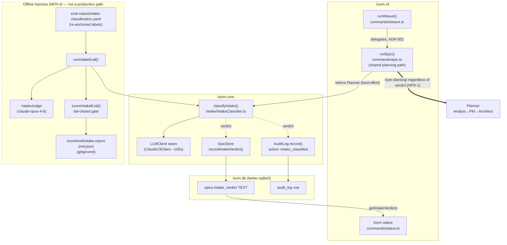

I'll ground this architecture in the real loom codebase before writing. Let me explore the relevant components.Let me verify the key files directly so the contracts and signatures are exact.# Loom Weave Intake Classifier — Hardening Architecture (epic-023)

## Architecture Philosophy

This epic does not build a new system; it hardens and proves one that already exists in `packages/loom-core/src/intake/` and `packages/loom-core/src/eval/`. NFR-5 ("Reuse and harden — do not rebuild") is therefore the dominant constraint, and it shapes every decision below: we extend `classifyIntake`, `runEpic`, `EpicStore`, `AuditLog`, and `scoreIntakeEval` in place rather than introducing parallel machinery.

Four constraints drive the design:

1. **Observe-only is a hard, structural invariant (NFR-1).** The verdict is written to three sinks and read by `loom status`, but the planning and execution code paths must be byte-identical whether the verdict is present, absent, or garbage. The wiring must therefore be a *leaf side-effect* — never an input to any downstream decision — and that property must be pinned by a regression test, not by convention.
2. **The classifier runs behind a session-subprocess LLM, not the raw SDK.** `classifyIntake` calls through the `LLMClient` seam, whose production implementation (`ClaudeCliClient`) shells out to `claude -p` with ~100s real latency. The existing 20s default timeout guarantees failure. Timeouts, JSON recovery, and "best-effort" persistence all exist because this backend is slow and its output is conversational, not pure JSON.
3. **The test must read the write, not a parallel copy.** `Database.ts` exposes a process-global singleton (`openDatabase`) *and* a fresh-handle constructor (`createDatabase`). The prior end-to-end test failed because it read through a different handle than the write used. Correctness of the proof depends on reading through the **same** handle.
4. **The yardstick must be trustworthy before the score means anything.** Some size labels were bootstrapped from loom's own over-decomposition (`story_count`), which is exactly the bias under test. Re-anchoring labels on *intrinsic* scope — conservatively, with each change documented — is a prerequisite for the re-run's verdict to mean anything. We measure with a fail-closed gate so an unproven classifier reports do-not-proceed rather than a flattering number.

## Component Diagram



The dashed cluster is the offline developer harness; it shares `classifyIntake` with the production path but is invoked only via `scripts/eval-intake.mjs`. The thick edge from `runEpic` to `Planner` is the path that NFR-1 forbids the verdict from touching.

## Tech Stack

| Layer | Choice | Rationale |
|---|---|---|
| Language / runtime | TypeScript, Node 20+ | Existing stack; no change. |
| LLM access | `LLMClient` seam → `ClaudeCliClient` (session subprocess) | Already the abstraction `classifyIntake` depends on. Keeps the classifier testable with a stub and isolates the ~100s latency that drives ADR-004. |
| Classifier model | cheap model via `classifierModel` | NFR-3: exactly one cheap classifier call per case. |
| Judge model | `claude-opus-4-8` (env `LOOM_JUDGE_MODEL`) | NFR-3: one stronger-model judge call per case; independent grader (ADR-008 anchor). |
| Schema validation | `zod` (`IntakeVerdictSchema`) | Already validates verdicts on both write and read; degrades corrupt JSON to a typed failure rather than crashing. |
| State | `better-sqlite3` (`epics.intake_verdict`, `audit_log`) | Verdict column already shipped (schema v23). Synchronous API makes the singleton-robust read straightforward (ADR-003). |
| Eval fixtures | YAML (`eval-cases/intake-classification.yaml`) | Human-editable; suits documented, conservative label re-anchoring (FR-11). |
| Config | `.loom/policy.yaml` → `PolicySchema` (`packages/loom-core/src/types.ts`) | New timeout knob lives beside existing `agents` knobs like `min_brief_quality_score`; no new config system (boring choice). |

## Data Models

The verdict shape already exists and **must not change** (other code, including the eval, depends on it):

```typescript
// packages/loom-core/src/intake/IntakeClassifier.ts — UNCHANGED
const IntakeVerdictSchema = z.object({
  type:       z.enum(['feature', 'bug', 'chore']),
  size:       z.enum(['story', 'epic']),
  confidence: z.enum(['low', 'medium', 'high']),
  rationale:  z.string().min(1).max(280),
});
type IntakeVerdict = z.infer<typeof IntakeVerdictSchema>;

type ClassifyResult =
  | { ok: true;  verdict: IntakeVerdict }
  | { ok: false; reason: 'llm_error' | 'timeout' | 'invalid_output'; detail: string };
```

Persistence sinks (all already present; this epic *writes* to them, it does not migrate them):

```sql
-- epics.intake_verdict: JSON-serialized IntakeVerdict, nullable (schema v23, already shipped)
ALTER TABLE epics ADD COLUMN intake_verdict TEXT;

-- audit_log row written with action = 'intake_classified' (INTAKE_AUDIT_ACTION)
-- detail JSON carries the verdict on success, or {reason, detail} on failure.
CREATE TABLE audit_log (
  id          INTEGER PRIMARY KEY AUTOINCREMENT,
  agent_id    TEXT,
  action      TEXT NOT NULL,     -- 'intake_classified'
  command     TEXT,              -- brief.slice(0, 120)
  allowed     INTEGER,           -- 1 on ok, 0 on classifier failure
  policy_rule TEXT,
  detail      TEXT,              -- JSON.stringify(verdict | {reason, detail})
  timestamp   DATETIME NOT NULL DEFAULT CURRENT_TIMESTAMP
);
```

The eval report grows two fields so the gate can fail closed on coverage, not just on dangerous confusions (FR-9, FR-10). This is an additive extension of the existing `IntakeEvalReport`:

```typescript
// packages/loom-core/src/eval/intakeEvalTypes.ts — EXTENDED (additive)
interface IntakeEvalReport {
  generatedFromCases: number;
  classifierModel: string;
  judgeModel: string;
  axes: AxisReport[];                 // 'type' then 'size'
  inconclusiveJudgeCount: number;
  // NEW (story-023-004):
  failureCounts: {                    // FR-10: surfaced, never silently dropped
    classifier: Record<'llm_error' | 'timeout' | 'invalid_output', number>;
    judgeInconclusive: number;
  };
  scoredCases: number;                // cases with ok classifier AND ok judge
  gate: {
    decision: 'proceed' | 'do-not-proceed' | 'inconclusive';   // FR-9, FR-13
    statement: string;
    minScoredCases: number;           // threshold, justified in report
  };
  overall: { proceed: boolean; statement: string };
}
```

## API / Interface Contracts

These are the seams the seven stories share. Signatures are the source of truth; full cross-story shapes live in the companion implementation contract.

```typescript
// Classifier — signature UNCHANGED; only the default timeout and prompt internals change.
// story-023-001 raises the default; story-023-002 sharpens the system/sizing instruction.
function classifyIntake(
  brief: string,
  opts: { llm: LLMClient; model: string; timeoutMs?: number },
): Promise<ClassifyResult>;

// New configurable timeout default (FR-5). Resolved in the CLI from policy, passed through.
// policy.agents.intake_timeout_ms: z.number().int().min(1000).default(120_000)

// Persistence sinks — already exist; the wiring calls them best-effort.
EpicStore.prototype.recordIntakeVerdict(id: string, verdict: IntakeVerdict): void;
EpicStore.prototype.getIntakeVerdict(id: string): IntakeVerdict | null;
EpicStore.prototype.getIntakeVerdicts(ids: string[]): Map<string, IntakeVerdict | null>;
AuditLog.prototype.record(entry: {
  action: string; command?: string; allowed?: boolean; detail?: Record<string, unknown>;
}): void;

// Wiring point (story-023-003): a private, leaf side-effect inside the shared
// planning path, AFTER the brief gate and BEFORE the Planner runs. It returns void,
// throws nothing, and feeds nothing downstream (NFR-1).
function recordIntakeClassification(deps: {
  db: Database; epicId: string; brief: string; llm: LLMClient; model: string; timeoutMs: number;
}): Promise<void>;   // swallows every failure; logs best-effort to all three sinks.

// Eval gate (story-023-004): pure function over records → report; no I/O.
function scoreIntakeEval(records: IntakeRunRecord[], meta?: ScoreIntakeEvalMeta): IntakeEvalReport;
```

## Security & Safety Model

The "threats" here are not attackers; they are the ways this change could silently violate its own safety contract. The controls are the architecture's load-bearing guarantees.

| Threat | Control |
|---|---|
| **Verdict influences planning/execution** (violates NFR-1) — the headline risk. | The classifier call is a leaf side-effect placed after the gate; its return type to the caller is `void`. No planner, supervisor, or guardrail reads `epics.intake_verdict`. Pinned by FR-4's regression test asserting byte-identical planner + execution output with verdict present vs. absent. |
| **Classifier failure blocks or alters the weave path** (violates FR-2). | `recordIntakeClassification` is `try/catch`-wrapped and best-effort to all three sinks independently; a timeout, LLM error, or invalid output is logged (`allowed: 0`) and discarded. Planning proceeds unchanged. |
| **A weakened guardrail slips in** (violates NFR-2). | No guardrail file is an owner of any path in this epic; story-023-007 runs the full suite and asserts no existing guardrail test regresses. Policy gains only an additive timeout knob. |
| **Score-gaming via relabeling** (violates FR-11). | Only labels a careful reading *and* the judge agree are wrong may change; each change is documented (what + why); `story_count` stays `@deprecated` evidence-only and is never read by the scorer. |
| **Eval leaks into a production/CI-blocking path** (violates NFR-4). | The harness stays invoked only via `scripts/eval-intake.mjs`; output dir `.loom/eval/` is gitignored (FR-12); no CLI subcommand or CI step depends on it. |
| **Flattering-but-false "proceed"** from thin coverage. | Fail-closed gate: below `minScoredCases`, or with high classifier-failure / judge-inconclusive rates, the decision is `inconclusive` or `do-not-proceed`, never `proceed`. |

## ADR Log

### ADR-001 — Persist the verdict as an observe-only leaf side-effect
- **Decision:** Write the verdict to database, audit log, and status surface, but feed it into no downstream decision; the wiring function returns `void`.
- **Context:** NFR-1 demands planning and execution be byte-identical regardless of the verdict. The verdict's purpose today is to *earn trust*, not to route.
- **Rationale:** A leaf side-effect is the simplest structure that is provably inert. The regression test (FR-4) can then assert equality of planner output rather than auditing every consumer.
- **Trade-off:** We accept "dead" data in `epics.intake_verdict` for now — written and observable but acted on by nothing — in exchange for a safety property we can prove cheaply.

### ADR-002 — Wire the classifier into `runEpic` (the shared path), not `runWeave`
- **Decision:** Place the classifier call inside the shared planning path that `runEpic` owns, after the brief gate and before the Planner, rather than in `runWeave`.
- **Context:** `runWeave` is a thin pass-through to `runEpic` (`weave.ts` delegates and strips its test seams). A call placed only in `runWeave` would not fire on `loom epic`, and FR-1 specifies "a real `loom weave` invocation."
- **Rationale:** Wiring at the shared path means one insertion point covers both entry points and naturally sits where the DB handle, epic id, and brief already exist (`runEpic` reserves the epic row via `EpicStore.beginPlanning` before any `await`).
- **Trade-off:** `loom epic` also gains the (inert) classification, slightly widening scope beyond `weave`. Acceptable: both paths are observe-only, and a weave-only branch would duplicate the wiring. The reserved `_classifyIntake` seam in `runWeave` is retired in favor of this.

### ADR-003 — The end-to-end test reads through the write's own database handle
- **Decision:** The singleton-robust test obtains the handle via the same accessor the production write used (`openDatabase`), reads the verdict back through it, and resets the singleton with `resetDatabaseForTest()` in setup/teardown — it never opens a fresh `createDatabase` read-only connection.
- **Context:** `Database.ts` caches a process-global `_db` via `openDatabase`; `loom status` deliberately uses a *fresh* `createDatabase(...).close()`. The prior e2e test failed on this "database singleton artifact" — reading a different handle than the write used.
- **Rationale:** FR-3 requires proving the *real* write landed. Reading through the writing handle eliminates connection/visibility skew as a confounder, so a non-null read is genuine evidence the production path persisted.
- **Trade-off:** The test is coupled to the singleton's lifecycle and must discipline `resetDatabaseForTest()` between cases. We accept that coupling because it is exactly what makes the proof honest.

### ADR-004 — Generous, configurable classification timeout sized to the real backend
- **Decision:** Raise the default `timeoutMs` to ~120s (≈ ~100s observed latency plus headroom) and expose it as `policy.agents.intake_timeout_ms`, resolved in the CLI and passed into `classifyIntake`.
- **Context:** The production `LLMClient` is `ClaudeCliClient`, a `claude -p` subprocess with ~100s latency; the old 20s default guaranteed a timeout failure (FR-5).
- **Rationale:** Sizing to the real backend with headroom makes success the expected case; making it configurable lets faster backends tighten it without code change, mirroring existing timeout knobs (`story_stall_minutes`).
- **Trade-off:** A genuinely hung call now wastes up to ~120s before failing. Acceptable because the call is best-effort and off the critical path (ADR-001) — the user's planning is never blocked on it.

### ADR-005 — Recover JSON via forceful instruction + assistant prefill, not a heavyweight parser
- **Decision:** Strengthen the system instruction and add an assistant prefill that begins the JSON object, rather than adding a tolerant/streaming JSON extractor around the model output.
- **Context:** The session-subprocess backend returns prose- and markdown-fence-wrapped text; `JSON.parse(response.text)` fails on it (FR-6). The verdict shape is small and fixed.
- **Rationale:** A prefill is the cheapest, most reliable steering for a constrained output and keeps the parse path a single `JSON.parse` + `zod` validation. Boring and proven beats a bespoke extractor that invites its own edge cases.
- **Trade-off:** We depend on the backend honoring an assistant prefill. Mitigated by tests that feed realistic non-pure-JSON responses through the parse path; a residual parse failure still degrades safely to `{ ok: false, reason: 'invalid_output' }`.

### ADR-006 — Conservative size tiebreak: prefer epic under ambiguity
- **Decision:** When confidence is low or scope signals are ambiguous, the classifier resolves to `epic`; the sizing instruction encodes concrete criteria (multiple functional areas / multiple services / cross-cutting ⇒ epic; single bounded change ⇒ story).
- **Context:** The honest prior run showed an asymmetric, dangerous bias: 4 epic→story under-sizings, 0 story→epic. Under-sizing an epic into a story is the costly error (it under-decomposes real work).
- **Rationale:** Making the costly direction the default-under-uncertainty directly attacks the measured failure mode, and concrete criteria reduce how often the tiebreak is even reached.
- **Trade-off:** We accept some new story→epic over-sizing. Goal 2 guards against simply trading one bias for the other: success is *fewer epic→story confusions than 4-of-22* without a wholesale swing to over-sizing — measured, not assumed.

### ADR-007 — Fail-closed eval gate with minimum coverage and failure-reason cutoffs
- **Decision:** The gate requires a justified `minScoredCases` and emits `inconclusive`/`do-not-proceed` when classifier-failure or judge-inconclusive rates exceed justified cutoffs; failure-reason counts are surfaced in the report, never silently excluded.
- **Context:** `computeAxisAccuracy` already excludes classifier failures from the scored count — so a run that mostly *failed* could otherwise show a high accuracy over a tiny denominator and read as "proceed" (FR-9, FR-10).
- **Rationale:** A gate that can only fail toward caution cannot be gamed by thin coverage; surfacing failure counts makes the denominator honest.
- **Trade-off:** Legitimate runs with a few transient failures may report `inconclusive` and need a re-run. Acceptable: a false "proceed" is far more expensive than a re-run.

### ADR-008 — Re-anchor size labels on intrinsic scope, conservatively and documented
- **Decision:** Re-derive size ground truth from the brief's intrinsic scope, not loom's historical `story_count`; change only labels a careful reading and the judge agree are wrong; document each change; keep `story_count` as `@deprecated` evidence the scorer must not read.
- **Context:** Some labels were bootstrapped from loom's own over-decomposition — the very bias under test (FR-11). A yardstick contaminated by the defect cannot measure the defect.
- **Rationale:** Anchoring on intrinsic scope and requiring dual agreement (human reading + independent judge) makes corrections defensible as rubric repair, not score-gaming; documentation makes the distinction auditable.
- **Trade-off:** Re-anchoring is slower and may still leave residual label noise the re-run must report honestly. If corrections turn out numerous, that is itself a signal about loom's decomposition — flagged, but explicitly out of scope here.
