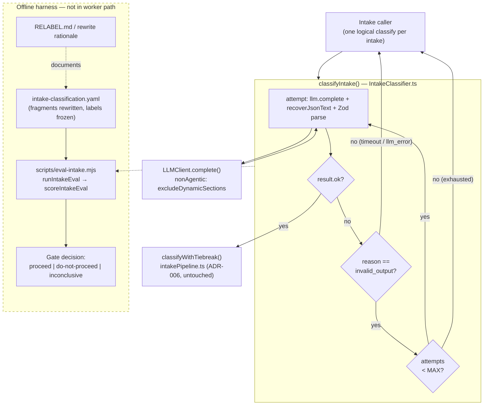

# Intake Classifier Reliability — System Architecture

## Architecture Philosophy

This is a reliability phase, not a feature phase. The architecture is therefore governed less by what we add than by what we are forbidden to disturb. Three constraints drive every decision below.

1. **The classify seam does not move.** Callers make exactly one logical `classifyIntake(brief, opts)` call per intake today (`packages/loom-core/src/intake/IntakeClassifier.ts:74`). Whatever we do about transient parse jitter must happen *behind* that signature. The retry is an internal loop, not a new contract surface — the function's name, parameters, and return type are unchanged.

2. **We separate "the model misbehaved" from "the model is wrong."** Unparseable output is a transport defect of a cheap model under a strict JSON contract; it is recoverable and worth a second look. A timeout or a thrown SDK error is a real failure and must surface verbatim, exactly as before. The whole design hinges on retrying *only* the first class and never the second.

3. **Fixtures are data, code is logic, and the two changes never touch.** The fragment-brief rewrite is a content edit to `eval-cases/intake-classification.yaml` with labels frozen; the retry is a code edit to `IntakeClassifier.ts`. They share no file. This is what lets two agents implement story-026-001 and story-026-002 in parallel branches without a merge conflict, and it is why the eval run is deferred to a human after both land.

The accepted trade-off across all three: we are buying a *trustworthy gate reading*, not a better classifier. None of this work can — or is allowed to — change a single verdict the model would have produced from a clean parse.

## Component Diagram



The two execution contexts are deliberately disjoint. The left/upper path is production code exercised on every intake. The dashed `EVAL` box is an offline developer harness that an operator runs by hand after merge; it imports the classifier but is never wired into the worker execution path (NFR-4).

## Tech Stack

No new technology is introduced. Reliability phases earn trust by *not* expanding the stack; every row below already exists in the tree.

| Layer | Choice | Rationale |
|---|---|---|
| Language / runtime | TypeScript on Node.js 20+ | Existing. The retry is ordinary control flow — no library can do it more clearly than a bounded `for` loop. |
| Schema validation | `zod` (`IntakeVerdictSchema`) | Already the arbiter of "is this a verdict." A Zod `safeParse` failure is one of the two parse-failure triggers; reusing it keeps "unparseable" defined in exactly one place. |
| LLM transport | `LLMClient.complete()` with `nonAgentic: { excludeDynamicSections: true }` | The non-agentic completion mode is load-bearing and guarded (ADR-002 of the prior phase). The retry re-issues the *same* request shape; it does not touch transport. |
| Test framework | `node:test` (`describe`/`it`) | Matches every existing classifier test. FR-4 lands as two new cases in `IntakeClassifier.test.ts` using a stub `LLMClient` that returns scripted responses. |
| Eval fixtures | YAML (`eval-cases/intake-classification.yaml`) loaded via `loadIntakeEvalSet.ts` | Data, not code. Human-diffable so a rewrite is auditable line-by-line and labels are visibly unchanged. |
| Eval harness | `scripts/eval-intake.mjs` + `runIntakeEval` / `scoreIntakeEval` | Existing offline runner. Story-026-003 prepares and documents it; it is run by an operator, not a worker. |

## Data Models

The verdict and result shapes are the system of record and **do not change**. They are reproduced here because the retry logic branches on them.

```typescript
// IntakeClassifier.ts:5  — unchanged
const IntakeVerdictSchema = z.object({
  type:       z.enum(['feature', 'bug', 'chore']),
  size:       z.enum(['story', 'epic']),
  confidence: z.enum(['low', 'medium', 'high']),
  rationale:  z.string().min(1).max(280),
});

// IntakeClassifier.ts:13  — unchanged. The retry decision keys on `reason`.
type ClassifyResult =
  | { ok: true;  verdict: IntakeVerdict }
  | { ok: false; reason: 'llm_error' | 'timeout' | 'invalid_output'; detail: string };
```

The **only** new code-level datum is the retry cap — a single named constant so the bound is a one-line change when the eval confirms whether 1 or 2 additional attempts is right (Out of Scope: "raising it to two is confirmed by the eval run, not pre-decided"):

```typescript
// New, IntakeClassifier.ts. Number of ADDITIONAL attempts after the first.
// 1 ⇒ up to 2 total calls. Capped so cost cannot run away (NFR-1).
const MAX_CLASSIFY_RETRIES = 1;
```

The eval-set case shape is likewise frozen. The fragment rewrite mutates `brief` (and only `brief`) within existing rows; `label.type` and `label.size` are invariant (FR-6):

```typescript
// eval/intakeEvalTypes.ts:9 — schema unchanged; story-026-002 edits only `brief` values
const IntakeEvalCaseSchema = z.object({
  id:           z.string(),
  source:       z.enum(['epic', 'anchor']),
  brief:        z.string().min(1),   // ← the ONLY field a rewrite may alter
  brief_source: z.string().optional(),
  label: z.object({
    type: z.enum(['feature', 'bug', 'chore']),  // ← frozen
    size: z.enum(['story', 'epic']),            // ← frozen
  }),
  rationale:    z.string().min(1),
  story_count:  z.number().int().optional(),
});
```

The gate reading the operator records is the existing report shape; the under-sizing signal the PRD calls out (FR-9, "epic-to-story under-sizing confusions ≤ 2") is the `epic → story` cell of the size-axis confusion matrix:

```typescript
// eval/intakeEvalTypes.ts — unchanged
interface ConfusionMatrix {
  axis: 'type' | 'size';
  labels: string[];
  counts: Record<string, Record<string, number>>; // counts[labeled][predicted]
}
// size axis: counts['epic']['story'] is the dangerous under-sizing count.

type GateDecision = 'proceed' | 'do-not-proceed' | 'inconclusive';
```

## API / Interface Contracts

These are the seams the three stories must agree on. None are new; the contract is that they stay stable.

```typescript
// SEAM 1 — the classify entry point. Signature UNCHANGED (FR-3).
// Internally: bounded loop; one logical call per intake regardless of attempts.
export async function classifyIntake(
  brief: string,
  opts: { llm: LLMClient; model: string; timeoutMs?: number },
): Promise<ClassifyResult>;

// SEAM 2 — production wrapper (intakePipeline.ts). UNTOUCHED.
// Applies the conservative tiebreak (ADR-006). Inherits retry for free
// because it delegates to classifyIntake.
export async function classifyWithTiebreak(
  brief: string,
  opts: { llm: LLMClient; model: string; timeoutMs?: number },
): Promise<ClassifyResult>;

// SEAM 3 — internal, extracted from the current body. NOT exported across the
// caller boundary. One attempt = one llm.complete + recoverJsonText + Zod parse.
// Returns the same ClassifyResult union so the loop can branch on `reason`.
async function classifyOnce(
  brief: string,
  opts: { llm: LLMClient; model: string; timeoutMs?: number },
): Promise<ClassifyResult>;
```

The retry control flow, stated as a contract rather than prose, is:

```text
for attempt in 0 .. MAX_CLASSIFY_RETRIES:
    r = classifyOnce(...)
    if r.ok                          -> return r          // success
    if r.reason != 'invalid_output'  -> return r          // timeout/llm_error: NEVER retried (FR-2)
    // else: parse failure — loop and try again
return r   // retries exhausted -> last invalid_output failure (FR-1)
```

Each attempt owns its own timeout race (the `timeoutMs` budget is per-attempt, as today — a parse retry is a fresh `complete` call with a fresh timer, line 81-83 of the current code). A timeout therefore exits immediately and is reported as `timeout`, never consumed as a retry.

For the eval-set rewrite, the documentation contract follows the precedent already in the tree — `eval-cases/RELABEL.md` (the "prior relabeling note" the PRD references in FR-8). Each rewrite records: case `id`, the original fragment text, the rewritten brief, and a one-line rationale, plus an explicit assertion that `label.type`/`label.size` are unchanged.

## Security Model

This phase touches no guardrail and no protected-branch logic, so the threat surface is narrow and economic rather than adversarial. The relevant threats are the ones a careless retry could introduce.

| Threat | Control |
|---|---|
| **Cost runaway** — a model that *always* emits unparseable output triggers unbounded re-calls (a self-inflicted DoS on the Anthropic budget). | Hard cap via `MAX_CLASSIFY_RETRIES`; total calls ≤ `1 + MAX_CLASSIFY_RETRIES`. The bound is a constant, not data- or model-derived (NFR-1). A test asserts exhaustion returns a failure rather than looping (FR-4). |
| **Masking real failures as retryable** — treating a timeout or SDK error as "just jitter" and retrying it hides genuine outages and inflates latency. | Retry is gated strictly on `reason === 'invalid_output'`. The two non-parse reasons (`timeout`, `llm_error`) short-circuit out of the loop unchanged (FR-2). A test pins this. |
| **Verdict tampering via the back door** — a retry path that "fixes up" or re-prompts differently could alter the classification the model intended. | Each retry re-issues the **identical** request (same system prompt, same `nonAgentic` flags, same prefill). No prompt mutation, no logic change. The observe-only invariant holds: the verdict still never influences planning or execution (NFR-2). |
| **Eval score-chasing** — rewriting briefs to flatter the classifier, or nudging labels, would corrupt the gate it exists to inform. | Only fragment briefs (title + comma-separated component list) are eligible (FR-5, FR-7); labels are frozen at the schema level by review (FR-6); every rewrite is documented with rationale (FR-8). Well-formed briefs are left byte-for-byte intact. |
| **Guardrail / mode regression** — incidental breakage of the non-agentic completion contract. | The FR-8 argv regression guard (`llm/__tests__/nonAgenticArgs.regression.test.ts`) and the non-agentic call-site test stay green; story-026-003's gate is a full green build + suite (NFR-3). |

## ADR Log

### ADR-001 — Bounded retry lives inside `classifyIntake`, not at the caller

**Decision.** Implement the parse-failure retry as a bounded loop *inside* `classifyIntake`, extracting the current body (lines 91-134) into an internal `classifyOnce` and looping over it.

**Context.** Callers today issue one logical classify per intake (FR-3) and reason about a single `ClassifyResult`. Pushing retry to callers would duplicate the policy at every call site and leak "how many attempts" into the contract.

**Rationale.** Keeping the loop behind the existing signature means the seam is untouched, the production wrapper `classifyWithTiebreak` inherits retry for free, and "transparent to callers" is structurally true rather than a convention to remember.

**Trade-off.** A single intake can now cost up to `1 + MAX_CLASSIFY_RETRIES` model calls and that many timeout budgets of latency, with no visibility from the caller. We accept hidden cost/latency in exchange for a stable contract and one place to reason about retry. The cap (ADR-003) bounds the downside.

### ADR-002 — Retry triggers on `invalid_output` only

**Decision.** Retry exactly when an attempt returns `{ ok: false, reason: 'invalid_output' }`. Return `timeout` and `llm_error` unchanged on the first occurrence.

**Context.** The current code produces `invalid_output` from two sites — a `JSON.parse` throw after `recoverJsonText` (line 109) and a Zod `safeParse` failure (line 118). Both mean "the model spoke but not in a verdict shape." Timeouts and SDK errors mean "the model didn't usably respond at all."

**Rationale.** JSON-adherence jitter from a cheap model under a strict contract is the precise distortion this phase exists to remove (PRD Goal 2). It is transient and idempotent-safe to re-ask. Transport failures are not jitter; retrying them hides outages and burns the latency budget.

**Trade-off.** We will not recover a transient timeout that a single retry might have survived. That is deliberate: conflating the two classes is exactly the failure mode that erodes trust in the gate. Both `invalid_output` sites are covered by the one trigger, so a Zod-shape failure retries identically to a parse throw.

### ADR-003 — The retry bound is a named constant defaulting to 1 additional attempt

**Decision.** Introduce `MAX_CLASSIFY_RETRIES = 1` (one additional attempt; two total) as a module constant.

**Context.** The PRD permits 1–2 additional attempts but explicitly defers "is it 2?" to the eval run rather than pre-deciding (Out of Scope). NFR-1 requires a hard cap.

**Rationale.** A single named constant makes the bound auditable, makes cost provably finite, and turns "bump to 2" into a one-line change the operator can justify from real eval numbers after merge — not a guess baked in now.

**Trade-off.** Defaulting to 1 may leave a sliver of recoverable jitter on the table if two retries would have helped. We prefer the conservative default and an evidence-driven bump over speculatively spending a third call on every hard case.

### ADR-004 — Fragment rewrite is a fixture-data change, fully disjoint from the code change

**Decision.** Story-026-002 edits only `brief` strings within existing rows of `eval-cases/intake-classification.yaml` and documents each in the RELABEL.md-style note. It touches no `.ts` file. Story-026-001 touches no `.yaml` file.

**Context.** The two reliability fixes are independent in intent but both feed the same gate. Stories are implemented by parallel agents in separate branches that cannot see each other's code.

**Rationale.** Disjoint file ownership is the cheapest guarantee of conflict-free parallel merges. Keeping labels and the schema frozen (FR-6) makes the fixture diff a pure-content review where any label change is visible on sight, foreclosing score-chasing.

**Trade-off.** Because neither story validates against the live eval (that's deferred), a bad rewrite or a too-tight retry bound is only caught by the human eval run afterward, not by the worker's own tests. We accept a later detection point in exchange for clean parallelism and an honest, human-rendered verdict.

### ADR-005 — The eval is run by an operator post-merge, not inside a worker story

**Decision.** Story-026-003 *prepares and documents* the offline harness (`scripts/eval-intake.mjs`) and the recording procedure — per-axis accuracy, confusion matrix, failure-reason counts, and the gate decision including the `epic → story` under-sizing count (≤ 2). It does **not** execute the long eval.

**Context.** The full eval exceeds the worker time budget and depends on both prior stories having landed. NFR-4 keeps the eval out of the worker execution path entirely.

**Rationale.** Modeling the eval as an operator action keeps a long, model-call-heavy job out of the time-boxed worker loop, and keeps the go/no-go an explicit human judgment recorded after the cleaned set exists — which is the entire point of an "honest" gate.

**Trade-off.** The epic merges without a green eval number attached; the gate verdict arrives separately, after merge. We accept a decision that lands out-of-band in exchange for not forcing a multi-minute eval into a worker that cannot afford it, and not letting the worker mark its own homework.
