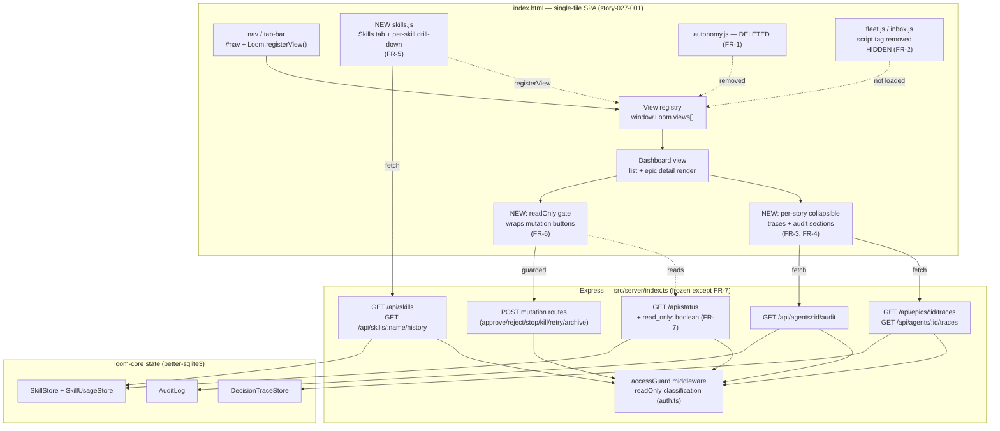

# Architecture: Refocusing the loom Web Dashboard on its Observability Spine

## Architecture Philosophy

This is a frontend-pruning epic, not a feature build. The architecture's whole job is to add and subtract surface area on `packages/loom-web/public/index.html` and its sibling view modules **without touching the read endpoints those views consume**. Four constraints drive every decision below.

1. **Client-only change against frozen read endpoints.** Every datum the new views show is already served by an existing `GET` route (`/api/epics/:id/traces`, `/api/agents/:id/audit`, `/api/skills`, `/api/skills/:name/history`). NFR-2 freezes those routes; all reshaping is client-side. The single sanctioned backend change is exposing the already-existing `readOnly` flag (FR-7). *Trade-off accepted:* the client absorbs grouping/joining work (e.g. fanning audit fetches across a story's agents) that a purpose-built endpoint would do server-side. We pay client complexity to keep the backend contract — and its test surface — untouched.

2. **Hide is not delete; visibility lives at one seam.** A tab is visible iff its view module's `<script>` tag is present in `index.html` *and* the module calls `Loom.registerView(...)` on load (`index.html:236`). That single seam lets us hide Fleet/Inbox by removing one line each while their `.js`, server routes, and tests stay byte-identical and restorable (Goal 4). *Trade-off:* tab presence is controlled by script-tag inclusion rather than a declarative feature-flag config — cheaper now, but "what's hidden" is discoverable only by reading the comment we leave at the registration site.

3. **One editor for the shared file.** `index.html` is a 923-line single-file SPA. FR-1 through FR-7 all converge on its nav/tab-bar and detail-render regions. Splitting them across parallel workers guarantees a merge conflict on the same hunks. The architecture therefore concentrates all `index.html` edits and the new `skills.js` into story-027-001, and keeps the seams (the view registry, a single `readOnly` flag) narrow so that one worker can hold the whole change in its head. *Trade-off:* less parallelism, but zero merge risk on the load-bearing file.

4. **Honesty is structural, mirroring the server.** The server already refuses mutations in read-only mode at `accessGuard` (`auth.ts:78`) — a non-GET without a token returns `403`. The dashboard today still *renders* the buttons, so the click fails silently. We make the client mirror the server's own classification: one `readOnly` flag gates every mutation control. *Trade-off:* the gate is defense-in-depth duplication of a rule the server already enforces — but the server's `403` is invisible UX, and an honest control surface is the entire point of the epic.

## Component Diagram



## Tech Stack

No new dependencies. The stack is fixed; what changes is how much of it the dashboard surfaces.

| Layer | Choice | Rationale |
|---|---|---|
| Dashboard shell | Vanilla JS in `public/index.html` (no framework) | Existing pattern; a build-step or framework here would be novel tech for a 6-control change. Boring wins. |
| View extension | `window.Loom.registerView({ id, label, render })` (`index.html:236`) | The codebase's own plugin seam — `fleet.js`, `inbox.js`, `autonomy.js` already use it. The Skills tab is one more registrant; nothing new is invented. |
| Collapsible UI | Native `<details>/<summary>` | Built-in, zero JS, accessible. The traces/audit sections (FR-3/FR-4) are read-only disclosure — exactly what `<details>` is for. |
| Server | Express, routes in `src/server/index.ts` + `routes/*.ts` | Unchanged. The only edit is one added field on `/api/status`. |
| Read-only enforcement | `accessGuard({ token, readOnly })` (`auth.ts`) | Already authoritative. The client gate is a UX mirror, not a new control. |
| State | `better-sqlite3` via `DecisionTraceStore`, `AuditLog`, `SkillStore`/`SkillUsageStore` | Read-only consumption only. |
| Docs | `docs/capabilities.md` + drift check | Project invariant (CLAUDE.md): user-visible surface changes update this page in the same epic (FR-8). |

## Data Models

No schema changes. These are the existing shapes the new client views consume — reproduced so the implementer reshapes against the real contract, not a guess. All are defined in `packages/loom-web/src/shared/types.ts` except `DecisionTrace` (`loom-core/src/state/DecisionTraceStore.ts:13`).

```typescript
// Decision traces — feeds FR-3. NOTE: carries story_id, so the whole-epic
// endpoint can be fetched once and grouped by story_id client-side.
interface DecisionTrace {
  id: number;
  agent_id: string | null;
  epic_id: string | null;
  story_id: string | null;            // ← group key for the per-story section
  kind: string;                        // 'thinking' | 'tool_intent' | 'plan_rationale' | 'pivot'
  subject: string | null;
  rationale: string;                   // load-bearing reasoning text
  metadata: string | null;             // JSON-encoded
  timestamp: string;
}

// Audit — feeds FR-4. Keyed by agent_id; per-story audit = union over the
// story's agents (EpicDetail.agents carries story_id).
interface AuditEntry {
  id: number;
  agent_id: string | null;
  action: string;
  command: string | null;
  allowed: 0 | 1 | null;
  policy_rule: string | null;
  detail: string | null;               // JSON-encoded
  timestamp: string;
}

// Skills list — feeds FR-5 (tab body)
interface SkillManifestSummary {
  name: string;
  description: string;
  source: 'bundled' | 'project' | 'global' | 'generated' | 'shared';
  lifecycle: 'active' | 'candidate' | 'disabled';
  shareSourceName?: string;
  injected: number; succeeded: number; failed: number;   // track record
}

// Per-skill history — feeds FR-5 drill-down
interface SkillHistoryEntry {
  ts: string;
  kind: 'generated' | 'injected' | 'lifecycle';
  text: string;                        // pre-rendered human string
}

// The one additive change (FR-7): a new optional field on the /api/status body.
// Sourced verbatim from opts.readOnly; no route behavior change.
interface EpicStatusResponse {
  epics: EpicStatus[];
  read_only?: boolean;                 // ← NEW; absent ⇒ treat as false
}
```

The `EpicDetail` shape (already consumed by the detail render) carries `agents: AgentSummary[]`, each with `story_id` and `id` — that is the join the per-story sections walk: group traces by `story_id`, fan audit fetches across the agent `id`s belonging to each story.

## API / Interface Contracts

These are the seams story-027-001 binds to. The read endpoints are **consumed exactly as-is** (NFR-2); the only signature that *changes* is `/api/status`.

**Read endpoints (frozen — consume, do not modify):**

```
GET /api/epics/:id/traces          → { traces: DecisionTrace[] }      // whole-epic; group by story_id (FR-3)
GET /api/agents/:id/traces?limit   → { traces: DecisionTrace[] }      // per-agent fallback
GET /api/agents/:id/audit?limit    → { entries: AuditEntry[] }        // per-agent; union per story (FR-4)
GET /api/skills                    → { skills: SkillManifestSummary[] }   // FR-5 list
GET /api/skills/:name/history      → { rows: SkillHistoryEntry[] }    // FR-5 drill-down
GET /api/epics/:id                 → EpicDetail (agents[] carry story_id)  // join source
```

**The one additive contract (FR-7):**

```
GET /api/status → { epics: EpicStatus[], read_only: boolean }
// read_only = opts.readOnly ?? false. Read-only is a launch constant
// (LOOM_WEB_READONLY=1 or `loom web --read-only`), so /api/status — already
// polled every 2s and available before any control renders — is the carrier.
// Adding a field is response-surface-only; no status logic changes.
```

**Client-side view seam (existing — Skills tab registers through it):**

```javascript
// index.html:236 — the plugin contract every view module already uses.
Loom.registerView({
  id:    string,                 // 'skills'
  label: string,                 // 'Skills'
  render: (container: HTMLElement, api: (path: string) => Promise<Response>)
            => (void | (() => void))   // optional cleanup fn on nav-away
}): void
```

**Client-side read-only gate (new, internal to `index.html`):**

```javascript
// A single module-level flag, set from /api/status, consulted by the detail
// render before it emits any of: approveBtn, rejectBtn, stopBtn, archiveBtn,
// [data-kill], [data-retry], [data-retry-clean].
let readOnly = false;             // updated each /api/status poll
function mutationControl(html) {  // single chokepoint
  return readOnly
    ? ''   // or: disabled + title="Read-only mode — mutations disabled"
    : html;
}
```

**Tab-visibility seam (FR-1, FR-2):** there is no config flag — a tab exists iff its module is `<script>`-loaded at the bottom of `index.html` (currently `autonomy.js`, `fleet.js`, `opportunities.js`, `flywheel.js`; `inbox.js` is referenced only in a comment and is already not loaded). FR-1 deletes `autonomy.js` and its include; FR-2 removes the `fleet.js` include (and leaves `inbox.js` un-included) with an explanatory restore comment at the site.

## Security Model

Read-only mode is the load-bearing trust boundary; the dashboard ships on `localhost` so the threat model is "honest controls," not network attack.

| Threat | Control |
|---|---|
| **Silent mutation in read-only mode** — operator clicks approve/kill/retry; server returns `403` (`auth.ts:85`); the UI shows nothing, eroding trust in every control. | Client `readOnly` gate (FR-6) hides/disables all mutation buttons with a one-line explanation. The server `403` remains as the actual enforcement — the gate is UX, not the security control. *Defense in depth: never rely on the client gate alone.* |
| **A new read section accidentally needs a mutation verb** — e.g. a "load more traces" that POSTs — would fail tokenless in read-only mode, reintroducing the silent-failure class. | Keep every new section **GET-only**. The traces/audit/skills endpoints are already GET; the `accessGuard` classification invariant (`auth.ts:61` — "correctness depends on every mutation being a non-GET verb") means GET reads always pass in read-only mode. |
| **Weakening the guard while "exposing" read-only** — FR-7 tempts a change to `accessGuard` behavior. | FR-7 is strictly additive: read `opts.readOnly` and surface it on the `/api/status` body. The `accessGuard` middleware and the enumerated-route test in `access-guard.test.ts` are untouched (NFR-1, NFR-3). |
| **Losing restorability of hidden surfaces** — a future operator can't tell Fleet/Inbox were intentionally hidden vs. broken. | The hide is a removed `<script>` include with a comment at the site naming the re-enable step; routes, view files, and `fleet.test.ts`/`inbox.test.ts` stay green (Goal 4 metric). |

## ADR Log

### ADR-001 — Fetch whole-epic traces once and group by `story_id` client-side

**Decision.** The per-story traces section (FR-3) calls `GET /api/epics/:id/traces` a single time and partitions the result by `DecisionTrace.story_id`, rather than calling `/api/agents/:id/traces` per agent.

**Context.** `DecisionTrace` carries `story_id` (`DecisionTraceStore.ts:17`), and the whole-epic endpoint already exists and returns up to 2000 traces. The detail view already holds the epic id.

**Rationale.** One request, no N+1 across agents, and the grouping is a pure client transform that honors NFR-2 (no endpoint change). It also tolerates stories whose agent was killed/retried — traces survive in the epic timeline regardless of which agent id produced them.

**Trade-off.** A very large epic returns one big payload instead of paginated per-agent slices; acceptable given the store's own 2000-row cap and the read-only, collapsed-by-default UI.

### ADR-002 — Per-story audit by fanning per-agent fetches, not a new endpoint

**Decision.** The per-story audit section (FR-4) issues `GET /api/agents/:id/audit` for each agent the story owns (from `EpicDetail.agents` filtered by `story_id`) and concatenates the entries.

**Context.** Audit is keyed by `agent_id` (`AuditEntry.agent_id`); there is no per-story or per-epic audit endpoint, and NFR-2 forbids adding one.

**Rationale.** Reuses the frozen endpoint exactly. Most stories have one agent, so the fan-out is typically a single request.

**Trade-off.** A retried story with several historical agents fans out to several requests, and ordering across agents must be merged client-side by `timestamp`. We accept a little client orchestration to avoid a new backend route — directly in line with Philosophy #1. *(If a story turns out to have no recoverable agent id, that section renders empty rather than erroring.)*

### ADR-003 — Expose read-only on `/api/status`, not `/api/health`

**Decision.** Surface the server's read-only state as a `read_only: boolean` field on the `GET /api/status` response.

**Context.** `readOnly` is a launch constant (`opts.readOnly`, from `LOOM_WEB_READONLY=1` / `loom web --read-only`). The client must know it before rendering any mutation control. Two carriers exist: `/api/health` (unauthenticated bootstrap probe) and `/api/status` (polled every 2s, drives the list render).

**Rationale.** `/api/status` is already fetched on bootstrap and on every 2s poll, so the flag is present before and during every detail render and stays correct if the server is relaunched in a different mode. Adding a field is response-surface-only — no status logic changes (NFR-1).

**Trade-off.** `/api/health` is more semantically "static config" and is unauthenticated, but the client doesn't reliably call it on the detail path; choosing `status` couples a deployment constant to a polled endpoint in exchange for it always being in hand where the gate runs. If a future need arises to know read-only *before* any authenticated call, `health` remains the place to add it.

### ADR-004 — Tab visibility via `<script>`-include presence, not a feature-flag config

**Decision.** Hide/remove a tab by removing its view module's `<script>` include (and, for Autonomy, deleting the module). Do not introduce a config-driven tab-enablement layer.

**Context.** The view registry (`index.html:236`) already makes tab presence a function of which modules load and self-register. Autonomy must be deleted (FR-1); Fleet/Inbox hidden but restorable (FR-2).

**Rationale.** Boring and minimal — it uses the mechanism already in the file, needs no new state, and makes "hidden" a one-line, well-commented diff that keeps routes/views/tests intact.

**Trade-off.** Tab availability isn't declaratively visible in one config object — an operator learns what's hidden only from the comment at the registration site. For a 3-tab change that's an acceptable cost; a declarative registry would be over-engineering for this epic and is the natural refactor if multi-project (Fleet/Inbox) is later re-enabled.

### ADR-005 — A single `readOnly` chokepoint gates all mutation controls

**Decision.** Route every mutation button in the detail render through one `readOnly`-aware helper rather than guarding each call site independently.

**Context.** Seven controls (`approveBtn`, `rejectBtn`, `stopBtn`, `archiveBtn`, `[data-kill]`, `[data-retry]`, `[data-retry-clean]`) are emitted across the detail render in `index.html`. FR-6 requires *all* of them honest in read-only mode.

**Rationale.** One chokepoint makes "did we cover every mutation?" auditable at a glance and prevents a future button from silently skipping the gate — the same single-classification discipline the server uses in `accessGuard`.

**Trade-off.** It introduces a small indirection in the render path and assumes future authors route new mutations through it; that assumption is the price of not re-checking seven scattered sites. The server `403` remains the real backstop if a control ever slips the gate.
