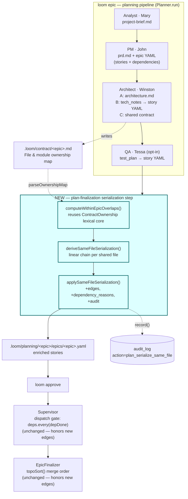

# Conflict-Aware Decomposition for the loom Planner — System Architecture

**Epic:** epic-028 · **Author:** Winston (System Architect) · **Status:** Proposed

## Architecture Philosophy

Four constraints drive every decision below. Each is load-bearing; where they pull against each other I name the trade-off rather than hide it.

1. **One detector, not two.** loom already has a path-aware overlap detector (`ContractOwnership.ts`) that the cross-epic advisory uses. NFR-1 and the maintainer user story are explicit: we *extend* it, we do not fork it. A second detection path that drifts from the first is the failure mode we are paid to avoid.
2. **Lexical exactness is a feature, not a limitation.** The existing detector is "the dumbest thing that can work — EXACT lexical path equality" (`ContractOwnership.ts:191`). That bluntness exists to kill the false-positive mode that globbing and token-similarity reintroduce. We inherit that discipline: serialize on a *real shared file path*, never on free-text similarity (FR-2, Goal 3).
3. **Additive blast radius.** The dependency graph, `topoSort`, the Supervisor's dispatch gate, and worktree isolation all work today. This feature may only *add* edges and *add* an optional field (FR-5, NFR-2, NFR-3). Nothing existing changes shape. A consumer that ignores the new field still behaves exactly as before.
4. **Two layers: prevent, then catch.** Persona guidance (probabilistic, LLM-driven) reduces over-decomposition at the source so the safety net fires rarely (Goal 2). Serialization (deterministic, code-driven) is the backstop that *guarantees* no unordered same-file pair survives (Goal 1). We rely on the deterministic layer for the guarantee and the probabilistic layer to keep it quiet.

## Component Diagram



The new step sits between QA enrichment and YAML persistence inside `Planner.run`. Everything downstream of the YAML — approve, Supervisor, EpicFinalizer — is unchanged: it already honors `story.dependencies`, and our edges are ordinary dependency edges.

## Tech Stack

| Layer | Choice | Rationale |
|---|---|---|
| Detection core | Extend `packages/loom-core/src/orchestrator/ContractOwnership.ts` | NFR-1: one detector. The lexical-exact-match primitive and `normalizePath` already exist and are battle-tested by the cross-epic advisory. |
| Ownership source | `parseOwnershipMap()` / `loadOwnershipMap()` over `.loom/contract/<epic>.md` | FR-2: structured, declared ownership — real paths, not tokens. Authoritative source already produced by the architect's Task C. |
| Serialization derivation | New module `SerializeOverlaps.ts`, co-located in `orchestrator/` | Keeps graph-mutation logic out of the detector; pure function over stories + overlaps, easy to fixture-test (FR-9). |
| Story / dependency model | `zod` `StorySchema` in `packages/loom-core/src/types.ts` + `schemas/epic.schema.yaml` | Additive optional field only — preserves backward compatibility (NFR-2). |
| Reason recording | Optional `dependency_reasons` on the story **and** `AuditLog.record()` | FR-6: audit is the minimum bar; the plan-surfaced field makes the reason operator-inspectable without a DB query. |
| Pipeline integration | `packages/loom-core/src/planner/Planner.ts` (`run` / `persistPlanResult`) | The only place that owns the epic YAML between architect output and persistence. |
| Persona guidance | Markdown prompts `personas/pm.md` (Task B) and `personas/architect.md` (Task C) | FR-7: prevention lives in the prompts that already shape decomposition and the ownership map. |
| Verification | `vitest` fixture + assertion under `loom-core` `__tests__` | FR-9: deterministic graph-property test. |

## Data Models

### Existing (reused as-is)

```typescript
// packages/loom-core/src/orchestrator/ContractOwnership.ts
interface OwnershipEntry { epicId: string; storyId?: string; path: string; } // path = normalized repo-relative POSIX
type OwnershipMap = OwnershipEntry[];
interface Overlap { path: string; owners: Array<{ epicId: string; storyId?: string }>; }

// packages/loom-core/src/types.ts — StorySchema (zod)
// dependencies: z.array(z.string())   ← unchanged shape, ordinary story-id edges
```

### New — additive only

```typescript
// SerializeOverlaps.ts — the derivation result, an internal value type
interface SerializationEdge {
  from: string;        // story that must wait (gets the edge added to its dependencies)
  dependsOn: string;   // story that must integrate first
  path: string;        // the exact shared file path that forced the edge
  reason: 'same-file-conflict-avoidance';
}

// StorySchema gains ONE optional field (zod .optional() → existing plans still validate)
// dependency_reasons?: Array<{ depends_on: string; reason: string; path?: string }>
```

```yaml
# schemas/epic.schema.yaml — additive, optional (NFR-2)
dependency_reasons:
  type: array
  description: "machine-readable provenance for derived dependency edges"
  items:
    type: object
    required: [depends_on, reason]
    properties:
      depends_on: { type: string }
      reason:     { type: string, enum: ["same-file-conflict-avoidance"] }
      path:       { type: string }
```

```jsonc
// audit_log.detail (JSON) for action = "plan_serialize_same_file", command = epicId
{
  "path": "packages/loom-web/public/dashboard.js",
  "chain": ["story-028-002", "story-028-004", "story-028-007"], // total order applied
  "added_edges": [
    { "from": "story-028-004", "dependsOn": "story-028-002" },
    { "from": "story-028-007", "dependsOn": "story-028-004" }
  ]
}
```

`dependencies` stays `string[]`. The reason lives beside it in `dependency_reasons` and in the audit row. `topoSort` and the Supervisor read `dependencies` and never see the new field — that is the point.

## API / Interface Contracts

These are the seams. The first two are the only new public surfaces; the third is the integration call.

```typescript
// 1. ContractOwnership.ts — NEW, sharing the existing path-index primitive
//    Detects ≥2 distinct storyIds owning the same exact path WITHIN one epic's map.
//    Internally reuses the same groupOwnersByPath helper as computeOverlaps()
//    (refactor the index out; do NOT copy it) — that is what "no second path" means.
export function computeWithinEpicOverlaps(map: OwnershipMap): Overlap[];

// 2. SerializeOverlaps.ts — NEW, pure function (no I/O), unit-testable
//    Orders each overlap's stories by a single global key (existing topo index,
//    tie-broken by story id) and emits the missing edges to totally order them.
export function deriveSameFileSerialization(
  stories: Story[],
  overlaps: Overlap[]
): SerializationEdge[];

// 3. Planner.ts — NEW integration hook, called after Task C / QA, before persist
//    Mutates story.dependencies (add missing edge) and story.dependency_reasons,
//    then records one audit row per shared file. Skips quietly if no contract/overlaps.
function applySameFileSerialization(
  epics: EpicYaml[],
  projectRoot: string,
  audit: AuditLog
): void;
```

```typescript
// Verification helper (FR-9) — graph property the fixture test asserts
// For every pair (a,b) of stories sharing a file, one must be transitively
// reachable from the other in the dependency DAG.
function noUnorderedSameFilePairs(stories: Story[], ownership: OwnershipMap): boolean;
```

Persona contracts (FR-7) are content, not code: `personas/pm.md` Task B and `personas/architect.md` Task C each gain a paragraph instructing single-file-concentrated / tightly-coupled-region work to be emitted as **one** story along independently-developable boundaries, with an explicit caution against collapsing genuinely separable different-file work into one oversized story.

## Safety & Integrity Model

This is a plan-time feature with no new network, auth, or execution surface, so classic security threats are thin. The real risks are integrity threats — ways the new code could corrupt the plan or weaken a loom invariant. I name them honestly rather than pad a threat table.

| Threat | Control |
|---|---|
| **Dependency cycle** introduced by serialization → `topoSort` bails to input order, epic deadlocks or mis-merges | Edges are only ever added from a later to an earlier story under **one global ordering key** (topo index, tie-broken by id). Every added edge respects that single total order, so the result is provably acyclic. Covered by a cycle-free assertion in the fixture test. |
| **False serialization** kills parallelism on independent work (Goal 3) | Edges added *only* on exact-lexical shared-path overlap from the structured ownership map; never on token similarity. Inherited directly from the existing detector's design. |
| **False negative** — undeclared file edits stay invisible (acknowledged coverage limit) | Out of scope by PRD decision; mitigated by persona guidance and the ownership map being the planning contract. Documented in `capabilities.md` (FR-10) so operators know the boundary. |
| **Silent loss of parallelism** an operator can't explain (Goal 4) | Every edge carries `dependency_reasons` + an `audit_log` row (FR-6). Nothing is serialized without a recorded, inspectable reason. |
| **Weakening of existing guarantees** (NFR-2/3) | The detector's cross-epic path and the policy/worktree-isolation invariants are untouched: we add a sibling function and an optional field, and the Supervisor's gate already honors arbitrary edges. Existing tests must stay green (story-028-001 AC). |

## ADR Log

### ADR-001 — Extend the lexical detector; do not build a second one
- **Decision:** Add `computeWithinEpicOverlaps()` inside `ContractOwnership.ts`, factoring the path-indexing logic shared with `computeOverlaps()` into one private helper.
- **Context:** NFR-1 and the maintainer user story forbid a divergent detection path. The within-epic case is structurally the same as cross-epic: index ownership entries by exact normalized path, flag paths with ≥2 distinct owners — only the owner key differs (storyId within an epic vs. epicId across epics).
- **Rationale:** One normalization rule, one equality rule, one place to fix a bug. The cross-epic advisory and within-epic serializer cannot drift.
- **Trade-off:** We inherit the detector's coverage limit — it sees only *declared* paths in the ownership map, so undeclared edits remain invisible. We accept that limit rather than reintroduce the smarter-matching false-positive mode the detector was built to kill.

### ADR-002 — Record the reason via an additive field + audit, not by changing `dependencies`
- **Decision:** Keep `dependencies: string[]`. Add optional `dependency_reasons` to the story and write an `audit_log` row per serialized file.
- **Context:** FR-6 needs a machine-readable reason. The richer alternative — `dependencies: Array<{id, reason}>` — would touch `topoSort`, the Supervisor's dispatch gate, the PM agent's output, every fixture, and the schema.
- **Rationale:** Additive optional fields preserve backward compatibility (NFR-2) and scope containment (NFR-3). Existing plans validate unchanged; consumers that don't care about reasons never read the new field. The audit row satisfies the FR-6 minimum bar; the plan field satisfies the preferred "surface it in the plan."
- **Trade-off:** Dependency information now lives in two fields (`dependencies` + `dependency_reasons`). A future reader wanting the *why* must consult the side field — they are not co-located on a single edge object.

### ADR-003 — Serialize as a total order along one global ordering key
- **Decision:** For N stories sharing a file, order them by a single global key (existing topo index, tie-broken by story id) and chain them — each depends on the previous (FR-4).
- **Context:** "Integrate sequentially" is the FR-4 `[ASSUMPTION]` of a total order, not an arbitrary partial order. A story may share files with several others, so per-file chains must compose without contradiction.
- **Rationale:** Deriving all edges from one global order makes the union of all chains trivially acyclic and deterministic — re-running the planner yields the identical graph. It also produces the operator's intuition: same-file stories integrate one at a time, oldest-first.
- **Trade-off:** A total order serializes the *whole* shared-file group even if some members touch disjoint regions that could safely interleave. We accept reduced theoretical parallelism in exchange for a provable no-conflict guarantee at file granularity — sub-file resolution is explicitly out of scope.

### ADR-004 — Run serialization as a plan-finalization step in `Planner.run`, after the contract exists
- **Decision:** Invoke `applySameFileSerialization()` after the architect's Task C (and optional QA) and before YAML persistence in `Planner.persistPlanResult`.
- **Context:** The ownership map — the authoritative path source (FR-2) — is produced by Task C and written to `.loom/contract/<epic>.md`. Edges must be baked into the YAML before `loom approve`, because the Supervisor honors `dependencies` at dispatch and has no plan-mutation hook.
- **Rationale:** This is the one stage that owns the epic YAML between architect output and disk. Placing the step here keeps all dependency derivation inside planning (NFR-3) and lets the unchanged Supervisor and EpicFinalizer simply honor the result.
- **Trade-off:** Detection quality depends on the shared contract being produced. When `policy.agents.shared_contract` is off there is no ownership table; the step degrades to path-gated extraction from tech notes (the same path-shaped-token scrape the cross-epic fallback already uses), which is weaker. We accept reduced coverage in the off-contract configuration rather than make the contract mandatory.

### ADR-005 — Always-on, no operator opt-out
- **Decision:** The behavior is automatic with no knob (FR-8).
- **Context:** The failure this prevents is *deterministic* merge conflict. An opt-out is an opt-in to a known-broken integration.
- **Rationale:** Boring and safe: there is no defensible reason to dispatch two stories that will provably conflict. Keeping it knob-free removes a configuration surface and a support burden.
- **Trade-off:** An operator who deliberately wants two stories to race on one file cannot express that. Mitigation: edges are additive and visible in the plan before approval, so an operator can hand-edit the YAML pre-approve if they truly intend it. We confirm with the PRD owner before adding any escape hatch (FR-8 `[ASSUMPTION]`).

### ADR-006 — Two layers: persona prevention plus deterministic serialization
- **Decision:** Ship both the persona guidance (FR-7) and the serializer (FR-1–FR-6), and rely on each for a different property.
- **Context:** Persona guidance alone is probabilistic — an LLM can still over-decompose. Serialization alone works but fires routinely if the planner keeps splitting cohesive single-file work (Goal 2 unmet).
- **Rationale:** The serializer *guarantees* the safety property (Goal 1); the persona guidance keeps the safety net quiet by emitting cohesive work as one story up front (Goal 2). Neither substitutes for the other.
- **Trade-off:** We change two prompts whose effect we cannot unit-test deterministically. We measure their effect by how *rarely* the serializer fires on representative briefs, not by an assertion — accepting a softer success signal for the prevention layer while the fixture test (FR-9) holds the hard guarantee on the catch layer.
