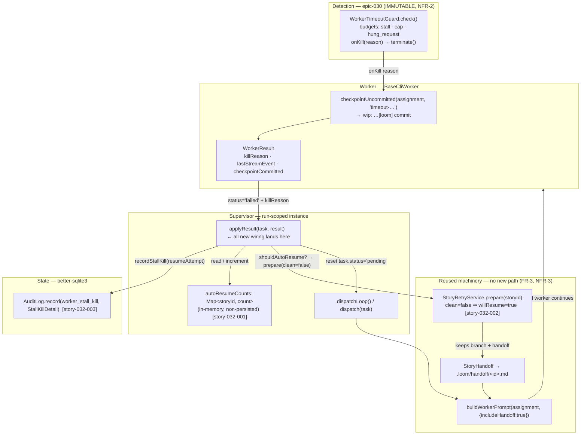

I'll ground this architecture in the actual loom codebase rather than guess at the seams. Let me explore the existing detection, checkpoint, handoff, retry-preparation, and audit machinery in parallel.# Architecture: Stall-Resilient Execution — Automatic In-Run Resume & Stall Diagnostics (epic-032)

## Architecture Philosophy

This feature heals a run that detection already stops. epic-030 gave us a fast, immutable kill switch (`WorkerTimeoutGuard`); epic-032 adds a recovery loop *on top of it* without touching it. Four constraints drive every decision below.

1. **Build on existing seams, add no parallel path.** The PRD's three hardest "MUST"s (FR-2, FR-3, NFR-3) all say the same thing: reuse `checkpointUncommitted`, `StoryHandoff`, `StoryRetryService.prepare`, and the `auto_resume_attempts` knob. The new code is *wiring and a counter*, concentrated in one method (`Supervisor.applyResult`) plus one small audit module. If you find yourself writing a second dispatch path, stop.

2. **Detection is frozen.** `WorkerTimeoutGuard`, the stall window, the hung-request bound, and the absolute cap are byte-for-byte unchanged (NFR-2). This feature only *consumes* the guard's output — the `killReason`, `lastStreamEvent`, and `checkpointCommitted` fields already present on `WorkerResult`.

3. **Recovery must be bounded and fail-safe.** A run is unattended; an unbounded resume loop is a budget fire. The bound is a run-scoped, non-persisted counter, and the default disposition on any doubt (no checkpoint, cap reached, missing signal) is *leave the story failed*. Recovery never builds on dirty state.

4. **Every kill must be diagnosable after the fact.** The diagnostics ship with the recovery, not after it, because the attempt number and failure mode are what let a maintainer tell a one-off hiccup from a story that re-stalls every attempt. The audit trail is the only V1 surface (no new UI/CLI).

The trade-off this philosophy accepts: by coupling auto-resume tightly to the manual-retry path, any future change to retry semantics silently changes auto-resume too. We take that coupling deliberately — one code path that two callers (operator, supervisor) share is worth more than two paths that drift.

## Component Diagram



## Tech Stack

No new dependencies — every layer is an existing loom surface. The "choice" column names *which existing component the work attaches to*, which is the architecturally load-bearing decision here.

| Layer | Choice | Rationale |
|---|---|---|
| Kill detection | `WorkerTimeoutGuard` (`orchestrator/WorkerTimeoutGuard.ts`) | Frozen by NFR-2; consumed read-only via its `onKill` reason and `lastStreamEvent`. |
| Kill→result transport | `WorkerResult` (`orchestrator/WorkerRunner.ts`) | Already carries `killReason`, `lastStreamEvent`, `checkpointCommitted` from epic-030 — the exact triple recovery needs. No schema change. |
| Checkpoint signal | `BaseCliWorker.checkpointUncommitted()` → `WorkerResult.checkpointCommitted` | Existing committed-vs-dirty signal (FR-6). No new checkpoint state introduced. |
| Recovery orchestration | `Supervisor.applyResult()` + a private `Map` (`orchestrator/Supervisor.ts`) | The supervisor already owns the dispatch loop and result application; the resume decision belongs where the result lands. |
| Retry preparation | `StoryRetryService.prepare()` (`orchestrator/StoryRetryService.ts`) | The mandated single retry path (FR-3); `clean=false` is the resume disposition. |
| Resume context | `StoryHandoff` + `buildWorkerPrompt({includeHandoff})` | Existing handoff mechanism (FR-2) — the resumed worker continues from `.loom/handoff/<id>.md`. |
| Attempt bound | `policy.agents.auto_resume_attempts` (`types.ts`, default `2`) | Existing knob (FR-4); no new knob, default untouched (Out of Scope). |
| Diagnostics persistence | `AuditLog.record()` (`state/AuditLog.ts`) — JSON `detail` column | Existing audit table; structured JSON `detail` already the convention (FR-7, NFR-1). |
| Config validation | `zod` schema in `types.ts` | Already validates `auto_resume_attempts`; nothing to add. |

## Data Models

### Existing — consumed, not modified (epic-030, in `orchestrator/WorkerRunner.ts`)

```typescript
type TimeoutKillReason = 'stall' | 'cap' | 'hung_request';

interface WorkerResult {
  status: 'done' | 'failed';
  // …existing fields…
  killReason?: TimeoutKillReason;     // set only on a guard kill
  lastStreamEvent?: string;           // guard's last label, or '(none)' if never streamed
  checkpointCommitted?: boolean;      // true iff a `wip: …[loom]` commit was created post-kill
}
```

The committed-vs-dirty distinction is `checkpointCommitted` — there is **no new checkpoint state** (FR-6). The hung-vs-silent distinction is *derived*, not stored: `killReason === 'hung_request'` ⇒ hung-with-no-response; `killReason === 'stall' && lastStreamEvent === '(none)'` ⇒ fully-silent-subprocess.

### New — run-scoped auto-resume counter (story-032-001)

A private field on the `Supervisor` instance. Run-scoping is structural: a `loom run` constructs one `Supervisor`, so the `Map` lives and dies with the run and never persists (FR-5).

```typescript
// field on Supervisor — orchestrator/Supervisor.ts
private readonly autoResumeCounts = new Map<string /* storyId */, number>();

// reads (defaulting absent → 0); per-story keying so one story can't starve another
private autoResumesSoFar(storyId: string): number {
  return this.autoResumeCounts.get(storyId) ?? 0;
}
private recordAutoResume(storyId: string): number {
  const next = this.autoResumesSoFar(storyId) + 1;
  this.autoResumeCounts.set(storyId, next);
  return next;
}
```

### New — stall-kill audit detail (story-032-003)

A typed shape serialized into the existing `audit_log.detail` TEXT/JSON column. Written under a dedicated action string.

```typescript
// orchestrator/StallKillAudit.ts (new, small)
const STALL_KILL_ACTION = 'worker_stall_kill';

interface StallKillDetail {
  kill_reason: TimeoutKillReason;                                   // FR-7(a) raw guard reason
  silence_kind: 'hung_request_no_response' | 'fully_silent_subprocess'; // FR-7(a) derived
  last_stream_event: string;        // FR-7(b); '(none)' sentinel for silent case (FR-8)
  resume_attempt: number;           // FR-7(c); counter reading for THIS kill (0 on first)
  checkpoint_committed: boolean;    // whether this kill is resume-eligible
}
```

`audit_log` itself is unchanged — DDL (`state/Database.ts`):

```sql
CREATE TABLE audit_log (
  id INTEGER PRIMARY KEY AUTOINCREMENT,
  agent_id TEXT REFERENCES agents(id),
  action TEXT NOT NULL,           -- = 'worker_stall_kill'
  command TEXT,                   -- = storyId, so getByStory() picks it up across retries
  allowed INTEGER,
  policy_rule TEXT,
  detail TEXT,                    -- = JSON.stringify(StallKillDetail)
  timestamp DATETIME NOT NULL DEFAULT CURRENT_TIMESTAMP
);
```

### Existing — the knob (`types.ts`, untouched)

```typescript
agents: z.object({
  // …
  auto_resume_attempts: z.number().int().min(0).default(2), // 0 disables; default NOT changed
})
```

## API / Interface Contracts

These are the seams the four stories must agree on. Signatures already in the tree are marked *(existing)*; only the bodies of `applyResult` and the new `StallKillAudit` module change.

```typescript
// 1. Detection → result (existing, FROZEN). The only inputs recovery may read.
//    WorkerTimeoutGuard.onKill(reason) ⇒ BaseCliWorker.terminalFailureResult ⇒ WorkerResult
//    with { killReason, lastStreamEvent, checkpointCommitted }.

// 2. The resume predicate (new, pure, unit-testable in isolation — story-032-002).
function shouldAutoResume(r: WorkerResult, attemptsSoFar: number, cap: number): boolean {
  return (r.killReason === 'stall' || r.killReason === 'hung_request') // FR-9 shared path
      && r.checkpointCommitted === true                               // FR-6 never on dirty
      && attemptsSoFar < cap;                                         // FR-4 bounded
}

// 3. Reused retry preparation (existing — StoryRetryService.prepare, FR-3).
//    clean=false is the resume disposition; willResume gates handoff injection.
interface StoryRetryResult {
  status: 'ready' | 'rejected' | 'error';
  storyId: string;
  cleaned: boolean;       // false on resume — branch + worktree kept
  willResume: boolean;    // true on resume — handoff fed back (= !clean)
  resetStories: string[];
  message: string;
}
prepare(storyId: string): StoryRetryResult;   // existing

// 4. Reused handoff injection (existing — workerPrompt.ts, FR-2).
buildWorkerPrompt(assignment, { includeHandoff: true }): string;   // existing

// 5. New audit seam (story-032-003). Sourced from result + counter; never throws on
//    the silent case — emits the '(none)' sentinel instead (FR-8).
function recordStallKill(audit: AuditLog, input: {
  agentId: string;
  storyId: string;
  result: WorkerResult;
  resumeAttempt: number;     // from autoResumesSoFar(storyId)
}): void;

// 6. The single integration point (Supervisor.applyResult — all wiring lands here).
//    Pseudocode of the added branch, ordered audit-first so a kill is recorded even
//    if resume preparation later rejects:
private applyResult(task: StoryTask, result: WorkerResult): void {
  // …existing status application…
  if (result.killReason === 'stall' || result.killReason === 'hung_request') {
    const attempt = this.autoResumesSoFar(task.story.id);
    recordStallKill(this.audit, { agentId: task.agentId, storyId: task.story.id, result,
                                  resumeAttempt: attempt });                  // FR-7, NFR-1
    const cap = this.opts.autoResumeAttempts ?? 0;
    if (shouldAutoResume(result, attempt, cap)) {
      const prep = this.retryService.prepare(task.story.id);  // clean=false default → resume
      if (prep.status === 'ready' && prep.willResume) {
        this.recordAutoResume(task.story.id);                 // increment AFTER prep succeeds
        task.status = 'pending';                              // re-enter dispatchLoop, same run
        return;
      }
    }
    // no checkpoint, cap reached, or prep rejected → leave failed (FR-4, FR-6)
  }
}
```

## Security Model

The dominant risk here is not an external attacker — it is a new automated actor (the supervisor re-dispatching on its own) that could erode guardrails or burn budget. NFR-1 is the security requirement.

| Threat | Control | Where enforced |
|---|---|---|
| Auto-resume bypasses push/branch protection | Re-dispatch routes through the *same* `dispatch()` path as a first run — worktree isolation and the structural policy engine are unchanged and run identically. No new spawn path. | `Supervisor.dispatch()` (unchanged); policy engine (Invariant 1, 2). |
| Runaway resume loop drains token/time budget | Per-story counter bounds re-dispatch to `auto_resume_attempts`; on cap the story is left failed and never re-queued. | `shouldAutoResume` + `autoResumeCounts` (FR-4). |
| Recovery builds on dirty, unverified state | Resume gated on `checkpointCommitted === true`; absent a checkpoint, fail. Default-deny on a missing/false signal. | `shouldAutoResume` (FR-6). |
| A re-dispatch happens silently / untraceably | Every kill writes `worker_stall_kill`; every resume increments the counter and re-enters dispatch, which logs its own `dispatch` audit row. | `recordStallKill` + existing dispatch audit (NFR-1). |
| Detection weakened to make recovery easier | `WorkerTimeoutGuard` and its constants are read-only here; CI/invariant + capabilities drift check guard against edits. | NFR-2; review + drift check (FR-10). |

Residual risk to accept and flag: with per-story keying (ADR-3), N stalling stories can each consume the full cap, so the *aggregate* run budget is `N × auto_resume_attempts` re-dispatches. This is the FR-5 `[ASSUMPTION]` — confirm the knob's intent is per-story, not a single global run budget, before shipping.

## ADR Log

### ADR-1 — Bound recovery with an in-memory, run-scoped `Map`, not persisted state
**Decision.** Track attempts in a `Map<storyId, number>` field on the `Supervisor` instance; never write it to `audit_log` or `agents`.
**Context.** FR-5 requires the bound to be run-scoped and *not* carry across runs; the "Should" user story wants a flaky story to start fresh next run.
**Rationale.** A `loom run` constructs exactly one `Supervisor`. Tying the counter's lifetime to that object makes run-scoping structural — there is no reset code to forget and no migration. The audit trail (ADR-6) still records each attempt number for post-hoc analysis, so we lose no observability by not persisting the live counter.
**Trade-off.** A run that crashes and is restarted begins the budget fresh — a story could in principle get `2 + 2` attempts across a crash. We accept this: cross-run reset is explicitly desired, and persisting would re-introduce exactly the cross-run carry FR-5 forbids.

### ADR-2 — Reuse `StoryRetryService.prepare(clean=false)`; introduce no recovery path
**Decision.** Auto-resume calls the existing manual-retry preparation with the non-clean disposition, then flips `task.status` back to `pending` so the normal dispatch loop picks it up.
**Context.** FR-3 and NFR-3 forbid a parallel/duplicate recovery code path; the operator's manual `loom retry` already does precisely "keep the branch, keep the handoff, resume."
**Rationale.** One path, two callers (operator and supervisor) keeps resume semantics identical whether a human or the run triggers it, and inherits handoff injection (`willResume`) for free.
**Trade-off.** Auto-resume is now coupled to manual-retry semantics — a future change to `prepare()` changes both. We prefer that coupling to two paths that drift; `shouldAutoResume` is the only auto-specific logic and it stays a pure, separately-tested function.

### ADR-3 — Key the counter per-story-within-run, not one global run counter
**Decision.** The `Map` key is the story id.
**Context.** FR-5 `[ASSUMPTION]`: one flaky story should not exhaust another's budget.
**Rationale.** Per-story keying gives each story an independent, fair budget — the intuitive reading of "attempts per story."
**Trade-off.** The aggregate run budget becomes `N × cap` rather than a single global ceiling (see Security Model residual risk). This is the open assumption in the PRD — **confirm against the knob's intent before shipping**; if a global cap is wanted, change the key to a constant and nothing else moves.

### ADR-4 — One shared budget for stall and hung-request kills
**Decision.** Both `killReason` values feed the same predicate and decrement the same counter.
**Context.** FR-9 (`[ASSUMPTION]` shared budget desired) and a single existing knob, `auto_resume_attempts`.
**Rationale.** There is one knob; modeling two budgets would require a second knob the PRD forbids (Out of Scope). A re-stall is a re-stall regardless of which clock fired.
**Trade-off.** You cannot tune tolerance for hung-requests separately from silent stalls. Acceptable for V1; the audit `kill_reason`/`silence_kind` fields preserve the data to justify splitting later if real failure patterns demand it.

### ADR-5 — Gate resume on the existing `checkpointCommitted` boolean
**Decision.** Resume only when `WorkerResult.checkpointCommitted === true`; introduce no new checkpoint detection.
**Context.** FR-6 plus "no new checkpoint state" (Out of Scope). `BaseCliWorker.checkpointUncommitted()` already commits `wip: timeout-… [loom]` on a guard kill and reports success on the result.
**Rationale.** The signal we need already exists and is set on exactly the kill paths we care about. Reusing it is the smallest correct change and keeps a single source of truth for "is there resumable work."
**Trade-off.** Correctness depends on the kill path having actually run `checkpointUncommitted` and set the flag. Any kill path that fails to set it yields *no* resume — a fail-safe default (we leave the story failed rather than resume blind), but it could occasionally skip a legitimately-resumable story.

### ADR-6 — Dedicated `worker_stall_kill` audit action with structured `StallKillDetail`
**Decision.** Write a new action string with a typed JSON `detail`, rather than overload the existing `worker_timeout_warn`.
**Context.** FR-7 requires every kill to carry failure mode, last stream event, and attempt number; FR-8 requires a sentinel, not a failure, when there is no stream event.
**Rationale.** Warnings and kills are different events with different consumers; a dedicated action lets a maintainer query kills directly (`getByStory` via `command=storyId`) without filtering. Structured `detail` matches the existing JSON-in-TEXT convention.
**Trade-off.** One more action string the dashboard/queries must learn. Worth it for clean separation and a stable, greppable signal.

### ADR-7 — Derive `silence_kind` from `killReason` + `lastStreamEvent`; add no guard field
**Decision.** Compute hung-vs-silent in the audit writer from the existing `'(none)'` sentinel and the kill reason; do not add a classification field to `WorkerTimeoutGuard`.
**Context.** NFR-2 freezes the guard. FR-7(a)/FR-8 need the distinction and the sentinel.
**Rationale.** The guard already exposes everything needed (`getLastStreamEvent()` returns `'(none)'` when nothing streamed). Deriving keeps the frozen component untouched and the classification logic next to where it's consumed.
**Trade-off.** The derivation rule must stay in lockstep with the guard's sentinel value — if the guard ever changes `'(none)'`, the classifier breaks silently. A single shared constant and a unit test on both failure modes (story-032-003 AC) mitigate this.
