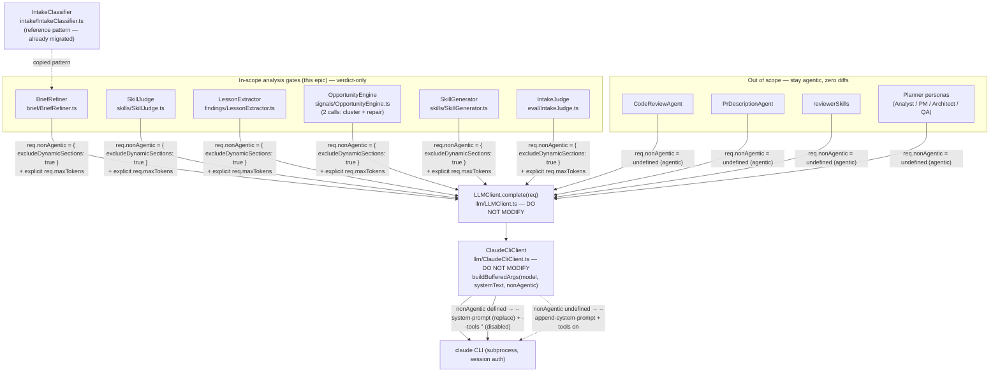

# Architecture: Routing Single-Purpose Analysis Gates Through Non-Agentic Completion Mode (epic-033)

## Architecture Philosophy

This is a transport-only migration. The whole job is to move six verdict-only LLM calls off the agentic `claude-cli` harness and onto the existing, regression-tested non-agentic path — without touching the seam itself or any gate's behavior. Four constraints drive every decision below.

1. **Don't touch the load-bearing seam.** The `nonAgentic` plumbing (`LLMClient.NonAgenticMode`, `ClaudeCliClient.buildBufferedArgs`/`buildStreamingArgs`) is already shipped and guarded by `nonAgenticArgs.regression.test.ts`. We change call sites, not the transport. Boring and proven beats novel here.
2. **Behavior is frozen; only the wire changes.** Each gate's output schema, JSON recovery, retry count, and fallback semantics must come out byte-identical. The migration adds exactly two things to each `llm.complete` call: a `nonAgentic` field and an explicit `maxTokens`.
3. **One reference pattern, copied six times.** `IntakeClassifier.classifyOnce` (`packages/loom-core/src/intake/IntakeClassifier.ts:96-105`) is the pattern of record. `BriefRefiner` migrates first and becomes the worked example; the other five copy it. Consistency is the point — the safe transport must be obvious and stay enforced.
4. **Parallel-safe by construction.** Each gate lives in its own file with its own test. Six migrations touch six disjoint file pairs and can land in any order after the lead; one final story owns the cross-cutting invariants no single migration can assert alone.

## Component Diagram



The seam is one method, `LLMClient.complete(req)`. The only behavioral fork is `req.nonAgentic`: when defined, `ClaudeCliClient` emits `--system-prompt` (which *replaces* the entire default prompt, dropping dynamic sections) plus `--tools ''` (all tools disabled); when undefined, it emits `--append-system-prompt` with tools on. This epic flips six callers from the dotted path to the solid path. Nothing downstream of the seam changes.

## Tech Stack

| Layer | Choice | Rationale |
|---|---|---|
| Transport (unchanged) | `claude-cli` subprocess via `ClaudeCliClient`, buffered `--output-format json` | Gates pass no `onText`, so they take the buffered path. Session auth — no API key, no billing (NFR-1). |
| Non-agentic switch | `LLMRequest.nonAgentic?: NonAgenticMode` | Existing opt-in field; absence preserves agentic defaults. We set `{ excludeDynamicSections: true }`. |
| Output sizing | `LLMRequest.maxTokens?: number` | Explicit per-gate ceiling sized to the structured payload (FR-3); avoids relying on a default that truncates the brief scorer. |
| Output schemas (unchanged) | `zod` (`SkillJudge`, `IntakeJudge`) / hand-rolled `normalize` (`BriefRefiner`) / `Lesson.parse` (`LessonExtractor`) | Each gate keeps its existing parser and fallback verbatim. |
| Prompt sources | `loadBundledPrompt(name)` (PersonaLoader), `SkillStore.load(...)`, on-disk `SKILL.md` | These are static files, not dynamic workspace context — the basis for the FR-4 self-containment audit. |
| JSON recovery (unchanged) | `extractJsonBlock` (planner/util), `recoverJsonText`, `parseClusterProposals`, `salvagePartialRefinedBrief` | Transport change must not perturb recovery; reused as-is. |
| Tests | `node:test` + `FakeLLM`/`MockLLMClient` capturing `.calls`/`.requests` | Mirrors `IntakeClassifier.test.ts`: assert on the captured request object, not the subprocess. |

## Data Models

The contract this epic adds to each call. These two fields are the *entire* code-level change per gate.

```typescript
// llm/LLMClient.ts — EXISTING, DO NOT MODIFY. Reproduced as the contract.
interface NonAgenticMode {
  // Caller-side contract: system blocks are self-contained; exclude cwd/env/git/memory.
  excludeDynamicSections?: boolean;
}
interface LLMRequest {
  model: string;
  system: SystemBlock[];   // [{ text, cache? }]
  messages: LLMMessage[];
  maxTokens?: number;       // ← each gate MUST now set this explicitly (FR-3)
  nonAgentic?: NonAgenticMode; // ← each gate MUST now set { excludeDynamicSections: true } (FR-1)
}
```

The **verdict shapes are unchanged** — listed here so sizing is grounded in real payloads:

```typescript
// BriefRefiner → BriefRefinement (brief/types.ts) — the LARGEST payload (FR-2)
interface BriefRefinement {
  ready: boolean;
  original: string;
  refined_brief?: string;                 // a FULL markdown brief — the size driver
  critique: { strong_points; ambiguities; missing_scope;
              untestable_claims; hidden_complexity: string[] };
  questions: string[];
  quality_score: number;                  // 0–10
  delta: { added_sections: string[];
           clarifications: { from: string; to: string }[];
           flagged_assumptions: string[] };
}

// SkillJudge → JudgeResult (skills/SkillJudge.ts) — SMALL
interface JudgeResult { score: number; verdict: 'accept' | 'reject'; reason: string; }

// IntakeJudge → IntakeJudgeResult (eval/intakeEvalTypes.ts) — SMALL
interface IntakeJudgeResult { type: 'feature'|'bug'|'chore'; size: 'story'|'epic';
                              grade: 'agree'|'disagree'; reason: string; }

// LessonExtractor → { lessons: Lesson[] } (findings/lesson.ts) — MEDIUM array
interface Lesson { category; observation; general_rule: string;
                   root_cause?; evidence?: string; /* epic_id/created_at stamped post-parse */ }

// OpportunityEngine → ClusterProposal[] (signals/OpportunityEngine.ts) — MEDIUM array, already 4096
interface ClusterProposal { title: string; signal_ids: number[];
                            impact: number; effort: number; confidence: number; rationale: string; }

// SkillGenerator → raw text: "NONE" | a full SKILL.md markdown document — MEDIUM/LARGE, not JSON
```

### Recommended `maxTokens` per gate

Sizing is a ceiling, not a reservation: too low truncates the payload and trips the gate's fail-closed degradation; too high costs nothing on a verdict that finishes early. Bias high on the gates with prose payloads. These are starting points — the implementer confirms against the gate's real worst case.

| Gate | Payload | Recommended `maxTokens` | Note |
|---|---|---|---|
| `BriefRefiner` | full markdown `refined_brief` + 5 critique arrays + delta | **8192** | FR-2. Undersizing trips `salvagePartialRefinedBrief` → `SALVAGE_QUALITY_SCORE` (fail-closed); size for the whole document. |
| `SkillGenerator` | a full `SKILL.md` (frontmatter + body) | **4096** | Markdown, not JSON. Truncation yields a non-conformant skill → silently dropped by `checkSkillConformance`. |
| `LessonExtractor` | `lessons[]`, several strings each | **2048** | Array scales with telemetry; both attempts use the same value. |
| `OpportunityEngine` | `ClusterProposal[]` | **4096** (keep existing) | Already explicit on both calls; satisfies FR-3 as-is. |
| `SkillJudge` | score + verdict + short reason | **512** | Small structured verdict. |
| `IntakeJudge` | type + size + grade + short reason | **512** | Small structured grade; mirrors classifier sizing intent (`IntakeClassifier` uses 400). |

## API / Interface Contracts

### The migration recipe (the one seam every gate conforms to)

Every in-scope `llm.complete` call must match this shape. This is the contract a worker copies from `BriefRefiner` once it lands.

```typescript
const response = await this.llm.complete({
  model: this.model,
  system: [{ text: systemText, cache: true }],   // self-contained blocks ONLY (FR-4)
  messages: [/* unchanged */],
  maxTokens: <sized to this gate's payload>,      // ADD — explicit (FR-3)
  nonAgentic: { excludeDynamicSections: true },   // ADD — verbatim (FR-1)
});
// everything after this line — parsing, schema, retry, fallback — is UNCHANGED (FR-6)
```

**Public method signatures are frozen** (callers must see no difference):

```typescript
BriefRefiner.refine(rough: string): Promise<BriefRefinement>
SkillJudge.judge(skillMd: string, existing: SkillManifest[]): Promise<JudgeResult>
LessonExtractor.extract(telemetry: EpicTelemetry): Promise<Lesson[]>
OpportunityEngine.generate(openSignals: SignalRecord[]): Promise<OpportunityRecord[]>
SkillGenerator.afterStory(agentId: string, story: Story): Promise<SkillManifest | null>
IntakeJudge.judge(brief: string, verdict: IntakeVerdict): Promise<JudgeOutcome>
```

### Multi-call gates — both calls migrate

Two gates issue more than one `complete` and **every** call in the path must carry `nonAgentic` + `maxTokens`:

- `OpportunityEngine` — the cluster call (`OpportunityEngine.ts:104`) **and** the JSON-repair re-prompt (`OpportunityEngine.ts:116`). FR-5.
- `LessonExtractor` — the `attempt()` closure runs up to twice (`LessonExtractor.ts:66`); migrating the closure covers both the initial and the repair attempt.

> Note on `SkillGenerator`: it constructs a `SkillJudge` internally (`SkillGenerator.ts:117`) and calls `judge()`. That inner call is migrated by **story-033-002 (SkillJudge)**, not by the SkillGenerator story. SkillGenerator owns only its own `extract()` completion (`SkillGenerator.ts:102`).

### Regression-test contract (FR-7)

Each gate gets one test that captures the request and asserts the non-agentic shape, mirroring `IntakeClassifier.test.ts:193-202`. Assert on the captured request object via `FakeLLM.calls` / `MockLLMClient.requests` — **not** on subprocess argv (the argv spelling is already pinned by `nonAgenticArgs.regression.test.ts`).

```typescript
const req = fake.calls[0];                  // or mock.requests[0]
assert.deepEqual(req.nonAgentic, { excludeDynamicSections: true });
assert.equal(req.maxTokens, <gate's value>);
// multi-call gates: assert EVERY captured call carries nonAgentic (calls[0] AND calls[1])
```

## Security Model

The migration is itself a risk-reduction. Threats and the controls this epic applies:

| # | Threat | Control |
|---|---|---|
| T1 | **Agentic execution of verdict input.** The agent harness has already caused a verdict-only call to *execute* a brief instead of classifying it. A gate fed hostile or instruction-shaped text could take tool actions. | `nonAgentic` makes `ClaudeCliClient` emit `--tools ''` — all tools disabled. The gate physically cannot act; its input is data, not an agent instruction. |
| T2 | **Dynamic-context contamination → non-deterministic verdicts.** cwd/env/git status leaking into the prompt makes the same brief score differently across machines. | `--system-prompt` *replaces* the default prompt (drops dynamic sections); `excludeDynamicSections: true` is the caller-side half — only self-contained blocks go in. FR-4 audit confirms each prompt source. |
| T3 | **Token truncation → garbage or fail-closed verdicts under load.** A quality scorer returned garbage under load; an under-budgeted `BriefRefiner` truncates mid-`refined_brief`. | Explicit per-gate `maxTokens` sized to the payload (FR-3); `BriefRefiner` sized to its full JSON (FR-2). |
| T4 | **Accidental metered/billed call.** | No transport change beyond the `nonAgentic` toggle; stays on the `claude-cli` session path. NFR-1. Out of scope to alter auth. |
| T5 | **Guardrail weakening.** | Strictly tightening: tools go from on → off. No guardrail is relaxed. NFR-2. |

## ADR Log

### ADR-001 — Reuse the existing `nonAgentic` plumbing unchanged; migrate only call sites
- **Decision:** Do not modify `LLMClient.ts` or `ClaudeCliClient.ts`. Flip the six gates by adding `nonAgentic` + `maxTokens` to their existing `complete` calls.
- **Context:** The seam is shipped and guarded by `nonAgenticArgs.regression.test.ts`; `IntakeClassifier` already rides it in production.
- **Rationale:** Boring, proven technology for the load-bearing path. The blast radius of a plumbing edit (every agentic caller) dwarfs the benefit.
- **Trade-off:** Six near-identical call-site edits instead of one central switch — accepted; per-gate explicitness is what FR-7's per-gate tests verify anyway.

### ADR-002 — `BriefRefiner` migrates first as the reference of record
- **Decision:** Land `story-033-001` before the other five; the other migration stories depend on it.
- **Context:** Six gates need one consistent pattern; `BriefRefiner` is also the largest, riskiest payload (FR-2), so it exercises sizing hardest.
- **Rationale:** A worked, merged example removes ambiguity for the five parallel followers and front-loads the sizing question on the gate that needs it most.
- **Trade-off:** Serializes one story before the fan-out; the other five then run fully in parallel.

### ADR-003 — Explicit per-gate `maxTokens`, not a shared constant
- **Decision:** Each gate sets its own `maxTokens` sized to its payload (see table), rather than importing one shared cap.
- **Context:** `BriefRefiner` needs ~8192 (a full markdown brief); `SkillJudge`/`IntakeJudge` need ~512. A single constant would either truncate the refiner or massively over-budget the small verdicts.
- **Rationale:** A ceiling is free when the call finishes early; correctness per gate beats DRY here.
- **Trade-off:** Six literals to keep honest. Mitigated by each gate's FR-7 test asserting its exact value, so drift fails loudly.

### ADR-004 — `excludeDynamicSections: true` is a caller-side contract; self-containment is an audit, not always a code change
- **Decision:** Set the flag verbatim on every gate, and separately *audit* each gate's prompt source for dynamic-context dependencies; fold any found dependency into the static prompt before flipping (FR-4).
- **Context:** Per the `NonAgenticMode` doc comment, `true` and `false` produce identical subprocess argv — `--system-prompt` already replaces the whole default prompt. The flag governs how the caller composes `req.system`, not the argv.
- **Rationale:** Prompts come from static sources (`loadBundledPrompt`, `SkillStore`, on-disk `SKILL.md`), so most audits are a no-op confirmation. But the contract must be honored where a prompt secretly assumed workspace context.
- **Trade-off:** A manual per-gate read is required and can't be fully automated; it's cheap (one prompt file each) and is the only way to satisfy FR-4 honestly.

### ADR-005 — Preserve every gate's retry / fallback / salvage path exactly
- **Decision:** Transport-only. `BriefRefiner`'s `salvagePartialRefinedBrief` path, `OpportunityEngine`'s repair re-prompt, `LessonExtractor`'s second attempt, `SkillJudge`'s permissive-accept, and `IntakeJudge`'s inconclusive degradation all stay byte-identical — now running under `nonAgentic`.
- **Context:** These behaviors are load-bearing (e.g. `SALVAGE_QUALITY_SCORE` fail-closed semantics) and individually tested.
- **Rationale:** The migration's value is correctness *with* existing safety nets intact; changing them would conflate two concerns and break pre-existing tests (FR-6).
- **Trade-off:** We inherit each gate's quirks unchanged (e.g. `SkillJudge` score `999` on failure). Out of scope to "improve" — preserving them is the explicit goal.

### ADR-006 — Cross-cutting invariants owned by a dedicated final story
- **Decision:** `story-033-007` owns the assertions no single migration can make: out-of-scope agentic files have zero diffs, the plumbing is untouched, `docs/capabilities.md` drift check passes, full build + test suite green. It depends on all six migrations.
- **Context:** "`CodeReviewAgent`/`PrDescriptionAgent`/`reviewerSkills`/personas unchanged" (FR-8) and "whole suite green" are properties of the *set*, not of any one gate.
- **Rationale:** One serializing verification gate is clearer and cheaper than six stories each re-running the whole suite and re-checking files they don't own.
- **Trade-off:** A final barrier story before the epic closes — appropriate, since these invariants are only meaningful once all six have landed.

### ADR-007 — Per-gate request-shape test, mirroring `IntakeClassifier`, not argv tests
- **Decision:** Each gate's new test captures the `complete` request via `FakeLLM`/`MockLLMClient` and asserts `req.nonAgentic` (and `maxTokens`); multi-call gates assert it on every captured call.
- **Context:** `nonAgenticArgs.regression.test.ts` already pins the argv flag spelling; duplicating that per gate adds no coverage.
- **Rationale:** The thing that can regress at a gate is the *call site* dropping the field — best caught by inspecting the request object the gate emits, exactly as `IntakeClassifier.test.ts:193` does.
- **Trade-off:** These tests trust the seam to translate `nonAgentic` into the right argv. That trust is justified — the seam's translation is itself a separately guarded regression test.
