I'll investigate the existing codebase to ground the architecture in real file paths and component names before writing.# Gate-Eval Framework + Brief-Quality Scorer Eval — System Architecture

## Architecture Philosophy

Four constraints drive every decision below. Each is load-bearing; where they conflict, the order here is the tie-break.

1. **Zero production impact is the headline feature, not a side effect.** The value of this work to the end user running planning is *no change at all* (PRD anti-persona). The architecture therefore enforces a one-way dependency: `eval/` may import the gates it measures (`BriefRefiner`, `IntakeClassifier`), but no production module — `planner/`, `orchestrator/`, `brief/`, `signals/`, `guardrails/` — may import anything under the framework or its consumers. This is the strongest invariant in the design.
2. **One copy of the eval mechanics, supplied by consumers.** The intake eval already contains a working loader → runner → judge → scorer → decision pipeline (`packages/loom-core/src/eval/`). We extract that spine into a gate-agnostic core and re-seat intake onto it by *moving* logic, not copying (NFR-4). Two live consumers (intake, brief-quality) must share exactly one implementation of each stage.
3. **Deterministic and cheap to test; expensive only when the operator chooses.** Every line is exercised by mocked-LLM unit tests reusing the existing `MockLLMClient`. The single expensive thing — an Opus judge call per case — happens only on the operator's out-of-band run, never in CI, never as a worker story (NFR-2).
4. **Boring, proven building blocks.** YAML fixtures + Zod validation + the existing `LLMClient` seam + Node's built-in test runner. No new dependency, no new transport, no new test framework. We reuse what the intake eval already proved.

## Component Diagram

```mermaid
flowchart TB
    subgraph operator["Operator (out-of-band)"]
      RUN["brief-quality/run.ts\n(plain entrypoint — not a loom subcommand,\nnot a worker story)"]
    end

    subgraph core["eval/framework/ — gate-agnostic core (story-034-001)"]
      ORCH["runGateEval()\nload → per-case: runGate → judge → record"]
      CORE_M["coreMetrics()\nscoredCases, gateFailureRate,\njudgeInconclusiveRate"]
      DECIDE["decide()\nfail-closed thresholded decision"]
    end

    subgraph plugs["Consumer plug points (FR-1/FR-2)"]
      direction LR
      subgraph intake_c["intake consumer (story-034-002)"]
        IC_LOAD["loadCases"]:::p
        IC_GATE["runGate"]:::p
        IC_JUDGE["judge"]:::p
        IC_SCORE["score + verdict"]:::p
      end
      subgraph bq_c["brief-quality consumer (story-034-003/004)"]
        BQ_LOAD["loadCases"]:::p
        BQ_GATE["runGate"]:::p
        BQ_JUDGE["judge"]:::p
        BQ_SCORE["score + verdict"]:::p
      end
    end

    subgraph gates["Gates under eval (PRODUCTION — read-only, frozen)"]
      BRIEF["brief/BriefRefiner.ts\n.refine() → BriefRefinement"]
      INTAKE["intake/IntakeClassifier.ts\nclassifyIntake() → IntakeVerdict"]
    end

    subgraph shared["Shared infra (frozen)"]
      LLM["llm/LLMClient.ts"]
      MOCK["llm/MockLLMClient.ts (tests only)"]
      MODELS["framework/models.ts\nenv-var model selection + safe defaults"]
    end

    subgraph data["Fixtures & personas"]
      BQ_YAML["eval-cases/brief-quality.yaml"]
      IC_YAML["eval-cases/intake-classification.yaml"]
      BQ_PERSONA["personas/brief-quality-judge.md"]
      IC_PERSONA["personas/intake-judge.md"]
    end

    PLANNING["planner/ · orchestrator/ · brief/gate.ts\n(PRODUCTION PLANNING PATH)"]:::forbidden

    RUN --> ORCH
    ORCH --> IC_LOAD & IC_GATE & IC_JUDGE
    ORCH --> BQ_LOAD & BQ_GATE & BQ_JUDGE
    ORCH --> CORE_M --> IC_SCORE & BQ_SCORE
    IC_SCORE & BQ_SCORE --> DECIDE
    IC_GATE --> INTAKE
    BQ_GATE --> BRIEF
    IC_JUDGE & BQ_JUDGE --> LLM
    BQ_GATE & IC_GATE --> LLM
    IC_LOAD --> IC_YAML
    BQ_LOAD --> BQ_YAML
    IC_JUDGE --> IC_PERSONA
    BQ_JUDGE --> BQ_PERSONA
    ORCH --> MODELS
    MOCK -.test-injected.-> LLM

    core -. "NO import — enforced one-way boundary (ADR-005)" .-x PLANNING

    classDef p fill:#eef,stroke:#88a;
    classDef forbidden fill:#fee,stroke:#c44,stroke-dasharray:5 5;
```



## Tech Stack

| Layer | Choice | Rationale |
|---|---|---|
| Language / runtime | TypeScript on Node 20+ | Matches the whole repo; no new toolchain. |
| Framework core location | `packages/loom-core/src/eval/framework/` | Sits beside the existing `eval/` module the intake eval already occupies; keeps the one-way `eval → gates` import direction intact. |
| Plug-point composition | Injected functions / interfaces (not inheritance) | Each consumer supplies four closures; the core never branches on consumer identity (ADR-001). |
| Case storage | YAML in `packages/loom-core/eval-cases/*.yaml` | Same format as `intake-classification.yaml`; human-authorable, diff-reviewable labeled data. |
| Schema validation | `zod` | Already the repo standard (`IntakeEvalCaseSchema` precedent); each consumer supplies its own schema. |
| LLM transport | existing `llm/LLMClient.ts` seam | Reused verbatim — prompt caching, `nonAgentic` mode, retries already solved. No new client. |
| Judge prompts | Markdown personas in `packages/loom-core/personas/` | Mirrors `intake-judge.md`; the judge prompt is a consumer-supplied plug, not baked into core (FR-2). |
| Model selection | env vars `LOOM_EVAL_GATE_MODEL`, `LOOM_EVAL_JUDGE_MODEL` with safe defaults | FR-4. Defaults: gate → `modelFor(policy,'planning')`; judge → `claude-opus-4-8`. |
| Tests | Node built-in `node:test` + `MockLLMClient` | NFR-2 — deterministic, no network, no real model call. |
| Operator entrypoint | plain runnable module `eval/brief-quality/run.ts` | Out-of-band by the operator; deliberately *not* a `loom` subcommand or worker story (ADR-006). |
| Docs | MkDocs under `docs/` | `docs/architecture/gate-eval-framework.md` + a run guide; capabilities drift check per FR-10. |

## Data Models

Typed pseudocode (TypeScript). SQL is not relevant — eval state is ephemeral, fixtures are files.

### Generic core types (`eval/framework/types.ts`)

```typescript
// A case is opaque to the core except for its id; the consumer's schema validates the rest.
interface GateEvalCase { id: string; source: string; /* + consumer fields */ }

type GateOutcome<TOut>   = { status: 'ok'; output: TOut }
                         | { status: 'failed'; detail: string };

type JudgeOutcome<TJudg> = { status: 'ok'; judgment: TJudg }
                         | { status: 'inconclusive'; detail: string }
                         | { status: 'skipped' };          // gate failed → judge not called

interface RunRecord<TOut, TJudg> {
  caseId: string;
  gate:   GateOutcome<TOut>;
  judge:  JudgeOutcome<TJudg>;
}

// Computed once by the core from records; every consumer's score() builds on this.
interface CoreMetrics {
  totalCases: number;
  scoredCases: number;            // gate ok AND judge ok
  gateFailures: number;
  gateFailureRate: number;        // gateFailures / totalCases
  judgeInconclusive: number;
  judgeInconclusiveRate: number;  // judgeInconclusive / (totalCases - gateFailures)
}

interface EvalThresholds {        // FR-3 — all configurable
  minScoredCases: number;
  maxGateFailureRate: number;
  maxJudgeInconclusiveRate: number;
}

type Decision = { verdict: 'proceed' | 'do-not-proceed' | 'inconclusive'; reasons: string[] };
```

### Brief-quality case schema (`eval/brief-quality/types.ts`, FR-6/FR-11)

```typescript
const QualityBand = z.enum(['low', 'mid', 'high']);   // see band definition below

const BriefQualityCaseSchema = z.object({
  id:               z.string(),                         // 'bq-anchor-clear-ready', 'bq-borderline-01'
  source:           z.enum(['anchor', 'borderline', 'derived']),
  category:         z.enum(['plan-ready', 'not-ready', 'borderline']),  // balanced across these
  brief:            z.string().min(1),                  // the rough brief fed to BriefRefiner
  expected_ready:   z.boolean(),                        // ground-truth plan-readiness
  expected_band:    QualityBand,                        // expected quality BAND, not exact score
  critique_themes:  z.array(z.string()).min(1),         // issues a good reviewer must surface
  rationale:        z.string().min(1),
});
type BriefQualityCase = z.infer<typeof BriefQualityCaseSchema>;
```

**Quality bands & tolerance (FR-11 — documented for operator review before the run):**

| Band | `quality_score` range (0–10) | Meaning |
|---|---|---|
| `low` | 0–3 | Clearly not plan-ready |
| `mid` | 4–6 | Borderline / needs clarification |
| `high` | 7–10 | Clearly plan-ready |

Agreement-within-band: the scorer's emitted `quality_score s` **agrees** with `expected_band [lo, hi]` iff `s ∈ [lo − τ, hi + τ]` with boundary tolerance **τ = 1**. τ absorbs reasonable disagreement at band edges (a 6-vs-7 call should not count as a miss). Both the band cuts and τ are config constants in `brief-quality/bands.ts`, surfaced in docs for review.

### Brief-quality gate output & judgment

```typescript
// Gate output is BriefRefiner's existing return type — UNCHANGED (no new fields).
//   brief/types.ts → BriefRefinement { ready, quality_score, critique, questions, ... }

interface BriefQualityJudgment {                        // FR-7 — three grading axes
  readiness_correct: boolean;                           // scorer.ready vs the brief's true readiness
  quality_in_band:   boolean;                           // scorer.quality_score within expected band (+τ)
  critique_fidelity: 'faithful' | 'partial' | 'fabricated';  // real issues surfaced, none invented
  reason:            string;
}

interface BriefQualityMetrics extends CoreMetrics {     // FR-8 — reported numbers
  readinessAccuracy:    number;   // readiness_correct / scoredCases
  qualityBandAgreement: number;   // quality_in_band / scoredCases
  critiqueQuality:      number;   // (faithful + 0.5·partial) / scoredCases
}
```

## API / Interface Contracts

These are the seams between the core and its consumers, and the operator entrypoints. Stories must match these signatures exactly.

### Plug-point interface (the contract every consumer implements) — `eval/framework/types.ts`

```typescript
interface GateEvalConsumer<TCase extends GateEvalCase, TOut, TJudg, TMetrics extends CoreMetrics> {
  // Plug 1 — case-set loader (FR-1). Loads + zod-validates fixtures.
  loadCases(fixturePath?: string): TCase[];

  // Plug 2 — per-case gate runner. Invokes the gate-under-eval ONCE; maps errors to 'failed'.
  runGate(c: TCase, deps: GateDeps): Promise<GateOutcome<TOut>>;

  // Plug 3 — LLM-as-judge. Builds the prompt from a consumer persona; maps any failure to 'inconclusive'.
  judge(c: TCase, output: TOut, deps: JudgeDeps): Promise<JudgeOutcome<TJudg>>;

  // Plug 4 — aggregating scorer. MUST call coreMetrics(records) and extend it.
  score(records: RunRecord<TOut, TJudg>[]): TMetrics;

  // Quality bar for the decision (consumer-specific proceed/do-not-proceed predicate).
  verdict(metrics: TMetrics): 'proceed' | 'do-not-proceed';

  thresholds: EvalThresholds;     // Plug 5 inputs — structural, fail-closed
}

interface GateDeps  { llm: LLMClient; gateModel: string }
interface JudgeDeps { llm: LLMClient; judgeModel: string }
```

### Core orchestrator & decision — `eval/framework/runGateEval.ts`, `eval/framework/decide.ts`

```typescript
// The only orchestration: load is the consumer's; the core drives the per-case loop.
async function runGateEval<TCase, TOut, TJudg>(
  cases: TCase[],
  consumer: Pick<GateEvalConsumer<...>, 'runGate' | 'judge'>,
  deps: GateDeps & JudgeDeps,
): Promise<RunRecord<TOut, TJudg>[]>;
// Per case: runGate → if 'ok' then judge(output) else judge='skipped'. Exactly ≤1 gate + ≤1 judge call/case.

function coreMetrics(records: RunRecord<any, any>[]): CoreMetrics;

// Fail-closed decision (Plug 5). Structural thresholds first → 'inconclusive'; else consumer verdict.
function decide<TMetrics extends CoreMetrics>(
  metrics: TMetrics,
  thresholds: EvalThresholds,
  verdict: (m: TMetrics) => 'proceed' | 'do-not-proceed',
): Decision;
// if scoredCases < minScoredCases → inconclusive
// if gateFailureRate > maxGateFailureRate → inconclusive
// if judgeInconclusiveRate > maxJudgeInconclusiveRate → inconclusive
// else → verdict(metrics)
```

### Model selection — `eval/framework/models.ts` (FR-4)

```typescript
const DEFAULT_JUDGE_MODEL = 'claude-opus-4-8';
function resolveEvalModels(policy: Policy): { gateModel: string; judgeModel: string } {
  return {
    gateModel:  process.env.LOOM_EVAL_GATE_MODEL  ?? modelFor(policy, 'planning'),
    judgeModel: process.env.LOOM_EVAL_JUDGE_MODEL ?? DEFAULT_JUDGE_MODEL,
  };
}
```

### Operator entrypoint — `eval/brief-quality/run.ts` (NFR-1/NFR-2)

```typescript
// A plain async main(). Not registered as a loom CLI subcommand; not invoked by any worker.
async function main(): Promise<EvalReport>;   // loads cases → runGateEval → score → decide → renders report
interface EvalReport { metrics: BriefQualityMetrics; decision: Decision; perCase: RunRecord<...>[]; markdown: string }
```

## Security Model

This is an offline developer harness, so the threat surface is small — but two threats are first-class because they map directly to the PRD's hard guarantees.

| Threat | Severity | Control |
|---|---|---|
| **Eval leaks into the production planning path** (NFR-1 — the anti-persona's whole concern) | High | One-way import boundary: `eval/` imports gates; no production module imports `eval/`. Enforced by (a) `BriefRefiner`/`IntakeClassifier` taking the eval as zero dependencies, (b) a directory-dependency review check in story-034-006, (c) the runner being a plain module, never registered in the `loom` command table or any worker prompt (ADR-005/006). |
| **Accidental real model calls / cost blowout in CI** (NFR-2) | High | All tests inject `MockLLMClient`; no test constructs `ClaudeCliClient`. The full eval (Opus judge per case) runs only via `run.ts` by the operator. Case-set size is bounded and the per-run cost is documented (NFR-3). |
| **Wiring into the integration gate** (NFR-1) | Med | No CI/integration-gate config references the eval; the eval emits a `Decision` for the operator's record, not an exit code consumed by any gate. |
| **Prompt injection via case briefs steering the judge** | Low | Cases are operator-authored and review-gated; the judge persona frames the brief strictly as untrusted data under eval, not as instructions. Offline, no privileged action results from a judgment. |
| **Secret/PII leakage in fixtures** | Low | Fixtures contain synthetic briefs only; model identity comes from env vars, never credentials. No `ANTHROPIC_API_KEY` handling lives in the framework. |

## ADR Log

### ADR-001 — Compose plug points by injected functions, not a base class
- **Decision:** The core defines a `GateEvalConsumer` interface of four closures (`loadCases`, `runGate`, `judge`, `score`) plus a `verdict` predicate and `thresholds`; consumers supply them. The core never imports a consumer and never branches on consumer identity.
- **Context:** The intake eval today welds case schema, gate call, and judge prompt into hand-written modules (`runIntakeEval.ts`, `IntakeJudge.ts`, `scoreIntakeEval.ts`). FR-1/FR-2 require those to become consumer-supplied with nothing baked into the core.
- **Rationale:** Function injection keeps the core free of every consumer type and lets a future skill-judge or lesson-extractor eval (the "Should" story) add a consumer without touching the core. Generics carry the case/output/judgment types end-to-end.
- **Trade-off:** Heavier generic signatures (`<TCase, TOut, TJudg, TMetrics>`) than an inheritance tree would need; the type plumbing is the price of a core that knows nothing about its consumers.

### ADR-002 — Structural thresholds live in the core; the quality bar and intake's legacy combined-rate live in the consumer's `verdict`
- **Decision:** `decide()` owns only the three FR-3 structural thresholds (min scored cases, max gate-failure rate, max judge-inconclusive rate) → `inconclusive`. The proceed/do-not-proceed quality judgment is the consumer's `verdict(metrics)`. Intake's existing asymmetric "epic→story under-sizing is dangerous" rule **and** its current single combined-failure-rate check move into the intake consumer's `score`/`verdict`, not the core.
- **Context:** Intake today uses one combined `MAX_FAILURE_RATE = 0.25` (classifier *or* judge) and a dangerous-confusion rule; FR-5 forbids any behavior change. FR-3 asks the new core to expose *separate* gate-failure and judge-inconclusive thresholds for the brief-quality consumer.
- **Rationale:** Splitting the rate in the core would change intake's edge-case behavior and break FR-5. Keeping intake's combined check inside its own `verdict` reproduces today's decision exactly while the core still offers the granular FR-3 knobs that brief-quality uses.
- **Trade-off:** "Do-not-proceed" is now decided in two layers — structural reasons in the core, quality/asymmetry reasons in the consumer. Slightly more indirection to trace a single verdict, accepted to honor both FR-3 and FR-5.

### ADR-003 — Grade quality by band with a boundary tolerance, not by exact score
- **Decision:** Cases carry an `expected_band` (`low`/`mid`/`high`); the scorer counts agreement when `quality_score ∈ [lo−τ, hi+τ]`, τ=1. Bands and τ are documented for review before the operator run (FR-11).
- **Context:** `BriefRefinement.quality_score` is a holistic 0–10 model judgment; demanding exact-score equality would make the eval flap on noise.
- **Rationale:** A band with a small edge tolerance measures the signal that matters — "did the scorer land in the right neighborhood" — without rewarding spurious precision.
- **Trade-off:** Band cuts and τ are human judgment calls; a poorly drawn boundary can mask a real regression. Mitigated by review-before-run and keeping them as visible config constants, not magic numbers.

### ADR-004 — Env-var model selection at the entry layer; the core stays model-pure
- **Decision:** `runGateEval` receives `gateModel`/`judgeModel` as injected deps. Resolution from `LOOM_EVAL_GATE_MODEL` / `LOOM_EVAL_JUDGE_MODEL` (defaults: planning model, `claude-opus-4-8`) happens in `models.ts`, called by the operator entrypoints — not inside the core loop.
- **Context:** FR-4 wants both models env-selectable with safe defaults; the intake eval currently passes models via `RunIntakeEvalDeps` at call time.
- **Rationale:** Keeping env reads out of the core preserves deterministic, fully-injected tests (a test names its own models) while satisfying FR-4 at the one place that actually launches a run. Defaults reproduce intake's prior model choices, so FR-5 behavior holds.
- **Trade-off:** Model resolution is split between an impure env layer and the pure core; an operator must know the two env var names to override. Documented in the run guide.

### ADR-005 — Observe-only enforced by a one-way import boundary, checked in review
- **Decision:** `eval/` may import production gates; no production module may import `eval/`. The runner is never registered as a `loom` subcommand or referenced by a worker prompt or the integration gate.
- **Context:** NFR-1 demands verifiable zero impact on the planning path; the gates being measured (`BriefRefiner`, `IntakeClassifier`) sit in production modules.
- **Rationale:** A directional dependency rule is simple, greppable, and verified by the full-suite story (034-006). It makes "the eval can't change a planning decision" a structural property, not a hope.
- **Trade-off:** Enforced by build/review discipline rather than a hard runtime sandbox; a careless future import could breach it. Accepted because a runtime barrier is overkill for an offline dev tool and the check is cheap to run.

### ADR-006 — Operator runner as a plain module, not a CLI subcommand or worker story
- **Decision:** Ship the run path as `eval/brief-quality/run.ts` with a `main()`, invoked out-of-band (e.g. an npm script or `node` on the built file). Do not add a `loom` subcommand by default; the capabilities-page trigger is resolved during story-034-005 (FR-10).
- **Context:** NFR-2 forbids running the full eval as a worker story; the PRD lists a dedicated end-user CLI command as an explicit `[ASSUMPTION]`/out-of-scope item.
- **Rationale:** A plain entrypoint keeps the eval off the user-facing command surface and out of the worker fleet, which is exactly the guarantee the anti-persona wants. If a thin operator command later proves worth it, it can wrap `main()` without restructuring.
- **Trade-off:** Less discoverable than a first-class command; the operator must be told how to run it (covered by the run-guide doc and the documented cost note, NFR-3).

### ADR-007 — Reuse `MockLLMClient` and YAML fixtures; add no new test or data infrastructure
- **Decision:** Tests inject the existing `llm/MockLLMClient.ts`; cases are YAML under `eval-cases/` validated by per-consumer Zod schemas, exactly like `intake-classification.yaml`.
- **Context:** FR-9 requires deterministic mocked-LLM coverage of the framework, scorer, judge wiring, and loader.
- **Rationale:** The intake eval already proved this stack end-to-end. Boring, in-repo, zero new dependencies — the fastest path to deterministic coverage and the easiest for a future gate-eval author to copy.
- **Trade-off:** YAML fixtures are hand-maintained and can drift from the schema; mitigated by load-time Zod validation that fails loudly (loader tests in story-034-003).
