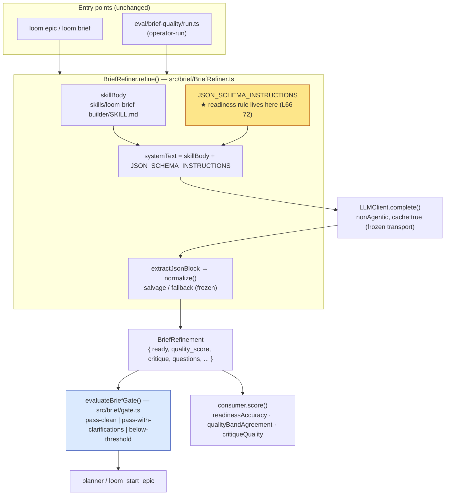

I'll explore the codebase to ground the architecture in real file paths, the actual prompt, schema, and parsing/fallback code before writing the document.Let me read the key files directly to quote the seams accurately — the prompt, gate logic, the brief-builder skill, and the band definitions.# Architecture: Sharpen BriefRefiner Readiness Determination (epic-035)

## Architecture Philosophy

This is a surgical change to one sentence of judgment inside an existing, well-tested component. The architecture's job here is mostly *containment* — defining exactly which seams may move and which must not — so three independent stories can land without disturbing two axes that already score 100%.

Four constraints drive every decision below:

1. **The defect is in the prompt, not the plumbing.** Readiness correctness sits at ~67% with a one-directional "ready → not ready" bias because the readiness rule in `BriefRefiner`'s prompt (`JSON_SCHEMA_INSTRUCTIONS`, line 67) ties `ready` to *critique-array smallness* — "every critique array except strong_points is acceptably small." Any imaginable clarification swells an array and flips the flag. The fix re-states that one rule as severity-aware plan-readiness. The schema, parser, gate, and transport are out of bounds.

2. **Readiness is a model judgment, not a computed value.** The `ready` flag is emitted by the model and carried verbatim by `normalize()`. We are *not* moving the decision into code (that would require a schema change to express severity structurally — see ADR-002). This means the prompt's judgment cannot be unit-tested directly; it is validated by the operator-run eval. The unit tests guard the *contract* around readiness, not the verdict itself.

3. **Two axes are load-bearing and frozen.** `quality_score` is already a holistic, model-emitted value explicitly decoupled from critique-item counts (`types.ts:53-65`, `BriefRefinement.test.ts`). The five critique arrays carry faithfulness. The readiness edit must reference neither in a way that changes how the model populates them.

4. **Fail-closed defaults stay closed.** `normalize()` defaults `ready` to `false` and `quality_score` to `0`; `fallback()` and the salvage path are conservative by design. Sharpening "ready" relaxes the *happy-path* criteria only — it must not relax any default, fallback, or guardrail.

## Component Diagram



The orange node is the only load-bearing source edit. The blue node (the gate) is the surface where readiness semantics become operator-visible (`pass-clean` vs `pass-with-clarifications`) and where story-035-003's documentation must align.

## Tech Stack

| Layer | Choice | Rationale |
|---|---|---|
| Scorer prompt | Plain string array in `BriefRefiner.ts` (`JSON_SCHEMA_INSTRUCTIONS`) + `skills/loom-brief-builder/SKILL.md` | Boring and inspectable. The readiness criteria are text; no framework needed. Keeping the authoritative rule in the embedded instructions (not the skill file) avoids prompt drift — see ADR-005. |
| Model transport | `LLMClient.complete()` with `nonAgentic: { excludeDynamicSections: true }`, `system: [{ text, cache: true }]` | Frozen by NFR-2. Single non-agentic completion keeps the system prompt static and cacheable; no tool loop to perturb. |
| Output contract | `BriefRefinement` TS interface (`src/brief/types.ts`) | Frozen by FR-6. Shared, documented shape consumed by CLI, gate, and eval alike. |
| Parsing / coercion | `extractJsonBlock` → `normalize()` → `clampScore`/`asStringArray` (`BriefRefiner.ts:208-255`) | Frozen by FR-6. Fail-closed coercion is the safety net; the edit must not require new parsing. |
| Gate routing | `evaluateBriefGate()` pure function (`src/brief/gate.ts`) | Already three-way and side-effect-free. No change needed; it consumes `ready` + `quality_score`. |
| Tests | Vitest with a mocked `LLMClient` (existing pattern in `src/brief/__tests__/BriefRefiner.test.ts`) | NFR-1: canned completions, zero real model calls. Reuse the established fake-LLM harness. |
| Eval | `eval/brief-quality/` (operator-run via `npm run eval:brief-quality`) | Out of scope to run as a story; it is how readiness correctness (NFR-3, Goal 1) is actually measured. |
| Docs | MkDocs: `docs/architecture/brief-refinement.md`, `docs/capabilities.md`, gate doc-comments | FR-7. Capabilities page is the public surface-of-truth and has a drift check. |

## Data Models

No schema changes. These shapes are reproduced as the *frozen contract* every story must respect (full definition: `src/brief/types.ts:11-70`).

```typescript
interface BriefRefinement {
  ready: boolean;            // model judgment; carried verbatim by normalize(). FROZEN type.
  original: string;          // user's input, echoed
  refined_brief?: string;    // present unless input too vague to draft
  critique: {                // ★ FROZEN axis — five arrays, faithfulness 100%
    strong_points: string[];
    ambiguities: string[];
    missing_scope: string[];
    untestable_claims: string[];
    hidden_complexity: string[];
  };
  questions: string[];       // surfaced regardless of `ready` (FR-3); empty when ready=true
  quality_score: number;     // ★ FROZEN axis — holistic 0–10, NOT a count of critique items
  delta: { added_sections: string[];
           clarifications: Array<{ from: string; to: string }>;
           flagged_assumptions: string[] };
}

// gate.ts — the operator-visible expression of "clean pass vs pass-with-clarifications"
type BriefGateOutcome =
  | 'pass-clean'                // quality_score >= threshold && ready === true
  | 'pass-with-clarifications'  // quality_score >= threshold && ready === false  ← questions ride here
  | 'below-threshold';          // quality_score <  threshold
```

**Quality bands (reference, `eval/brief-quality/bands.ts`)** — the "ready band" FR-1 refers to:

| Band | Range | Meaning |
|---|---|---|
| low | 0–3 | not plan-ready |
| mid | 4–6 | has gaps needing clarification |
| **high** | **7–10** | **well-scoped, ready to plan** |

FR-4's internal consistency means `ready: true` should co-occur with a high-band `quality_score` and a critique free of *critical* items — a property the prompt asks of the model, not one the code enforces (ADR-002).

## API / Interface Contracts

The seams. Signatures are frozen unless explicitly noted; only the *prose inside the prompt string* changes.

```typescript
// src/brief/BriefRefiner.ts — the ONLY behavioral change is the text of the
// readiness rule inside JSON_SCHEMA_INSTRUCTIONS. Method signature FROZEN.
class BriefRefiner {
  constructor(opts: { projectRoot: string; llm: LLMClient; model: string });
  refine(rough: string): Promise<BriefRefinement>;
}

// CURRENT readiness rule (JSON_SCHEMA_INSTRUCTIONS, line 67) — the defect:
//   '"ready" is true only when every critique array except strong_points is
//    acceptably small AND the brief is something the planner could decompose
//    without inventing requirements.'
//
// TARGET shape (story-035-001 — wording is the implementer's craft, intent is fixed):
//   ready = (quality is in the ready band) AND (no critical, planning-blocking
//   gap — blocking ambiguity or missing scope). Minor/optional gaps a planner
//   can proceed past do NOT block; clarification questions are still surfaced
//   and do NOT, on their own, force ready=false. Stated as general principles,
//   citing no fixture (FR-5).

// src/brief/gate.ts — FROZEN. Consumes the flag; needs no change.
function evaluateBriefGate(
  refinement: Pick<BriefRefinement, 'ready' | 'quality_score'>,
  minScore: number
): GateVerdict;   // → { outcome, pass, ready, quality_score, threshold }

// Test seam (story-035-002): a mocked LLMClient whose complete() returns a
// canned ```json block. Asserts refine()'s output contract, NOT the model's verdict.
interface LLMClient { complete(req): Promise<{ text: string }>; }
```

## Security Model

Not an external-attack surface, but this change touches a *gate*, so the relevant threats are integrity and over-correction.

| Threat | Control |
|---|---|
| **Guardrail weakening** — relaxing "ready" silently lowers the planning bar. | The quality gate is unchanged: `evaluateBriefGate` still routes `below-threshold` purely on `quality_score < minScore`. Sharpening `ready` only shifts the split between `pass-clean` and `pass-with-clarifications`; it cannot pass a sub-threshold brief. Story-035-001 AC explicitly forbids weakening any guardrail. |
| **Fail-open readiness** — relaxed criteria leak into the fail-closed defaults. | `normalize()` keeps `ready` defaulting to `false`; `fallback()` (score 0) and salvage (score 3, `ready:false`) are untouched. The edit modifies only the model-facing happy-path definition, never the coercion layer. |
| **Over-correction → false "ready"** (NFR-3) — the prompt swings to minting `pass-clean` on briefs with real blocking gaps. | Two-sided defense: (a) story-035-002 adds a unit case asserting a critical gap still yields `ready:false`; (b) the operator eval's `readinessAccuracy` must rise *with no remaining one-directional bias* — a new bias toward false-ready is a failure, not a pass. |
| **Eval overfitting** (NFR-3) — criteria tuned to fixtures rather than principle. | FR-5 forbids referencing any fixture or labeled case in the prompt; the criteria are stated as general plan-readiness principles. Reviewable as a diff of `JSON_SCHEMA_INSTRUCTIONS`. |
| **Prompt/transport tampering** — losing the non-agentic, cached, static system prompt. | `nonAgentic: { excludeDynamicSections: true }` and `cache: true` are unchanged (NFR-2); existing tests assert the request shape (`BriefRefiner.test.ts` "Non-agentic mode request shape", "Static system prompt"). Editing only the rule text preserves both. |

## ADR Log

### ADR-001 — Localize the change to the readiness rule in `JSON_SCHEMA_INSTRUCTIONS`
**Decision:** Edit only the readiness sentence (line 67) in `BriefRefiner.ts`'s prompt; leave the schema, `normalize()`, `salvage`, `fallback`, gate, and transport untouched.
**Context:** Readiness correctness is ~67% with a one-directional bias; the offending instruction couples `ready` to critique-array size. Score and critique axes are at 100%.
**Rationale:** The defect is semantic, not structural. A one-string edit is the smallest change that addresses the root cause and is trivially diff-reviewable against FR-5 (no fixture references). It keeps two passing axes mechanically isolated.
**Trade-off:** A prompt-only fix cannot be proven correct by a unit test; correctness rests on the operator-run eval (ADR-003). We accept slower, human-in-the-loop validation in exchange for not destabilizing the parser or gate.

### ADR-002 — Keep readiness a model-emitted flag; do not compute it in code
**Decision:** Continue to let the model emit `ready`; `normalize()` carries it verbatim. Do not derive `ready` in code from `quality_score` band + critique severity.
**Context:** FR-4 wants `ready` consistent with the quality score and critique severity. One could enforce that in `normalize()`.
**Rationale:** Severity is not a structured field — the critique arrays carry no per-item severity. Computing readiness would require adding severity to the schema, which FR-6 forbids. The model already holds the holistic context to weigh severity; asking it in-prompt is the boring, schema-preserving path.
**Trade-off:** Internal consistency (FR-4) becomes a property the prompt *requests* rather than the code *guarantees* — the model can still emit an inconsistent pair. We mitigate with the eval's consistency check and accept residual risk rather than a schema change.

### ADR-003 — Readiness-intent unit tests assert the contract, not the verdict
**Decision:** Story-035-002's tests use a mocked `LLMClient` returning canned JSON, asserting that (a) a `ready:true` output with non-empty `questions` is preserved as `ready:true` with questions intact (FR-3), and (b) a `ready:false` critical-gap output is preserved — plus the over-correction direction (NFR-3). They live in `src/brief/__tests__/BriefRefiner.test.ts`.
**Context:** NFR-1 bars real model completions, but the readiness judgment itself lives in the LLM.
**Rationale:** What code *can* test deterministically is the contract: that `refine()` faithfully carries the model's `ready` through `normalize()`, that `questions` and `ready` are independent fields, and that nothing in code re-derives `ready` from question presence. These cases double as executable documentation of intent and a regression guard on the decoupling.
**Trade-off:** The tests cannot prove the prompt *judges* correctly — only that the pipeline respects the contract. The judgment-quality claim (Goal 1) is owned by the operator eval. We are explicit that green unit tests ≠ improved readiness accuracy.

### ADR-004 — Ride on the existing three-way gate; do not retune it
**Decision:** Leave `evaluateBriefGate` and `min_brief_quality_score` (default 6) unchanged. Sharpening `ready` only re-partitions `pass-clean` vs `pass-with-clarifications`.
**Context:** The gate already models "clean pass" vs "pass-with-clarifications" vs "below-threshold." The PRD's out-of-scope section forbids lowering the quality gate.
**Rationale:** The readiness fix is orthogonal to the score threshold. Keeping the gate fixed means `below-threshold` routing is provably unaffected, scoping the blast radius to the readiness flag alone.
**Trade-off:** Operators who previously read every `pass-with-clarifications` as "needs work" will now see more `pass-clean`; story-035-003 must update the docs so the shift in distribution reads as intended, not as a regression.

### ADR-005 — Single authoritative source for the readiness rule
**Decision:** Keep the binding readiness criteria in `JSON_SCHEMA_INSTRUCTIONS`. Leave `skills/loom-brief-builder/SKILL.md`'s "When to stop" section about *brief construction* (the smallest defensible question set), not the `ready` flag; touch it only if needed to avoid contradicting the new criteria.
**Context:** The system prompt is `skillBody` (SKILL.md) + `JSON_SCHEMA_INSTRUCTIONS`. Readiness language in both could drift and let the prompt argue with itself.
**Rationale:** One load-bearing definition prevents contradictory guidance reaching the model. The skill file describes *how to build* a brief; the instructions define *how to score* it — a clean division of responsibility.
**Trade-off:** Two documents still discuss "done"/"ready" adjacently; reviewers must confirm they remain coherent. We accept a coherence-review burden over the alternative of merging two concerns into one prompt block.
