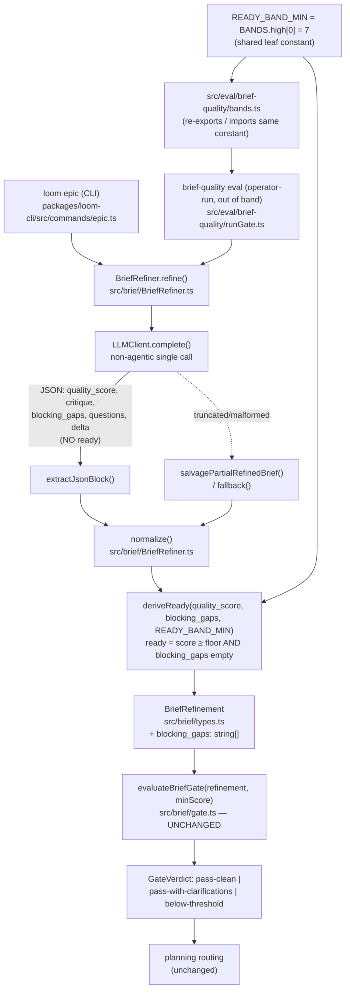

I'll first explore the codebase to ground the architecture in real file paths, component names, and data shapes — then produce the document.Let me confirm the most load-bearing specifics directly before writing — the scorer's normalize/parse path, the gate, and the band definitions.# Code-Derived Readiness for the Brief-Quality Scorer — Architecture

## Architecture Philosophy

This is a surgical change to one component, `BriefRefiner`, governed by four constraints:

1. **Move a decision the model gets wrong into code, and nothing else.** The eval shows the model is reliable at graded judgments (`quality_score`, critique) and unreliable at the binary `ready` synthesis. The architecture relocates exactly that synthesis — `ready` — out of the model and into a pure function, and touches nothing that already scores 100%.
2. **Model output is untrusted input crossing a trust boundary.** `ready` was a model-asserted control signal that routes planning. We shrink the model's authority over that gate by deriving the signal from inputs the model is trusted to produce. The existing fail-closed parsing discipline (`normalize`, salvage, fallback) is the template, not an afterthought.
3. **Additive and backward-compatible by default.** `blocking_gaps` is a new field that defaults to empty when absent or malformed. Old or truncated outputs must degrade to score-band-only readiness, never throw. The `ready` field keeps its name, type, and consumers.
4. **One number, one home.** The ready-band floor (7) already exists in the eval's `BANDS.high` definition. The derivation must reference that single source, not reintroduce a magic `7` fit to fixtures — which forces a deliberate decision about module layering (ADR-001).

## Component Diagram



## Tech Stack

| Layer | Choice | Rationale |
|---|---|---|
| Language / runtime | TypeScript, Node.js 20+ | Existing repo standard; no new runtime concern for a one-component change. |
| Scorer | `BriefRefiner` class, `src/brief/BriefRefiner.ts` | The component that owns the model call and output normalization — the only place that changes. |
| Output validation | Hand-written `normalize()` + type-guard helpers (`asStringArray`, `clampScore`) | The brief module already parses model JSON by manual coercion, not zod. Stay with the established pattern; `blocking_gaps` slots into the same `asStringArray` discipline. |
| Threshold source | `BANDS.high` in `src/eval/brief-quality/bands.ts` (band SSOT) | FR-5: the ready-band floor must come from the eval's high-band definition, not a refit constant. |
| Gate | `evaluateBriefGate()`, `src/brief/gate.ts` | Pure, three-way routing consumer of `ready` + `quality_score`. Stays untouched (FR-3 changes provenance, not the gate). |
| Tests | `node:test` + `node:assert/strict`, `MockLLMClient` | Matches `src/brief/__tests__/BriefRefiner.test.ts`; lets unit tests cover derivation against mocked outputs with no real model calls (Story 036-001 AC). |
| Docs / drift | MkDocs (`docs/architecture/brief-refinement.md`), `loom doctor --capabilities` | FR-8: docs describe code-derived readiness; the drift check gates any user-visible surface change. |

## Data Models

The only schema change is one additive field on `BriefRefinement` (`src/brief/types.ts`). `ready` keeps its type; its **provenance** moves from `raw.ready` to derivation.

```typescript
// src/brief/types.ts — BriefRefinement (excerpt; + blocking_gaps)
interface BriefRefinement {
  ready: boolean;            // UNCHANGED type. Provenance: was raw.ready (model);
                            // now derived in normalize() — see deriveReady().
  original: string;
  refined_brief?: string;

  critique: {               // UNCHANGED — 100% agreement, preserved exactly (FR-7)
    strong_points: string[];
    ambiguities: string[];
    missing_scope: string[];
    untestable_claims: string[];
    hidden_complexity: string[];
  };

  // NEW (FR-1, FR-2): ONLY gaps so severe a planner would have to invent
  // requirements to proceed. Deliberately narrow — NOT a duplicate or superset
  // of critique.ambiguities / critique.missing_scope / questions.
  blocking_gaps: string[];

  questions: string[];      // UNCHANGED — minor/optional clarifications
  quality_score: number;    // UNCHANGED — model-emitted holistic 0–10, clamped
  delta: {
    added_sections: string[];
    clarifications: Array<{ from: string; to: string }>;
    flagged_assumptions: string[];
  };
}
```

Threshold constant — one home, sourced from the eval bands:

```typescript
// Single source of truth (see ADR-001 for where this lives to avoid a cycle).
// READY_BAND_MIN === BANDS.high[0] === 7
const READY_BAND_MIN = BANDS.high[0]; // src/eval/brief-quality/bands.ts: high: [7,10]
```

## API / Interface Contracts

**1. Model output contract** — `JSON_SCHEMA_INSTRUCTIONS`, `src/brief/BriefRefiner.ts` (FR-4). `ready` is removed; `blocking_gaps` is added. The "critical gap" judgment that the prompt currently folds into the `ready` rule (lines 67–69) is relocated into the `blocking_gaps` enumeration instruction.

```text
// REMOVE:
"ready": boolean,            // true if the brief is concrete enough to plan
// ADD:
"blocking_gaps": [string],   // ONLY gaps so severe a planner would have to
                            // invent requirements to proceed. NOT minor ambiguities,
                            // NOT general missing scope, NOT clarification questions —
                            // those belong in critique/questions. Empty when none.
// KEEP UNCHANGED: quality_score, critique{...}, questions, delta{...}, refined_brief
// REMOVE the "ready is true when..." rule; the model no longer emits ready.
```

**2. Pure derivation seam** (new, the testable core):

```typescript
// src/brief/BriefRefiner.ts (or a colocated pure module)
function deriveReady(qualityScore: number, blockingGaps: string[], readyBandMin: number): boolean {
  return qualityScore >= readyBandMin && blockingGaps.length === 0;
}
```

**3. Normalization seam** — `normalize(raw, original): BriefRefinement` changes one line and adds one field. `blocking_gaps` parses via the existing `asStringArray` (safe, default-empty → FR-6 satisfied for free). `ready` is computed from the already-clamped score, not read from `raw.ready`:

```typescript
// BEFORE: ready: typeof raw.ready === 'boolean' ? raw.ready : false,
// AFTER:
const quality_score = clampScore(raw.quality_score);
const blocking_gaps = asStringArray(raw.blocking_gaps);     // absent/malformed → []
const ready = deriveReady(quality_score, blocking_gaps, READY_BAND_MIN);
```

**4. Gate seam** — `evaluateBriefGate(refinement: Pick<BriefRefinement,'ready'|'quality_score'>, minScore)` in `src/brief/gate.ts` is **unchanged** (FR-3, Goal 3). It consumes the now-derived `ready` transparently; `BriefGateOutcome` and `GateVerdict` keep their shape. Note `minScore` (policy `min_brief_quality_score`) and `READY_BAND_MIN` (eval high-band floor) remain distinct thresholds — the gate threshold is not the ready-band floor, and this change does not conflate them.

## Trust & Integrity Model

| Concern | Before | Control after this change |
|---|---|---|
| Model asserts a control-flow boolean (`ready`) that routes planning | The untrusted model directly sets a gate signal it is measured wrong on (~67%) | Code derives `ready` from inputs the model is trusted on; the model's authority over the routing boolean is removed (FR-3/FR-4). |
| Malformed / truncated / legacy output | `ready` defaulted to `false`; salvage/fallback fail closed | `blocking_gaps` absent/malformed → `[]`; derivation falls back to score-band-only readiness; salvage (`SALVAGE_QUALITY_SCORE`) and `fallback` (`FALLBACK_QUALITY_SCORE`) score below the floor → derived `ready=false` automatically (FR-6, fail-closed preserved). |
| Threshold fit to fixtures (overfitting risk) | n/a | Floor sourced from `BANDS.high` SSOT, reviewed by operators in `bands.ts`, not embedded in the scorer (FR-5, ADR-001). |
| Scope creep into working outputs | n/a | `quality_score`, critique arrays, questions, delta unchanged in shape and computation (FR-7); `blocking_gaps` is additive and distinct (FR-2). |

## ADR Log

### ADR-001 — Source the ready-band floor from one shared constant, hoisted to avoid a `brief ↔ eval` cycle
- **Decision:** Treat the high-band floor as a single exported constant (`BANDS.high[0]` = 7) referenced by both the scorer and the eval. Because `src/eval/brief-quality/` already imports from `src/brief/` (e.g. `runGate.ts` drives `BriefRefiner`), have the scorer **not** import from `eval/`. Instead hoist the band definition to a leaf module the scorer owns and re-export it from `src/eval/brief-quality/bands.ts`, **or** inject the floor into `deriveReady(...)` as a parameter wired from `BANDS.high[0]` at the call sites.
- **Context:** FR-5 forbids a refit `7` in the scorer. The bands live in the eval module today, but `brief/` importing `eval/` would create a dependency cycle since `eval/` already depends on `brief/`.
- **Rationale:** One number, one home — operators keep reviewing the cut in `bands.ts`, and the scorer can't drift from the eval. Keeping the dependency direction one-way (`eval → brief`) preserves clean layering.
- **Trade-off:** Hoisting touches `bands.ts`'s import surface and the operator-review comment moves with it; parameter-injection instead spreads the wiring to call sites (`epic.ts`, `runGate.ts`). Either way we accept one small structural edit to avoid a duplicated magic constant and a module cycle. Recommended: hoist + re-export (least call-site churn).

### ADR-002 — Derive `ready` in code; remove it from the model contract
- **Decision:** `ready = (quality_score ≥ READY_BAND_MIN) AND (blocking_gaps is empty)`, computed in `normalize()`; the model stops emitting `ready`.
- **Context:** Eval shows readiness accuracy ~67% against 100% for quality-band and critique; a prompt-sharpening pass didn't move it. The failure is the binary synthesis, not the graded inputs.
- **Rationale:** Deterministic boolean logic over two trusted signals is exact and free; it removes the one judgment the model demonstrably can't make.
- **Trade-off:** Accuracy now depends on the model's `blocking_gaps` discipline and `quality_score` calibration. We trade a fuzzy end-to-end judgment for a sharp rule over narrower inputs — verified out-of-band by the operator re-running the eval after ship.

### ADR-003 — Parse `blocking_gaps` additively with default-empty
- **Decision:** Parse `blocking_gaps` via the existing `asStringArray` guard; absent, non-array, or non-string entries collapse to `[]`.
- **Context:** FR-6 requires graceful degradation; older/malformed/truncated outputs (including the salvage and `fallback` paths) must not break.
- **Rationale:** When `blocking_gaps` is `[]`, `ready` degrades to score-band-only — a safe, monotonic fallback consistent with the existing fail-closed normalize. No new failure mode is introduced.
- **Trade-off:** A legacy output that *should* have flagged a blocking gap but lacks the field reads as gap-free, so readiness rests on the score band alone for that case. Acceptable: the alternative (hard-failing on a missing field) regresses robustness for a benefit only legacy payloads would see.

### ADR-004 — Keep `blocking_gaps` distinct from critique arrays, not a reuse of `missing_scope`/`ambiguities`
- **Decision:** Add a dedicated `blocking_gaps` field rather than deriving blocking-ness from `critique.missing_scope` or `critique.ambiguities` lengths.
- **Context:** FR-2 demands `blocking_gaps` be neither a duplicate nor a superset of the minor-ambiguity, missing-scope, or clarification-question outputs.
- **Rationale:** Critique arrays are graded, inclusive, and at 100% agreement precisely because they list everything; a planning-blocking subset is a different, narrower judgment. Counting critique items to infer blocking-ness would couple the derivation to outputs whose shape we are committed to preserving and would re-introduce a synthesis the model isn't asked to make.
- **Trade-off:** One more field for the model to populate and one more thing to keep semantically separate in the prompt. Worth it to keep the derivation inputs clean and the preserved critique arrays untouched.

### ADR-005 — Leave `evaluateBriefGate`, `quality_score`, and critique computation untouched
- **Decision:** No change to `src/brief/gate.ts`, the score, or the critique/questions/delta computation and shape.
- **Context:** Goal 3 / FR-7: keep the readiness contract and downstream consumption stable; quality-band and critique are at 100%.
- **Rationale:** Smallest blast radius. The gate already consumes `ready` + `quality_score`; changing provenance upstream is transparent to it. Touching the 100% paths only risks regression for no gain.
- **Trade-off:** The gate's policy `minScore` and the ready-band `READY_BAND_MIN` remain two separate thresholds, which a future reader must not conflate — documented here and in the brief-refinement docs (FR-8) rather than unified now.

### ADR-006 — Stay on the non-agentic single-call path
- **Decision:** Keep `BriefRefiner.refine()` as one non-agentic `LLMClient.complete()` call (`nonAgentic: { excludeDynamicSections: true }`); no tool/agent loop is introduced.
- **Context:** PRD explicitly scopes out any move to an agentic flow.
- **Rationale:** The fix is a code derivation plus one narrow output field — none of it needs multi-step model autonomy. Boring path, proven cost (~one call), no new latency or failure surface.
- **Trade-off:** We forgo any richer model-side reasoning an agentic loop might enable for `blocking_gaps`; if `blocking_gaps` quality proves insufficient out-of-band, that is a separate, later decision, not a prerequisite of this change.
