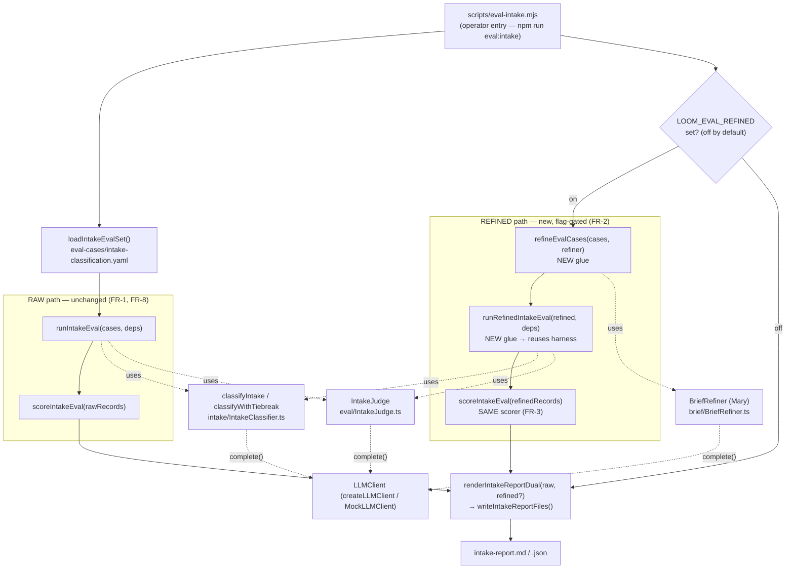

I'll explore the codebase to ground the architecture in real file paths, component names, and data shapes before writing.Let me read the key files directly to nail down the exact seams where the refined-brief variant plugs in.# Architecture: Refined-Brief Variant for the Intake Classifier Eval

## Architecture Philosophy

This is additive, observe-only measurement bolted onto a pipeline that already works. Three constraints drive every decision below.

1. **The raw path is sacred (FR-8).** The existing offline eval — `scripts/eval-intake.mjs` → `runIntakeEval` → `scoreIntakeEval` → `renderIntakeReport` — must produce *byte-identical* `intake-report.{md,json}` when the new variant is off. That rules out any in-place edit to the raw scoring or rendering code path; the refined variant must run *alongside* it, not *through* it.
2. **Reuse over reimplementation (FR-6).** The refined variant is not a new evaluator. It is the *same* classifier and judge, scored by the *same* `scoreIntakeEval`, fed a brief that has first passed through the *same* production `BriefRefiner`. The cleanest expression of this is: run the existing pipeline a second time over refined inputs. New code is glue, not logic — which is also what makes same-axis scoring (FR-3, FR-4) free rather than a thing to re-derive.
3. **Deterministic and offline (NFR-1, NFR-2).** Every new seam takes the `LLMClient` interface by injection so a `MockLLMClient` substitutes in tests. The eval is operator-run via an npm script, never a worker story, so the "doubles the LLM calls" cost (NFR-4) lands on a human who opted in, not on an autonomous agent.

The load-bearing idea: **a refined run is the existing run with one extra pre-step.** Refine each case's brief, swap the brief text (never the label), and replay the unchanged harness. Everything downstream — confusion matrix, fail-closed gate, under-sizing count — comes along for free because it is literally the same `scoreIntakeEval` call on a second record set.

## Component Diagram



## Tech Stack

| Layer | Choice | Rationale |
|---|---|---|
| Language / runtime | TypeScript, Node 20+ | Matches the whole repo; no new toolchain for a glue-sized change. |
| Schema / validation | `zod` (existing `IntakeEvalCaseSchema`, `IntakeVerdictSchema`) | Refined cases reuse the same schema; a refined brief is just a different `brief` string. |
| Brief refinement | `BriefRefiner` (`packages/loom-core/src/brief/BriefRefiner.ts`), non-agentic `complete()` path | FR-2/FR-6: the production refiner, reused verbatim — no parallel copy. |
| Classification | `classifyWithTiebreak` / `classifyIntake` (`packages/loom-core/src/intake/`) | FR-6: the production classifier under test, unchanged. |
| Independent grading | `IntakeJudge` (`packages/loom-core/src/eval/IntakeJudge.ts`) | Same judge grades both variants on the same axes. |
| Scoring | `scoreIntakeEval` (`packages/loom-core/src/eval/scoreIntakeEval.ts`), unchanged | FR-3/FR-4: same-axis accuracy, confusion matrix, fail-closed gate, under-sizing — for free by reusing it. |
| Reporting | `renderIntakeReport` extended to `renderIntakeReportDual` (`renderIntakeReport.ts`) | FR-5: side-by-side rendering; raw-only output stays byte-identical. |
| LLM access | `LLMClient` interface; `createLLMClient(backend)` in prod, `MockLLMClient` in tests | NFR-1: injection seam keeps new wiring deterministically testable. |
| Variant gate | `LOOM_EVAL_REFINED` env var read in `scripts/eval-intake.mjs` | FR-7: matches the existing env-var flag convention (`LOOM_EVAL_BACKEND`, `LOOM_EVAL_MODEL`); this is a dev harness, not an operator CLI command (existing ADR-005). |
| Fixtures | `packages/loom-core/eval-cases/intake-classification.yaml` | Unchanged — same labeled case set drives both variants (Goal 2). |

## Data Models

The refined variant introduces **no new persisted shape and no schema migration.** It reuses `IntakeEvalCase`, `ClassifyResult`, `JudgeOutcome`, `IntakeRunRecord`, and `IntakeEvalReport` exactly as defined in `packages/loom-core/src/eval/intakeEvalTypes.ts`. Two small new in-memory types carry the glue.

```typescript
// Existing, reused verbatim (intakeEvalTypes.ts) — shown for context:
//   IntakeEvalCase   { id, source, brief, brief_source?, label:{type,size}, rationale, story_count? }
//   IntakeRunRecord  { case: IntakeEvalCase; classifier: ClassifyResult; judge: JudgeOutcome }
//   IntakeEvalReport { generatedFromCases, classifierModel, judgeModel, axes[], gate, ... }

// NEW — per-case outcome of the refiner pre-step (eval/refineEvalCases.ts).
// A refined case keeps the ORIGINAL label as ground truth (ADR-003); only the
// brief text is replaced with the refiner's output.
export type RefinedCaseResult =
  | { ok: true;  case: IntakeEvalCase /* brief := refinement.refined_brief */; qualityScore: number }
  | { ok: false; caseId: string; reason: 'no_refined_brief' | 'refiner_error'; detail: string };

// NEW — the dual report wrapper produced only when the flag is on (ADR-006).
// `raw` is the exact object today's scorer returns; `refined` is a second,
// independently-scored IntakeEvalReport over the refined records.
export interface DualIntakeReport {
  raw: IntakeEvalReport;
  refined?: IntakeEvalReport;   // undefined ⇒ flag off ⇒ byte-identical legacy output
  /** Pre-computed side-by-side deltas for the comparison header (FR-5). */
  comparison?: {
    typeAccuracy:  { raw: { correct: number; scored: number }; refined: { correct: number; scored: number } };
    sizeAccuracy:  { raw: { correct: number; scored: number }; refined: { correct: number; scored: number } };
    underSizing:   { raw: number; refined: number };   // epic→story confusion count per variant
    refinerFailures: number;                           // cases with no usable refined_brief
  };
}
```

**Why no mutation of `IntakeEvalCase`.** `scoreIntakeEval` and `computeAxisAccuracy` read only `case.label[axis]` and `classifier.verdict[axis]` — never `case.brief`. So a refined record can carry the *original* `label` while its `classifier` verdict reflects the *refined* brief, and scoring stays honest with zero new branching. The refined brief text is what the classifier and judge *saw*, not what the scorer reads.

## API / Interface Contracts

These are the new seams. They are deliberately thin wrappers over existing functions.

```typescript
// eval/refineEvalCases.ts — NEW
// Maps each labeled case to a refined version by calling the production refiner
// once per case (FR-2). Cases whose refiner returns no usable refined_brief
// become { ok:false } and are reported as refiner failures (ADR-005).
export async function refineEvalCases(
  cases: IntakeEvalCase[],
  refiner: BriefRefiner,            // constructed with modelFor(policy,'planning') — ADR-007
): Promise<RefinedCaseResult[]>;

// eval/runRefinedIntakeEval.ts — NEW (thin orchestrator)
// For ok cases: builds refined IntakeEvalCases (brief := refined_brief) and runs
// the UNCHANGED runIntakeEval over them, so classifier AND judge both see the
// refined brief (ADR-004). For failed cases: synthesizes an IntakeRunRecord whose
// classifier is { ok:false, reason:'llm_error', detail:'refiner: <reason>' } so the
// existing failure-counting excludes it but counts it. Order matches `cases`.
export async function runRefinedIntakeEval(
  refined: RefinedCaseResult[],
  deps: RunIntakeEvalDeps,          // SAME deps shape: { llm, classifierModel, judgeModel, judge }
): Promise<IntakeRunRecord[]>;

// scoring — reused with NO signature change (FR-3):
//   const rawReport     = scoreIntakeEval(rawRecords,     { classifierModel, judgeModel });
//   const refinedReport = scoreIntakeEval(refinedRecords, { classifierModel, judgeModel });

// eval/renderIntakeReport.ts — EXTENDED, additive
// When `refined` is undefined, MUST delegate to the existing renderIntakeReport so
// output is byte-for-byte identical to today (FR-8). When present, appends a
// "Refined-brief variant" section plus a raw-vs-refined comparison table (FR-5).
export function renderIntakeReportDual(
  dual: DualIntakeReport,
): { markdown: string; json: string };

// writeIntakeReportFiles(report, outputDir) — unchanged; the dual renderer feeds it.
```

Entry-point wiring in `scripts/eval-intake.mjs` (the only place the flag is read):

```js
const refinedEnabled = process.env.LOOM_EVAL_REFINED === '1';   // FR-7, off by default
const rawRecords = await runIntakeEval(cases, deps);            // FR-1, unchanged
const rawReport  = scoreIntakeEval(rawRecords, { classifierModel, judgeModel });

let refinedReport;
if (refinedEnabled) {
  const refiner  = new BriefRefiner({ projectRoot, llm, model: planningModel });
  const refined  = await refineEvalCases(cases, refiner);
  const refRecs  = await runRefinedIntakeEval(refined, deps);
  refinedReport  = scoreIntakeEval(refRecs, { classifierModel, judgeModel });
}
writeIntakeReportFiles(renderIntakeReportDual({ raw: rawReport, refined: refinedReport, ... }), outputDir);
```

## Security & Safety Model

This is an offline measurement tool, so the relevant threats are operational, not adversarial.

| Threat | Control |
|---|---|
| **Cost blow-up** — refining every case roughly doubles LLM calls/runtime (NFR-4). | Flag-gated *off by default* (FR-7); a human opts in via `LOOM_EVAL_REFINED=1`. Cost noted in eval docs (FR-9). |
| **Autonomous agent runs the full eval / makes real model calls** (NFR-2). | The eval lives in `scripts/eval-intake.mjs` and `npm run eval:intake`, not in any worker/skill surface. No story may invoke it; story-037-003's tests use `MockLLMClient`. No worker story added. |
| **Non-determinism leaking into tests** (NFR-1). | All new seams take `LLMClient` by injection; unit tests inject `MockLLMClient`. No `Date.now`/randomness in the new glue. |
| **Silent regression of the raw baseline** (FR-8). | `renderIntakeReportDual` delegates to the unchanged renderer when refined is absent; a golden-output test asserts `intake-report.{md,json}` are byte-identical with the flag off. |
| **Guardrail weakening** (NFR-3). | No policy, branch-protection, or guard code is touched; this PR adds eval-only files plus one env-var read. |

## ADR Log

### ADR-001 — Implement the refined variant by re-running the existing pipeline, not a new evaluator
- **Decision:** The refined path refines each brief, then feeds the result through the *unchanged* `runIntakeEval` + `scoreIntakeEval`, producing a second `IntakeEvalReport`.
- **Context:** FR-3/FR-4 demand same-axis scoring (accuracy, confusion matrix, fail-closed gate, under-sizing); FR-6 demands reuse of the existing classifier and scorer with no parallel copies.
- **Rationale:** Reusing `scoreIntakeEval` verbatim makes "scored on the same axes" a structural guarantee rather than a thing to re-implement and keep in sync. New code shrinks to glue (`refineEvalCases`, `runRefinedIntakeEval`).
- **Trade-off:** Accepts ~2× LLM calls and runtime (one refiner call + one classifier + one judge per case, twice over). Acceptable for an offline, opt-in operator tool (NFR-4).

### ADR-002 — Gate the variant with a `LOOM_EVAL_REFINED` env var, off by default
- **Decision:** Read `LOOM_EVAL_REFINED` in `scripts/eval-intake.mjs`; unset ⇒ today's behavior exactly.
- **Context:** FR-7 permits flag-gating *or* labeling; the existing harness already configures itself purely through env vars (`LOOM_EVAL_BACKEND`, `LOOM_EVAL_MODEL`, `LOOM_JUDGE_MODEL`) and is explicitly *not* an operator CLI command (existing ADR-005).
- **Rationale:** Matching the established env-var convention keeps one mental model for the harness and avoids inventing an argument parser for a dev script.
- **Trade-off:** Env vars are less discoverable than a `--refined` flag; mitigated by documenting it in the eval runbook (FR-9).

### ADR-003 — Keep human labels as ground truth; swap only the brief text
- **Decision:** A refined case is `{ ...originalCase, brief: refinement.refined_brief }` — the `label.{type,size}` is carried over unchanged.
- **Context:** The PRD lists "whether human labels remain correct ground truth for a refined brief" as an explicit open question, out of scope.
- **Rationale:** Holding the label fixed is the only way raw and refined accuracy are comparable against a common reference (Goal 2). Changing the label would make the two numbers measure different things.
- **Trade-off:** If refinement materially changes a brief's true scope, the fixed label may be slightly wrong for the refined text — a known, accepted interpretation gap flagged for a later decision, not fixed here.

### ADR-004 — The judge sees the refined brief in the refined variant
- **Decision:** In the refined run, both `classifyIntake` and `IntakeJudge.judge` receive the refined brief (achieved by setting the refined case's `brief` field, which `runIntakeEval` passes to both).
- **Context:** The judge independently classifies the *input* to grade the classifier; a fair refined comparison requires judge and classifier to see the same input.
- **Rationale:** Reuses `runIntakeEval`'s existing `judge(c.brief, output)` call with zero new branching, and keeps the grading honest for the refined input.
- **Trade-off:** `judgeVsClassifier`/`judgeVsHuman` agreement counts are not directly comparable across variants (different inputs). That is expected — the headline comparison is per-axis accuracy and the under-sizing count, not judge agreement.

### ADR-005 — A missing `refined_brief` is recorded as a refiner failure, not dropped
- **Decision:** When `BriefRefiner.refine()` returns no usable `refined_brief` (it is optional — absent when the input is too underspecified to draft), the case becomes a `{ ok:false }` refined record whose `classifier` is `{ ok:false, reason:'llm_error', detail:'refiner: …' }`.
- **Context:** `refined_brief?` is optional in `BriefRefinement`; `IntakeEvalCaseSchema.brief` requires `min(1)`, so an empty brief cannot be classified.
- **Rationale:** Routing it through the existing `ClassifyResult` failure path means `computeFailureCounts`, accuracy exclusion, and the gate all handle it with no new code, and the refined case set keeps the *same N* as raw so the side-by-side stays aligned (fail-closed: a refiner miss is never credited as correct).
- **Trade-off:** Such a case contributes to neither variant's `scored` accuracy; the count of these is surfaced as `comparison.refinerFailures` so the operator isn't misled about coverage.

### ADR-006 — Emit a `DualIntakeReport` wrapper; raw output stays byte-identical when off
- **Decision:** Introduce `DualIntakeReport { raw; refined?; comparison? }`. `renderIntakeReportDual` delegates to the existing `renderIntakeReport(raw)` when `refined` is undefined, and appends a refined section + comparison table when present.
- **Context:** FR-8 requires the raw `intake-report.{md,json}` to be bit-for-bit unchanged when the variant is off; FR-5 requires both variants rendered together when on.
- **Rationale:** A wrapper that no-ops to the legacy renderer is the smallest change that satisfies both constraints; the raw `IntakeEvalReport` JSON object is nested unchanged under `raw`, so existing JSON consumers reading the off-path file see no diff.
- **Trade-off:** When on, the JSON's top-level shape changes (gains `refined`/`comparison` keys), so any consumer of the *refined* run must opt into the new shape. Additive only — the raw key is untouched.

### ADR-007 — Refiner runs on the planning-tier model, independent of the classifier model
- **Decision:** Construct `BriefRefiner` with `model: modelFor(policy, 'planning')`, separate from `LOOM_EVAL_MODEL` (the classifier model, default `claude-haiku-4-5-20251001`).
- **Context:** The refiner's own contract (`BriefRefinerOptions.model`) specifies it must run on the planning-tier model because its judgment gates the planner; using a cheap classifier-tier model would not exercise the production refiner faithfully (FR-2/FR-6).
- **Rationale:** Reproduces exactly what production refinement would feed the classifier, so the measured effect reflects the real hypothesis under test.
- **Trade-off:** Adds a third model to reason about in a single run (refiner planning-tier, classifier eval-tier, judge `LOOM_JUDGE_MODEL`); all three are surfaced in the report header (`classifierModel`, `judgeModel`) and the docs note the refiner tier.
