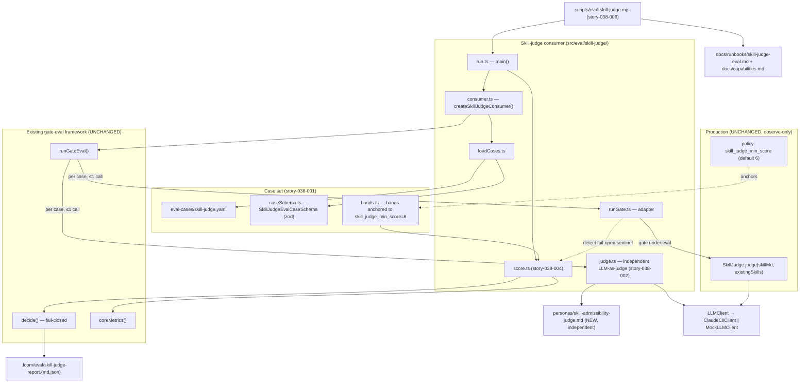

# SkillJudge Eval — System Architecture

## Architecture Philosophy

This harness measures a production gate; it must never become one. Four constraints drive every decision below.

1. **Observe-only is a hard wall, not a guideline.** The production `SkillJudge` (`packages/loom-core/src/skills/SkillJudge.ts`) and its fail-open default are invoked *unmodified*. Everything the eval adds lives in a new sibling directory (`packages/loom-core/src/eval/skill-judge/`) and a new fixture; nothing under `src/skills/` is touched. The eval reads the gate's behavior, it does not reshape it.

2. **Reuse the existing seams; add only a consumer.** The gate-eval framework (`packages/loom-core/src/eval/framework/`) already supplies the loop (`runGateEval`), the fail-closed decision (`decide`), the baseline metrics (`coreMetrics`), and the `GateEvalConsumer<TCase, TOut, TJudg, TMetrics>` extension point. We implement that one interface — exactly as `brief-quality/` does — and write zero new framework code. This is the boring-technology choice: the framework is proven by two prior consumers.

3. **Determinism in CI, real models only out-of-band.** Unit tests inject `MockLLMClient` and assert wiring/scoring with no network. The full eval that drives real models is an operator-run script (`scripts/eval-skill-judge.mjs`), never a worker story, never part of `npm test`'s real-call surface.

4. **Break the judge↔gate circle deliberately.** The thing under measurement is itself an LLM judge. If we grade it with the same model and the same rubric, we measure self-agreement, not quality. The independent judge defaults to a *different, stronger* model and a *separate* persona file from production's `skill-judge.md`.

The trade-off this philosophy accepts: by mirroring `brief-quality/` rather than abstracting a shared base, we duplicate ~6 small modules of structure. We pay that duplication to keep each consumer independently readable and to avoid coupling three evals through a premature abstraction.

## Component Diagram



## Tech Stack

| Layer | Choice | Rationale |
|---|---|---|
| Eval loop / decision | Existing `runGateEval` + `decide` + `coreMetrics` in `src/eval/framework/` | Proven by two consumers (intake, brief-quality). Reusing it satisfies PRD Goal 2 and guarantees the ≤1-gate/≤1-judge-call control flow for free. |
| Consumer pattern | `GateEvalConsumer<TCase, TOut, TJudg, TMetrics>` | The framework's sole extension point. One interface, six methods, no framework edits. |
| Case set format | YAML in `packages/loom-core/eval-cases/skill-judge.yaml`, validated by `zod` at load | Mirrors `brief-quality.yaml`; human-curatable; schema-pinned so malformed cases fail loudly at load, not mid-run. |
| Schema validation | `zod` (`SkillJudgeEvalCaseSchema`) | Already the repo standard (CLAUDE.md). Matches `BriefQualityCaseSchema`. |
| Gate under eval | Production `SkillJudge` (`src/skills/SkillJudge.ts`), constructed with `{ llm, model }` | The whole point: drive the real gate. Its `SkillJudgeOptions.loadPrompt` seam also lets tests exercise it deterministically without touching production. |
| Independent judge | New `personas/skill-admissibility-judge.md` + `LLMClient.complete` | A *separate* persona from `skill-judge.md` is the circularity firewall. |
| Model resolution | Env vars `LOOM_EVAL_GATE_MODEL` / `LOOM_EVAL_JUDGE_MODEL`, framework-style defaults | Consistent with `resolveEvalModels` and the existing runner scripts; reproducible, overridable. |
| LLM transport | `LLMClient` abstraction; `ClaudeCliClient` (prod runs), `MockLLMClient` (tests) | The injection seam that makes Goal 3 (deterministic CI) achievable. |
| Tests | `node:test` + `node:assert/strict` + `MockLLMClient` | Repo standard; no jest/vitest. No network in CI. |
| Runner | `scripts/eval-skill-judge.mjs` + root `package.json` script `eval:skill-judge` | Mirrors `eval-brief-quality.mjs`. Operator-run, out-of-band (NFR-2). |
| Output | `.loom/eval/skill-judge-report.{md,json}` | Same convention as brief-quality; md for humans, json for tooling. |

## Data Models

### Eval case (story-038-001) — `src/eval/skill-judge/caseSchema.ts`

```typescript
import { z } from 'zod';

// Band anchored to skill_judge_min_score (default 6). See ADR-003.
export const SkillQualityBand = z.enum(['bad', 'borderline', 'good']);
export type SkillQualityBandType = z.infer<typeof SkillQualityBand>;

// The existing-library context the production judge receives as its 2nd arg.
// Mirrors SkillManifest's shape (name + description) so duplicative cases are real.
export const ExistingSkillSchema = z.object({
  name:        z.string(),
  description: z.string(),
});

export const SkillJudgeEvalCaseSchema = z.object({
  id:                z.string(),
  source:            z.enum(['anchor', 'borderline', 'derived']),
  category:          z.enum(['accept', 'reject', 'borderline']),
  skill_md:          z.string().min(1),          // candidate SKILL.md fed to SkillJudge
  existing_skills:   z.array(ExistingSkillSchema).default([]),
  expected_decision: z.enum(['accept', 'reject']),
  expected_band:     SkillQualityBand,            // NOT an exact score (FR-1)
  // For reject cases, which named failure mode this exercises (FR-1):
  failure_mode:      z.enum(['vague', 'not-reusable', 'duplicative', 'unsafe']).optional(),
  rationale:         z.string().min(1),
});

export const SkillJudgeEvalSetSchema = z.object({
  cases: z.array(SkillJudgeEvalCaseSchema).min(1),
});

export type SkillJudgeEvalCase = z.infer<typeof SkillJudgeEvalCaseSchema>;
```

### Gate output (`TOut`) — the production result, reused verbatim

```typescript
// From src/skills/SkillJudge.ts — DO NOT redefine; import it.
export interface JudgeResult {
  score: number;                       // 0–10, or the 999 fail-open sentinel
  verdict: 'accept' | 'reject';
  reason: string;
}
```

### Judge output (`TJudg`) — `src/eval/skill-judge/judgeTypes.ts`

Mirrors `BriefQualityJudgment`: deterministic fields computed in TypeScript, LLM contributes the independent cross-check.

```typescript
export interface SkillJudgeJudgment {
  // Computed deterministically in judge.ts (not from the LLM):
  decision_correct:    boolean;   // gateOutput.verdict === case.expected_decision
  band_in_range:       boolean;   // scoreInBand(gateOutput.score, case.expected_band)
  // From the independent LLM-as-judge (the circularity cross-check, FR-2):
  independent_verdict: 'accept' | 'reject';   // judge's own admission call
  band_defensible:     boolean;               // is the gate's score band defensible?
  reason:              string;
}

export interface SkillJudgeMetrics extends CoreMetrics {
  decisionAccuracy:    number;   // decision_correct / scoredCases   (FR-4)
  bandAgreement:       number;   // band_in_range    / scoredCases   (FR-4, FR-6)
  independentAgreement:number;   // (independent_verdict === gate.verdict) / scoredCases
  failOpenObserved:    number;   // count of cases where the gate failed open (score===999)
}
```

### Quality bands — `src/eval/skill-judge/bands.ts`

```typescript
import { JUDGE_MIN_SCORE } from '...'; // = 6, the schemas/policy.schema.yaml default

// Anchored to the skill_judge_min_score knob (=6): below it the gate rejects.
// [ASSUMPTION] ranges pending ratification (see Out of Scope / ADR-003).
export const BANDS = {
  bad:        [0, JUDGE_MIN_SCORE - 2],   // [0, 4]  reject-zone
  borderline: [JUDGE_MIN_SCORE - 1, JUDGE_MIN_SCORE], // [5, 6] straddles the knob
  good:       [JUDGE_MIN_SCORE + 1, 10],  // [7, 10] accept-zone
} as const;

export const BAND_TOLERANCE = 1; // s agrees with [lo,hi] if s ∈ [lo−1, hi+1]

export function scoreInBand(score: number, band: SkillQualityBandType): boolean {
  if (score < 0 || score > 10) return false; // 999 sentinel never "in band"
  const [lo, hi] = BANDS[band];
  return score >= lo - BAND_TOLERANCE && score <= hi + BAND_TOLERANCE;
}
```

## API / Interface Contracts

These are the seams the stories must agree on. Signatures match the framework's `GateDeps`/`JudgeDeps`/`GateOutcome`/`JudgeOutcome` types already in `src/eval/framework/types.ts`.

```typescript
// story-038-001 — loadCases.ts
export function loadSkillJudgeCases(fixturePath?: string): SkillJudgeEvalCase[];

// story-038-003 — runGate.ts  (drives the UNMODIFIED production SkillJudge)
//   _judgeFactory injection seam exists ONLY for unit tests; prod path uses the default.
export function runSkillJudgeGate(
  c: SkillJudgeEvalCase,
  deps: GateDeps,                       // { llm, gateModel }
  _judgeFactory?: (o: SkillJudgeOptions) => SkillJudge,
): Promise<GateOutcome<JudgeResult>>;
//   Returns { status:'ok', output } normally. Detects the fail-open sentinel
//   (output.score === 999 / "judge unavailable") and maps it to
//   { status:'failed', detail:'fail-open' } so the framework's maxGateFailureRate
//   catches a flaky gate — WITHOUT patching production. (ADR-005)

// story-038-002 — judge.ts  (independent LLM-as-judge)
export function judgeSkillAdmissibility(
  c: SkillJudgeEvalCase,
  output: JudgeResult,                  // the gate's score+verdict
  deps: JudgeDeps,                      // { llm, judgeModel }
): Promise<JudgeOutcome<SkillJudgeJudgment>>;

// story-038-004 — score.ts
export function scoreSkillJudge(
  records: RunRecord<JudgeResult, SkillJudgeJudgment>[],
): SkillJudgeMetrics;

export function skillJudgeVerdict(m: SkillJudgeMetrics): 'proceed' | 'do-not-proceed';

export const SKILL_JUDGE_THRESHOLDS: EvalThresholds = {
  minScoredCases: 5,           // brief-quality precedent
  maxGateFailureRate: 0.25,    // fail-opens count here (ADR-005)
  maxJudgeInconclusiveRate: 0.25,
};

// story-038-001..004 — consumer.ts  (the one framework extension point)
export function createSkillJudgeConsumer(opts?: { projectRoot?: string }):
  GateEvalConsumer<SkillJudgeEvalCase, JudgeResult, SkillJudgeJudgment, SkillJudgeMetrics>;

// story-038-003/004 — run.ts  (operator entry point, mirrors brief-quality/run.ts)
export interface MainOptions {
  llm?: LLMClient; gateModel?: string; judgeModel?: string; fixturePath?: string;
}
export interface EvalReport {
  metrics: SkillJudgeMetrics; decision: Decision;
  perCase: RunRecord<JudgeResult, SkillJudgeJudgment>[]; markdown: string;
}
export function main(opts?: MainOptions): Promise<EvalReport>;
```

**Model defaults (FR-5).** `run.ts` resolves: `gateModel = LOOM_EVAL_GATE_MODEL ?? 'claude-haiku-4-5-20251001'` (the production `skill_gen` model — measure what actually ships) and `judgeModel = LOOM_EVAL_JUDGE_MODEL ?? 'claude-opus-4-8'` (stronger, *different* — breaks circularity by default).

## Security Model

The harness handles no secrets and exposes no network surface, so the "threats" here are integrity threats: ways the eval could silently lie about the gate or perturb production.

| Threat | Control |
|---|---|
| Eval accidentally mutates production gating behavior (violates NFR-1) | `SkillJudge` is imported and called, never edited. `runGate` is a read-only adapter. ADR-001 + a unit test asserting `src/skills/` is untouched by this epic's diff. |
| Judge↔gate circularity inflates the score (the gate looks good because it agrees with itself) | Independent persona file (`skill-admissibility-judge.md` ≠ `skill-judge.md`) + different default model (opus judge vs. haiku gate). `independentAgreement` metric surfaces suspiciously high self-agreement. (ADR-002) |
| Fail-open masquerades as a genuine accept, hiding a broken gate | `runGate` detects the `score===999` / "judge unavailable" sentinel and routes it to `gate.status:'failed'`; `failOpenObserved` is reported; `maxGateFailureRate` can fail the run closed. We measure the fail-open risk without fixing it (explicitly out of scope). (ADR-005) |
| Real model calls leak into CI / a worker runs the full eval | Tests use `MockLLMClient` only; the real-model path lives solely in `scripts/eval-skill-judge.mjs`, an operator command excluded from `npm test`'s real-call surface (NFR-2). |
| Borderline labels are contestable, so "accuracy" is overstated | Bands carry τ=1 tolerance; the LLM judge's `band_defensible` is an independent check on the gate's score, distinct from deterministic label-matching. |
| Guardrail/worktree invariants disturbed | This epic adds files under `src/eval/` and `scripts/` only; no policy-engine or worktree code is in scope (NFR-3). |

## ADR Log

### ADR-001 — Add a consumer; never touch `src/skills/`
- **Decision.** Implement the eval entirely as a new `GateEvalConsumer` in `src/eval/skill-judge/`, importing the production `SkillJudge` as-is.
- **Context.** PRD NFR-1/Goal 3 demand zero change to production gating, including the fail-open default. The framework already exposes a clean consumer seam.
- **Rationale.** The smallest possible blast radius: production code is read, not written. A diff-scope test enforces it.
- **Trade-off.** We cannot make the gate *easier* to test (e.g. force it to throw); we work around its always-catches behavior via sentinel detection (ADR-005) instead of a cleaner exception path.

### ADR-002 — Independent persona + different default model for the judge
- **Decision.** The eval's judge uses a new `personas/skill-admissibility-judge.md` and defaults `judgeModel` to `claude-opus-4-8` while the gate defaults to the production `claude-haiku-4-5-20251001`.
- **Context.** The system under test is an LLM judge; grading it with the same model+rubric measures self-consistency, not admission quality (PRD FR-2/FR-5).
- **Rationale.** A distinct rubric and a stronger, different model give an assessment that can actually disagree with the gate. `independentAgreement` makes the degree of agreement visible.
- **Trade-off.** Two judge rubrics can drift apart over time and must be maintained separately; and the stronger judge model costs more per run. Acceptable for an out-of-band operator tool.

### ADR-003 — Bands anchored to `skill_judge_min_score` (=6), τ=1
- **Decision.** Three bands — `bad` [0,4] / `borderline` [5,6] / `good` [7,10] — anchored so the `borderline` band brackets the `skill_judge_min_score` default of 6, with a ±1 tolerance.
- **Context.** FR-6 requires bands mapped to reject-zone / borderline / accept-zone anchored to that knob. The production gate rejects when `score < 6`.
- **Rationale.** Anchoring to the live knob means the agreement instrument tracks the actual admission boundary, not an arbitrary scale. τ=1 mirrors brief-quality, absorbing one-point scoring noise on borderline cases.
- **Trade-off.** The exact ranges are an `[ASSUMPTION]` pending ratification (PRD Out of Scope). If the knob's default changes, `bands.ts` must be re-derived — so it reads the constant rather than hard-coding 6.

### ADR-004 — Mirror `brief-quality/`, don't extract a shared base
- **Decision.** Copy the `brief-quality/` module layout (`caseSchema`, `bands`, `loadCases`, `runGate`, `judge`, `score`, `consumer`, `run`, `__tests__`) rather than abstracting a reusable mid-layer across consumers.
- **Context.** Three consumers now share only the framework primitives; their case shapes, judges, and metrics differ substantially.
- **Rationale.** "Design for the system that exists." A premature base class would couple intake, brief-quality, and skill-judge through their least-common-denominator. Duplicating ~6 thin modules keeps each eval independently legible and lets the parallel story workers own disjoint files.
- **Trade-off.** Genuine bug-fixes to shared patterns (e.g. report rendering) must be applied in N places. We accept N=3 duplication today over a speculative abstraction.

### ADR-005 — Detect the fail-open sentinel in the eval adapter, report it, don't fix it
- **Decision.** `runGate` inspects the returned `JudgeResult`; a `score===999` / "judge unavailable" result is mapped to `GateOutcome.status:'failed'` and counted in `failOpenObserved`, feeding the framework's `maxGateFailureRate` fail-closed check.
- **Context.** `SkillJudge.judge` never throws — it catches internally and returns `{score:999, verdict:'accept'}`. A naive adapter would record every fail-open as a genuine accept, hiding a broken gate. Hardening the fail-open is explicitly out of scope.
- **Rationale.** Observe-only still means *observe*: surfacing fail-opens as gate failures lets the harness measure (and fail closed on) an unreliable judge without modifying production behavior.
- **Trade-off.** We rely on an implementation sentinel (`999` / a reason string) rather than a typed signal; if production changes how it fails open, the adapter's detection must follow. A unit test pins the sentinel to catch that drift.

### ADR-006 — The full eval is an operator script, not a CLI command or worker story
- **Decision.** Ship the real-model eval as `scripts/eval-skill-judge.mjs` (npm `eval:skill-judge`), writing `.loom/eval/skill-judge-report.{md,json}`. Only mocked unit tests run under `npm test`.
- **Context.** PRD NFR-2 makes "no worker executes the full eval / no worker makes real model calls" a hard boundary; the prior evals already follow this pattern.
- **Rationale.** Keeps real-model cost and non-determinism out of CI and out of autonomous worker execution, while giving operators a one-command run identical in shape to the other evals.
- **Trade-off.** The end-to-end real path is exercised only when an operator runs it — CI proves the wiring (mocked), not the live verdict. That is the intended division of labor.
