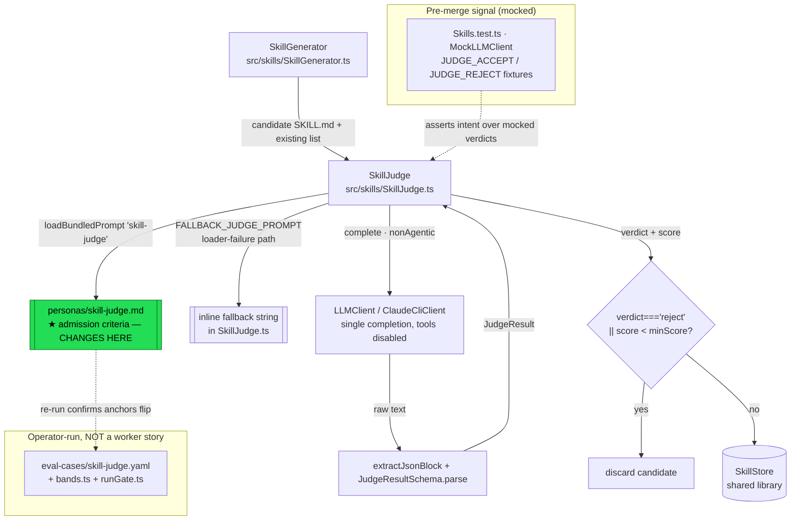

# Architecture: Hardening Skill-Judge Admission Criteria

## Architecture Philosophy

This effort changes **prompt text, not control flow**. The constraints that drive every decision below follow from that:

1. **The seam is the persona file, not the code.** The judge's behavior is governed by `packages/loom-core/personas/skill-judge.md` — a bundled prompt loaded at runtime. Sharpening admission criteria means editing that Markdown rubric. The TypeScript path (`SkillJudge.ts`), the output schema, the JSON parsing, and the fail-open fallback are load-bearing and stay frozen in shape (FR-6).
2. **The verdict is the gate; the score is advisory.** `SkillGenerator.ts:122` already rejects on `verdict.verdict === 'reject' || verdict.score < minScore`. The `reject` verdict short-circuits the score entirely. So the correct enforcement design is to instruct the judge to **set `verdict: "reject"`** for any unsafe or non-reusable candidate — independent of the 0–10 it might otherwise earn (FR-7). We do not touch the `skill_judge_min_score` knob mechanics.
3. **Principles must generalize, not memorize.** The criteria are written as general rejection rules with representative (not exhaustive) examples and an explicit edge-case stance for guarded mentions (FR-4, FR-5). The proof that they generalize is an **operator-run eval**, not a fixture-tuned assertion — so unit tests verify *encoded intent over mocked outputs*, never real model behavior (FR-8).
4. **Fail-open is preserved on purpose.** A judge error still defaults to `accept` with the sentinel `score: 999`. Hardening this is explicitly out of scope; the architecture documents it as a known residual rather than closing it (per PRD Out of Scope).

## Component Diagram



The green node is the only behavior-changing artifact. Everything else is held constant or is verification scaffolding around it.

## Tech Stack

No new technology is introduced — that is itself the design choice (boring beats novel for a load-bearing gate). The stack is inherited:

| Layer | Choice | Rationale |
|---|---|---|
| Admission criteria | Markdown rubric (`personas/skill-judge.md`) loaded via `loadBundledPrompt` | The criteria live as editable text, hot-loaded at judge time; no recompile to change policy. The single seam this epic touches. |
| Judge runtime | `SkillJudge` (TypeScript class), single `LLMClient.complete()` call | Non-agentic, one completion, `maxTokens: 512`, `cache: true` on the system prompt. Frozen by FR-6. |
| Model invocation | `ClaudeCliClient` with `nonAgentic: { excludeDynamicSections: true }` | Disables tools and dynamic system sections — keeps the judge deterministic and free of cwd/git/memory leakage. Unchanged. |
| Output contract | `zod` (`JudgeResultSchema`) + `extractJsonBlock` | Validates `{score, verdict, reason}`. Shape is the contract; stays green (FR-6). |
| Gate enforcement | `SkillGenerator.ts:122` OR-condition | `verdict==='reject'` already overrides score. No change — we drive it from the verdict. |
| Score knob | `JUDGE_MIN_SCORE = 6` / `policy.agents.skill_judge_min_score` | Default threshold, untouched. The verdict, not the knob, carries safety/reusability rejections. |
| Pre-merge tests | Node test runner + `MockLLMClient` | Asserts encoded intent over canned judge outputs — zero real model calls (FR-8). |
| Eval (operator) | YAML cases + `bands.ts` + `runGate.ts` | Confirms anchors flip on re-run. Out of scope as a worker story. |

## Data Models

The contract that must remain stable in shape (FR-6):

```typescript
// packages/loom-core/src/skills/SkillJudge.ts — UNCHANGED
const JudgeResultSchema = z.object({
  score:   z.number(),                       // 0–10 rubric sum (999 = fail-open sentinel)
  verdict: z.enum(['accept', 'reject']),     // authoritative gate signal
  reason:  z.string().default(''),           // one sentence
});

export interface JudgeResult {
  score:   number;
  verdict: 'accept' | 'reject';
  reason:  string;
}
```

The candidate-skill shape the judge reads (the `## Candidate skill` block) is a SKILL.md document — agentskills.io frontmatter plus body. The judge also receives the existing-library summary (`- <name>: <description>` lines) for the non-duplicate check. Neither shape changes.

The sentinel that encodes fail-open (preserved):

```typescript
// On any thrown error in score():
{ score: 999, verdict: 'accept', reason: 'judge unavailable — defaulting to accept' }
```

## API / Interface Contracts

The seams every story aligns on. None of these signatures change; only the *content* the prompt induces does.

```typescript
// The judge's public seam — frozen.
class SkillJudge {
  constructor(opts: { llm: LLMClient; model: string; loadPrompt?: (name: string) => string });
  judge(skillMd: string, existingSkills: SkillManifest[]): Promise<JudgeResult>; // never throws
}

// The gate condition the verdict must drive — frozen (SkillGenerator.ts:122).
if (verdict.verdict === 'reject' || verdict.score < minScore) return null;

// The prompt seam — the ONE thing that changes.
// personas/skill-judge.md template, with {{CONTEXT}} substituted at runtime.
// New, high-priority rejection rules added to the rubric; output block unchanged.
```

The **prompt contract** the new criteria text must satisfy, expressed as the behavior the rubric induces:

- An unsafe candidate (teaches/encourages destructive ops — force-push, history rewrite, data deletion, disabling safety checks; representative not exhaustive) → `verdict: "reject"`.
- A non-reusable candidate (repo-internal, one-off, non-generalizable) → `verdict: "reject"`.
- An unsafe/non-reusable candidate that is otherwise polished → still `verdict: "reject"` (precedence over surface quality).
- A genuinely reusable skill that *mentions* a destructive command in a safe, guarded way → **not** rejected on that basis alone.
- Output remains the single fenced ` ```json ` block of `{score, verdict, reason}` — no schema or parsing drift.

## Security Model

The skill library is a **shared-trust amplifier**: one admitted skill is retrieved and followed by every downstream agent. The judge is the single content-admission control in front of it. This epic hardens that control.

| Threat | Vector | Control | Status |
|---|---|---|---|
| Destructive-op propagation | A skill teaching force-push/history-rewrite/data-deletion is admitted; downstream agents follow it | High-priority safety rejection criterion in `skill-judge.md`, enforced via `verdict: "reject"` | **Closed** (FR-1) |
| Library pollution | Repo-specific/one-off skill admitted; degrades retrieval signal and misleads on different stories | High-priority reusability rejection criterion | **Closed** (FR-2) |
| Quality laundering | A polished, well-formed but unsafe/non-reusable skill scores high and slips past | Explicit precedence: safety/reusability override surface quality | **Closed** (FR-3) |
| Over-correction / false reject | A legitimate skill that safely *mentions* a destructive command gets rejected | Explicit guarded-mention edge-case stance in the criteria | **Mitigated** (FR-5) |
| Fixture overfitting | Criteria tuned to the two anchor cases; fails to generalize | Principle-based wording, no fixture references; operator eval re-run is the generalization check | **Mitigated** (FR-4) |
| Judge-error bypass | LLM/parse failure returns `{score:999, verdict:'accept'}` — anything admitted | **None this phase** — fail-open preserved by design; sentinel marks it for the eval runner | **Residual / deferred** (Out of Scope) |

Note the asymmetry that motivated this work: the eval found *every* error was a wrong-accept. The controls above all push in the safe direction (more rejection), and the guarded-mention stance is the one counterweight keeping that from becoming indiscriminate strictness.

## ADR Log

### ADR-001 — Change criteria in the persona prompt, not in code

**Decision.** Sharpen safety/reusability rules by editing `packages/loom-core/personas/skill-judge.md`. Leave `SkillJudge.ts`, the schema, parsing, and the gate condition untouched.
**Context.** The judge's behavior is governed by a hot-loaded Markdown rubric; the code is plumbing. FR-6 mandates the path, schema, parsing, and fail-open stay unchanged in shape.
**Rationale.** Smallest blast radius. Policy lives where it belongs — in editable text, recompile-free. Keeps the frozen contract genuinely frozen.
**Trade-off.** Prompt-only changes cannot be proven by unit tests against real model behavior; correctness rests on the operator eval re-run. We accept a weaker pre-merge signal (intent-only, mocked) in exchange for not entangling policy with code.

### ADR-002 — Enforce via the `verdict`, not the score knob

**Decision.** Unsafe/non-reusable candidates reject by the judge emitting `verdict: "reject"`, independent of the numeric score. We do not alter `JUDGE_MIN_SCORE` or `skill_judge_min_score`.
**Context.** `SkillGenerator.ts:122` gates on `verdict==='reject' || score < minScore`. The verdict already short-circuits the score (FR-7 asked the architect to confirm precedence — confirmed: the `||` makes a `reject` verdict authoritative regardless of score).
**Rationale.** A safety failure is categorical, not a matter of degree. Lowering the score threshold would be a blunt, global instrument that also rejects merely-mediocre skills. Driving the verdict targets exactly the dangerous class.
**Trade-off.** A logged result can look internally inconsistent — e.g. `{score: 8, verdict: "reject"}` for a polished-but-unsafe skill. The `reason` field must explain it. We accept slightly surprising logs for precise, score-independent enforcement.

### ADR-003 — Mirror the sharpened criteria into `FALLBACK_JUDGE_PROMPT`

**Decision.** Apply the same safety/reusability rejection intent to the inline `FALLBACK_JUDGE_PROMPT` in `SkillJudge.ts:7`, which is used when the bundled persona fails to load.
**Context.** If only `skill-judge.md` is hardened, a loader failure silently falls back to a permissive prompt — re-opening the exact gap this epic closes, precisely when something is already going wrong.
**Rationale.** A security gate should not weaken on its own degraded path. The fallback must be at least as strict as the primary rubric.
**Trade-off.** Two copies of the criteria intent to keep roughly in sync, and this places one edit inside `SkillJudge.ts` (otherwise frozen). We scope that edit to the fallback string only — no logic, schema, or signature changes — and assign both files to a single owning story so the two copies move together rather than drifting across parallel branches.

### ADR-004 — Express criteria as principles with representative examples

**Decision.** Write the new rules as general rejection principles (dangerous/destructive operations; non-generalizable/one-off/repo-internal), with examples flagged explicitly as representative, not an exhaustive blocklist. No reference to the eval's anchor cases.
**Context.** FR-4 forbids fixture references; the eval's value depends on the judge generalizing rather than memorizing the two cases it was measured against.
**Rationale.** A blocklist of specific commands is trivially evaded by a synonym; a principle covers the class. Naming the eval cases would overfit and invalidate the eval as an independent check.
**Trade-off.** Principles are fuzzier than enumerations and lean on model judgment, so we cannot guarantee a given borderline case lands a particular way without the eval re-run. We accept that fuzziness as the price of generalization.

### ADR-005 — Give the guarded-mention edge case an explicit stance

**Decision.** The criteria explicitly state that a genuinely reusable skill which *mentions* a destructive command in a safe, guarded way (e.g. "never force-push to a protected branch") is not rejected on that basis — the rejection trigger is *teaching or encouraging* the destructive act, not naming it.
**Context.** FR-5. Without this, the safety rule risks flipping the error in the opposite direction — rejecting good defensive skills that reference dangerous commands precisely to warn against them.
**Rationale.** The dangerous signal is intent and encouragement, not vocabulary. Distinguishing mention-to-warn from teach-to-do keeps the gate from over-correcting into indiscriminate strictness (a Goal-3 regression).
**Trade-off.** This boundary is the subtlest judgment the model must make and the most likely source of residual error in either direction. We localize the risk to a single, clearly-worded clause so it is easy to inspect and adjust after the eval re-run.

### ADR-006 — Pre-merge tests assert encoded intent over mocked verdicts only

**Decision.** Unit tests use `MockLLMClient` with canned `JudgeResult` outputs (extending the existing `JUDGE_ACCEPT`/`JUDGE_REJECT` fixtures in `Skills.test.ts`) to assert the gate's *handling* of unsafe-reject, non-reusable-reject, quality-override, guarded-mention-accept, and good-skill-accept. No real model calls.
**Context.** FR-8 and the reality that the actual criteria behavior is a model property, not a code property. The code under the prompt (verdict→gate mapping, parsing, fail-open) is what is unit-testable.
**Rationale.** These tests pin the *contract and gate semantics* the criteria depend on — e.g. that a `reject` verdict drops the candidate regardless of score — so a future refactor can't silently break enforcement. The criteria's real-world efficacy is confirmed separately by the operator eval.
**Trade-off.** Green unit tests do **not** prove the sharpened prompt actually rejects the anchor cases — only that the surrounding machinery honors a `reject`. We document this gap explicitly so the operator eval re-run is understood as a required, non-optional confirmation step, not a nicety.
