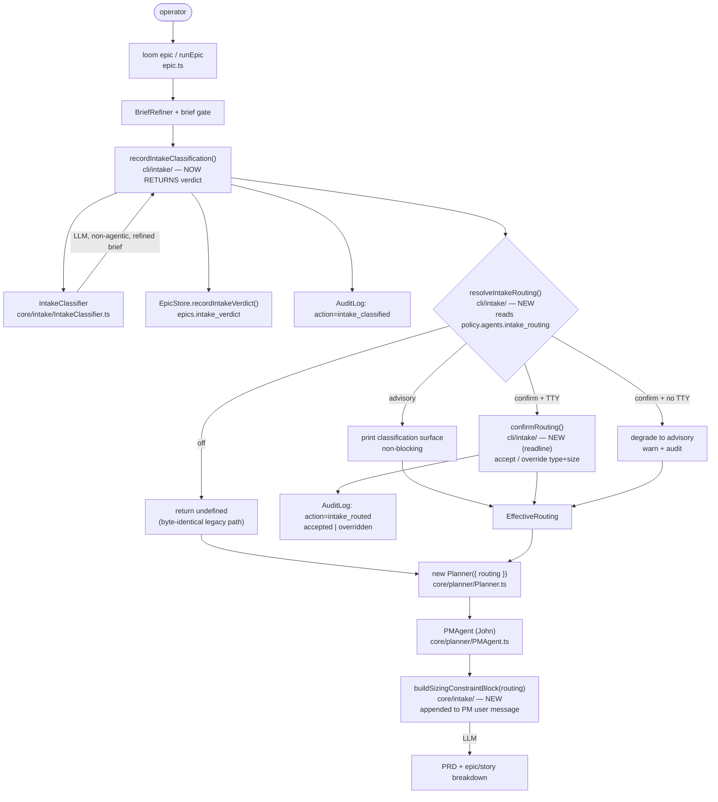

I'll ground this architecture in the actual loom codebase before writing. Let me explore the relevant components in parallel.# Intake Routing Architecture — Graduating the Classifier from Observe-Only to Acting

## Architecture Philosophy

The constraints below drive every decision in this design. They are deliberately conservative because the feature changes what the planner is *told*, and the planner is load-bearing.

1. **The off-path must be byte-identical to today.** The classifier already runs, records a verdict to `epics.intake_verdict`, and logs `intake_classified` — and that verdict is *stranded* (`types.ts:225-227`: "Never read by planning, gate, or execution code (NFR-1)"). Graduation means un-stranding it *only on explicit opt-in*. When `intake_routing` is `off`, no new code may touch the planner's inputs. This forces a single guarded seam, not changes scattered through the planner.

2. **Reuse the existing planner; do not fork it.** Routing is *prompt text injected into the existing PM agent*, not a parallel pipeline (FR-5). The trade-off this accepts: prompt-text guidance is probabilistic — the model can still over-decompose — so the `story`→single-story outcome must be *proven by an outcome-level test*, never assumed from the instruction's presence (ASSUMPTION #2).

3. **The CLI decides; core consumes.** Interaction (advisory print, confirm prompt, TTY detection) is a CLI concern and lives in `loom-cli`. The core `Planner` accepts an optional, already-resolved `EffectiveRouting` value and knows nothing about policy levels or terminals. This keeps `loom-core` non-interactive and testable.

4. **Provenance is append-only and free.** Confirm-mode decisions reuse the existing `audit_log` table and `AuditLog.record()` — a new `action`, not a new schema. No migration, no weakened guardrail (NFR-3).

## Component Diagram



## Tech Stack

| Layer | Choice | Rationale |
|---|---|---|
| Language / runtime | TypeScript, Node 20+ | Existing stack; no new runtime. |
| Policy knob & validation | `zod` via `PolicySchema` in `types.ts`; YAML source in `schemas/policy.schema.yaml` | The enum knob slots into the existing `agents` block beside `agents.intake_timeout_ms`; `z.enum([...]).default('off')` gives validation + default for free (rejects out-of-range — AC for story-045-001). |
| Verdict shape | existing `IntakeVerdictSchema` (`core/intake/IntakeClassifier.ts:5-11`) | Reused verbatim; routing never redefines the verdict. |
| Routing value object | plain typed object `EffectiveRouting` in `loom-core` | Pure, serializable, easy to unit-test; crosses the CLI→core seam. |
| Interactive confirm | `node:readline` (stdlib), matching the existing `readStdin()` pattern in `cli/commands/guard.ts:113` | Boring on purpose: no new dependency (`inquirer`/`prompts`), and the repo already has zero interactive-prompt libraries — adding one is unjustified for a single y/n+override checkpoint. |
| TTY detection | `process.stdin.isTTY` | Same primitive `guard.ts` already uses; settles the non-interactive ASSUMPTION with no new abstraction. |
| Provenance | `better-sqlite3` `audit_log` table via `AuditLog.record()` (`core/state/AuditLog.ts:12`) | Append-only; `detail` is JSON, so original+final values fit without a migration. |
| Planner injection | string concatenation into the PM agent user message (`core/planner/PMAgent.ts`) | Exactly how `skillsBlock` is already injected; the seam exists. |
| Docs drift guard | `docs/capabilities.md` fenced knob region + `cli/describe/coverage-check.ts` | `operatorKnobs()` parses the schema; documenting `` `policy.agents.intake_routing` `` in the `coverage:knob` fence satisfies the drift test. |

## Data Models

### Existing — the classifier verdict (reused unchanged)

`packages/loom-core/src/intake/IntakeClassifier.ts:5-11`

```typescript
export const IntakeVerdictSchema = z.object({
  type:       z.enum(['feature', 'bug', 'chore']),
  size:       z.enum(['story', 'epic']),
  confidence: z.enum(['low', 'medium', 'high']),
  rationale:  z.string().min(1).max(280),
});
export type IntakeVerdict = z.infer<typeof IntakeVerdictSchema>;
```

### New — the policy knob (YAML source of truth)

`schemas/policy.schema.yaml`, inside the existing `agents:` block (beside `intake_timeout_ms`):

```yaml
agents:
  intake_routing:
    type: string
    enum: [off, advisory, confirm]
    default: off
    description: |
      Graduates the intake classifier from observe-only to acting.
      off      — classifier records its verdict but never influences planning (default; legacy path).
      advisory — the effective size/type is routed into the planner automatically; classification
                 is printed first; planning does not block for input.
      confirm  — the same surface is printed, then the operator may accept or override type/size
                 before planning proceeds. Non-interactive invocation degrades to advisory (see ADR-004).
```

Mirror in `PolicySchema` (`packages/loom-core/src/types.ts`, `agents` object):

```typescript
intake_routing: z.enum(['off', 'advisory', 'confirm']).default('off'),
```

### New — the resolved routing value (CLI→core seam)

`packages/loom-core/src/intake/routing.ts` (new):

```typescript
export interface EffectiveRouting {
  type:       'feature' | 'bug' | 'chore';   // effective (possibly overridden) type
  size:       'story' | 'epic';              // effective (possibly overridden) size
  confidence: 'low' | 'medium' | 'high';     // classifier output; never operator-editable
  source:     'classifier' | 'operator-override';
}
```

### New — confirm-mode provenance (audit `detail` JSON; no DDL change)

Written through the existing `audit_log` table (`core/state/Database.ts:45-54`). Shape of `detail` for `action='intake_routed'`:

```jsonc
{
  "mode": "confirm",                  // or "confirm-degraded-advisory"
  "decision": "overridden",           // "accepted" | "overridden"
  "original": { "type": "feature", "size": "epic" },   // classifier verdict
  "routed":   { "type": "feature", "size": "story" },  // final values handed to planner
  "confidence": "low"
}
```

## API / Interface Contracts

These are the seams every story must agree on; the file/module ownership belongs to the contract document (task C).

```typescript
// loom-cli — recordIntakeClassification now RETURNS the verdict (today it only records).
// This is the minimal change that un-strands the verdict without a second DB read.
type IntakeClassificationResult =
  | { ok: true;  verdict: IntakeVerdict }
  | { ok: false; reason: 'llm_error' | 'timeout' | 'invalid_output'; detail?: string };

export async function recordIntakeClassification(opts: {
  db; epicId: string; brief: string; classifyBrief: string;
  llm; model: string; timeoutMs: number;
}): Promise<IntakeClassificationResult>;

// loom-cli/intake/resolveIntakeRouting.ts (NEW) — the routing brain.
// Returns undefined for the off-path AND when classification failed (can't route on nothing):
// undefined => Planner runs byte-identically to today.
export async function resolveIntakeRouting(opts: {
  classification: IntakeClassificationResult;
  level: 'off' | 'advisory' | 'confirm';   // = policy.agents.intake_routing
  isTTY: boolean;                          // process.stdin.isTTY
  audit: AuditLog;
  epicId: string;
  out?: NodeJS.WritableStream;             // for testable printing
}): Promise<EffectiveRouting | undefined>;

// loom-cli/intake/confirmRouting.ts (NEW) — interactive checkpoint, readline-based.
// Override is constrained to the verdict enums; confidence/rationale are not editable.
export async function confirmRouting(verdict: IntakeVerdict): Promise<{
  decision: 'accepted' | 'overridden';
  type: 'feature' | 'bug' | 'chore';
  size: 'story' | 'epic';
}>;

// loom-core/intake/routing.ts (NEW) — pure prompt-text builder. Reused by advisory & confirm.
export function buildSizingConstraintBlock(routing: EffectiveRouting): string;

// loom-core/planner/Planner.ts — PlannerOptions gains ONE optional field.
// Absent => no block appended => byte-identical PM prompt (NFR-1).
interface PlannerOptions {
  /* ...existing... */
  routing?: EffectiveRouting;
}
```

`PMAgent` (`core/planner/PMAgent.ts`) appends `buildSizingConstraintBlock(routing)` to its user message *only when `routing` is present* — the same conditional pattern as the existing `skillsBlock`. `story` emits "produce a single cohesive story or the minimum necessary decomposition"; `epic` emits the full-decomposition instruction (which equals today's behavior, so an `epic` verdict is also effectively a no-op on output).

## Security Model

The feature changes planner *input text* and appends *audit records*; it executes no commands and touches no git/filesystem policy. Threats are therefore narrow.

| Threat | Control |
|---|---|
| A malformed/garbage verdict steers planning | The verdict is already `zod`-validated by `IntakeVerdictSchema` on read; `resolveIntakeRouting` routes only validated values, and a failed classification (`ok:false`) yields `undefined` → legacy path, never a partial route. |
| Operator override as a prompt-injection vector | Override is constrained to the `type`/`size` *enums* (FR/ASSUMPTION #3) — never free text — so `buildSizingConstraintBlock` interpolates only one of five known tokens. Confidence and rationale are read-only. |
| Guardrail weakening (NFR-3) | No change to `PolicyEngine`, protected branches, or worktree isolation. The new knob is additive and default-off; the audit write is append-only via `AuditLog.record()`. |
| Planning hangs in CI/headless (availability) | `confirm` blocks for input *only* under a TTY; non-interactive invocation degrades to advisory (ADR-004), so automation never stalls (NFR-2). |
| Provenance tampering / loss | Records are inserted, never updated; `intake_routed` carries both `original` and `routed`, so a routed outcome is always traceable to its source verdict (FR-6). |

## ADR Log

### ADR-001 — Route via prompt-text sizing constraint injected into the existing PM agent
- **Decision:** Pass the effective verdict to the *existing* `Planner`/`PMAgent` as an appended prompt block (`buildSizingConstraintBlock`), reusing the `skillsBlock` injection pattern. No new or parallel planning pipeline.
- **Context:** FR-5 demands routing "into the existing planner as an explicit sizing constraint… demonstrably not a separate or parallel pipeline." Decomposition happens in `PMAgent` (John), `core/planner/PMAgent.ts`.
- **Rationale:** The injection seam already exists; reuse keeps one planner, one prompt-caching strategy, one code path to maintain.
- **Trade-off:** Prompt-text guidance is probabilistic — the model can ignore it and still over-decompose. We accept this and *require* an outcome-level test (story-045-002 AC) proving a `story` verdict yields a single-story result. We buy reuse at the cost of needing behavioral, not structural, verification.

### ADR-002 — Gate behind a default-off three-level enum knob `agents.intake_routing`
- **Decision:** A single `z.enum(['off','advisory','confirm']).default('off')` knob under the existing `agents` block.
- **Context:** FR-1/FR-2, NFR-1; intake config already lives under `agents` (`agents.intake_timeout_ms`).
- **Rationale:** Boring, consistent placement; `zod` gives validation + default, satisfying "rejects out-of-range" and "defaults to off when unset" with no custom code.
- **Trade-off:** A three-way enum (vs. a boolean) is slightly more surface, but a boolean couldn't distinguish advisory from confirm without a second knob.

### ADR-003 — Confirm is advisory plus an interactive override step (one routing path)
- **Decision:** `confirm` prints the same classification surface as `advisory`, optionally mutates the verdict via `confirmRouting`, then routes through the *identical* `EffectiveRouting`→planner path.
- **Context:** FR-3/FR-4; both levels must reuse the same planner constraint mechanism.
- **Rationale:** One routing path means the `story`→single-story guarantee is tested once and holds for both levels; confirm differs only by an upstream edit + an audit record.
- **Trade-off:** Confirm and advisory share so much that the interactive step must be cleanly isolated (its own `confirmRouting` module) to keep advisory non-blocking and unit-testable without a TTY.

### ADR-004 — Non-interactive `confirm` degrades to advisory (loudly + audited), not a hard error
- **Decision:** When `intake_routing=confirm` and `process.stdin.isTTY` is false, skip the prompt, print a warning, write an `intake_routed` record with `mode:"confirm-degraded-advisory"`, and route as advisory.
- **Context:** Settles the PRD's open ASSUMPTION (hard error *or* documented degrade). `guard.ts:113` already establishes `process.stdin.isTTY` as the detection primitive.
- **Rationale:** NFR-2's spirit is "don't block automation"; advisory is itself a sanctioned acting level, so degrading still produces correctly-sized planning rather than failing the run. The warning + audit record keep it from being silent.
- **Trade-off:** The operator's requested human gate is bypassed in headless contexts — the classifier acts without confirmation. We accept this over a hard error because a hard error would make `confirm` unusable in any CI/automated planning, and we mitigate with a loud warning and explicit provenance. This behavior is documented in `capabilities.md` (FR-7).

### ADR-005 — Provenance via the existing `audit_log` and a new `intake_routed` action; no migration
- **Decision:** Record confirm-mode decisions through `AuditLog.record({ action: 'intake_routed', command: epicId, detail: {...} })`, with `detail` carrying `decision`, `original`, and `routed`. The observe-only `intake_classified` record is unchanged.
- **Context:** FR-6, NFR-3; the `detail` column is already free-form JSON (`Database.ts:45-54`).
- **Rationale:** Reuses the established write path; the two distinct actions (`intake_classified` vs `intake_routed`) cleanly separate "what the classifier said" from "what was routed," and `decision` distinguishes accepted from overridden.
- **Trade-off:** Provenance lives inside `detail` JSON, so querying accepted-vs-overridden requires JSON extraction rather than an indexed column. Acceptable at audit-log volume; a column migration would be over-engineering for a low-cardinality flag.

### ADR-006 — `recordIntakeClassification` returns the verdict; the CLI owns the routing decision
- **Decision:** Change `recordIntakeClassification` to return its `IntakeClassificationResult` (verdict included), and have `epic.ts` pass it to `resolveIntakeRouting`. The core `Planner` receives only a resolved `EffectiveRouting | undefined`.
- **Context:** The CLI flow already calls `recordIntakeClassification` after refinement and before the planner (`epic.ts`, ~lines 206-214). The verdict is computed there; reading it back from `EpicStore` would be a redundant round-trip.
- **Rationale:** Keeps `loom-core` non-interactive and policy-unaware; concentrates terminal/TTY/printing logic in `loom-cli`; the verdict crosses the seam in-memory with no extra DB read.
- **Trade-off:** `recordIntakeClassification`'s signature changes from `void`-ish to value-returning, touching its existing callers. This is a small, contained ripple and is preferable to splitting the routing brain across CLI and core.
