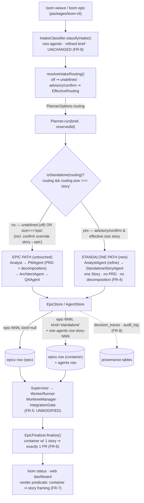

I'll ground this architecture in the actual loom codebase. Let me explore the relevant components first.Let me read the load-bearing files directly to nail the exact shapes and seams.Good — the FK `agents.epic_id NOT NULL REFERENCES epics(id)` and the routing-into-planner seam are the crux. Let me confirm the routing shape, the finalize contract, and the Story/Epic types.# Standalone Story Routing — System Architecture

**Epic:** epic-047 · **PRD:** `.loom/planning/epic-047/prd.md` · **Architect:** Winston

This change adds a *standalone-story path* to the planning pipeline. It is a routing decision and an identity decision — not a new execution stack. The architecture's whole job is to add that branch while leaving the epic path and the `intake_routing: off` path provably untouched.

---

## Architecture Philosophy

Four constraints drive every decision below.

1. **Reuse the machinery; add only a branch and an identity.** FR-5 and the Out-of-Scope list forbid new story-execution, integration-gate, or finalize infrastructure. The `Supervisor`, `WorktreeManager`, `IntegrationGate`, and `EpicFinalizer` are dispatched *by epic id* today (`loom_lease.epic_id` is the per-epic lease; `EpicFinalizer.finalize(epic, stories)` takes an `EpicRecord`). The cheapest correct design keeps the epic-shaped container alive internally and changes only what the operator *sees* and how the *planner branches*. We pay for this with a presentation-suppression discipline (below), not with a rewrite.

2. **The off path must be byte-identical, and we must be able to prove it.** NFR-1 demands a golden test. The seam already supports this: `PlannerOptions.routing` is `undefined` on the off path, and the planner is documented to be "byte-identical to the legacy baseline" when it is absent. The standalone branch must hang off `routing` presence so that `routing === undefined` can never reach it.

3. **The standalone identity must read as a story, not a one-story epic.** Goal 2 is "0% appear as `epic-NNN with 1 story`." Honesty is an interface property: a distinct story id scheme (`story-NNN`) and a branch (`story/story-NNN`) that encode no phantom epic number (story-047-003 AC).

4. **Migrations are additive, never destructive.** The state model already carries `v23` (`epics.intake_verdict` added by `ALTER … ADD COLUMN`, "Additive; never DROP/TRUNCATE"). The standalone marker follows that exact precedent.

---

## Component Diagram



---

## Tech Stack

No new technology is introduced; that is itself the decision (boring beats novel for a load-bearing pipeline change). The table records the existing layers this feature touches and why each stays.

| Layer | Choice | Rationale |
|---|---|---|
| Routing seam | `EffectiveRouting` in `packages/loom-core/src/intake/routing.ts` | Already the shared producer/consumer contract between CLI and planner; carries post-override `size`. Reuse, don't re-derive. |
| Branch point | `Planner.run()` in `packages/loom-core/src/planner/Planner.ts` | The single site that already consumes `routing`; the standalone branch belongs here, not in the CLI, so MCP/test callers get it free. |
| Single-story generation | New `StandaloneStoryAgent` (LLM via `ctx.llm`, `@anthropic-ai/sdk`) | Mirrors `PMAgent`/`ArchitectAgent` shape; emits one `Story`. Prompt caching on persona prompt per Invariant 3. |
| State | `better-sqlite3` — `epics` + `agents` tables, `EpicStore`/`AgentStore` | Container row satisfies the existing `agents.epic_id NOT NULL REFERENCES epics(id)` FK with zero FK surgery. |
| Schema validation | `zod` — `StorySchema` in `types.ts` | Relax the id regex to a backward-compatible union; existing ids still validate (NFR-1). |
| Dispatch / finalize | `Supervisor`, `EpicFinalizer` (orchestrator package) | Per-epic-id dispatch and finalize work unmodified on a one-story container (FR-5). |
| Provenance | `audit_log`, `decision_traces` tables | A story-scoped `agents` row routes provenance through the same writers (FR-8). |
| Docs gate | `docs/capabilities.md` + drift check | Planning-section row already documents `intake_routing`; extend it (FR-10). |

---

## Data Models

### Schema migration — `v24` (additive, follows the `v23` precedent)

```sql
-- packages/loom-core/src/state/Database.ts  — bump SCHEMA_VERSION 23 -> 24
-- v24: standalone-story container marker. Additive; never DROP/TRUNCATE; default
-- semantics = legacy epic. NULL or 'epic' = a normal epic; 'standalone' = an
-- internal single-story container that MUST render as its one story (FR-7).
ALTER TABLE epics ADD COLUMN kind TEXT;     -- NULL | 'epic' | 'standalone'
```

No change to the `agents` table. A standalone story is one `agents` row whose `epic_id` is the container's `epic-NNN` and whose `story_id` is the standalone id `story-NNN`.

### Identity scheme

| Concept | Epic path (today) | Standalone path (new) |
|---|---|---|
| Container row id (`epics.id`, internal) | `epic-NNN` | `epic-NNN` *(same allocator, `Planner.nextEpicId`)* |
| Story id (`agents.story_id`, **surfaced**) | `story-NNN-MMM` | `story-NNN` *(flat; shares NNN with container)* |
| Branch (`agents.branch_name`) | `story/story-NNN-MMM` → `epic/epic-NNN` | `story/story-NNN` *(no phantom epic id)* |
| `epics.kind` | `NULL` / `'epic'` | `'standalone'` |

### `StorySchema` id relaxation (`packages/loom-core/src/types.ts:630`)

```ts
// before: z.string().regex(/^story-\d{3}-\d{3}$/)
// after — additive union; every existing parented id still validates (NFR-1):
id: z.string().regex(/^story-\d{3}(-\d{3})?$/),
```

The standalone `Story` reuses the existing shape verbatim (`title`, `description`, `acceptance_criteria`, `tech_notes`) — satisfying story-047-001 AC3 with no new entity:

```ts
type Story = {
  id: string;                    // 'story-047' (standalone) | 'story-047-001' (parented)
  title: string;                 // 5..100
  description: string;
  acceptance_criteria: string[]; // >= 1
  estimated_complexity: 'trivial' | 'small' | 'medium' | 'large';
  dependencies: string[];        // standalone: always []
  tech_notes?: string;
};
```

---

## API / Interface Contracts

These are the seams every story in the epic must agree on.

```ts
// packages/loom-core/src/intake/routing.ts — NEW predicate, single source of truth.
// The ONLY definition of "are we on the standalone path". routing===undefined ⇒ false
// (off path & classification-failure ⇒ epic path, byte-identical — NFR-1).
export function isStandalone(routing?: EffectiveRouting): boolean {
  return routing !== undefined && routing.size === 'story';
}
```

```ts
// packages/loom-core/src/planner/Planner.ts — Planner.run signature UNCHANGED.
// Internally, after the Analyst refines the brief, branch:
async run(brief: string, reservedId?: string): Promise<PlanResult> {
  // ... beginPlanning / sink / ctx as today ...
  const analyst = await new AnalystAgent(ctx).run(brief);          // refined brief — both paths
  if (isStandalone(this.opts.routing)) {
    return this.runStandalone(epicStore, runId, analyst, ...);     // NEW — no PM, no Architect decomposition
  }
  // ... existing PM -> Architect -> QA path, unchanged ...
}
```

```ts
// packages/loom-core/src/planner/StandaloneStoryAgent.ts — NEW, mirrors PMAgent.
export class StandaloneStoryAgent {
  constructor(private ctx: PlannerContext) {}
  // Produces exactly one story from the refined brief. No epic-level PRD,
  // no decomposition pass (FR-4).
  run(refinedBrief: string): Promise<{ story: Story; usage: LLMUsage }>;
}
```

```ts
// packages/loom-core/src/state/EpicStore.ts — NEW container helpers (additive).
createStandalone(epicId: string, title: string): void;   // INSERT epics row, kind='standalone'
isStandalone(epicId: string): boolean;
list(opts?: { includeStandalone?: boolean; ... }): EpicRecord[];  // epic listings EXCLUDE kind='standalone' by default
```

```ts
// Finalize — EpicFinalizer.finalize(epic, stories) UNCHANGED (FR-5/FR-6).
// A kind='standalone' container has exactly one story, so the existing
// path yields exactly one PR. The branch carries the story id, not an epic id.
finalize(epic: EpicRecord, stories: Story[]): Promise<FinalizeResult>;
```

```ts
// Presentation — loom status (packages/loom-cli/src/commands/status.ts) and web.
// Single render predicate, applied at every epic-enumeration site:
//   epic.kind === 'standalone'  ⇒  render its one story with story framing,
//                                   NEVER as "epic-NNN with 1 story" (FR-7).
```

---

## Security Model

The dominant risk here is **regression**, not external attack — the feature adds a privileged code path through the same dispatch and push machinery. Threats and controls:

| Threat | Control |
|---|---|
| Standalone path silently weakens guardrails / integration gate (NFR-2) | Standalone is an *identity* decision; the container flows through the **unmodified** `Supervisor` → `IntegrationGate` → `EpicFinalizer`. The policy engine (Invariant 1) and worktree isolation (Invariant 2) apply structurally, regardless of `kind`. story-047-003 AC asserts gate/guardrail parity. |
| A standalone story pushes to a protected branch or unapproved remote | Unchanged `allowed_remotes` gate in `EpicFinalizer` (`policy.git.allowed_remotes`); push/PR seams unchanged. No new push site is introduced. |
| Off-path behavioral drift slips into a release (NFR-1) | Golden/snapshot test (story-047-005) asserts byte-identity of off-path planner output; CI fails on drift. The `isStandalone(undefined) === false` invariant guarantees off never enters the branch. |
| Migration corrupts existing epic/story rows | `v24` is a single additive `ALTER … ADD COLUMN kind TEXT`; never DROP/TRUNCATE; `NULL` defaults to legacy-epic semantics. Existing rows load unchanged (story-047-001 AC2). |
| Provenance gap — a standalone story escapes audit/trace (FR-8) | The standalone unit is an `agents` row with a real `agent_id`; `audit_log` and `decision_traces` writers key off `agent_id`/`story_id` and need no change. |
| Planner crash leaks internals | Existing behavior preserved: `epics.error` records the message, not the stack (see `Planner.run` catch block). |

---

## ADR Log

### ADR-001 — Branch in `Planner.run` on `EffectiveRouting` presence + size
**Decision.** Add the standalone branch inside `Planner.run`, gated by `isStandalone(this.opts.routing)` (`routing !== undefined && routing.size === 'story'`), after the Analyst refines the brief.
**Context.** `PlannerOptions.routing` is already the consumer end of the intake seam; it is `undefined` on the off path and on classification failure, and carries the post-override `size` for advisory/confirm. The CLI (`resolveIntakeRouting`) is the only producer.
**Rationale.** One predicate expresses all of FR-1/FR-2/FR-3: `undefined` ⇒ epic path (off, byte-identical); `size==='epic'` ⇒ epic path (including the confirm-mode story→epic override, which already lands as `size:'epic'`); `size==='story'` ⇒ standalone. Placing it in the planner (not the CLI) gives every caller — CLI, MCP, tests — the same behavior.
**Trade-off.** The planner now has two internal shapes of run. We accept a slightly larger `run()` in exchange for a single, testable routing point and an untouched CLI.

### ADR-002 — Represent a standalone story as a marked single-story container, not a nullable FK
**Decision.** Keep the `agents.epic_id NOT NULL REFERENCES epics(id)` FK. Persist a standalone story as one `agents` row under an `epics` container row marked `kind='standalone'`.
**Context.** Stories have no table of their own — they are `agents` rows that *require* an epic parent. Dispatch (`loom_lease.epic_id`), the Supervisor, and `EpicFinalizer.finalize(epic, stories)` are all keyed by epic id. The alternative is making `epic_id` nullable and teaching every query and the lease/finalize machinery to handle parentless rows.
**Rationale.** The container satisfies the FK and the entire orchestration/lease/finalize stack with **zero structural change**, honoring FR-5 and the Out-of-Scope ban on new execution infrastructure. The marker is additive (`v24`), matching the `v23 intake_verdict` precedent.
**Trade-off.** A real `epic-NNN` row exists internally for work the operator submitted as a story. We accept that and pay for it with ADR-005's presentation discipline — every epic-enumeration site must exclude `kind='standalone'`. The cost is concentrated in one render predicate rather than smeared across the FK and every join.

### ADR-003 — Standalone id scheme `story-NNN` with a relaxed, backward-compatible regex
**Decision.** Surface standalone work as `story-NNN` (flat, sharing the container's number), branch `story/story-NNN`. Relax `StorySchema.id` to `/^story-\d{3}(-\d{3})?$/`.
**Context.** Today `StorySchema.id` is `^story-\d{3}-\d{3}$` and `epic_id` is `^epic-\d{3}$`. story-047-003 AC forbids encoding a phantom epic id in branch/PR naming; Goal 2 forbids `epic-NNN with 1 story` framing.
**Rationale.** A flat `story-NNN` reads unambiguously as a story and embeds no epic segment in the visible id or branch. The regex change is a strict superset — every existing parented id still validates, so plan output and the off path are unchanged (NFR-1). Sharing NNN with the internal container keeps provenance traceable without surfacing the container.
**Trade-off.** Two id arities now exist for stories; any code that parses a story id to *infer* its epic must tolerate the no-epic-segment form (covered by story-047-004 AC4: trace/audit rendering handles a parentless story id without error).

### ADR-004 — Dedicated `StandaloneStoryAgent`; Analyst runs, PM/Architect decomposition skipped
**Decision.** On the standalone path, run `AnalystAgent` (refine the brief) then a new `StandaloneStoryAgent` that emits exactly one `Story`. Do not run `PMAgent` (PRD + decomposition) or the Architect's multi-epic enrichment.
**Context.** FR-4 mandates one story with no epic-level PRD and no multi-story decomposition. The Analyst already produces the refined brief both paths need; the classifier classified that refined brief (FR-9) and stays put.
**Rationale.** A purpose-built agent keeps the standalone prompt small and cacheable (Invariant 3) and makes the absence of PRD/decomposition stages observable for Goal 1's measurement. Reusing `AnalystAgent` preserves refined-brief provenance.
**Trade-off.** A third planner agent to maintain. Cheaper than overloading `PMAgent` with a conditional that would muddy the very decomposition prompt the off-path snapshot must keep frozen.

### ADR-005 — Single-PR finalize via the existing `EpicFinalizer`; presentation suppresses the container
**Decision.** Finalize standalone work through the unmodified `EpicFinalizer` (a one-story container yields exactly one PR). Apply a single render predicate at every epic-listing site so `kind='standalone'` containers render as their one story and never as an epic.
**Context.** `EpicFinalizer` already opens one PR per container and already has a per-story fallback path. `loom status` and the web dashboard enumerate epics; left alone they would expose the container as `epic-NNN`.
**Rationale.** Reuses finalize machinery verbatim (FR-6) and concentrates the honesty guarantee (FR-7) in one predicate — easy to test (story-047-004) and to audit. `EpicStore.list()` excludes standalone containers by default so callers opt in explicitly.
**Trade-off.** Every site that enumerates epics for display must honor the predicate or the container leaks. We bound this risk by routing all enumeration through `EpicStore.list()`'s default exclusion and covering it with the story-047-004 regression test, rather than scattering `if (kind===…)` checks.

### ADR-006 — Prove the off path with a golden/snapshot test
**Decision.** Add a deterministic snapshot test (story-047-005) asserting the `intake_routing: off` planner output is byte-identical to today, independent of brief size.
**Context.** NFR-1 requires provable equivalence; the planner is documented as byte-identical when `routing` is absent, and ADR-001 makes absence the guard.
**Rationale.** A frozen reference turns "we believe it's unchanged" into a CI gate that fails on any drift, including accidental changes from the regex relaxation (ADR-003) or the new agent (ADR-004).
**Trade-off.** The snapshot must exclude nondeterministic fields (timestamps, token counts, run ids) to stay stable in CI; that scoping is part of the test's design, not an afterthought.
