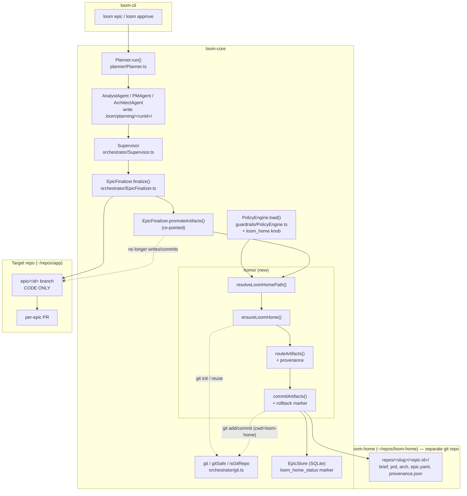

# Architecture: loom-home — Relocating Committed Artifacts to a Control-Plane Repository

> Phase 1, first slice of the cross-repo / loom-home initiative (`docs/architecture/cross-repo-loom-home.md`). Scope: introduce a separate **loom-home** git repository that holds loom's committed planning artifacts, and route artifact writes and commits there instead of onto the target repo's epic branch. Nothing more.

## Architecture Philosophy

Four constraints drive every decision below.

1. **The target repo is a guest's house — leave only code.** The single externally-visible outcome that matters is that the target repo's epic branch and PR contain product changes and nothing else (FR-8, NFR-2). Every design choice is subordinate to that invariant, and it is proven by a test, not by inspection.

2. **Two git repositories, never entangled.** loom-home is a *separate* repository with its own history. Its git operations must run with an explicit, distinct `cwd` and must not touch — or be touchable by — the target repo's index, branches, or remotes (NFR-1). We accept the cost of managing a second repo to get hard isolation, rather than the cheaper-but-fragile orphan-branch trick inside the target repo.

3. **Smallest possible seam.** This is one slice of a multi-phase plan. We add exactly one config knob (FR-9), one new module namespace (`home/`), and we re-point exactly one existing function (`EpicFinalizer.promoteArtifacts`). We do **not** build the workspace manifest, the config hierarchy, or any cross-repo read/execute capability. The seam is established; the generality is deferred.

4. **The target repo is the source of truth for "did it land"; loom-home is an append-only ledger that catches up.** Finalize touches two repos. Rather than a true two-phase commit (which neither git nor the PR flow support), we order operations so the irreversible outward action — the target PR — happens first, and loom-home is brought to consistency afterward with an explicit retryable marker. No silent split state (FR-10).

## Component Diagram



## Tech Stack

No new runtime dependencies. The slice is deliberately built from primitives already in `loom-core`.

| Layer | Choice | Rationale |
| --- | --- | --- |
| Language / runtime | TypeScript, Node 20+ | Matches the whole codebase; zero new toolchain. |
| Git invocation | Existing `orchestrator/git.ts` (`git`, `gitSafe`) | `execFileSync` with array args — no shell, injection-safe. Already the only sanctioned way loom touches git; reusing it keeps the guard story intact. |
| Repo detection / init | `isGitRepo()`, `hasCommits()` (git.ts) + `git init` via `gitSafe` | Boring and tested; no libgit2 or simple-git dependency introduced. |
| Config | `PolicySchema` (Zod) in `types.ts`, loaded by `PolicyEngine.load()` from `.loom/policy.yaml` | One optional field added to an existing validated schema — no new config file, no new loader. |
| Path resolution | `node:path` + new `home/resolveLoomHomePath.ts` | Pure function, trivially unit-testable (FR-2), mirrors the style of `planner/paths.ts`. |
| Provenance | Directory layout + `provenance.json` + git commit trailers | Three redundant, human- and machine-readable channels; all plain text, no schema registry. |
| State marker | `better-sqlite3` via `EpicStore` | Reuses the existing `epics`/`audit_log` tables for the `loom_home_status` marker that drives retry. |
| Tests | Existing test runner (per-package `npm test`) | Same harness; new tests assert target-repo code-only diff and provenance presence. |

## Data Models

### Config knob (the single addition to `PolicySchema`, `packages/loom-core/src/types.ts`)

```ts
// Added to the top level of PolicySchema. Exactly one knob (FR-9).
// Absolute or ~-expandable path to the loom-home repo. When omitted,
// resolution falls back to the sibling-at-workspace-root default.
loom_home: z.string().optional(),
```

`.loom/policy.yaml` (target repo) — override example:

```yaml
loom_home: ~/workspaces/control-plane/loom-home   # optional; omit for the default
```

### loom-home on-disk layout

```
loom-home/                          # a git repo (default branch, e.g. main)
├── .gitignore                      # reserves machine-local namespaces for later phases
└── repos/
    └── <repo-slug>/                # e.g. app-3f9a2c  (name + short identity hash)
        └── <epic-id>/              # e.g. epic-050
            ├── project-brief.md
            ├── prd.md
            ├── architecture.md
            ├── epic.yaml
            └── provenance.json
```

`<repo-slug>` = `<sanitized-repo-name>-<8-char hash>`, where the hash is derived from the target repo's stable identity (remote URL via `remoteUrl()`; absolute `projectRoot` if no remote). This disambiguates two same-named repos run into one shared loom-home (FR-7).

### `provenance.json` (written alongside each artifact set, story-050-003)

```ts
interface Provenance {
  loom_home_schema: 1;
  target_repo: {
    name: string;          // basename of projectRoot
    path: string;          // absolute projectRoot
    remote_url: string | null;
    slug: string;          // matches the directory name
  };
  epic_id: string;         // "epic-050"
  run_id: string;          // planning run id
  target_head_sha: string | null;  // epic/<id> tip in the target repo at commit time
  created_at: string;      // ISO-8601
}
```

### Commit-message convention (loom-home git history)

```
loom: artifacts for <repo-slug>/<epic-id>

Target-Repo: <name>
Target-Path: <absolute projectRoot>
Target-Head: <target_head_sha | none>
Epic: <epic-id>
Run-Id: <run-id>
```

### State marker (EpicStore, drives rollback/retry — FR-10)

```sql
-- Added to the epics table (or an adjacent key/value row in state).
-- 'committed' once loom-home holds the set; 'pending' if the commit
-- could not complete, so a later finalize/retry closes the gap.
ALTER TABLE epics ADD COLUMN loom_home_status TEXT
  CHECK (loom_home_status IN ('committed','pending')) DEFAULT NULL;
ALTER TABLE epics ADD COLUMN loom_home_sha TEXT;     -- loom-home commit sha when committed
```

## API / Interface Contracts

The new module is `packages/loom-core/src/home/`. These are the seams the parallel stories must agree on.

```ts
// home/resolveLoomHomePath.ts  — story-050-001 (pure, no I/O)
//
// Default = sibling at the workspace root, where workspace root is the
// immediate parent of the target repo:  ~/repos/app -> ~/repos/loom-home.
// An explicit policy.loom_home overrides it (with ~ expansion).
export function resolveLoomHomePath(
  projectRoot: string,
  policy: Pick<Policy, 'loom_home'>,
): string;                          // returns an absolute path

// home/ensureLoomHome.ts  — story-050-002 (idempotent; performs filesystem + git init)
//
// absent dir          -> mkdir -p + `git init`
// existing git repo   -> reuse, do NOT re-init
// existing non-git dir -> init-in-place (documented assumption, FR-4)
export interface EnsureResult {
  path: string;
  created: boolean;       // directory was created by us
  initialized: boolean;   // `git init` was run by us
  reused: boolean;        // pre-existing git repo reused
}
export function ensureLoomHome(loomHomePath: string): EnsureResult;

// home/artifactRouter.ts  — story-050-003 (write routing + provenance)
//
// Copies the four planning artifacts from .loom/planning/<runId>/ into
// loom-home under repos/<slug>/<epic-id>/ and writes provenance.json.
// Returns the absolute loom-home dir that now holds the set.
export function routeArtifacts(input: {
  loomHomePath: string;
  projectRoot: string;
  epicId: string;
  runId: string;
  artifactSources: { brief?: string; prd?: string; architecture?: string; epicYaml?: string };
}): { artifactDir: string; relDir: string; provenance: Provenance };

// home/commitArtifacts.ts  — story-050-004 (commit + rollback semantics)
//
// Stages and commits repos/<slug>/<epic-id>/ in loom-home (cwd = loomHomePath,
// via gitSafe). Records loom_home_status. Never throws into the finalize
// critical path; returns a discriminated result the Supervisor records.
export type CommitArtifactsResult =
  | { status: 'committed'; sha: string }
  | { status: 'pending'; reason: string };   // marker set; retry will reconcile
export function commitArtifacts(input: {
  loomHomePath: string;
  relDir: string;
  epicId: string;
  provenance: Provenance;
  store: EpicStore;
}): CommitArtifactsResult;
```

### The re-pointed seam

`EpicFinalizer.promoteArtifacts()` (`packages/loom-core/src/orchestrator/EpicFinalizer.ts:809`) changes from "copy into `<gitRoot>/.loom_outputs/<epicId>` and `git add`/`git commit` on the epic branch" to "call `resolveLoomHomePath → ensureLoomHome → routeArtifacts → commitArtifacts`." Critically, **it no longer writes into or commits to `gitRoot` (the target checkout) at all.** Because the artifacts leave the target tree, the promotion no longer needs to run before the integration gate (the old ADR-6 "gated tree == PR tree" constraint that forced ordering is now moot for artifacts — the gated tree is already pure code). The git wrapper (`git.ts`) is reused unchanged; only the `cwd` differs.

## Security Model

| Threat | Control |
| --- | --- |
| loom-home commits leak into / contaminate the target repo's index or branches (NFR-1). | All loom-home git calls go through `gitSafe(loomHomePath, …)` with the loom-home path as an explicit `cwd`; the target repo's `git add`/`commit` for artifacts is *removed*, not redirected. A test asserts the target epic-branch diff is code-only (story-050-005). |
| Malicious or mistaken `loom_home` config pointing inside the target worktree or `.git`, causing path traversal or nested-repo corruption. | `resolveLoomHomePath` returns an absolute path; `ensureLoomHome` refuses to init when the resolved path is inside `projectRoot` or inside any `.git` directory, erroring clearly rather than corrupting. |
| Secrets committed into shared history. | Artifacts are planning documents (brief/PRD/architecture/epic.yaml) — no secrets. loom-home is **not** given a remote and **not** pushed in Phase 1 (local ledger only). Existing env-only secret handling (`worker_auth`) is untouched. |
| Guard engine weakened by introducing a second repo (Invariant 1, NFR-1). | No new shell paths: every git invocation still flows through `git.ts` (`execFileSync`, array args, no shell). loom-home commits land on loom-home's *own* default branch — they never target a `protected_branches` ref of the target repo, so the policy engine's protections are neither bypassed nor relaxed. |
| Partial finalize leaves loom-home and the target repo inconsistent (FR-10). | `commitArtifacts` is idempotent and records a `pending` marker on failure; a subsequent finalize/retry reconciles. The target PR is never rolled back for a loom-home failure (see ADR-5). |

## ADR Log

### ADR-1 — loom-home is a separate git repository, not a branch in the target repo
**Decision.** Hold artifacts in a distinct git repo at a configured location, not in an orphan branch or a `.loom_outputs/` subtree of the target repo.
**Context.** The whole point (FR-8) is that the target repo's history and PRs contain only code. An orphan branch still lives in the target repo's object store and remote.
**Rationale.** Physical separation makes the invariant structural — there is no target-repo ref for artifacts to leak onto — and it is the seam the later phases (shared team brain, multi-repo) require anyway.
**Trade-off.** loom now manages two repos and must resolve/ensure the second one; we accept that operational cost for hard isolation.

### ADR-2 — Default location is a sibling at the workspace root; one override knob
**Decision.** Default loom-home to `<dirname(projectRoot)>/loom-home` (e.g. `~/repos/app` → `~/repos/loom-home`). Override via a single optional `loom_home` field in `.loom/policy.yaml` (FR-1, FR-9).
**Context.** PRD demands exactly one knob and no broader config hierarchy; FR-2 marks "workspace root = immediate parent of target repo" as an assumption needing precise, tested resolution.
**Rationale.** A sibling is discoverable, keeps the control plane next to the work, and the resolution is a pure function (`resolveLoomHomePath`) with two unit-tested branches. Folding the knob into the existing Zod `PolicySchema` avoids a new config file or loader.
**Trade-off.** "Parent directory" is a heuristic that is wrong for unusual layouts; the single override exists precisely to escape it, and we explicitly defer the full workspace manifest to a later phase.

### ADR-3 — Ensure-on-demand: create+init if absent, reuse if git, init-in-place if non-git
**Decision.** `ensureLoomHome` creates the directory and runs `git init` when nothing is there; reuses an existing git repo without re-initializing; and for a pre-existing non-git directory, initializes in place (FR-3, FR-4).
**Context.** FR-4 flags the non-git-directory case as an `[ASSUMPTION]` that must be defined rather than failing ambiguously.
**Rationale.** Init-in-place is the least-surprising, non-destructive choice (it adds a `.git`, touches no existing files) and keeps the first-run UX zero-setup (the "Should" user story). Reuse-when-git makes repeated epics and a shared loom-home work naturally.
**Trade-off.** Init-in-place could surprise an operator who pointed `loom_home` at a populated non-git folder by accident; we mitigate with the documented behavior and the refuse-inside-target guard (Security Model), and accept the residual surprise over a hard error that blocks the first epic.

### ADR-4 — Provenance via three redundant channels
**Decision.** Record provenance as (a) directory layout `repos/<slug>/<epic-id>/`, (b) a `provenance.json` metadata file, and (c) structured git commit-message trailers (FR-7).
**Context.** A single loom-home may accumulate artifacts from many repos over time; the history must stay traceable to its source repo and epic.
**Rationale.** Each channel serves a different consumer: the directory makes browsing obvious, `provenance.json` is machine-parseable without git, and trailers tie the *commit* to its origin even if files are later moved. Belt and suspenders is cheap when all three are plain text.
**Trade-off.** Mild redundancy (the same facts in three places) that can drift; we treat `provenance.json` as canonical and generate the directory slug and trailers from the same computed values to keep them consistent.

### ADR-5 — Target repo lands first; loom-home is an eventually-consistent ledger with a retry marker
**Decision.** Order finalize so the target-repo merge/PR (the outward, hard-to-reverse action) completes first, then commit to loom-home. If the loom-home commit fails, set `loom_home_status = 'pending'` and surface a warning; do **not** roll back the target PR. A later finalize/retry reconciles. If the target side fails, loom-home is never committed (FR-10, NFR-1).
**Context.** Finalize spans two repositories; git offers no cross-repo atomic commit, and the PR is an externally visible side effect that cannot be cleanly un-published.
**Rationale.** Choosing a single source of truth ("did the epic land" = the target PR) and making loom-home append-only-with-catch-up avoids an undefined split state without pretending we have two-phase commit. The marker makes the gap explicit and closeable rather than silent.
**Trade-off.** A brief window where the target PR exists but loom-home lacks the artifact record. We accept that bounded, observable inconsistency (closed by the `pending` marker + retry) instead of blocking the product PR on the ledger.

### ADR-6 — Keep `.loom/planning/<runId>/` as the working source; loom-home receives a copy at finalize
**Decision.** Leave the planner agents (`AnalystAgent`, `PMAgent`, `ArchitectAgent`) writing to `.loom/planning/<runId>/` via `planner/paths.ts` unchanged. Only the *promotion* step (`promoteArtifacts`) is re-pointed from `.loom_outputs/<epic-id>/` in the target repo to loom-home.
**Context.** The four artifacts are authored during planning into a per-run directory; promotion currently copies and commits them into the target tree at finalize.
**Rationale.** Re-pointing one well-understood function is a far smaller, safer change than relocating the planner's write paths, and it preserves the existing copy-at-finalize boundary the orchestration already depends on. Stories 050-003/004 touch only the promotion seam.
**Trade-off.** Planning artifacts still transit a `.loom/planning/` directory in the target repo on disk — but that directory is the working area, not committed to the epic branch, so the code-only invariant holds. A future phase may relocate the working area too; out of scope here.

### ADR-7 — Repo slug = name + short identity hash
**Decision.** Name each repo's subtree `<sanitized-name>-<8-char hash>`, hashing the remote URL (or absolute `projectRoot` when there is no remote).
**Context.** A shared loom-home will eventually hold many repos; two of them may share a basename (`app`).
**Rationale.** The name keeps the directory human-readable; the hash guarantees uniqueness and stability across machines/clones of the same repo. `remoteUrl()` and `projectRoot` are already available at finalize.
**Trade-off.** Slugs are slightly less pretty than a bare name, and a repo that changes its remote URL would get a new slug (new subtree). Acceptable: Phase 1 is single-repo, and stability-per-identity matters more than cosmetics.

### ADR-8 — State DB and worktrees stay machine-local and in place
**Decision.** Do not relocate the SQLite state DB (`.loom/loom.db`) or worktrees (`.loom/worktrees/`, `.loom/integration/`) into loom-home (NFR-3, PRD Out of Scope).
**Context.** The broader design eventually consolidates the "brain" into loom-home, but this slice is artifacts-only.
**Rationale.** Those are per-machine runtime state attached to the *target* checkout; moving them is unrelated risk and already gitignored, so they never polluted the target history. Keeping them put preserves behavior parity (NFR-2) and bounds the blast radius of this change.
**Trade-off.** loom-home in Phase 1 is not yet the full control plane — it holds artifacts only. That is the intended, de-risked staircase; later phases relocate state and config.
