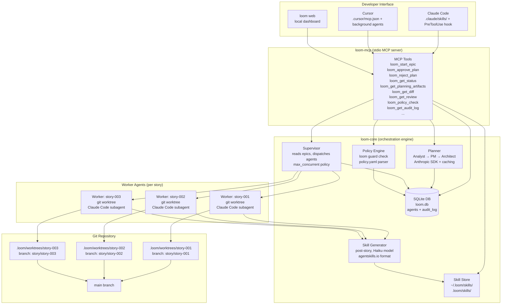

# System Architecture: Loom

## 1. Architecture Philosophy

Loom is designed around three core constraints:

1. **Structural safety over prompt safety**: Guardrails are enforced at the OS command level, not via LLM instruction. An agent that ignores safety prompts still cannot push to a protected branch or write outside its worktree.

2. **Local-first, IDE-agnostic**: The engine runs as a local process. IDEs connect via MCP (stdio). No cloud orchestration, no shared state server.

3. **Boring technology**: SQLite over Postgres, git worktrees over Docker, TypeScript over multiple languages. The smallest viable abstraction stack for the problem.

---

## 2. Component Diagram



---

## 3. Tech Stack Decisions

| Layer | Technology | Rationale |
|---|---|---|
| Language | TypeScript (Node.js 20+) | MCP SDK is TypeScript-first; npm packaging; broad LSP support |
| LLM API | Anthropic SDK (`@anthropic-ai/sdk`) | the latest Claude models; prompt caching; extended thinking for complex planning |
| MCP Server | `@modelcontextprotocol/sdk` | IDE-agnostic; Cursor + Claude Code both support MCP stdio |
| State/Audit | `better-sqlite3` + FTS5 | Local, zero-dep, synchronous API suits Node.js single-threaded model |
| CLI | `commander` + `chalk` + `cli-table3` | Minimal, well-maintained, LSP-friendly |
| Git operations | `execa` + git CLI | Direct git CLI preferred over libgit2 bindings for stability |
| Skill format | agentskills.io (SKILL.md) | hermes-compatible; open standard; progressive disclosure |
| Frontmatter parsing | `gray-matter` | YAML/TOML frontmatter in SKILL.md files |
| TOML config | `@iarna/toml` | three-layer config merge support |
| Schema validation | `zod` | Runtime type safety for epic YAML, policy.yaml, MCP tool inputs |
| File globbing | `fast-glob` | Skill discovery, persistent_facts file: refs |
| Monorepo | npm workspaces | No build tool overhead for MVP; packages: loom-core, loom-cli, loom-mcp |

**Not used in MVP**: Docker, Redis, Postgres, embeddings APIs, web UI framework, LangGraph/CrewAI.

---

## 4. Monorepo Package Structure

```
loom/
├── packages/
│   ├── loom-core/              # Pure orchestration logic, no CLI/MCP coupling
│   │   ├── src/
│   │   │   ├── planner/         # Persona pipeline (Analyst, PM, Architect)
│   │   │   │   ├── PersonaLoader.ts
│   │   │   │   ├── AnalystAgent.ts
│   │   │   │   ├── PMAgent.ts
│   │   │   │   └── ArchitectAgent.ts
│   │   │   ├── orchestrator/    # Supervisor + worktree management
│   │   │   │   ├── Supervisor.ts
│   │   │   │   └── WorktreeManager.ts
│   │   │   ├── guardrails/      # Policy engine
│   │   │   │   ├── PolicyEngine.ts
│   │   │   │   └── CommandParser.ts
│   │   │   ├── skills/          # Skill store, selector, generator
│   │   │   │   ├── SkillStore.ts
│   │   │   │   ├── SkillSelector.ts
│   │   │   │   └── SkillGenerator.ts
│   │   │   ├── state/           # SQLite DB, migrations, CRUD
│   │   │   │   ├── Database.ts
│   │   │   │   ├── AgentStore.ts
│   │   │   │   └── AuditLog.ts
│   │   │   └── types.ts         # Shared interfaces (AgentStatus, PolicyResult, etc.)
│   │   └── package.json
│   │
│   └── loom-cli/               # CLI entry point (loom command)
│   │   ├── src/
│   │   │   ├── commands/
│   │   │   │   ├── init.ts      # loom init
│   │   │   │   ├── epic.ts      # loom epic "<brief>"
│   │   │   │   ├── approve.ts   # loom approve <epic-id>
│   │   │   │   ├── reject.ts    # loom reject <epic-id>
│   │   │   │   ├── status.ts    # loom status [--watch]
│   │   │   │   └── guard.ts     # loom guard check --command "..."
│   │   │   ├── templates/       # CLAUDE.md, policy.yaml, mcp.json templates
│   │   │   └── index.ts
│   │   └── package.json
│
├── skills/                      # Built-in loom skills (agentskills.io format)
│   ├── loom-guardrails/        # Guardrail policy summary for agents
│   │   └── SKILL.md
│   ├── loom-worker-protocol/   # Worker agent behavioral spec
│   │   └── SKILL.md
│   └── loom-pr-conventions/    # PR title/body conventions
│       └── SKILL.md
│
├── schemas/
│   ├── epic.schema.yaml         # Epic + story YAML schema (zod source of truth)
│   └── policy.schema.yaml       # Policy YAML schema
│
├── .claude/skills/              # loom slash commands + vendored planning skills for Claude Code
├── .agents/skills/              # same set for Cursor/other IDEs
├── docs/                        # Architecture, ADRs, user guide
│   └── architecture.md          # This file
├── epics/                       # Generated epic YAML files
└── package.json                 # Workspace root
```

---

## 5. Data Models

### SQLite Schema

```sql
-- loom.db

CREATE TABLE epics (
  id TEXT PRIMARY KEY,            -- e.g., "epic-001"
  title TEXT NOT NULL,
  status TEXT NOT NULL,           -- planned | approved | rejected | in_progress | done
  brief_path TEXT,                -- path to brief.md
  prd_path TEXT,                  -- path to prd.md
  yaml_path TEXT,                 -- path to epic-{n}.yaml
  reason TEXT,                    -- rejection reason if status=rejected
  created_at DATETIME NOT NULL DEFAULT CURRENT_TIMESTAMP,
  updated_at DATETIME NOT NULL DEFAULT CURRENT_TIMESTAMP
);

CREATE TABLE agents (
  id TEXT PRIMARY KEY,            -- e.g., "agent-story-001-001-abc123"
  epic_id TEXT NOT NULL REFERENCES epics(id),
  story_id TEXT NOT NULL,         -- e.g., "story-001-001"
  status TEXT NOT NULL,           -- pending | running | blocked | pr_open | done | failed
  worktree_path TEXT,             -- .loom/worktrees/story-001-001
  branch_name TEXT,               -- story/story-001-001
  pr_url TEXT,
  log_tail TEXT,                  -- last 500 chars of agent output
  started_at DATETIME,
  updated_at DATETIME NOT NULL DEFAULT CURRENT_TIMESTAMP
);

CREATE TABLE audit_log (
  id INTEGER PRIMARY KEY AUTOINCREMENT,
  agent_id TEXT REFERENCES agents(id),
  action TEXT NOT NULL,           -- bash_command | git_operation | api_call | status_change
  command TEXT,                   -- the raw command or description
  allowed BOOLEAN,
  policy_rule TEXT,               -- which rule blocked/allowed (e.g., "git.forbidden_flags")
  detail TEXT,                    -- structured JSON for extra context
  timestamp DATETIME NOT NULL DEFAULT CURRENT_TIMESTAMP
);

-- FTS5 virtual table for audit log search
CREATE VIRTUAL TABLE audit_log_fts USING fts5(command, action, content=audit_log, content_rowid=id);
```

### Epic YAML Schema (zod source of truth → `schemas/epic.schema.yaml`)

```typescript
const StorySchema = z.object({
  id: z.string().regex(/^story-\d{3}-\d{3}$/),
  title: z.string().min(5).max(100),
  description: z.string(),
  acceptance_criteria: z.array(z.string()).min(1),
  estimated_complexity: z.enum(['trivial', 'small', 'medium', 'large']),
  dependencies: z.array(z.string()),
  tech_notes: z.string().optional(),
});

const EpicSchema = z.object({
  epic_id: z.string().regex(/^epic-\d{3}$/),
  title: z.string().min(5).max(100),
  status: z.enum(['approved', 'in_progress', 'done']),
  priority: z.enum(['must-have', 'should-have', 'nice-to-have']),
  prd_ref: z.string(),
  requirements: z.array(z.string()),
  stories: z.array(StorySchema).min(1),
});
```

### Policy YAML Schema

```typescript
const PolicySchema = z.object({
  git: z.object({
    allowed_remotes: z.array(z.string()).default([]),  // glob patterns; empty = block all pushes
    protected_branches: z.array(z.string()).default(['main', 'master']),
    forbidden_flags: z.array(z.string()).default(['--force', '--force-with-lease', '--hard']),
    agents_must_use_pr: z.boolean().default(true),
  }),
  filesystem: z.object({
    protected_paths: z.array(z.string()).default(['~/.ssh', '~/.aws', '~/.gnupg', '/etc', '/usr', '.git']),
    allowed_write_root: z.string().default('.'),
    allowed_read_root: z.string().default('.'),   // resolved relative to the worktree at hook time; on-by-default; independent of cross_repo.enabled
  }),
  agents: z.object({
    max_concurrent: z.number().int().min(1).max(10).default(3),
    model: z.string().default('claude-sonnet-4-6'),
    budget_tokens_per_story: z.number().optional(),
  }),
});
```

---

## 6. API Contracts

### MCP Tool Signatures

```typescript
// loom_start_epic
input:  { brief: string }
output: { epic_id: string; status: 'planning'; message: string }

// loom_approve_plan
input:  { epic_id: string }
output: { epic_id: string; status: 'dispatching'; stories_queued: number }

// loom_reject_plan
input:  { epic_id: string; reason?: string }
output: { epic_id: string; status: 'rejected' }

// loom_get_status
input:  { epic_id?: string }
output: {
  epics: Array<{
    id: string; title: string; status: string;
    stories: Array<{ id: string; title: string; status: string; pr_url?: string; started_at?: string }>
  }>
}

// loom_policy_check
input:  { command: string }
output: { allowed: boolean; rule?: string; reason?: string }

// loom_get_audit_log
input:  { agent_id: string; limit?: number }
output: Array<{ id: number; action: string; command?: string; allowed?: boolean; policy_rule?: string; timestamp: string }>
```

### Anthropic SDK Call Pattern

All LLM calls follow this pattern for prompt caching:

```typescript
const response = await anthropic.messages.create({
  model: policy.agents.model,
  max_tokens: 8192,
  system: [
    {
      type: 'text',
      text: personaSystemPrompt,
      cache_control: { type: 'ephemeral' },  // cache persona (changes rarely)
    },
    {
      type: 'text',
      text: skillsContext,
      cache_control: { type: 'ephemeral' },  // cache loaded skills (changes per epic)
    },
  ],
  messages: [{ role: 'user', content: storySpec }],  // uncached (per-story)
});
```

---

## 7. Security Model

### Threat Model

| Threat | Impact | Control |
|---|---|---|
| Agent executes `git push --force` | Overwrites remote history | Policy engine exits non-zero; Claude Code aborts tool call |
| Agent deletes `~/.ssh` | Loss of credentials | Protected paths list; path resolution before comparison |
| Agent escapes worktree to parent repo | Corrupts main branch | allowed_write_root enforcement; git worktree scoping |
| Agent reads outside its worktree and repo root | Exfiltrates code from unrelated paths or parent directories | `allowed_read_root` enforcement; pre-tool-use hook intercepts `Read`, `Grep`, `Glob`, and Bash searches; every denial audit-logged as `read_scope_denied` |
| Agent pushes to unauthorized remote | Leaks code to wrong repo | allowed_remotes glob matching |
| Malicious skill injects harmful instructions | Agent misbehaves | Skills are plain markdown; no execution; human controls skill store |
| Planning produces an incorrect architecture | Bad code generated | Human gate (approve/reject) before any code execution |

### Defense in Depth

```
Layer 1: Policy YAML (configuration)
  └── Defines what is allowed; committed to repo

Layer 2: Command Interceptor (PreToolUse hook / MCP policy_check)
  └── Validates every command before execution
  └── Exits non-zero to abort; logs to audit table

Layer 3: Git Worktree Isolation
  └── Each agent operates in its own worktree
  └── Agents have no write access to other worktrees
  └── Agents cannot directly touch main branch

Layer 4: PR Gate
  └── Agents open PRs, never merge
  └── Human reviews before any code lands on main

Layer 5: Audit Log
  └── All commands (allowed and blocked) logged with structured metadata
  └── FTS5 search for incident review
```

---

## 8. Prompt Caching Strategy

Anthropic charges for cache reads at 10% of input cost. Loom applies `cache_control: ephemeral` aggressively:

| Content | Cached? | Rationale |
|---|---|---|
| Persona system prompt (Mary/John/Winston) | Yes | Same across all calls in a planning session (5-min TTL) |
| Loaded skills bodies | Yes | Same across stories in an epic |
| PRD content (when passed to Architect) | Yes | Same document, multiple story generations |
| Story spec (user message) | No | Unique per story |
| Audit log (sent to SkillGenerator) | Yes | Same log read multiple times per post-story analysis |

---

## 9. Deployment / Distribution

Published to the npm registry:

```bash
npm install -g loom-ai
loom init                        # sets up .loom/ in current git repo
loom init --cursor               # also writes .cursor/mcp.json
loom epic "brief text"           # starts planning pipeline
```

**Requirements for end users:**
- Node.js 20+
- git 2.5+ (for worktrees)
- `gh` CLI (for PR creation)
- `claude` CLI logged in (session-based auth, default) OR `cursor-agent` CLI logged in for the `cursor-cli` backend. The legacy `anthropic-api` backend was removed in v0.4.

**No Docker required.** Session-based auth only — loom does not require an API key or cloud account.

---

## 10. ADR Log

### ADR-001: SQLite over Postgres

**Decision**: Use SQLite with better-sqlite3 for all state storage.
**Context**: Local-first constraint; single-machine operation for V1.
**Rationale**: Zero setup; synchronous API fits Node.js single-threaded model; FTS5 covers audit search.
**Tradeoff**: Cannot scale to multi-machine coordination without migration. V2 can swap for Turso (SQLite-over-network) if needed.

### ADR-002: Git worktrees over Docker

**Decision**: Each story agent gets a git worktree, not a Docker container.
**Context**: No Docker installation requirement; local-first.
**Rationale**: Native git; no daemon required; worktree provides filesystem scoping within repo.
**Tradeoff**: Worktrees share the host filesystem. Protected-paths policy compensates for absence of container namespacing.

### ADR-003: MCP over custom RPC

**Decision**: loom-mcp implements the Model Context Protocol.
**Context**: Need to support Cursor and Claude Code with the same engine.
**Rationale**: Both IDEs have native MCP support. One protocol = one implementation.
**Tradeoff**: MCP protocol is evolving; will need to track spec changes.

### ADR-004: Anthropic-only for V1

**Decision**: Only Claude models via Anthropic SDK for V1.
**Context**: User is experimenting with Claude Code; the planning methodology is LLM-agnostic in principle but loom needs a concrete implementation.
**Rationale**: Prompt caching is Anthropic-specific and material to cost; the latest Claude models excel at code generation. Provider abstraction adds complexity without V1 benefit.
**Tradeoff**: Users on OpenAI or Gemini can't use V1. V2 can add provider abstraction via LiteLLM.
